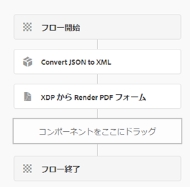

# コアコンポーネントのデータを使用してPDFを生成し、フォームの送信に基づいて

次に、「コアコンポーネント」を大文字にした改訂テキストを示します。

一般的なシナリオでは、コアコンポーネントベースのアダプティブフォーム経由で送信されたPDFからデータを生成します。 このデータは常に JSON 形式です。 レンダリングPDFAPI を使用してPDFを生成するには、JSON データを XML 形式に変換する必要があります。 The `toString` メソッド `org.json.XML` は、この変換に使用されます。 詳しくは、 [～の文書化 `org.json.XML.toString` メソッド](https://www.javadoc.io/doc/org.json/json/20171018/org/json/XML.html#toString-java.lang.Object-).

## JSON スキーマに基づくアダプティブフォームベース

次の手順に従って、アダプティブフォームの JSON スキーマを作成してください。

### XDP のサンプルデータを生成

プロセスを合理化するには、次の詳細な手順に従います。

1. XDP ファイルをAEM Forms Designer で開きます。
1. 「ファイル」/「フォームのプロパティ」/「プレビュー」に移動します。
1. 「プレビューデータを生成」を選択します。
1. 「生成」をクリックします。
1. 意味のあるファイル名を割り当てる（例： ） `form-data.xml`.

### XML データから JSON スキーマを生成

無料のオンラインツールを利用して、 [XML を JSON に変換](https://jsonformatter.org/xml-to-jsonschema) 前の手順で生成された XML データを使用します。

### JSON を XML に変換するカスタムワークフロープロセス

指定されたコードは JSON を XML に変換し、結果の XML をという名前のワークフロープロセス変数に保存します。 `dataXml`.

```java
import org.slf4j.LoggerFactory;
import com.adobe.granite.workflow.WorkflowException;
import java.io.InputStream;
import java.io.BufferedReader;
import java.io.InputStreamReader;
import javax.jcr.Node;
import javax.jcr.Session;
import org.json.JSONObject;
import org.json.XML;
import org.slf4j.Logger;
import org.osgi.service.component.annotations.Component;
import com.adobe.granite.workflow.WorkflowSession;
import com.adobe.granite.workflow.exec.WorkItem;
import com.adobe.granite.workflow.exec.WorkflowProcess;
import com.adobe.granite.workflow.metadata.MetaDataMap;

@Component(property = {
    "service.description=Convert JSON to XML",
    "process.label=Convert JSON to XML"
})
public class ConvertJSONToXML implements WorkflowProcess {

    private static final Logger log = LoggerFactory.getLogger(ConvertJSONToXML.class);

    @Override
    public void execute(final WorkItem workItem, final WorkflowSession workflowSession, final MetaDataMap arg2) throws WorkflowException {
        String processArgs = arg2.get("PROCESS_ARGS", "string");
        log.debug("The process argument I got was " + processArgs);
        
        String submittedDataFile = processArgs;
        String payloadPath = workItem.getWorkflowData().getPayload().toString();
        log.debug("The payload in convert json to xml " + payloadPath);
        
        String dataFilePath = payloadPath + "/" + submittedDataFile + "/jcr:content";
        try {
            Session session = workflowSession.adaptTo(Session.class);
            Node submittedJsonDataNode = session.getNode(dataFilePath);
            InputStream jsonDataStream = submittedJsonDataNode.getProperty("jcr:data").getBinary().getStream();
            BufferedReader streamReader = new BufferedReader(new InputStreamReader(jsonDataStream, "UTF-8"));
            StringBuilder stringBuilder = new StringBuilder();
            String inputStr;
            while ((inputStr = streamReader.readLine()) != null) {
                stringBuilder.append(inputStr);
            }
            JSONObject submittedJson = new JSONObject(stringBuilder.toString());
            log.debug(submittedJson.toString());
            
            String xmlString = XML.toString(submittedJson);
            log.debug("The json converted to XML " + xmlString);
            
            MetaDataMap metaDataMap = workItem.getWorkflow().getWorkflowData().getMetaDataMap();
            metaDataMap.put("xmlData", xmlString);
        } catch (Exception e) {
            log.error("Error converting JSON to XML: " + e.getMessage(), e);
        }
    }
}
```

### ワークフローの作成

フォームの送信を処理するには、次の 2 つの手順を含むワークフローを作成します。

1. 最初の手順では、カスタムプロセスを使用して、送信された JSON データを XML に変換します。
1. 次の手順では、XML データと XDPPDFを組み合わせてテンプレートを生成します。




## サンプルコードのデプロイ

ローカルサーバーでテストするには、以下の合理化された手順に従います。

1. [AEM OSGi Web コンソールを使用してカスタムバンドルをダウンロードし、インストールします。](assets/convertJsonToXML.core-1.0.0-SNAPSHOT.jar).
1. [ワークフローパッケージをインポート](assets/workflow_to_render_pdf.zip).
1. [サンプルのアダプティブフォームおよび XDP テンプレートを読み込む](assets/adaptive_form_and_xdp_template.zip).
1. [アダプティブフォームのプレビュー](http://localhost:4502/content/dam/formsanddocuments/f23/jcr:content?wcmmode=disabled).
1. いくつかのフォームフィールドに入力します。
1. フォームを送信してAEMワークフローを開始します。
1. ワークフローのペイロードPDFー内で、レンダリングされたフォルダーを見つけます。

