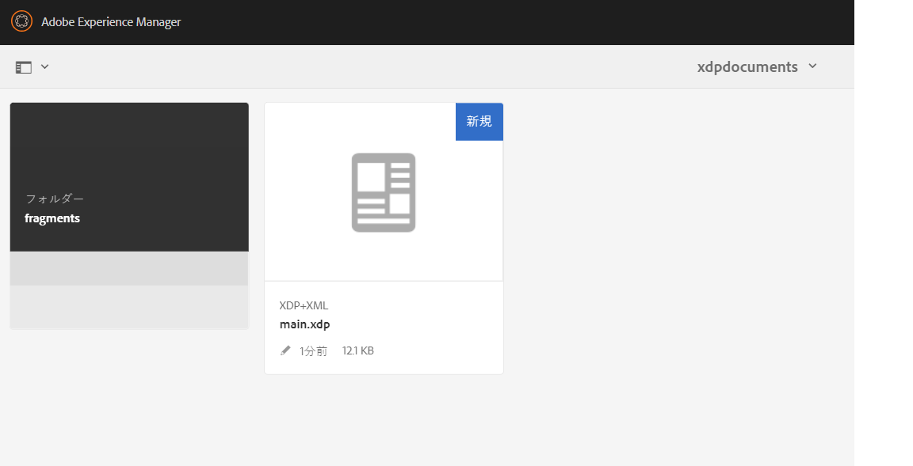

# フラグメントを使用した PDF ドキュメントの作成{#developing-with-output-and-forms-services-in-aem-forms}


この記事では、xdp フラグメントを使用して PDF ファイルを生成する際に、出力サービスを使用します。 メインの xdp とフラグメントは crx リポジトリに存在します。 AEM のファイルシステムフォルダー構造を模倣することが重要です。 例えば、xdp の fragments フォルダーでフラグメントを使用する場合は、AEM のベースフォルダーに **fragments** というフォルダーを作成する必要があります。ベースフォルダーにはベース xdp テンプレートが格納されます。例えば、ファイルシステムに次の構造がある場合
* c:\xdptemplates - これには、ベースの xdp テンプレートが含まれます
* c:\xdptemplates\fragments - このフォルダーにはフラグメントが含まれ、メインテンプレートは以下に示すようにフラグメントを参照します。
  。
* フォルダー xdpdocuments には、ベーステンプレートと **fragments** フォルダー内のフラグメントが含まれます。

[フォームとドキュメント UI](http://localhost:4502/aem/forms.html/content/dam/formsanddocuments) を使用して、必要な構造を作成できます。

次に、2 つのフラグメントを使用するサンプル xdp のフォルダー構造を示します



* Output サービス - 通常、 xml データを xdp テンプレートまたは PDF と結合して、統合された PDF を生成するために使用されます。詳細については、出力サービスの [javadoc](https://helpx.adobe.com/experience-manager/6-5/forms/javadocs/index.html?com/adobe/fd/output/api/OutputService.html) を参照してください。このサンプルでは、crx リポジトリ内のフラグメントを使用します。


次のコードは、フラグメントを PDF ファイルに含めるために使用されました。

```java
System.out.println("I am in using fragments POST.jsp");
// contentRootURI is the base folder. All fragments are relative to this folder
String contentRootURI = request.getParameter("contentRootURI");
String xdpName = request.getParameter("xdpName");
javax.servlet.http.Part xmlDataPart = request.getPart("xmlDataFile");
System.out.println("Got xml file");
String filePath = request.getParameter("saveLocation");
java.io.InputStream xmlIS = xmlDataPart.getInputStream();
com.adobe.aemfd.docmanager.Document xmlDocument = new com.adobe.aemfd.docmanager.Document(xmlIS);
com.adobe.fd.output.api.OutputService outputService = sling.getService(com.adobe.fd.output.api.OutputService.class);

if (outputService == null) {
  System.out.println("The output service is  null.....");
} else {
  System.out.println("The output service is  not null.....");

}
com.adobe.fd.output.api.PDFOutputOptions pdfOptions = new com.adobe.fd.output.api.PDFOutputOptions();
pdfOptions.setAcrobatVersion(com.adobe.fd.output.api.AcrobatVersion.Acrobat_11);

pdfOptions.setContentRoot(contentRootURI);

com.adobe.aemfd.docmanager.Document generatedDocument = outputService.generatePDFOutput(xdpName, xmlDocument, pdfOptions);
generatedDocument.copyToFile(new java.io.File(filePath));
out.println("Document genreated and saved to " + filePath);
```

**システム上のサンプルパッケージをテストするには**

* [サンプル xdp ファイルをダウンロードして AEM に読み込みます。](assets/xdp-templates-fragments.zip)
* [AEM パッケージマネージャーを使用して、パッケージをダウンロードしてインストールします。](assets/using-fragments-assets.zip)
* [サンプルの xdp とフラグメントは、こちらからダウンロードできます。](assets/xdptemplates.zip)

**パッケージをインストールした後、Adobe Granite CSRF フィルターの次の URL を許可リストに加える必要があります。**

1. 上記のパスを許可リストに加えるには、下記の手順に従ってください。
1. [configMgr にログインします](http://localhost:4502/system/console/configMgr)。
1. Adobe Granite CSRF フィルターを検索します。
1. 除外されたセクションに次のパスを追加して、保存します。
1. /content/AemFormsSamples/usingfragments

サンプルコードをテストするには、様々な方法があります。Postman アプリを使用するのが最もすばやく簡単です。Postman を使用すると、サーバーに POST リクエストを送信できます。 システムに Postman アプリをインストールします。
アプリを起動し、次の URL を入力してデータ書き出し API をテストします。

「POST」がドロップダウンリストから選択されていることを確認してください。
http://localhost:4502/content/AemFormsSamples/usingfragments.html
「Authorization」を「Basic Auth」として指定してください。AEM Server のユーザー名とパスワードを指定します。
「本文」タブに移動し、次の画像に示すリクエストパラメーターを指定します

次に、「送信」ボタンをクリックします。

[この Postman コレクションを読み込んで、API をテストできます。](assets/usingfragments.postman_collection.json)
