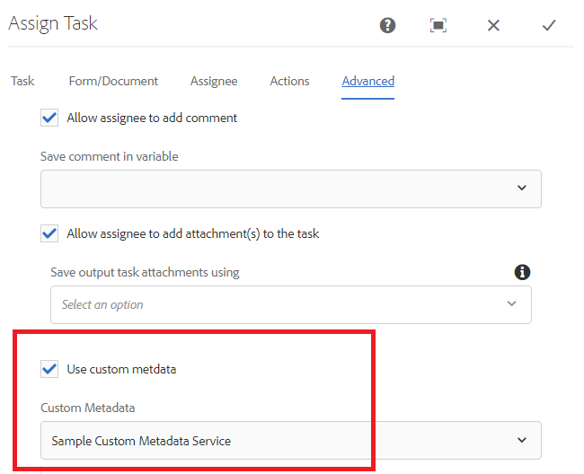

# タスクの割り当て通知のカスタマイズ

タスクの割り当てコンポーネントは、タスクをワークフロー参加者に割り当てるために使用します。 タスクがユーザーまたはグループに割り当てられると、定義済みのユーザーまたはグループメンバーに電子メール通知が送信されます。
この電子メール通知には、通常、タスクに関連する動的データが含まれます。 この動的データは、システムで生成された[メタデータプロパティ](https://docs.adobe.com/content/help/en/experience-manager-65/forms/publish-process-aem-forms/use-metadata-in-email-notifications.html#using-system-generated-metadata-in-an-email-notification)を使用して取得されます。
送信されたフォームデータの値を電子メール通知に含めるには、カスタムメタデータプロパティを作成し、電子メールテンプレートでこれらのカスタムメタデータプロパティを使用する必要があります


## カスタムメタデータプロパティの作成

推奨される方法は、[WorkitemUserMetadataService](https://helpx.adobe.com/experience-manager/6-5/forms/javadocs/com/adobe/fd/workspace/service/external/WorkitemUserMetadataService.html#getUserMetadataMap--)のgetUserMetadataメソッドを実装するOSGIコンポーネントを作成することです

次のコードは、4つのメタデータプロパティ（_firstName_、_lastName_、_reason_&#x200B;および&#x200B;_amountRequested_）を作成し、送信データから値を設定します。 例えば、メタデータプロパティ&#x200B;_firstName_&#x200B;の値は、送信されたデータからfirstNameと呼ばれる要素の値に設定されます。 次のコードは、アダプティブフォームの送信データがxml形式であることを前提としています。 JSONスキーマまたはフォームデータモデルに基づくアダプティブFormsは、JSON形式でデータを生成します。


```java
package com.aemforms.workitemuserservice.core;

import java.io.InputStream;
import java.util.HashMap;
import java.util.Map;

import javax.jcr.Session;
import javax.xml.parsers.DocumentBuilder;
import javax.xml.parsers.DocumentBuilderFactory;
import javax.xml.xpath.XPath;

import org.osgi.framework.Constants;
import org.osgi.service.component.annotations.Component;
import org.slf4j.Logger;
import org.slf4j.LoggerFactory;
import org.w3c.dom.*;


import com.adobe.fd.workspace.service.external.WorkitemUserMetadataService;
import com.adobe.granite.workflow.WorkflowSession;
import com.adobe.granite.workflow.exec.WorkItem;
import com.adobe.granite.workflow.metadata.MetaDataMap;
@Component(property={Constants.SERVICE_DESCRIPTION+"=A sample implementation of a user metadata service.",
Constants.SERVICE_VENDOR+"=Adobe Systems",
"process.label"+"=Sample Custom Metadata Service"})


public class WorkItemUserServiceImpl implements WorkitemUserMetadataService {
private static final Logger log = LoggerFactory.getLogger(WorkItemUserServiceImpl.class);

@Override
public Map<String, String> getUserMetadata(WorkItem workItem, WorkflowSession workflowSession,MetaDataMap metadataMap)
{
HashMap<String, String> customMetadataMap = new HashMap<String, String>();
String payloadPath = workItem.getWorkflowData().getPayload().toString();
String dataFilePath = payloadPath + "/Data.xml/jcr:content";
Session session = workflowSession.adaptTo(Session.class);
DocumentBuilderFactory factory = null;
DocumentBuilder builder = null;
Document xmlDocument = null;
javax.jcr.Node xmlDataNode = null;
try
{
    xmlDataNode = session.getNode(dataFilePath);
    InputStream xmlDataStream = xmlDataNode.getProperty("jcr:data").getBinary().getStream();
    XPath xPath = javax.xml.xpath.XPathFactory.newInstance().newXPath();
    factory = DocumentBuilderFactory.newInstance();
    builder = factory.newDocumentBuilder();
    xmlDocument = builder.parse(xmlDataStream);
    Node firstNameNode = (org.w3c.dom.Node) xPath.compile("afData/afUnboundData/data/firstName")
            .evaluate(xmlDocument, javax.xml.xpath.XPathConstants.NODE);
    log.debug("The value of first name element  is " + firstNameNode.getTextContent());
    Node lastNameNode = (org.w3c.dom.Node) xPath.compile("afData/afUnboundData/data/lastName")
            .evaluate(xmlDocument, javax.xml.xpath.XPathConstants.NODE);
    Node amountRequested = (org.w3c.dom.Node) xPath
            .compile("afData/afUnboundData/data/amountRequested")
            .evaluate(xmlDocument, javax.xml.xpath.XPathConstants.NODE);
    Node reason = (org.w3c.dom.Node) xPath.compile("afData/afUnboundData/data/reason")
            .evaluate(xmlDocument, javax.xml.xpath.XPathConstants.NODE);
    customMetadataMap.put("firstName", firstNameNode.getTextContent());
    customMetadataMap.put("lastName", lastNameNode.getTextContent());
    customMetadataMap.put("amountRequested", amountRequested.getTextContent());
    customMetadataMap.put("reason", reason.getTextContent());
    log.debug("Created  " + customMetadataMap.size() + " metadata  properties");

}
catch (Exception e)
{
    log.debug(e.getMessage());
}
return customMetadataMap;
}

}
```

## タスク通知電子メールテンプレートのカスタムメタデータプロパティを使用します

電子メールテンプレートには、次の構文を使用してメタデータプロパティを含めることができます。amountRequestedはメタデータプロパティ`${amountRequested}`です

## カスタムメタデータプロパティを使用するための割り当てタスクの設定

OSGiコンポーネントを構築し、AEMサーバーにデプロイした後、次に示すように「タスクの割り当て」コンポーネントを設定して、カスタムメタデータプロパティを使用します。


## カスタムメタデータプロパティの使用の有効化



## サーバーで試すには

* [Day CQ 電子メールサービスの設定](https://docs.adobe.com/content/help/ja-JP/experience-manager-65/administering/operations/notification.html#configuring-the-mail-service)
* 有効な電子メールIDを[管理者ユーザー](http://localhost:4502/security/users.html)に関連付ける
* [パッケージマネージャー](http://localhost:4502/crx/packmgr/index.jsp)を使用して[Workflow-and-notification-template](assets/workflow-and-task-notification-template.zip)をダウンロードし、インストールします
* [アダプティブフォーム](assets/request-travel-authorization.zip)をダウンロードし、[フォームとドキュメントui](http://localhost:4502/aem/forms.html/content/dam/formsanddocuments)からAEMに読み込みます。
* [Webコンソール](http://localhost:4502/system/console/bundles)を使用して[カスタムバンドル](assets/work-items-user-service-bundle.jar)を展開し、開始します
* [フォームをプレビューして送信する](http://localhost:4502/content/dam/formsanddocuments/requestfortravelauhtorization/jcr:content?wcmmode=disabled)

フォーム送信時に、タスク割り当て通知が管理者ユーザーに関連付けられた電子メールIDに送信されます。 次のスクリーンショットは、タスク割り当ての通知の例を示しています


>[!NOTE]
>タスクの割り当て通知の電子メールテンプレートは、次の形式にする必要があります。
>
> subject=タスクが割り当てられました — `${workitem_title}`
>
> message=行に新しい文字を含まない電子メールテンプレートを表す文字列。
