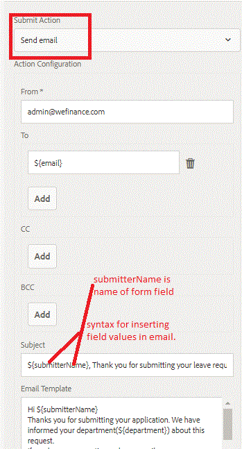

# アダプティブフォーム送信時の電子メールの送信{#sending-email-on-adaptive-form-submission}

一般的な操作の1つは、アダプティブフォームの送信が成功したときに確認電子メールを送信者に送信することです。 これを行うには、送信アクションとして「電子メールの送信」を選択します。

以下のスクリーンショットに示すように、電子メールテンプレートを使用するか、電子メールの本文を入力します。

フォームフィールドの値を電子メールに挿入する構文に注意してください。また、設定プロパティで「添付ファイルを含める」チェックボックスを選択して、電子メールに添付ファイルを含めるオプションもあります。

アダプティブフォームが送信されると、受信者に電子メールが送信されます。

## 必要な構成{#configurations-needed}

Day CQ Mailサービスを設定する必要があります。 これは、ブラウザに[Felix Configuration Manager](http://localhost:4502/system/console/configMgr)を指定することで設定できます

スクリーンショットは、アドビのメールサーバーの設定プロパティを示しています。

サーバーでこれを試すには、次の手順に従います。

* [パッケージマネージャーを使用して、AEMでこの記事に関連付けら](assets/timeoffrequest.zip) れたアセットを読み込みます。

* [TimeOffRequestForm](http://localhost:4502/content/dam/formsanddocuments/helpx/timeoffrequestform/jcr:content?wcmmode=disabled)を開きます。

* 詳細を入力します。電子メールフィールドに有効な電子メールアドレスを入力してください。

* フォームを送信します。
