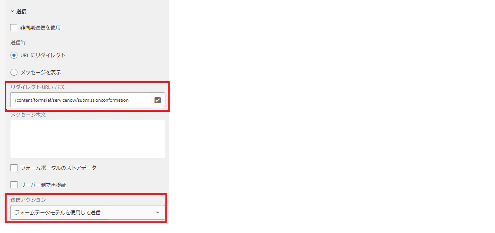

# 「Thank you」ページのカスタマイズ

アダプティブフォームを REST エンドポイントに送信する際は、フォームの送信が成功したことをユーザーに知らせる確認メッセージを表示する必要があります。POST 応答には送信 ID などの送信に関する詳細が含まれ、適切に設計された確認メッセージには送信 ID が含まれており、ユーザーエクスペリエンスを向上させます。この応答は、アダプティブフォームで設定した「Thank you」ページに表示できます。

次のスクリーンショットは、「Thank you」ページが設定されたフォームデータモデルの送信アクションを使用してフォームが送信されている様子を示しています。



フォームデータモデルの POST の応答は、常に JSON オブジェクトを返します。この JSON は、「Thank you」ページの URL で _fdmSubmitResult_ というクエリパラメーターとして使用可能です。このクエリパラメーターを解析して、「Thank you」ページに JSON 要素を表示できます。
次のサンプルコードは、JSON 応答を解析して数値フィールドの値を抽出します。次に、適切な xml が構築され、slingRequest に渡されて、フォームにデータが入力されます。このコードは、通常、アダプティブフォームテンプレートに関連付けられたページコンポーネントの jsp で記述されます。

```java
if(request.getParameter("fdmSubmitResult")!=null)
{
    String fdmSubmitResult =  request.getParameter("fdmSubmitResult");
    String status = request.getParameter("status");
    com.google.gson.JsonObject jsonObject = com.google.gson.JsonParser.parseString(fdmSubmitResult).getAsJsonObject();
    String caseNumber = jsonObject.get("result").getAsJsonObject().get("number").getAsString();
    slingRequest.setAttribute("data","<afData><afUnboundData><data><caseNumber>"+caseNumber+"</caseNumber><status>"+status+"</status></data></afUnboundData></afData>");
}
```

「Thank you」ページは、クエリパラメーターから応答を抽出するカスタムコードを記述できる、新しいアダプティブフォームテンプレートに基づいて作成することをお勧めします。

## ソリューションのテスト

アダプティブフォームを作成し、フォームデータモデルの送信アクションを使用してフォームを送信するよう設定します。
[サンプルのアダプティブフォームテンプレートのデプロイ](assets/thank-you-page-template.zip)
このテンプレートに基づいて「Thank you」フォームを作成します
この「Thank you」ページをメインフォームに関連付けます
[createXml.jsp](http://localhost:4502/apps/thank-you-page-template/component/page/thankyoupage/createxml.jsp) 内の jsp コードを変更して、アダプティブフォームの事前入力に必要な xml を作成します。
アダプティブフォームのプレビューと送信を行います。
「Thank you」ページが表示され、XML で指定したデータが事前入力されます
