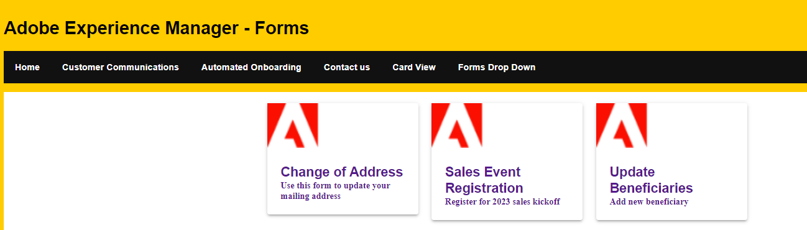

# フォームの取得とカード形式での表示

カード表示形式は、情報やデータをカード形式で表示するデザインパターンです。各カードは、個別のコンテンツまたはデータエントリを表し、通常は、特定の要素が内部に配置された視覚的に異なるコンテナで構成されます。
React のクリック可能なカードは、カードやタイルに似たインタラクティブコンポーネントで、ユーザーがクリックまたはタップできます。クリック可能なカードをクリックまたはタップすると、別のページへの移動、モーダルのオープン、UI の更新など、指定したアクションまたは動作がトリガーされます。

この記事では、[listforms API](https://opensource.adobe.com/aem-forms-af-runtime/api/#tag/List-Forms/operation/listForms) でフォームを取得してカード形式で表示し、クリックイベントでアダプティブフォームを開きます。



## カードテンプレート

次のコードを使用して、カードテンプレートをデザインしました。このカードテンプレートには、アダプティブフォームのタイトルと説明がアドビロゴと共に表示されます。[Material UI コンポーネント](https://mui.com/)が、このレイアウトの作成に使用されています。


```javascript
import Container from "@mui/material/Container";
import Form from './Form';
import PlainText from './plainText'
import TextField from './TextField'
import Button from './Button';
import { AdaptiveForm } from "@aemforms/af-react-renderer";

import { CardActionArea, Typography } from "@mui/material";
import { Box } from "@mui/system";
import { useState,useEffect } from "react";
import DisplayForm from "../DisplayForm";
import { Link } from "react-router-dom";
export default function FormCard({headlessForm}) {
const extendMappings =
    {
        'plain-text' : PlainText,
        'text-input' : TextField,
        'button' : Button,
        'form': Form
    };
   
    return (
        
            <Grid item xs={3}>
                <Paper elevation={3}>
                    
                    <Box padding={3}>
                        <Link style={{ textDecoration: 'none' }} to={`/displayForm${headlessForm.id}`}>
                            <Typography variant="subtititle2" component="h2">
                                {headlessForm.title}
                            </Typography>
                            <Typography variant="subtititle3" component="h4">
                                {headlessForm.description}
                            </Typography>
                        </Link>
                
                    </Box>
                </Paper>
            </Grid>
    );
    

};
```

DisplayForm.js に移動するために、次のルートを Main.js で定義しました。

```javascript
    <Route path="/displayForm/:formID" element={<DisplayForm/>} exact/>
```

## フォームの取得

listforms API を使用して、AEM サーバーからフォームを取得しました。この API は JSON オブジェクトの配列を返し、各 JSON オブジェクトはフォームを表します。

```javascript
import { useState,useEffect } from "react";
import React, { Component } from "react";
import FormCard from "./components/FormCard";
import Grid from "@mui/material/Grid";
import Paper from "@mui/material/Paper";
import Container from "@mui/material/Container";
 
export default function ListForm(){
    const [fetchedForms,SetHeadlessForms] = useState([])
    const getForms=async()=>{
        const response = fetch("/adobe/forms/af/listforms")
        let headlessForms = await (await response).json();
        console.log(headlessForms.items);
        SetHeadlessForms(headlessForms.items);
    }
    useEffect( ()=>{
        getForms()
        

    },[]);
    return(
        <div>
             <div>
                <Container>
                   <Grid container spacing={3}>
                       {
                            fetchedForms.map( (afForm,index) =>
                                <FormCard headlessForm={afForm} key={index}/>
                         
                            )
                        }
                    </Grid>
                </Container>
             </div>

        </div>
    )
}
```

上記のコードでは、map 関数を使用して fetchedForms を反復処理し、fetchedForms 配列内の項目ごとに FormCard コンポーネントを作成してグリッドコンテナに追加します。これで、必要に応じて、React アプリで ListForm コンポーネントを使用できるようになりました。

## 次の手順

[ユーザーによるカードクリック時のアダプティブフォームの表示](./open-form-card-view.md)
