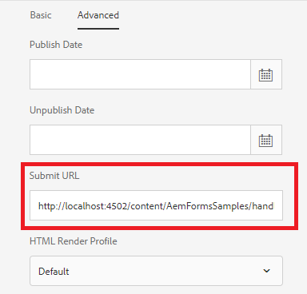

# HTML5フォーム送信の処理

HTML5フォームは、AEMでホストされるサーブレットに送信できます。 送信されたデータは、入力ストリームとしてサーブレット内でアクセスできます。 HTML5フォームを送信するには、AEM Formsデザイナを使用してフォームテンプレートに「HTTP送信ボタン」を追加する必要があります

## 送信ハンドラーの作成

単純なサーブレットを作成して、HTML5フォームの送信を処理できます。 送信されたデータは、次のコードを使用して抽出できます。 この[サーブレット](assets/html5-submit-handler.zip)は、このチュートリアルの一環として利用できます。 [パッケージマネージャー](http://localhost:4502/crx/packmgr/index.jsp)を使用して[サーブレット](assets/html5-submit-handler.zip)をインストールしてください

9行目のコードは、J2EEプロセスの呼び出しに使用できます。 コードを使用してJ2EEプロセスを呼び出す場合は、[AdobeLiveCycleのクライアントSDKの設定](https://helpx.adobe.com/aem-forms/6/submit-form-data-livecycle-process.html)を設定していることを確認してください。

```java
StringBuffer stringBuffer = new StringBuffer();
String line = null;
java.io.InputStreamReader isReader = new java.io.InputStreamReader(request.getInputStream(), "UTF-8");
java.io.BufferedReader reader = new java.io.BufferedReader(isReader);
while ((line = reader.readLine()) != null) {
    stringBuffer.append(line);
}
System.out.println("The submitted form data is " + stringBuffer.toString());
/*
        * java.util.Map params = new java.util.HashMap();
        * params.put("in",stringBuffer.toString());
        * com.adobe.livecycle.dsc.clientsdk.ServiceClientFactoryProvider scfp =
        * sling.getService(com.adobe.livecycle.dsc.clientsdk.
        * ServiceClientFactoryProvider.class);
        * com.adobe.idp.dsc.clientsdk.ServiceClientFactory serviceClientFactory =
        * scfp.getDefaultServiceClientFactory(); com.adobe.idp.dsc.InvocationRequest ir
        * = serviceClientFactory.createInvocationRequest("Test1/NewProcess1", "invoke",
        * params, true);
        * ir.setProperty(com.adobe.livecycle.dsc.clientsdk.InvocationProperties.
        * INVOKER_TYPE,com.adobe.livecycle.dsc.clientsdk.InvocationProperties.
        * INVOKER_TYPE_SYSTEM); com.adobe.idp.dsc.InvocationResponse response1 =
        * serviceClientFactory.getServiceClient().invoke(ir);
        * System.out.println("The response is "+response1.getInvocationId());
        */
```


## HTML5フォームの送信URLの設定



* xdpをタップし、_プロパティ_->_詳細_&#x200B;をクリックします
* http://localhost:4502/content/AemFormsSamples/handlehml5formsubmission.htmlをコピーして、「Submit URL」テキストフィールドに貼り付けます。
* 「_SaveAndClose_」ボタンをクリックします。

### 除外パス追加のエントリ

* [configMgr](http://localhost:4502/system/console/configMgr)に移動します。
* _AdobeGranite CSRF Filter_&#x200B;を検索します
* 「Excluded Paths」追加セクションの次のエントリ
* _/content/AemFormsSamples/handlehml5formsubmission_
* 変更を保存する

### フォームのテスト

* xdpテンプレートをタップします。
* _プレビュー_->プレビューをHTMLでクリック
* フォームにデータを入力し、「送信」をクリックします
* サーバーのstdout.logファイルに送信されたデータが表示されます

### 追加の読み取り

HTML5フォームの送信からPDFを生成する場合は、この[記事](https://docs.adobe.com/content/help/en/experience-manager-learn/forms/document-services/generate-pdf-from-mobile-form-submission-article.html)も推奨します。


