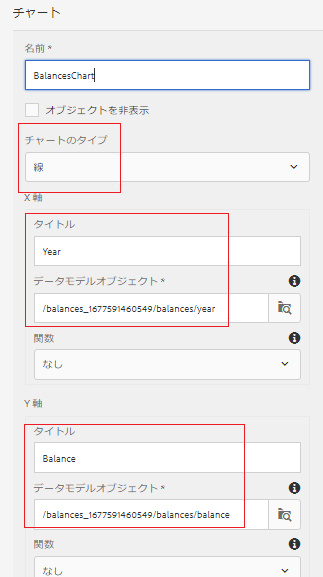

# 最初のインタラクティブ通信ドキュメントの折れ線グラフの設定

この部分では、アカウントの進行状況パネルに折れ線グラフを追加します。

AEM Formsにログインし、 Adobe Experience Manager / Forms / Forms &amp; Documentsに移動します。

401KStatementフォルダーを開きます。

401KStatementを編集モードで開きます。

AEM Forms 6.4では、様々な種類のグラフを使用してデータを表示するのが非常に簡単になりました。 年別の残高を表示するために折れ線グラフを使用します。

右側の「**アカウントの進行状況**」ターゲット領域をタップし、「+」アイコンをクリックしてコンポーネントの挿入ダイアログボックスを表示します。

「グラフ」を選択して、グラフ・コンポーネントを挿入します。

下のスクリーンショットの設定に従ってグラフコンポーネントを設定し、青いチェックマークアイコンをクリックして設定を保存します。

x軸とy軸の正しいフォームデータモデル要素を選択していることを確認してください。

**AEM Forms 6.4の折れ線グラフ設定**

**AEM Forms 6.5の折れ線グラフ設定**

