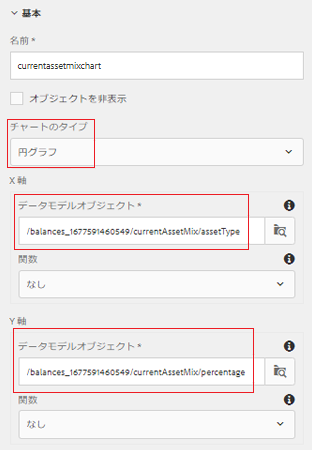
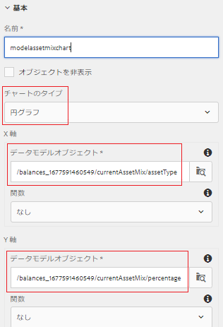

# 投資混合パネルの設定

この部分では、円グラフを追加して、現在の投資とモデルの投資の組み合わせを表示します。

* AEM Formsにログインし、Adobe Experience Manager/Forms/Forms&amp;ドキュメントに移動します。

* 401KStatementフォルダーを開きます。

* 401KStatementを編集モードで開きます。

* アカウント保持者の現在とモデルの投資の組み合わせを表す円グラフを2つ追加します。

## 現在のアセットの混在 {#current-asset-mix}

* 右側の「現在のアセットミックス」パネルをタップし、「+」アイコンを選択してテキストコンポーネントを挿入します。 デフォルトのテキストを「現在のアセットミックス」に変更します。

* 「現在のアセットミックス」パネルをタップし、「+」アイコンを選択して、グラフコンポーネントを挿入します。 新しく挿入されたグラフコンポーネントをタップし、「レンチ」アイコンをクリックして、グラフの設定プロパティシートを開きます。

* 次の画像に示すように、プロパティを設定します。 グラフの種類が円グラフであることを確認します。

* X軸とY軸に連結されたデータモデルオブジェクトに注目してください。 フォームデータモデルのルート要素を選択し、ドリルダウンして適切な要素を選択する必要があります。

* 

## モデルアセットミックス {#model-asset-mix}

* 右側の「RecommendedAssetMix」パネルをタップし、「+」アイコンを選択してテキストコンポーネントを挿入します。 デフォルトのテキストを「Model Asset Mix」に変更します。

* 「RecommendedAssetMix」パネルをタップし、「+」アイコンを選択して、グラフコンポーネントを挿入します。 新しく挿入されたグラフコンポーネントをタップし、「レンチ」アイコンをクリックして、グラフの設定プロパティシートを開きます。

* 次の画像に示すように、プロパティを設定します。 グラフの種類が円グラフであることを確認します。

* X軸とY軸に連結されたデータモデルオブジェクトに注目してください。 フォームデータモデルのルート要素を選択し、ドリルダウンして適切な要素を選択する必要があります。

* 

