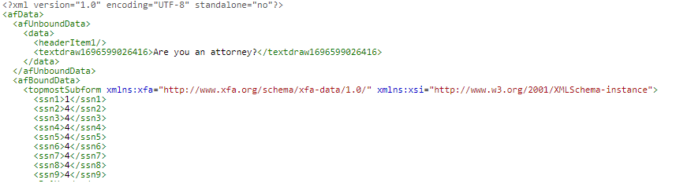

# はじめに

最初の手順では、アダプティブフォームの入力に使用されるデータに基づいてスキーマを作成します。

## XFA がスキーマに基づいている

スキーマを使用して、アダプティブフォームを作成する

## XFA がスキーマに基づいていない

* XDP を AEM Forms Designer で開きます。
* ファイル／フォームのプロパティ／プレビューを選択します。
* 「プレビューデータを生成」をクリックします。
* 「生成」をクリックします。
* `form-data.xml` などの意味のあるファイル名を指定する

無料のオンラインツールを使用して、前の手順で生成された xml データから [XSD を生成](https://www.freeformatter.com/xsd-generator.html?lang=ja)できます。

前の手順のスキーマに基づいてアダプティブフォームを作成します。

>[!NOTE]
>アダプティブフォームの送信時に生成されるデータを確認することを常にお勧めします。これにより、アダプティブフォームと結合する必要のあるデータの XML 形式を適切に把握することができます。

アダプティブフォームから送信されたデータ

PDF から書き出されたデータ

データをアダプティブフォームと正常に結合するには、書き出されたデータから、適切な名前空間が保存された **_topmostSubform_** ノードを抽出する必要があります。

## 次の手順

[OSGi サービスの作成](./create-osgi-service.md)
