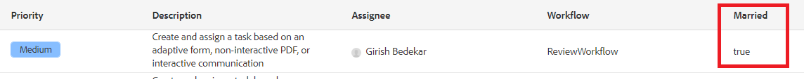

# カスタム列の追加

インボックスでワークフローデータを表示するには、ワークフローで変数を定義し、設定する必要があります。 タスクをユーザーに割り当てる前に、変数の値を設定する必要があります。 ヘッド開始を提供するため、AEMサーバーに導入する準備が整ったサンプルワークフローを提供しています。

* [AEMにログイン](http://localhost:4502/crx/de/index.jsp)
* [レビューワークフローの読み込み](assets/review-workflow.zip)
* [ワークフローの確認](http://localhost:4502/editor.html/conf/global/settings/workflow/models/reviewworkflow.html)

このワークフローには2つの変数（isMarriedとincome）が定義され、その値はset variableコンポーネントを使用して設定されます。 これらの変数は、AEM受信トレイに追加する列として使用できるようになります

## サービスの作成

受信トレイに表示する必要のある列ごとに、サービスを作成する必要があります。 次のサービスでは、isMarried変数の値を表示する列を追加できます

```java
import com.adobe.cq.inbox.ui.column.Column;
import com.adobe.cq.inbox.ui.column.provider.ColumnProvider;

import com.adobe.cq.inbox.ui.InboxItem;
import org.osgi.service.component.annotations.Component;

import java.util.Map;

/**
 * This provider does not require any sightly template to be defined.
 * It is used to display the value of 'ismarried' workflow variable as a column in inbox
 */
@Component(service = ColumnProvider.class, immediate = true)
public class MaritalStatusProvider implements ColumnProvider {@Override
public Column getColumn() {
return new Column("married", "Married", Boolean.class.getName());
}

// Return True or False if 'ismarried' is set. Else returns null
private Boolean isMarried(InboxItem inboxItem) {
Boolean ismarried = null;

Map metaDataMap = inboxItem.getWorkflowMetadata();
if (metaDataMap != null) {
if (metaDataMap.containsKey("isMarried")) {
    ismarried = (Boolean) metaDataMap.get("isMarried");
}
}

return ismarried;
}

@Override
public Object getValue(InboxItem inboxItem) {
return isMarried(inboxItem);
}
}
```

>[!NOTE]
>
>上記のコードが機能するには、プロジェクトにAEM 6.5.5 Uber.jarを含める必要があります


## サーバーでのテスト

* [AEM Webコンソールにログイン](http://localhost:4502/system/console/bundles)
* [展開と開始インボックスカスタマイズバンドル](assets/inboxcustomization.inboxcustomization.core-1.0-SNAPSHOT.jar)
* [受信トレイを開く](http://localhost:4502/aem/inbox)
* 「 _作成_ 」ボタンの横にある _リスト表示_ アイコンをクリックして、管理コントロールを開きます。
* 既婚の追加列を受信トレイに追加し、変更内容を保存
* [FormsAndDocuments UIに移動](http://localhost:4502/aem/forms.html/content/dam/formsanddocuments)
* [作成](assets/snap-form.zip) メニューから「 _ファイルのアップロード_ 」を選択して、サンプルフォームを読み込みます __ 。
* [フォームをプレビューする](http://localhost:4502/content/dam/formsanddocuments/snapform/jcr:content?wcmmode=disabled)
* 婚姻状況 _を選択し_ 、フォームを送信します
   [表示受信トレイ](http://localhost:4502/aem/inbox)

フォームを送信するとワークフローがトリガーされ、タスクが「管理者」ユーザーに割り当てられます。 このスクリーンショットに示すように、「既婚」列の下に値が表示されます。


