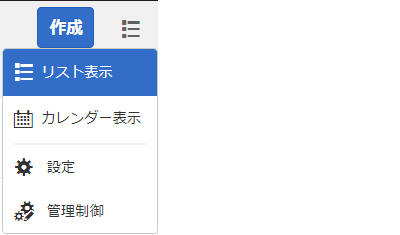

# AEM インボックス

AEMインボックスは、Formsワークフローを含む様々なAEMコンポーネントからの通知とタスクを統合します。 タスクの割り当て手順を含む Forms ワークフローがトリガされると、関連するアプリケーションが担当者のインボックスにタスクとしてリストされます。インボックスのユーザーインターフェースでは、リストビューまたはカレンダービューでタスクを表示できます。ビューの設定も構成することができます。様々なパラメーターに基づいてタスクをフィルターできます
Experience Manager受信トレイをカスタマイズして、列の既定のタイトルを変更したり、列の位置を並べ替えたり、ワークフローのデータに基づいて列を追加表示したりできます

>[!NOTE]
>
>インボックスの列をカスタマイズするには、管理者またはワークフロー管理者のメンバーである必要があります

## 列のカスタマイズ

[AEM ](http://localhost:4502/aem/inbox)
inboxの起動 _リストビューアイコンをクリックし、下のスクリーンショットに表示される_ 管理 __ コントロールを選択して、管理者コントロールを開きます

列のカスタマイズUIでは、次の操作を実行できます

* 列の削除
* 列の順序の変更
* 列名の変更

## ブランディングのカスタマイズ

ブランディングのカスタマイズでは、次の操作を行うことができます。

* 追加組織のロゴ
* ヘッダーテキストをカスタマイズ
* ヘルプリンクのカスタマイズ
* ナビゲーションオプションを隠す

