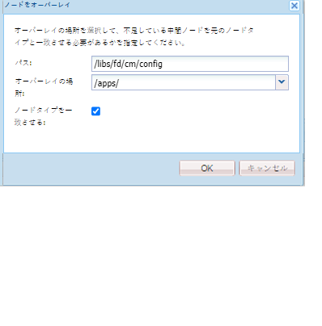

# テキストエディターのカスタマイズ{#customize-text-editor}

## 概要 {#overview}

ドキュメントフラグメントの作成に使用するテキストエディターをカスタマイズして、フォントやフォントサイズを追加できます。 これらのフォントには、日本語フォントなどの英語と英語以外のフォントが含まれます。

をカスタマイズして、フォント設定で以下を変更できます。

* フォントファミリーとサイズ
* 高さや文字間隔などのプロパティ
* フォントファミリーとサイズ、高さ、文字間隔、日付形式のデフォルト値
* 箇条書きのインデント

これをおこなうには、次の手順を実行する必要があります。

1. [CRX の tbxeditor-config.xml ファイルを編集しフォントをカスタマイズ](#customizefonts)
1. [クライアントコンピューターへのカスタムフォントの追加](#addcustomfonts)

## CRX の tbxeditor-config.xml ファイルを編集してフォントをカスタマイズ {#customizefonts}

tbxeditor-config.xml ファイルを編集してフォントをカスタマイズするには、次の手順を実行します。

1. `https://'[server]:[port]'/[ContextPath]/crx/de` にアクセスし、管理者としてログインします。
1. apps フォルダーに、libs/fd/cm/config の config フォルダーに類似したパスまたはフォルダー構造を持つ config という名前のフォルダーを次の手順で作成します。

   1. 以下のパスにある items フォルダーを右クリックし、「**ノードをオーバーレイ**」を選択します。

      `/libs/fd/cm/config`

      

   1. ノードをオーバーレイダイアログに次の値が表示されていることを確認します。

      **パス：** /libs/fd/cm/config

      **場所：** /apps/

      **ノードタイプを一致させる：**&#x200B;選択済み

      

   1. 「**OK**」をクリックします。apps フォルダーにフォルダー構造が作成されます。

   1. 「**すべて保存**」をクリックします。

1. 次の手順に従って、新しく作成した config フォルダーに tbxeditor-config.xml ファイルのコピーを作成します。

   1. libs/fd/cm/config にある tbxeditor-config.xml ファイルを右クリックし、を選択します。 **コピー**.
   1. 次のフォルダーを右クリックし、「 」を選択します。 **貼り付け：**

      `apps/fd/cm/config`

   1. 貼り付けたファイルの名前は、デフォルトでは `copy of tbxeditor-config.xml.` です。ファイル名を `tbxeditor-config.xml` に変更し、「**すべて保存**」をクリックします。

1. apps/fd/cm/config の tbxeditor-config.xml ファイルを開き、必要な変更を加えます。

   1. apps/fd/cm/config にある tbxeditor-config.xml ファイルをダブルクリックします。ファイルが開きます。

      ```xml
      <editorConfig>
         <bulletIndent>0.25in</bulletIndent>
      
         <defaultDateFormat>DD-MM-YYYY</defaultDateFormat>
      
         <fonts>
            <default>Times New Roman</default>
            <font>_sans</font>
            <font>_serif</font>
            <font>_typewriter</font>
            <font>Arial</font>
            <font>Courier</font>
            <font>Courier New</font>
            <font>Geneva</font>
            <font>Georgia</font>
            <font>Helvetica</font>
            <font>Tahoma</font>
            <font>Times New Roman</font>
            <font>Times</font>
            <font>Verdana</font>
         </fonts>
      
         <fontSizes>
            <default>12</default>
            <fontSize>8</fontSize>
            <fontSize>9</fontSize>
            <fontSize>10</fontSize>
            <fontSize>11</fontSize>
            <fontSize>12</fontSize>
            <fontSize>14</fontSize>
            <fontSize>16</fontSize>
            <fontSize>18</fontSize>
            <fontSize>20</fontSize>
            <fontSize>22</fontSize>
            <fontSize>24</fontSize>
            <fontSize>26</fontSize>
            <fontSize>28</fontSize>
            <fontSize>36</fontSize>
            <fontSize>48</fontSize>
            <fontSize>72</fontSize>
         </fontSizes>
      
         <lineHeights>
            <default>2</default>     
            <lineHeight>2</lineHeight>
            <lineHeight>3</lineHeight>
            <lineHeight>4</lineHeight>
            <lineHeight>5</lineHeight>
            <lineHeight>6</lineHeight>
            <lineHeight>7</lineHeight>
            <lineHeight>8</lineHeight>
            <lineHeight>9</lineHeight>
            <lineHeight>10</lineHeight>
            <lineHeight>11</lineHeight>
            <lineHeight>12</lineHeight>
            <lineHeight>13</lineHeight>
            <lineHeight>14</lineHeight>
            <lineHeight>15</lineHeight>
            <lineHeight>16</lineHeight>
         </lineHeights>
      
         <letterSpacings>
            <default>0</default>
            <letterSpacing>0</letterSpacing>
            <letterSpacing>1</letterSpacing>
            <letterSpacing>2</letterSpacing>
            <letterSpacing>3</letterSpacing>
            <letterSpacing>4</letterSpacing>
            <letterSpacing>5</letterSpacing>
            <letterSpacing>6</letterSpacing>
            <letterSpacing>7</letterSpacing>
            <letterSpacing>8</letterSpacing>
            <letterSpacing>9</letterSpacing>
            <letterSpacing>10</letterSpacing>
            <letterSpacing>11</letterSpacing>
            <letterSpacing>12</letterSpacing>
            <letterSpacing>13</letterSpacing>
            <letterSpacing>14</letterSpacing>
            <letterSpacing>15</letterSpacing>
            <letterSpacing>16</letterSpacing>
         </letterSpacings>
      </editorConfig>
      ```

   1. 必要となる変更をファイルに加え、フォント設定で以下を変更します。

      * フォントファミリとサイズの追加または削除
      * 高さや文字間隔などのプロパティ
      * フォントファミリーとサイズ、高さ、文字間隔、日付形式のデフォルト値
      * 箇条書きのインデント

      例えば、Sazanami Mincho Medium という名前の日本語フォントを追加するには  XML ファイル：`<font>Sazanami Mincho Medium</font>`。アクセスしてフォントのカスタマイズを行うクライアントマシンにも、このフォントをインストールしておく必要があります。詳しくは、[クライアントコンピューターへのカスタムフォントの追加](#addcustomfonts)を参照してください。

      また、様々な特性を持つテキストのデフォルト設定を変更したり、エントリを削除してテキストエディターからフォントを削除したりすることもできます。

   1. 「**すべて保存**」をクリックします。


## クライアントコンピューターへのカスタムフォントの追加 {#addcustomfonts}

インタラクティブ通信テキストエディタでフォントにアクセスする場合は、インタラクティブ通信にアクセスするために使用するクライアントマシンにフォントが存在している必要があります。 テキストエディターでカスタムフォントを使用するには、まずクライアントマシンに同じフォントをインストールする必要があります。

フォントのインストールについて詳しくは、次を参照してください。

* [Windows でフォントをインストールまたはアンインストールする](https://windows.microsoft.com/ja-jp/windows-vista/install-or-uninstall-fonts)
* [Mac ハンドブック：Font Book](https://support.apple.com/ja-jp/HT201749)

## カスタマイズしたフォントへのアクセス {#access-font-customizations}

CRX の tbxeditor-config.xml ファイルのフォントに変更を加え、さらに AEM Forms へのアクセスに使用するクライアントマシンに必要なフォントをインストールすると、テキストエディターに変更が反映されます。

例えば、[CRX の tbxeditor-config.xml ファイルを編集してフォントをカスタマイズする](#customizefonts)手順で Sazanami Mincho Medium フォントを追加した場合、テキストエディターの UI で以下のように表示されます。


>[!NOTE]
>
>日本語でテキストを表示するには、まず日本語の文字でテキストを入力する必要があります。 カスタムの日本語フォントを適用すると、特定の形式でテキストが書式設定されます。 カスタムの日本語フォントを適用しても、英語や他の文字が日本語の文字に変更されることはありません。