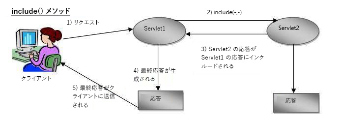

# ウェブチャネルドキュメントの電子メール配信

Webチャネルの対話型通信ドキュメントを定義してテストした後は、Webチャネルドキュメントを受信者に配信する配信メカニズムが必要です。

この記事では、Webチャネルドキュメントの配信メカニズムとして電子メールを見ていきます。 受信者は、Webチャネルドキュメントへのリンクを電子メールで取得します。リンクをクリックすると、ユーザーの認証が求められ、Webチャネルドキュメントには、ログインしたユーザーに固有のデータが入力されます。

次のコードスニペットを見てみましょう。 このコードは、Webチャネルドキュメントへの電子メール内のリンクをユーザーがクリックしたときにトリガーされるGET.jspの一部です。 jackrabbit UserManagerを使用してログインユーザーを取得します。 ログインしたユーザーを取得したら、そのユーザーのプロファイルに関連付けられたaccountNumberプロパティの値を取得します。

次に、accountNumber値をマップ内のaccountnumberというキーに関連付けます。 キー&#x200B;**accountnumber**&#x200B;は、フォームデータモーダルでRequest属性として定義されます。 この属性の値は、Form Data Modal読み取りサービスメソッドに入力パラメーターとして渡されます。

7行目：Interactive CommunicationドキュメントURLで識別されるリソースタイプに基づいて、受信したリクエストを別のサーブレットに送信します。 この2つ目のサーブレットが返す応答は、1つ目のサーブレットの応答に含まれます。

```java
org.apache.jackrabbit.api.security.user.UserManager um = ((org.apache.jackrabbit.api.JackrabbitSession) session).getUserManager();
org.apache.jackrabbit.api.security.user.Authorizable loggedinUser = um.getAuthorizable(session.getUserID());
String accountNumber = loggedinUser.getProperty("profile/accountNumber")[0].getString();
map.put("accountnumber",accountNumber);
slingRequest.setAttribute("paramMap",map);
CustomParameterRequest wrapperRequest = new CustomParameterRequest(slingRequest,"GET");
wrapperRequest.getRequestDispatcher("/content/forms/af/401kstatement/irastatement/channels/web.html").include(wrapperRequest, response);
```



7行目のコードの視覚的表現


フォームデータモーダルの読み取りサービス用に定義された要求属性


[AEMパッケージの例](assets/webchanneldelivery.zip)。
