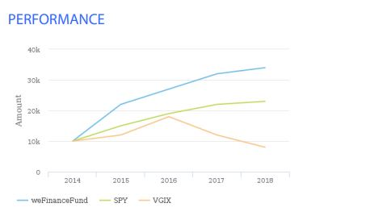

# 複数系列グラフ

AEM Forms 6.5 では、複数系列グラフを作成および設定する機能が導入されました。複数系列グラフは、通常、折れ線グラフ、棒グラフ、列グラフの種類に関連して使用されます。次のグラフは、複数系列グラフの良い例です。このグラフは、10,000 米ドルを 3 種類の投資信託に投資した場合の、一定期間の成長を示しています。AEM Formsでこのようなグラフを作成して使用するには、適切なフォームデータモデルを作成する必要があります。

AEM Forms で複数系列のグラフを作成するには、必要なエンティティとエンティティ間の関連付けを持つ適切なフォームデータモデルを作成する必要があります。次のスクリーンショットは、エンティティと 3 つのエンティティ間の関連付けを示しています。トップレベルでは、Fund エンティティと 1 対多の関連を持つ「組織」というエンティティがあります。次に、Fund エンティティは Performance エンティティと 1 対多の関連があります。

## 複数系列グラフ用のフォームデータモデルの作成

>[!VIDEO](https://video.tv.adobe.com/v/35442?quality=12&learn=on&captions=jpn)

### 線系列グラフの設定

>[!VIDEO](https://video.tv.adobe.com/v/35443?quality=12&learn=on&captions=jpn)

お使いのシステムでこれをテストするには、次の手順に従ってください。

* [AEM Package Manager を使用して、MutualFundFactSheet.zip をダウンロードし、読み込みます。](assets/mutualfundfactsheet.zip)
* [SeriesChartSampleData.json をハードドライブにダウンロードします。](assets/serieschartsampledata.json)これは、グラフにデータを入力するために使用されるサンプルデータです。
* [「フォームとドキュメント」に移動します。](http://localhost:4502/aem/forms.html/content/dam/formsanddocuments)
* 「MutualFundGrowthFactSheet」インタラクティブ通信テンプレートを選択します。
* プレビュー／印刷チャネル／サンプルデータをアップロードをクリックします。
* この記事の一部として提供されているサンプルデータファイルを参照します。
* 前の手順でダウンロードしたサンプルデータを使用して、「MutualFundGrowthFactSheet」インタラクティブ通信の印刷チャネルをプレビューします。
