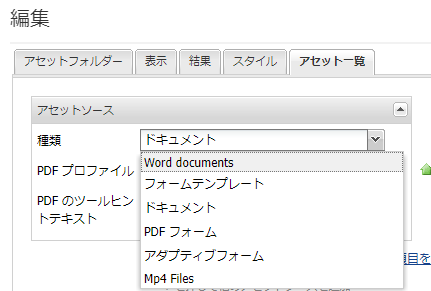

# カスタムアセットタイプの登録{#registering-custom-asset-types}

AEM Forms Portalでのリスト表示に使用するカスタムアセットタイプの有効化

>[!NOTE]
>
>AEM 6.3とSP1を搭載し、対応するAEM Formsがインストール済みであるこ追加とを確認します。 この機能は、AEM Forms6.3 SP1以降でのみ機能します

## ベースパスを指定{#specify-base-path}

ベースパスは最上位のリポジトリパスで、ユーザーがSearch &amp; Listerコンポーネント内でリストしたいすべてのアセットが含まれます。 必要に応じて、ユーザは、コンポーネント編集ダイアログからベースパス内の特定の場所を設定し、検索が特定の場所でトリガされ、ベースパス内のすべてのノードを検索する必要がなくなる。 デフォルトでは、ベースパスは、ユーザーがこの場所内から特定のパスのセットを設定しない限り、アセットを取得するための検索パス条件として使用されます。 パフォーマンスの高い検索を行うためには、このパスの最適な値を持つことが重要です。 ベースパスのデフォルト値は&#x200B;**_/content/dam/formsanddocuments_**&#x200B;のままです。これは、すべてのAEM Formsアセットが&#x200B;**_/content/dam/formsanddocumentsに存在するためです。_**

ベースパスを設定する手順

1. crxにログイン
1. **/libs/fd/fp/extensions/querybuilder/basepath**&#x200B;に移動します。

1. ツールバーの「ノードをオーバーレイ」をクリックします
1. オーバーレイの場所が「/apps/」であることを確認します。
1. 「OK」をクリックします
1. 「保存」をクリックします。
1. **/apps/fd/fp/extensions/querybuilder/basepath**&#x200B;に作成された新しい構造に移動します。

1. パスプロパティの値を&#x200B;**&quot;/content/dam&quot;**&#x200B;に変更します
1. 「保存」をクリックします。

パスプロパティを&#x200B;**&quot;/content/dam&quot;**&#x200B;に指定すると、基本的にベースパスは/content/damに設定されます。 これは、Search &amp; Listerコンポーネントを開くことで確認できます。

## カスタムアセットタイプの登録{#register-custom-asset-types}

Search &amp; Listerコンポーネントに新しいタブ（アセットリスト）が追加されました。 このタブには、初期設定のアセットタイプと、設定済みの追加のアセットタイプがリストされます。 デフォルトでは、次のアセットタイプが表示されます

1. アダプティブフォーム
1. フォームテンプレート
1. PDF フォーム
1. ドキュメント（スタティックPDF）

**カスタムアセットタイプの登録手順**

1. **/libs/fd/fp/extensions/querybuilder/assettypes**&#x200B;のオーバーレイノードを作成

1. オーバーレイの場所を「/apps」に設定します
1. **/apps/fd/fp/extensions/querybuilder/assettypes **で作成した新しい構造に移動します。

1. この場所で、登録するタイプに対して「nt:unstructured」ノードを作成し、**mp4filesという名前を付けます。 この追加mp4filesノード**&#x200B;に対する次の2つのプロパティ

   1. jcr追加:titleプロパティを使用して、アセットタイプの表示名を指定します。 jcr:titleの値を「Mp4 Files」に設定します。
   1. &quot;追加type&quot;プロパティに値を設定し、その値を&quot;videos&quot;に設定します。 これは、ビデオタイプのアセットをリストするためにテンプレートで使用する値です。 変更を保存します。

1. mp4filesの下に、「nt:unstructured」タイプのノードを作成します。 このノードに「searchcriteria」という名前を付けます。
1. 検索条件に1つ追加以上のフィルターが含まれる場合。 MIMEタイプが「video/mp4」のリストmp4Filesに対して検索フィルタを使用したい場合、ここでそれを行うことができます
1. ノードの検索条件の下に、タイプ「nt:unstructured」のノードを作成します。 このノードに「filetypes」という名前を付けます。
1. こ追加の「filetypes」ノードに対する次の2つのプロパティ

   1. name: ./jcr:content/metadata/dc:format
   1. 値：video/mp4

1. つまり、プロパティdc:formatがvideo/mp4と等しいアセットは、アセットタイプ「Mp4ビデオ」と見なされます。 「jcr:content/metadata」ノードにリストされた任意のプロパティを検索条件に使用できます

1. **作業内容を保存してください**

上記の手順を実行した後、新しいアセットタイプ(Mp4 Files)が、以下に示すように、Search &amp; Listerコンポーネントのアセットタイプドロップダウンリストに表示される開始

[この機能を使用する上で問題が発生した場合は、次のパッケージを読み込むことができます。](assets/assettypeskt1.zip) パッケージには、2つのカスタムアセットタイプが定義されています。Mp4ファイルとWorddocuments。 **/apps/fd/fp/extensions/querybuilder/assettypes**&#x200B;をご覧ください。

[customeportalパッケージをインストールします](assets/customportalpage.zip)。このパッケージには、サンプルのポータルページが含まれています。 このページは、このチュートリアルのパート2で使用します。

