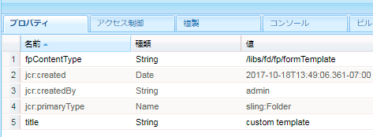
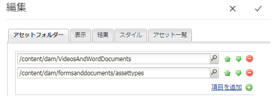
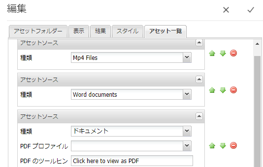

# AEM Forms {#listing-custom-asset-types-in-aem-forms}でのカスタムアセットタイプのリスト

## カスタムテンプレート{#creating-custom-template}を作成しています


この記事の目的で、カスタムアセットタイプとOOTBアセットタイプを同じページに表示するカスタムテンプレートを作成します。 カスタムテンプレートを作成するには、次の手順に従います

1. Slingの作成：/appsの下のフォルダー。 名前を「 myportalcomponent 」にします。
1. &quot;fpContentType&quot; プロパティを追加この値を&quot;**/libs/fd/ fp/formTemplate&quot;.**&#x200B;に設定します。
1. 「title」プロパティを追加し、その値を「カスタムテンプレート」に設定します。 これは、Search &amp; Listerコンポーネントのドロップダウンリストに表示される名前です
1. このフォルダーの下に「template.html」を作成します。 このファイルには、様々なアセットタイプのスタイルを設定および表示するコードが格納されます。



次のコードは、 search &amp; listerコンポーネントを使用する様々なタイプのアセットをリストします。 アセットのタイプごとに個別のhtml要素を作成します（ data-type = &quot;videos&quot;タグで示します）。 アセットタイプが「ビデオ」の場合は、 &lt;video>要素を使用してビデオをインラインで再生します。 「worddocuments」のアセットタイプでは、異なるHTMLマークアップを使用します。

```html
<div class="__FP_boxes-container __FP_single-color">
   <div  data-repeatable="true">
     <div class = "__FP_boxes-thumbnail" style="float:left;margin-right:20px;" data-type = "videos">
   <video width="400" controls>
       <source src="${path}" type="video/mp4">
    </video>
         <h3 class="__FP_single-color" title="${name}" tabindex="0">${name}</h3>
     </div>
     <div class="__FP_boxes-thumbnail" style="float:left;margin-right:20px;" data-type = "worddocuments">
       <a href="/assetdetails.html${path}" target="_blank">
           
          </a>
          <h3 class="__FP_single-color" title="${name}" tabindex="0">${name}</h3>
     </div>
  <div class="__FP_boxes-thumbnail" style="float:left;margin-right:20px;" data-type = "xfaForm">
       <a href="/assetdetails.html${path}" target="_blank">
           
          </a>
          <h3 class="__FP_single-color" title="${name}" tabindex="0">${name}</h3>
                <a href="{formUrl}"></a><p>

     </div>
  <div class="__FP_boxes-thumbnail" style="float:left;margin-right:20px;" data-type = "printForm">
       <a href="/assetdetails.html${path}" target="_blank">
           
          </a>
          <h3 class="__FP_single-color" title="${name}" tabindex="0">${name}</h3>
                <a href="{pdfUrl}"></a><p>
     </div>
   </div>
</div>
```

>[!NOTE]
>
>11行目 — 画像srcを変更して、DAMで選択した画像を指すようにしてください。
>
>このテンプレート内のアダプティブFormsをリストするには、新しいdivを作成し、そのdata-type属性を「guide」に設定します。 data-type=&quot;printFormのdivをコピーして貼り付け、新しくコピーしたdivのdata-typeを&quot;guide&quot;に設定できます。

## Search &amp; Listerコンポーネントの設定{#configure-search-and-lister-component}

カスタムテンプレートを定義したら、このカスタムテンプレートを「Search &amp; Lister」コンポーネントに関連付ける必要があります。 ブラウザー[でこのURL ](http://localhost:4502/editor.html/content/AemForms/CustomPortal.html)を参照します。

デザインモードに切り替え、許可されたコンポーネントグループにSearch &amp; Listerコンポーネントを含めるように段落システムを設定します。 Search &amp; Listerコンポーネントは、Document Servicesグループの一部です。

編集モードに切り替え、Search &amp; ListerコンポーネントをParSysに追加します。

「Search &amp; Lister」コンポーネントの設定プロパティを開きます。 「アセットフォルダー」タブが選択されていることを確認します。 Search &amp; Listerコンポーネント内のアセットのリストを作成するフォルダーを選択します。 この記事のために、私は選んだ

* /content/dam/VideosAndWordDocuments
* /content/dam/formsanddocuments/assettypes



「表示」タブにタブを移動します。 ここでは、Search &amp; Listerコンポーネントにアセットを表示するテンプレートを選択します。

次に示すように、ドロップダウンから「カスタムテンプレート」を選択します。


ポータルに表示するアセットのタイプを設定します。 アセットのタブのタイプを「アセットリスト」に設定し、アセットのタイプを設定するには この例では、次のタイプのアセットを設定します

1. MP4ファイル
1. Word文書
1. ドキュメント（これはOOTBアセットタイプ）
1. フォームテンプレート（OOTBアセットタイプ）

次のスクリーンショットは、リストに設定されているアセットタイプを示しています



これで、Search &amp; Lister Portalコンポーネントを設定したので、次はリスターを実際に表示します。 ブラウザー[でこのURL ](http://localhost:4502/content/AemForms/CustomPortal.html?wcmmode=disabled)を参照します。 結果は、次の画像のようになります。

>[!NOTE]
>
>ポータルでパブリッシュサーバー上のカスタムアセットタイプのリストを作成する場合は、ノード&#x200B;**/apps/fd/fp/extensions/querybuilder**&#x200B;に「fd-service」ユーザーに「読み取り」権限を付与してください


[assettypesパッケージマネージャーを使用して、このパッケージをダウンロードしてインストールしてください。](assets/customassettypekt1.zip) これには、Search &amp; Listerコンポーネントを使用してリストを表示するアセットタイプとして使用される、サンプルのmp4とWordドキュメントおよびxdpファイルが含まれます
