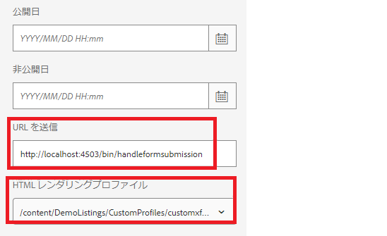

# このユースケースをシステムで動作させる

>[!NOTE]
>
>サンプルアセットがシステム上で動作するようにするには、AEM Forms オーサーインスタンスとAEM Forms パブリッシュインスタンスへのアクセス権があることを前提としています。

ローカルシステムでこのユースケースを機能させるには、次の手順に従います。

## AEM Forms オーサーインスタンスに以下をデプロイします

* [MobileFormToWorkflow バンドルのインストール](assets/MobileFormToWorkflow.core-1.0.0-SNAPSHOT.jar)

* HTML5 フォームのデータを XDP に結合し、インタラクティブ PDF を返す [ カスタムプロファイルを読み込み ](assets/customprofile.zip) ます。

* [ サービスユーザーバンドルを使用した開発をデプロイする ](https://experienceleague.adobe.com/docs/experience-manager-learn/assets/developingwithserviceuser.zip?lang=en)
configMgr を使用して、Apache Sling Service User Mapper Service に次のエントリを追加します。

```
DevelopingWithServiceUser.core:getformsresourceresolver=fd-service
```

* [configMgr](http://localhost:4502/system/console/configMg) を使用して、AEM Server Credentials 設定のフォルダー名を指定することで、フォーム送信を別のフォルダーに格納できます。 フォルダーを変更する場合は、そのフォルダーにランチャーを作成して、ワークフロー **ReviewSubmittedPDF** をトリガーします


* [ パッケージマネージャーを使用して、サンプル xdp とワークフローパッケージを読み込みます ](assets/xdp-form-and-workflow.zip)。


## 次のアセットをパブリッシュインスタンスにデプロイします

* [MobileFormToWorkflow バンドルのインストール](assets/MobileFormToWorkflow.core-1.0.0-SNAPSHOT.jar)

* [configMgr](http://localhost:4503/system/console/configMgr) を使用して送信したデータをAEM サーバー資格情報に保存するために、オーサーインスタンスのユーザー名とパスワードおよび **AEM リポジトリ内の既存の場所** を指定します。 AEM Workflow Server 上のエンドポイントの URL はそのままにすることができます。 これは、ノードで指定された送信内からデータを抽出して保存するエンドポイントです。
  

* [ サービスユーザーバンドルを使用した開発をデプロイする ](https://experienceleague.adobe.com/docs/experience-manager-learn/assets/developingwithserviceuser.zip?lang=en)
* [OSGi 設定を開きます](http://localhost:4503/system/console/configMgr)。
* **Apache Sling Referrer Filter** を検索します。「空白を許可」チェックボックスがオンになっていることを確認します。
* HTML5 フォームのデータを XDP に結合し、インタラクティブ PDF を返す [ カスタムプロファイルを読み込み ](assets/customprofile.zip) ます。


## ソリューションのテスト

* オーサーインスタンスにログインします
* [w9.xdp の詳細プロパティを編集します ](http://localhost:4502/libs/fd/fm/gui/content/forms/formmetadataeditor.html/content/dam/formsanddocuments/w9.xdp)。 送信 URL とレンダリングプロファイルが以下に示すように正しく設定されていることを確認します。
  

* w9.xdp のPublish
* パブリッシュインスタンスにログインします
* [w9 フォームをプレビューする ](http://localhost:4503/content/dam/formsanddocuments/w9.xdp/jcr:content)
* 複数のフィールドに入力し、ツールバーのボタンをクリックしてインタラクティブ PDF をダウンロードします。
* Acrobat を使用してダウンロードした PDF に入力し、「送信」ボタンを押します。
* 成功メッセージが表示されます
* 管理者として AEM オーサーインスタンスにログインします。
* [AEM インボックスを確認する](http://localhost:4502/aem/inbox)
* 送信された PDF 項目を確認する作業項目が必要です。

>[!NOTE]
>
>一部の顧客は、パブリッシュインスタンスで実行するサーブレットに PDF を送信する代わりに、Tomcat などのサーブレットコンテナにサーブレットをデプロイしています。 これはすべて、顧客が使用するトポロジによって異なります。このチュートリアルでは、パブリッシュインスタンスにデプロイされたサーブレットを使用して、PDF 送信を処理します。
