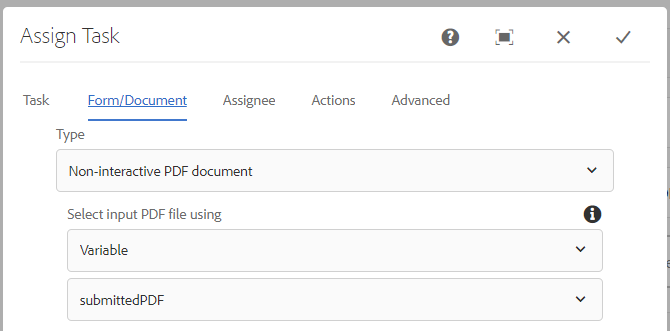

# 送信済みPDFをレビューおよび承認するためのワークフロー

最後と最後のステップは、レビューと承認のための静的または非インタラクティブなPDFを生成するAEMワークフローを作成することです。 ワークフローは、ノード`/content/pdfsubmissions`上で構成されたAEMランチャーを介してトリガーされます。

次のスクリーンショットは、ワークフローに関連する手順を示しています。

## 非インタラクティブPDFワークフローの手順を生成

ここでは、XDPテンプレートとテンプレートに結合するデータを指定します。 結合されるデータは、PDFから送信されたデータです。 この送信データはノード`/content/pdfsubmissions`の下に保存されます。

生成されたPDFは`submittedPDF`という名前のワークフロー変数に割り当てられます。

### 生成されたpdfをレビューおよび承認用に割り当てます

「タスクの割り当て」ワークフローコンポーネントは、生成されたPDFをレビューおよび承認用に割り当てるために使用します。 変数`submittedPDF`は、タスク割り当てワークフローコンポーネントの「Formsとドキュメント」タブで使用されます。

