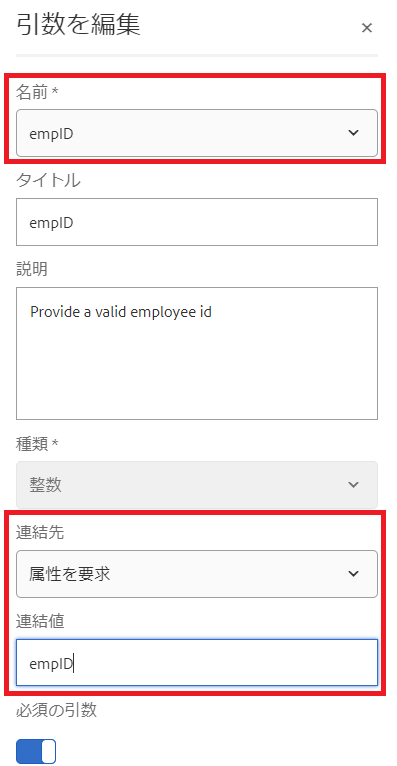
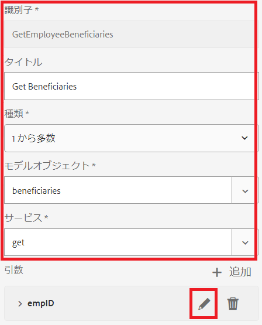
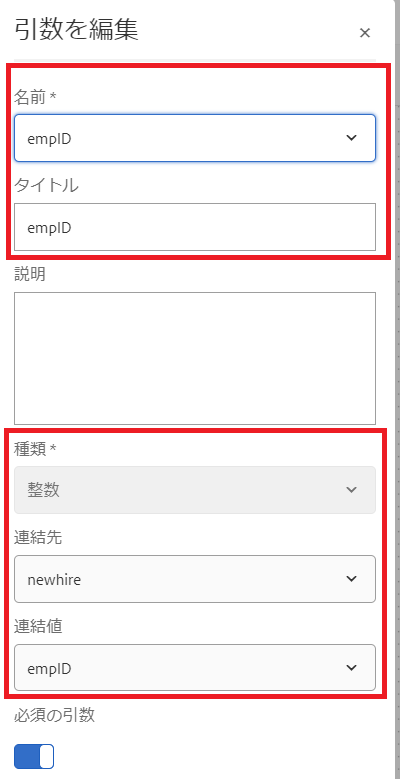
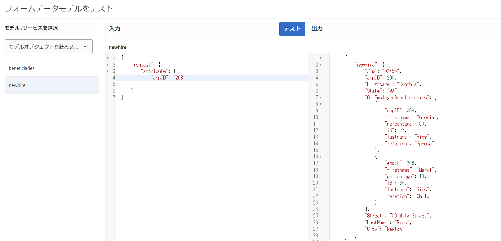

# フォームデータモデルの設定

## Apache Sling接続プールされたデータソース

RDBMSでバックアップされたフォームデータモデルを作成する最初の手順は、Apache Sling接続プールされたデータソースを設定することです。 データソースを設定するには、次の手順に従います。

* ブラウザに[configMgr](http://localhost:4502/system/console/configMgr)を指定します。
* **Apache Sling接続プールされたDataSource**&#x200B;を探します
* 新し追加いエントリが作成され、スクリーンショットに示すように値が提供されます。
* 
* 変更を保存する

>[!NOTE]
>JDBC接続のURI、ユーザー名、パスワードは、MySQLデータベースの設定に応じて変わります。

## フォームデータモデルの作成

* ブラウザーに[データ統合](http://localhost:4502/aem/forms.html/content/dam/formsanddocuments-fdm)を指定します。
* 「_作成_->_フォームデータモデル_」をクリックします
* **従業員**&#x200B;などのフォームデータモデルに意味のある名前とタイトルを付けます。
* 「_次へ_」をクリックします。
* 前のセクション（フォーラム）で作成したデータソースを選択します
* 「_作成_->編集」をクリックして、新しく作成したフォームデータモデルを編集モードで開きます
* _フォーラム_&#x200B;ノードを展開して、従業員のスキーマを確認します。 employeeノードを展開して2つの表を表示します

## モデル追加のエンティティ

* employeeノードが展開されていることを確認します。
* 新しいエンティティと受益者エンティティを選択し、_追加選択済み_&#x200B;をクリックします

## エンティティを追加すぐに読み取る

* 全エンティティの選択
* 「_プロパティの編集_」をクリックします。
* 「サービスを読み取り」ドロップダウンリストから「get」を選択します。
* 「+」アイコンをクリックして、getサービスにパラメーターを追加します。
* スクリーンショットに示すように値を指定する
* 
>[!NOTE]
> getサービスでは、エンティティのempID列にマッピングされた値が必要です。この値を渡す方法は複数あり、このチュートリアルでは、empIDがempIDというリクエストパラメータを通じて渡されます。
* 「_完了_」をクリックして、getサービスの引数を保存します
* 「_完了_」をクリックして、変更をフォームデータモデルに保存します

## 2追加エンティティ間の関連付け

データベースエンティティ間で定義された関連付けは、フォームデータモデルでは自動的に作成されません。 エンティティ間の関連付けは、フォームデータモデルエディターを使用して定義する必要があります。 全ての組織が1人以上の受益者を持つことができます私たちは新しい権利者と受益者の間に1対多の関連性を定義する必要があります
次の手順で、1対多の関連付けを作成するプロセスを説明します

* エンティティを選択し、_追加関連付け_&#x200B;をクリックします
* 以下のスクリーンショットに示すように、関連付けと他のプロパティに意味のあるタイトルと識別子を指定します
   

* 「引数」セクションの下の&#x200B;_編集_&#x200B;アイコンをクリックします

* このスクリーンショットに示すように値を指定します。
* 
* **受益者エンティティと新規エンティティのempID列を使用して、2つのエンティティをリンクします。**
* 「_完了_」をクリックして変更を保存します

## フォームデータモデルのテスト

フォームデータモデルに、empIDを受け取り、新婚者とその受益者の詳細を返す&#x200B;**_get_**&#x200B;サービスが追加されました。 getサービスをテストするには、次の手順に従ってください。

* 全エンティティの選択
* 「_モデルオブジェクトをテスト_」をクリックします。
* 有効なempIDを入力し、_テスト_&#x200B;をクリックします
* 以下のスクリーンショットに示すように、結果が得られます。
* 
