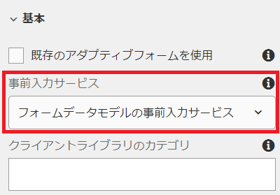

# アダプティブフォームの作成

これまで、以下を作成しました

* 2つのテーブルを持つデータベース — `newhire`と`beneficiaries`
* 設定済みのApache Sling接続プール済みデータソース
* RDBMSベースのフォームデータモデル

次のステップは、フォームデータモデルを使用するアダプティブフォームを作成し、設定することです。  ヘッド開始を取得するには、[サンプルフォーム](assets/fdm-demo-af.zip)をダウンロードして読み込みます。 サンプルフォームには、従業員の詳細を表示するセクションと、リスト従業員の受益者に対する別のセクションがあります。

## フォームをフォームデータモデルに関連付ける

このコースで提供されるサンプルフォームは、どのフォームデータモデルにも関連付けられていません。 フォームデータモデルを使用するようにフォームを設定するには、次の手順を実行する必要があります。

* FDMDemoフォームを選択
* 「_プロパティ_->_フォームモデル_」をクリックします。
* ドロップダウンリストから「Form Data Model」を選択します
* 前のレッスンで作成したフォームデータモデルを検索して選択します。
* 「_保存して閉じる_」をクリックします

## 事前入力サービスの設定

最初の手順は、フォームに事前入力サービスを関連付けることです。 事前入力サービスを関連付けるには、次の手順に従ってください

* `FDMDemo`フォームを選択
* 「_編集_」をクリックしてフォームを編集モードで開きます
* コンテンツ階層でフォームコンテナを選択し、レンチアイコンをクリックして、プロパティシートを開きます
* 「事前入力サービス」ドロップダウンリストから「_Form Data Model Prefillサービス_」を選択します。
* 青色をクリック☑して変更を保存します

* 

## 従業員の詳細の設定

次の手順は、アダプティブフォームのテキストフィールドをフォームデータモデルの要素に連結することです。 次のフィールドのプロパティシートを開き、bindRefを次のように設定する必要があります。

| フィールド名 | 参照をバインド |
|------------|--------------------|
| 名 | /newhire/FirstName |
| 姓 | /newhire/lastName |

>[!NOTE]
>
>テキストフィールドを追加し、それらを適切なフォームデータモデルの要素に連結することは自由に行ってください。

## 受益者テーブルの構成

次のステップは、従業員の受益者を表形式で表示することです。 提供されるサンプルフォームには、4列1行のテーブルがあります。 受益者の数に応じてテーブルが拡大するように設定する必要があります。

* フォームを編集モードで開きます。
* 「Root Panel」>「Your Wensaries」>「Table」を展開します。
* 「Row1」を選択し、レンチアイコンをクリックして、プロパティシートを開きます。
* バインド参照を&#x200B;**/newhire/GetEmployeeWensitaries**&#x200B;に設定します。
* 「繰り返しの設定 — 最小値」を1、「最大値」を5に設定します。
* Row1設定は、次のスクリーンショットのようになります
   
* 青色をクリック☑して変更を保存します

## 行のセルを連結

最後に、行セルとフォームデータモデルの要素を連結します。

* 「Root Panel」>「Your Wensaries」>「Table」>「Row1」を展開します。
* 下の表に従って、各行セルの連結参照を設定します

| 行セル | バインド参照 |
|------------|----------------------------------------------|
| firstName | /newhire/GetEmployeeHunsaries/firstname |
| 姓 | /newhire/GetEmployeeHunaries/lastname |
| 関係 | /newhire/GetEmployeeHunsaries/relation |
| 割合 | /newhire/GetEmployeeHunsaries/percentage |

* 青色をクリック☑して変更を保存します

## フォームのテスト

次に、適切なempIDを含むフォームをURLで開く必要があります。 次の2つのリンクは、データベースからの情報をフォームに埋め込みます
[empID=207](http://localhost:4502/content/dam/formsanddocuments/fdmdemo/jcr:content?wcmmode=disabled&amp;empID=207)のフォーム
[empID=208](http://localhost:4502/content/dam/formsanddocuments/fdmdemo/jcr:content?wcmmode=disabled&amp;empID=208)のフォーム

## トラブルシューティング

フォームが空白でデータがない

* フォームデータモデルが正しい結果を返していることを確認します。
* フォームが正しいフォームデータモデルに関連付けられている
* フィールドの連結の確認
* stdoutログファイルを確認します。 empIDがファイルに書き込まれていることが確認できます。この値が表示されない場合は、フォームで提供されたカスタムテンプレートが使用されていない可能性があります。

テーブルに値が入力されていない

* Row1連結の確認
* 行1の繰り返し設定が正しく設定されていることを確認します（最小=1、最大= 5以上）。

