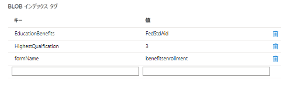

# カスタム送信の作成

フォーム送信を処理するために、カスタム送信ハンドラーが記述されました。大まかに言えば、カスタム送信ハンドラーは以下を行います。

* 送信されたフォームの名前を抽出します。
* 送信されたデータを抽出します。コアコンポーネントベースのフォームの送信済みデータは、常に JSON 形式になります。
* フォームの添付ファイルを抽出して Azure portal に保存します。送信された json データに添付ファイルの URL を反映します。
* BLOB インデックスタグの作成 - フォームの検索可能なフィールドのリストと、それに対応する値を送信済みデータから見つけます。
* BLOB インデックスタグを送信済みデータと関連付け、Azure portal に保存します。

次のスクリーンショットは、Azure portal 内の BLOB インデックスタグを示しています。

カスタム送信コードは、**_StoreFormDataWithBlobIndexTagsInAzure_** にあり、Azure にデータを保存および取得するためのコードは **_SaveAndFetchFromAzure_** コンポーネントにあります。

## 次の手順

[クエリインターフェイスの作成](./part3.md)
