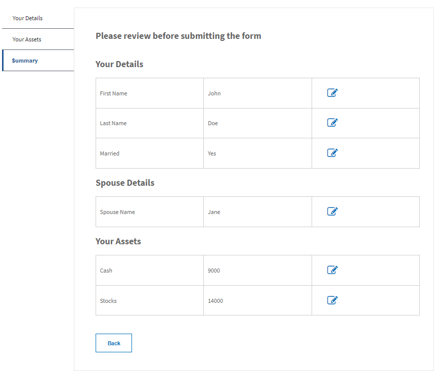

# 送信前にフォームデータを確認する

フォームを送信する前にフォームデータを確認および編集するための概要コンポーネントを作成する手順について説明する、マルチパートチュートリアルです。

このチュートリアルに従うには、以下をインストールすることをお勧めします。

* AEM 6.5 以降（適切なフォームアドオンパッケージを使用）

また、AEM および AEM Forms である程度の開発経験があることもお勧めします。

## 次の手順

[カスタムコンポーネントを使用したデータの要約](./create-component.md)