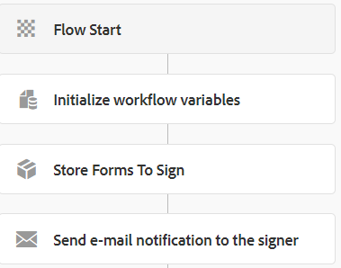

# メインワークフローの作成

メインワークフローは、ユーザーが最初のフォーム（**RefinanceForm**）を送信するとトリガーされます。 以下は、ワークフローの流れです



**署名するフォームを保存** は、カスタムプロセス手順です。

カスタムプロセス手順を実装する動機は、AEM ワークフローを拡張することです。 次のコードは、カスタムプロセス手順を実装します。 コードは、署名するフォームの名前を抽出し、送信されたフォームデータを SignMultipleForms サービスの `insertData` メソッドに渡します。`insertData` メソッドは、次に、データソース **aemformstudation** で識別されるデータベースに行を挿入します。

このカスタムプロセス手順のコードは、`SignMultipleForms` サービスを参照します。


```java
package com.aem.forms.signmultipleforms;

import java.io.ByteArrayInputStream;
import java.io.ByteArrayOutputStream;
import java.io.InputStream;
import java.io.StringWriter;
import java.nio.charset.Charset;
import java.nio.charset.StandardCharsets;

import javax.jcr.Node;
import javax.jcr.Session;
import javax.xml.parsers.DocumentBuilder;
import javax.xml.parsers.DocumentBuilderFactory;
import javax.xml.transform.TransformerFactory;
import javax.xml.transform.dom.DOMSource;
import javax.xml.transform.stream.StreamResult;
import javax.xml.xpath.XPath;

import org.apache.commons.io.IOUtils;
import org.osgi.framework.Constants;
import org.osgi.service.component.annotations.Component;
import org.osgi.service.component.annotations.Reference;
import org.slf4j.Logger;
import org.slf4j.LoggerFactory;
import org.w3c.dom.Document;

import com.adobe.granite.workflow.WorkflowException;
import com.adobe.granite.workflow.WorkflowSession;
import com.adobe.granite.workflow.exec.WorkItem;
import com.adobe.granite.workflow.exec.WorkflowProcess;
import com.adobe.granite.workflow.metadata.MetaDataMap;

@Component(property = {
  Constants.SERVICE_DESCRIPTION + "=StoreFormsToSign",
  Constants.SERVICE_VENDOR + "=Adobe Systems",
  "process.label" + "=StoreFormsToSign"
})
public class StoreFormsToSignWorkflowStep implements WorkflowProcess {
  private static final Logger log = LoggerFactory.getLogger(StoreFormsToSignWorkflowStep.class);@Reference
  SignMultipleForms signMultipleForms;

  @Override
  public void execute(WorkItem workItem, WorkflowSession workflowSession, MetaDataMap arg2) throws WorkflowException {
    String payloadPath = workItem.getWorkflowData().getPayload().toString();
    log.debug("The payload  in StoreFormsToSign " + workItem.getWorkflowData().getPayload().toString());
    String dataFilePath = payloadPath + "/Data.xml/jcr:content";
    String serverURL = arg2.get("PROCESS_ARGS", "string").toString();
    Session session = workflowSession.adaptTo(Session.class);
    DocumentBuilderFactory factory = null;
    DocumentBuilder builder = null;
    Document xmlDocument = null;
    Node xmlDataNode = null;
    try {
      xmlDataNode = session.getNode(dataFilePath);
      InputStream xmlDataStream = xmlDataNode.getProperty("jcr:data").getBinary().getStream();
      XPath xPath = javax.xml.xpath.XPathFactory.newInstance().newXPath();
      factory = DocumentBuilderFactory.newInstance();
      builder = factory.newDocumentBuilder();
      xmlDocument = builder.parse(xmlDataStream);
      org.w3c.dom.Node node = (org.w3c.dom.Node) xPath.compile("/afData/afUnboundData/data/formsToSign").evaluate(xmlDocument, javax.xml.xpath.XPathConstants.NODE);
      log.debug("The form names to sign are  t" + node.getTextContent());
      String formNamesToSign[] = node.getTextContent().split(",");
      ByteArrayOutputStream outputStream = new ByteArrayOutputStream();
      DOMSource source = new DOMSource(xmlDocument);
      StreamResult outputTarget = new StreamResult(outputStream);
      TransformerFactory.newInstance().newTransformer().transform(source, outputTarget);
      InputStream inputStream = new ByteArrayInputStream(outputStream.toByteArray());
      StringWriter writer = new StringWriter();
      IOUtils.copy(inputStream, writer, Charset.defaultCharset());
      String formData = writer.toString();
      signMultipleForms.insertData(formNamesToSign, formData, serverURL, workItem, workflowSession);

  }
    catch(Exception e) {
      log.debug(e.getMessage());
    }

  }
}
```


## Assets

この記事で使用される、複数のフォームに署名ワークフローは、[こちら](assets/sign-multiple-forms-workflows.zip)からダウンロードできます

>[!NOTE]
> メール通知を送信するには、Day CQ メールサービスを設定してください。 上記のパッケージには、メールテンプレートも含まれています。

## 次の手順

[ドキュメント署名時の署名ステータスの更新](./update-signature-status.md)
