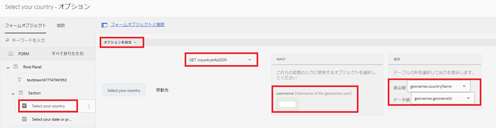
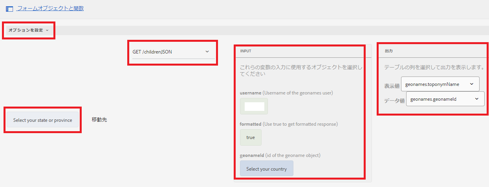
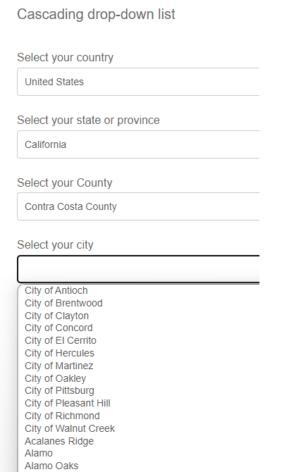

# カスケードドロップダウンリスト

カスケードドロップダウンリストは、1 つの DropDownList コントロールが親または以前の DropDownList コントロールに依存する、一連の依存 DropDownList コントロールです。 DropDownList コントロールの項目は、別の DropDownList コントロールからユーザーが選択した項目に基づいて設定されます。

## ユースケースのデモ

>[!VIDEO](https://video.tv.adobe.com/v/340344?quality=12&learn=on)

このチュートリアルでは、[Geonames REST API](https://www.geonames.org/export/web-services.html) を使用して、この機能を試すことができます。
この種のサービスを提供する組織は多数あり、REST API が詳細に文書化されている限り、データ統合機能を使用して AEM Forms と簡単に統合できます

次の手順に従って、AEM Forms にカスケードドロップダウンリストを実装しました

## 開発者アカウントの作成

[地域名](https://www.geonames.org/login)で開発者アカウントを作成します。 ユーザー名をメモします。 このユーザー名は、geonames.org の REST API を呼び出すために必要です。

## Swagger／OpenAPI ファイルの作成

OpenAPI Specification（旧称 Swagger Specification）は、REST API の API 記述形式です。 OpenAPI ファイルを使用すると、次のような API 全体を記述できます。

* 使用可能なエンドポイント（/users）および各エンドポイントでの操作（GET/users、POST/users）
* 操作パラメーター各操作の入出力
認証方法
* 連絡先情報、ライセンス、利用条件、その他の情報。
* API の仕様は、YAML または JSON で記述できます。 形式は、学習が容易で、人と機械の両方が読み取り可能です。

最初の swagger／OpenAPI ファイルを作成するには、[OpenAPI ドキュメント](https://swagger.io/docs/specification/2-0/basic-structure/)に従ってください。

>[!NOTE]
> AEM Forms は、OpenAPI Specification version 2.0（旧 Swagger）をサポートしています。

[Swagger Editor](https://editor.swagger.io/) を使用して swagger ファイルを作成し、国または州のすべての国と子要素を取得する操作を記述します。 Swagger ファイルは、JSON 形式または YAML 形式で作成できます。

## データソースの作成

AEM／AEM Forms をサードパーティのアプリケーションと統合するには、クラウドサービス設定で[データソースを作成](https://experienceleague.adobe.com/docs/experience-manager-learn/forms/ic-web-channel-tutorial/parttwo.html?lang=ja)する必要があります。 [Swagger ファイル](assets/geonames-swagger-files.zip)を使用してデータソースを作成します。 2 つのデータソースを作成する必要があります（1 つはすべての国を取得するためのデータソースで、もう 1 つは子要素を取得するためのデータソース）

## フォームデータモデルの作成

AEM Forms のデータ統合機能には、[フォームデータモデル](https://experienceleague.adobe.com/docs/experience-manager-65/forms/form-data-model/create-form-data-models.html?lang=ja)を作成して使用するための直感的なユーザーインターフェイスが付属しています。 前の手順で作成したデータソースに基づいて、フォームデータモデルを作成します。 2 つのデータソースを持つフォームデータモデル

## アダプティブフォームの作成

フォームデータモデルの GET 呼び出しをアダプティブフォームと統合して、ドロップダウンリストに入力します。
2 つのドロップダウンリストを持つアダプティブフォームを作成します。 1 つは国をリストするためのもので、もう 1 つは選択した国に応じて州や都道府県をリストするものです。

### 「国」ドロップダウンリストへの入力

国リストは、フォームが最初に初期化されたときに入力されます。 次のスクリーンショットは、「国」ドロップダウンリストのオプションを入力するように設定されたルールエディターを示しています。 この機能を使用するためには、ユーザー名に geonames アカウントを指定する必要があります。

#### 都道府県ドロップダウンリストに入力する

選択した国に基づいて、「都道府県」ドロップダウンリストを生成する必要があります。 以下のスクリーンショットに、ルールエディターの設定を示します

### 演習

フォームに郡と市という名前の 2 つのドロップダウンリストを追加して、選択した国と都道府県に基づいて郡と市を一覧表示します。

### サンプルアセット

次のアセットをダウンロードして、カスケードドロップダウンリストのサンプルの作成を開始できます
完成した Swagger ファイルは、[こちら](assets/geonames-swagger-files.zip)からダウンロードできます
Swagger ファイルには、次の REST API が記述されています
* [すべての国を取得](https://secure.geonames.org/countryInfoJSON?username=yourusername)
* [Geoname オブジェクトの子の取得](https://secure.geonames.org/children?formatted=true&amp;geonameId=6252001&amp;username=yourusername)

入力済みの[フォームデータモデルは、こちらからダウンロードできます](assets/geonames-api-form-data-model.zip)
