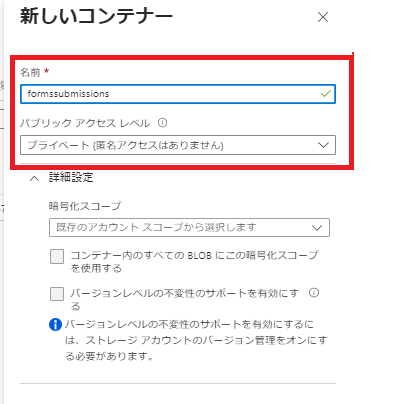
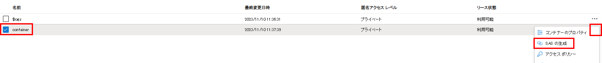
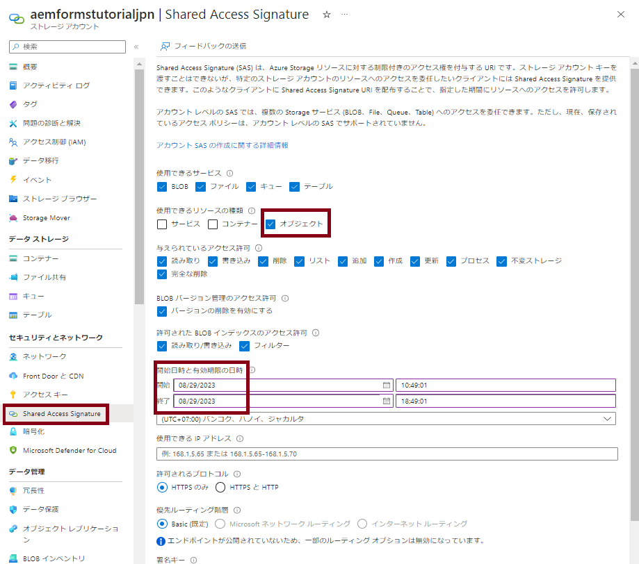
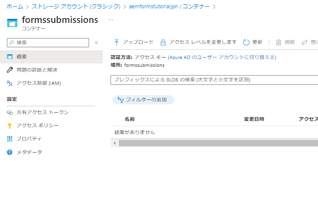

# Azure ストレージへのフォーム送信の保存

この記事では、REST 呼び出しを実行して、送信した AEM Forms データを Azure ストレージに保存する方法を説明します。
送信したフォームデータを Azure ストレージに保存するには、次の手順に従う必要があります。

>[!NOTE]
>この記事のコードは、コアコンポーネントベースのアダプティブフォームでは機能しません。[コアコンポーネントベースのアダプティブフォームに関する同様の記事は、こちらから参照できます](https://experienceleague.adobe.com/docs/experience-manager-learn/forms/prefill-form-with-data-attachments/introduction.html?lang=ja)


## Azure ストレージアカウントの作成

[Azure Portal アカウントにログインし、ストレージアカウントを作成します](https://learn.microsoft.com//ja-jp/azure/storage/common/storage-account-create?tabs=azure-portal#create-a-storage-account-1)。ストレージアカウントにわかりやすい名前を付けて、「レビュー」をクリックしたあと、「作成」をクリックします。これにより、すべてのデフォルト値を使用してストレージアカウントが作成されます。この記事では、ストレージアカウントに `aemformstutorial` という名前を付けました。


## コンテナの作成

次に、フォーム送信のデータを保存するコンテナを作成する必要があります。
ストレージアカウントページで、左側の「コンテナ」メニュー項目をクリックし、`formssubmissions` というコンテナを作成します。パブリックアクセスレベルを必ずプライベートに設定してください。


## コンテナ上に SAS を作成

Shared Access Signature（SAS）の認証メソッドを使用して、Azure ストレージコンテナを操作できるようになります。
ストレージアカウントのコンテナに移動し、省略記号をクリックし、スクリーンショットに示すように、「SAS を生成」オプションを選択します

次のスクリーンショットに示すように、適切な権限と終了日を必ず指定し、「SAS トークンと URL を生成」をクリックします。Blob SAS トークンと Blob SAS URL をコピーします。これら 2 つの値を使用して HTTP 呼び出し
 を行います


## Blob SAS トークンとストレージ URI を指定します

コードをより汎用的にするには、次に示すように、OSGi 設定を使用して 2 つのプロパティを設定します。_**aemformstutorial**_ はストレージアカウントの名前で、_**formsubmissions**_ はデータを保存するコンテナです。
ストレージ URI の末尾に「/」があり、SAS トークンが「?」で始まることを確認してください。


## PUT リクエストの作成

次に、送信したフォームデータを Azure ストレージに保存するための PUT リクエストを作成します。フォーム送信はすべて、一意の BLOB ID で識別する必要があります。一意の BLOB ID は通常、コード内で作成し、PUT リクエストの URL に挿入します。
PUT リクエストの URL の一部を以下に示します。`aemformstutorial` はストレージアカウントの名前で、formsubmissions は一意の BLOB ID でデータを保存するコンテナです。URL の残りの部分は同じままです。
https://aemformstutorial.blob.core.windows.net/formsubmissions/blobid/sastoken
PUT リクエストを使用して、送信したフォームデータを Azure ストレージに保存するために作成した関数を以下に示します。なお、URL では、コンテナ名と UUID を使用しています。以下に示すサンプルコードを使用して OSGi サービスまたは Sling サーブレットを作成し、フォーム送信を Azure ストレージに保存できます。

```java
 public String saveFormDatainAzure(String formData) {
    log.debug("in SaveFormData!!!!!" + formData);
    String sasToken = azurePortalConfigurationService.getSASToken();
    String storageURI = azurePortalConfigurationService.getStorageURI();
    log.debug("The SAS Token is " + sasToken);
    log.debug("The Storage URL is " + storageURI);
    org.apache.http.impl.client.CloseableHttpClient httpClient = HttpClientBuilder.create().build();
    UUID uuid = UUID.randomUUID();
    String putRequestURL = storageURI + uuid.toString();
    putRequestURL = putRequestURL + sasToken;
    HttpPut httpPut = new HttpPut(putRequestURL);
    httpPut.addHeader("x-ms-blob-type", "BlockBlob");
    httpPut.addHeader("Content-Type", "text/plain");

    try {
        httpPut.setEntity(new StringEntity(formData));

        CloseableHttpResponse response = httpClient.execute(httpPut);
        log.debug("Response code " + response.getStatusLine().getStatusCode());
        if (response.getStatusLine().getStatusCode() == 201) {
            return uuid.toString();
        }
    } catch (IOException e) {
        log.error("Error: " + e.getMessage());
        throw new RuntimeException(e);
    }
    return null;

}
```

## コンテナに保存したデータの確認



## ソリューションをテスト

* [カスタム OSGi バンドルのデプロイ](./assets/SaveAndFetchFromAzure.core-1.0.0-SNAPSHOT.jar)

* [カスタムアダプティブフォームテンプレートと、テンプレートに関連付けられたページコンポーネントを読み込みます](./assets/store-and-fetch-from-azure.zip)

* [サンプルアダプティブフォームを読み込みます。](./assets/bank-account-sample-form.zip)

* [OSGi 設定コンソールを使用して、Azure portal 設定で適切な値を指定します](https://experienceleague.adobe.com/docs/experience-manager-learn/forms/some-useful-integrations/store-form-data-in-azure-storage.html?lang=ja#provide-the-blob-sas-token-and-storage-uri)

* [BankAccount フォームをプレビューして送信](http://localhost:4502/content/dam/formsanddocuments/azureportalstorage/bankaccount/jcr:content?wcmmode=disabled)

* データが任意の Azure ストレージコンテナに保存されていることを確認します。Blob ID をコピーします。
* [BankAccount フォームをプレビュー](http://localhost:4502/content/dam/formsanddocuments/azureportalstorage/bankaccount/jcr:content?wcmmode=disabled&amp;guid=dba8ac0b-8be6-41f2-9929-54f627a649f6)し、Azure ストレージからのデータが事前に入力されるフォームの URL で、guid パラメーターとして Blob ID を指定します

