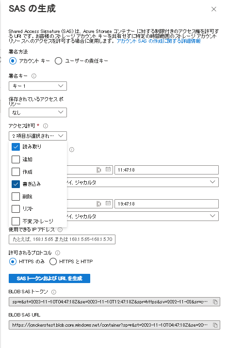

# Azure ストレージへのフォーム送信の保存

この記事では、REST 呼び出しを実行して、送信した AEM Forms データを Azure ストレージに保存する方法を説明します。
送信したフォームデータを Azure ストレージに保存するには、次の手順に従う必要があります。

## Azure ストレージアカウントの作成

[Azure Portal アカウントにログインし、ストレージアカウントを作成します](https://learn.microsoft.com//ja-jp/azure/storage/common/storage-account-create?tabs=azure-portal#create-a-storage-account-1)。ストレージアカウントにわかりやすい名前を付けて、「レビュー」をクリックしたあと、「作成」をクリックします。これにより、すべてのデフォルト値を使用してストレージアカウントが作成されます。この記事では、ストレージアカウントに `aemformstutorial` という名前を付けました。

## 共有アクセスの作成

Shared Access Signature（SAS）の認証メソッドを使用して、Azure ストレージコンテナを操作できるようになります。
ポータルのストレージアカウントページで、左側の「Shared Access Signature」
メニュー項目をクリックして、新しい Shared Access Signature キー設定ページを開きます。次のスクリーンショットに示すように、設定と適切な終了日を必ず指定し、「SAS と接続文字列を生成する」ボタンをクリックします。BLOB サービス SAS URL をコピーします。この URL を使用して HTTP 呼び出しを行います。


## コンテナの作成

次に、フォーム送信のデータを保存するコンテナを作成する必要があります。
ストレージアカウントページで、左側の「コンテナ」メニュー項目をクリックし、`formssubmissions` というコンテナを作成します。パブリックアクセスレベルを必ずプライベートに設定してください。


## PUT リクエストの作成

次に、送信したフォームデータを Azure ストレージに保存するための PUT リクエストを作成します。BLOB サービス SAS URL を変更して、URL にコンテナ名と BLOB ID を含める必要があります。フォーム送信はすべて、一意の BLOB ID で識別する必要があります。一意の BLOB ID は通常、コード内で作成し、PUT リクエストの URL に挿入します。
PUT リクエストの URL の一部を以下に示します。`aemformstutorial` はストレージアカウントの名前で、formsubmissions は一意の BLOB ID でデータを保存するコンテナです。URL の残りの部分は同じままです。
https://aemformstutorial.blob.core.windows.net/formsubmissions/00cb1a0c-a891-4dd7-9bd2-67a22bef3b8b?...............

PUT リクエストを使用して、送信したフォームデータを Azure ストレージに保存するために作成した関数を以下に示します。なお、URL では、コンテナ名と UUID を使用しています。以下に示すサンプルコードを使用して OSGi サービスまたは Sling サーブレットを作成し、フォーム送信を Azure ストレージに保存できます。

```java
 public String saveFormDatainAzure(String formData) {
        System.out.println("in SaveFormData!!!!!"+formData);
        org.apache.http.impl.client.CloseableHttpClient httpClient = HttpClientBuilder.create().build();
        UUID uuid = UUID.randomUUID();
        
        String url = "https://aemformstutorial.blob.core.windows.net/formsubmissions/"+uuid.toString();
        url = url+"?sv=2022-11-02&ss=bf&srt=o&sp=rwdlaciytfx&se=2024-06-28T00:42:59Z&st=2023-06-27T16:42:59Z&spr=https&sig=v1MR%2FJuhEledioturDFRTd9e2fIDVSGJuAiUt6wNlkLA%3D";
        HttpPut httpPut = new HttpPut(url);
        httpPut.addHeader("x-ms-blob-type","BlockBlob");
        httpPut.addHeader("Content-Type","text/plain");
        try {
            httpPut.setEntity(new StringEntity(formData));
            CloseableHttpResponse response = httpClient.execute(httpPut);
            log.debug("Response code "+response.getStatusLine().getStatusCode());
        } catch (IOException e) {
            log.error("Error: "+e.getMessage());
            throw new RuntimeException(e);
        }
        return uuid.toString();


    }
```

## コンテナに保存したデータの確認


