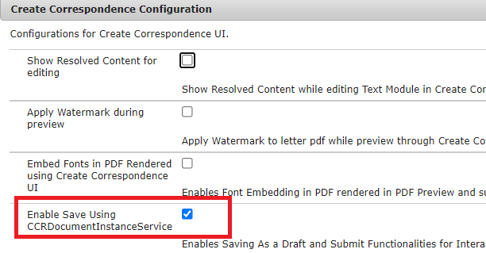

# サーバーにサンプルアセットをデプロイします。

この機能をAEM Server で動作させるには、以下の手順に従ってください

* [データベーススキーマの作成](assets/icdrafts.sql)
* [クライアントライブラリのインポート](assets/icdrafts.zip)
* [アダプティブフォームの読み込み](assets/SavedDraftsAdaptiveForm.zip)
* 次の名前のデータソースを作成 _SaveAndContinue_

| プロパティ名 | プロパティの値 |
|---|---|
| Datasource Name | SaveAndContinue |
| JDBC ドライバークラス | com.mysql.cj.jdbc.Driver |
| JDBC 接続 URL | jdbc:mysql://localhost:3306/aemformstutorial?autoReconnect=true&amp;useSSL=false&amp;characterEncoding=utf8&amp;useUnicode=true |

* [icdrafts バンドルをデプロイします。](assets/icdrafts.icdrafts.core-1.0-SNAPSHOT.jar)
* 必ず _CCRDocumentInstanceService を使用して保存を有効にする_ （以下に示すように）
   
* 任意のインタラクティブ通信を開きます。 ドラフトとして保存をクリックして保存
* [保存済みの下書きの表示](http://localhost:4502/content/dam/formsanddocuments/saveddrafts/jcr:content?wcmmode=disabled)

>[!NOTE]
>xml ファイルは、AEMサーバーインストール環境のルートフォルダーに保存されます。 Eclipse プロジェクトが提供され、必要に応じてソリューションをカスタマイズできます。

サンプル実装を使用した Eclipse プロジェクトは、次のようになります。 [ここからダウンロード](assets/icdrafts-eclipse-project.zip)
