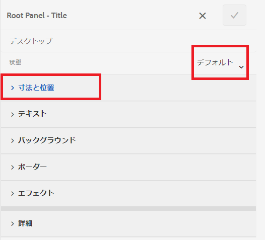
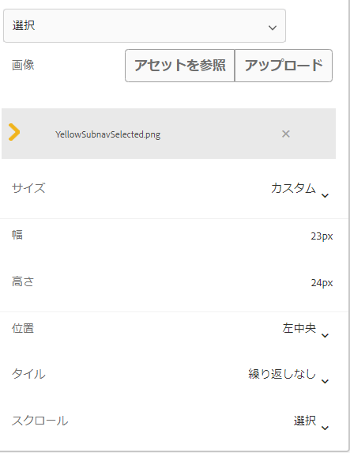
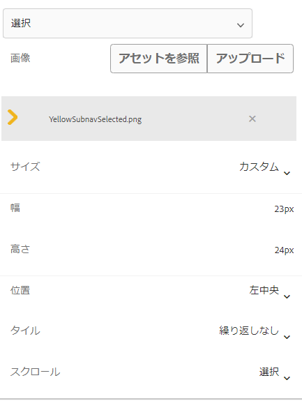

# アクティブなタブと完了したタブを示すアイコンを追加

左側に「ナビゲーション」タブが付いたアダプティブフォームがある場合は、タブのステータスを示すアイコンを表示することができます。例えば、以下のスクリーンショットに示すように、アクティブなタブを示すアイコンと完了したタブを示すアイコンを表示したいとします。

## アダプティブフォームの作成

サンプルフォームの作成には、基本テンプレートと Canvas 3.0 テーマに基づくシンプルなアダプティブフォームが使用されました。
[この記事で使用されているアイコン](assets/icons.zip)は、こちらからダウンロードできます。

## デフォルトステートのスタイル設定

フォームを編集モードで開きます。
スタイルレイヤーにいることを確認し、任意のタブ（例えば「一般」タブ）を選択します。
以下のスクリーンショットに示すように、タブのスタイルエディターを開くと、デフォルトのステートになります。

以下に示すように、CSS プロパティをデフォルト状態に設定します。

| カテゴリ | プロパティ名 | プロパティの値 |
|:---|:---|:---|
| 寸法と位置 | 幅 | 50 px |
| テキスト | Font Weight | Bold |
| テキスト | Color | #FFF |
| テキスト | 行の高さ | 3 |
| テキスト | テキストの位置揃え | Left |
| 背景 | Color | #056dae |

変更内容を保存します。

## アクティブステートのスタイル設定

アクティブステートであることを確認し、次の CSS プロパティのスタイルを設定します

| カテゴリ | プロパティ名 | プロパティの値 |
|:---|:---|:---|
| 寸法と位置 | 幅 | 50 px |
| テキスト | Font Weight | Bold |
| テキスト | Color | #FFF |
| テキスト | 行の高さ | 3 |
| テキスト | テキストの位置揃え | Left |
| 背景 | Color | #056dae |

以下のスクリーンショットに示すように、背景画像のスタイルを設定します

変更を保存します。

## 訪問済みステートのスタイル設定

訪問済みステートであることを確認し、次のプロパティのスタイルを設定します

| カテゴリ | プロパティ名 | プロパティの値 |
|:---|:---|:---|
| 寸法と位置 | 幅 | 50 px |
| テキスト | Font Weight | Bold |
| テキスト | Color | #FFF |
| テキスト | 行の高さ | 3 |
| テキスト | テキストの位置揃え | Left |
| 背景 | Color | #056dae |

以下のスクリーンショットに示すように、背景画像のスタイルを設定します

変更内容を保存します。

フォームをプレビューし、アイコンが期待どおりに動作していることをテストします。
