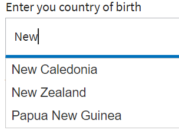

# オートコンプリートの実装

jquery のオートコンプリート機能を使用して、AEM forms にオートコンプリート機能を実装します。
この記事に含まれるサンプルでは、様々なデータソース（静的配列、REST API 応答から生成される動的配列）を使用して、ユーザーがテキストフィールドに入力し始めると、候補を入力します。

自動完了機能を実行するために使用されるコードは、フィールドの initialize イベントに関連付けられています。


## 国名に対する提案を提供する



## アドレスに対する提案を提供しています


次に、住所の提案に使用するコードを示します

```javascript
$(".streetAddress input").autocomplete({
    source: function(request, response) {
        $.ajax({
            url: "https://api.geoapify.com/v1/geocode/autocomplete?text=" + request.term + "&apiKey=Your API Key", //please get your own API key with geoapify.com
            responseType: "application/json",
            success: function(data) {
                console.log(data.features.length);
                response($.map(data.features, function(item) {
                    return {
                        label: [item.properties.formatted],
                        value: [item.properties.formatted]
                    };
                }));
            },
        });
    },
    minLength: 5,
    select: function(event, ui) {
        console.log(ui.item ?
            "Selected: " + ui.item.label :
            "Nothing selected, input was " + this.value);
    }

});
```

## 絵文字を使用した提案


次のコードは、絵文字の候補リストでの表示に使用されました

```javascript
var values=["Wolf \u{1F98A}", "Lion \u{1F981}","Puppy \u{1F436}","Giraffe \u{1F992}","Frog \u{1F438}"];
$(".Animals input").autocomplete( {
minLength: 1, source: values, delay: 0
}

);
```

この [サンプルフォームをダウンロードできます](assets/auto-complete-form.zip) ここから。 REST 呼び出しを正常におこなうには、コードエディターを使用して独自のユーザー名/API キーを指定してください。

>[!NOTE]
>
> オートコンプリートが機能するために、フォームで次のクライアントライブラリが使用されていることを確認する **cq.jquery.ui**. このクライアントライブラリはAEMに付属しています。
