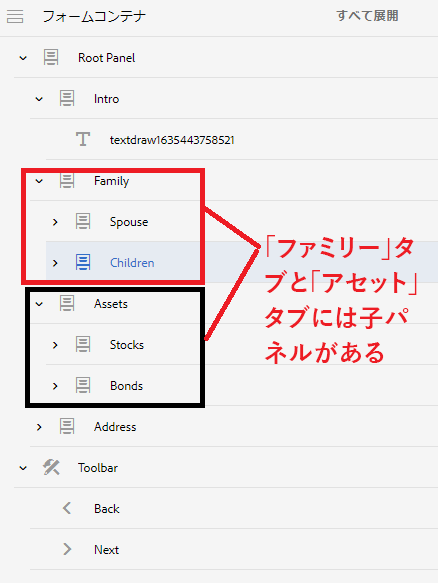

# 複数のパネルを含んだナビゲーションタブ

フォームの左側にナビゲーションタブがあり、その中に複数のパネルを持つタブがある場合、子パネルのタイトルを非表示にして、引き続きこれらのタブとタブの子パネル間を移動できるようにしたい場合があります。

## アダプティブフォームの作成

次の構造を持つアダプティブフォームを作成します。 ルートパネルには子パネルがあり、それらが左側にタブとして表示されています。これらの「**タブ**」の一部には、さらに子パネルがあります。例えば、「家族」タブには「配偶者」と「子」という 2 つの子パネルがあります。

FormContainer には、「前へ」ボタンと「次へ」ボタンを含んだツールバーも追加されます。




このフォームのデフォルトの動作では、左側にすべてのパネルを表示し、「次へ」ボタンをクリックしてタブ間を移動します。

このデフォルトの動作を変更するには、以下の操作を行う必要があります。

>[!VIDEO](https://video.tv.adobe.com/v/338369?quality=12&learn=on)


コードエディターを使用して、以下のコードを「**次へ**」ボタンのクリックイベントに追加します。

```javascript
window.guideBridge.setFocus(null, 'nextItemDeep', true);
```

コードエディターを使用して、次のコードを「**前へ**」ボタンのクリックイベントに追加します。

```javascript
window.guideBridge.setFocus(null, 'prevItemDeep', true);
```

上記のコードは、各タブと各タブの子パネル間を移動する際に役立ちます。

## 子パネルのタイトルの非表示

スタイルエディターを使用すると、タブの子パネルのタイトルを非表示にすることができます。

>[!VIDEO](https://video.tv.adobe.com/v/338370?quality=12&learn=on)

>[!NOTE]
>
>この記事で説明されている機能は、最後のタブでは機能しません。例えば、「住所」タブに子パネルがある場合、この機能は動作しません。
