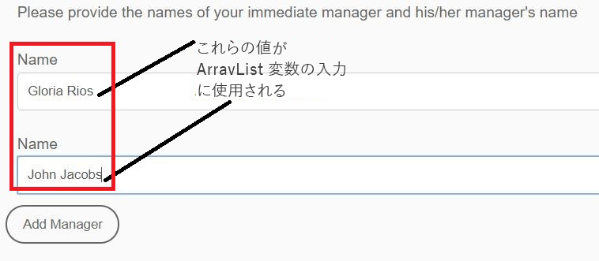
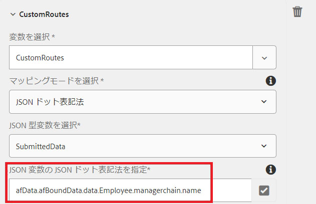

# AEMワークフローのArrayList変数

AEM Forms 6.5では、ArrayList型の変数が導入されました。ArrayList変数の一般的な使用例は、AssignTaskで使用するカスタムルートを定義する場合です。

AEMワークフローでArrayList変数を使用するには、送信されたデータに繰り返し要素を生成するアダプティブフォームを作成する必要があります。 一般的な方法は、配列要素を含むスキーマを定義することです。 この記事の目的で、配列要素を含む単純なJSONスキーマを作成しました。 使用例は、経費報告書に記入した従業員です。 経費報告書では、送信者の管理者名と管理者の管理者名を取り込みます。 マネージャの名前は、managerchainと呼ばれる配列に格納されます。 次のスクリーンショットは、経費報告書フォームと、アダプティブForms送信からのデータを示しています。



次に、アダプティブフォームの送信データを示します。 アダプティブフォームはJSONスキーマに基づいており、スキーマに連結されたデータはafBoundData要素のdata要素の下に保存されます。 managerchainは配列で、managerchain配列内のオブジェクトのname要素をArrayListに設定する必要があります。

```json
{
    "afData": {
        "afUnboundData": {
            "data": {
                "numericbox_2762582281554154833426": 700
            }
        },
        "afBoundData": {
            "data": {
                "Employee": {
                    "Name": "Conrad Simms",
                    "Department": "IT",
                    "managerchain": [{
                        "name": "Gloria Rios"
                    }, {
                        "name": "John Jacobs"
                    }]
                },
                "expense": [{
                    "description": "Hotel",
                    "amount": 300
                }, {
                    "description": "Air Fare",
                    "amount": 400
                }]
            }
        },
        "afSubmissionInfo": {
            "computedMetaInfo": {},
            "stateOverrides": {},
            "signers": {},
            "afPath": "/content/dam/formsanddocuments/helpx/travelexpensereport",
            "afSubmissionTime": "20190402102953"
            }
        }
}
```

サブタイプ文字列のArrayList変数を初期化するには、 JSONドット表記またはXPathマッピングモードを使用します。 次のスクリーンショットは、JSONドット表記を使用してCustomRoutesと呼ばれるArrayList変数を設定する方法を示しています。 次のスクリーンショットに示すように、配列オブジェクト内の要素を指していることを確認します。 CustomRoutes ArrayListにmanagerchain配列オブジェクトの名前を入力します。
次に、CustomRoutes ArrayListを使用して、AssignTaskコンポーネントでルートを設定します

CustomRoutes ArrayList変数が送信されたデータの値で初期化されると、AssignTaskコンポーネントのRoutesがCustomRoutes変数を使用して設定されます。 以下のスクリーンショットは、AssignTaskでのカスタムルートを示しています


お使いのシステムでこのワークフローをテストするには、次の手順に従います

* ArrayListVariable.zipファイルをダウンロードしてファイルシステムに保存します。
* [AEM Package Managerを使用し](assets/arraylistvariable.zip) てzipファイルを読み込みます。
* [TravelExpenseReportフォームを開きます。](http://localhost:4502/content/dam/formsanddocuments/helpx/travelexpensereport/jcr:content?wcmmode=disabled)
* 2人の経費と2人の管理者の名前を入力します
* 送信ボタンを押す
* [インボックスを開く](http://localhost:4502/aem/inbox)
* 「経費管理者に割り当て」という新しいタスクが表示されます。
* タスクに関連付けられたフォームを開く
* マネージャー名を持つ2つのカスタムルートが表示されます
   [ReviewExpenseReportWorkflowを調べます。](http://localhost:4502/editor.html/conf/global/settings/workflow/models/ReviewExpenseReport.html) このワークフローでは、ArrayList変数、JSONタイプの変数、Or分割コンポーネントのルールエディターを使用します
