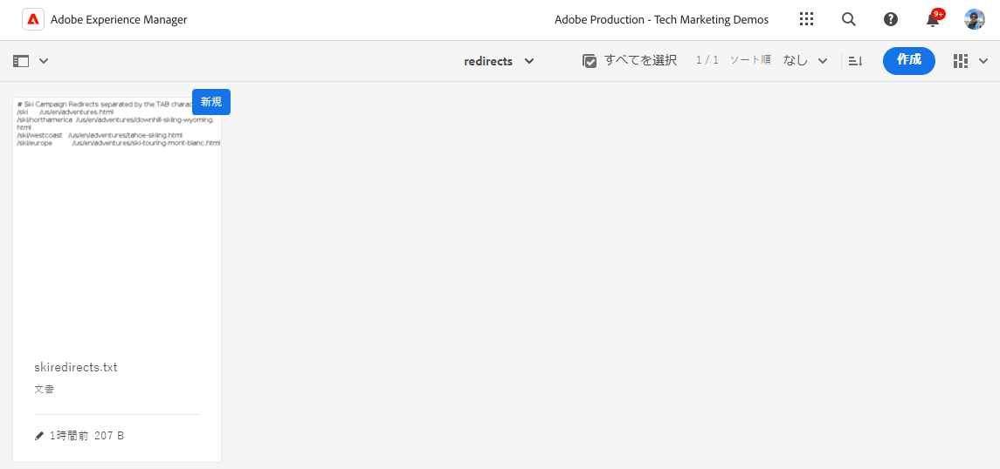
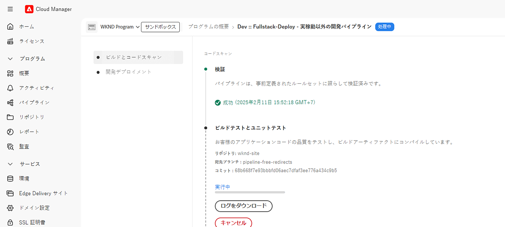

# パイプライン不要の URL リダイレクトの実装

AEM as a Cloud Service で[パイプライン不要の URL リダイレクト](https://experienceleague.adobe.com/ja/docs/experience-manager-cloud-service/content/implementing/content-delivery/pipeline-free-url-redirects)を実装し、マーケティングチームが開発者を必要とせずにリダイレクトを管理できるようにする方法について説明します。

AEM では、URL リダイレクトを管理するオプションが複数あります。詳しくは、[URL リダイレクト](url-redirection.md)を参照してください。

チュートリアルでは、[Apache RewriteMap](https://httpd.apache.org/docs/2.4/rewrite/rewritemap.html) などのテキストファイルでキーと値のペアとして URL リダイレクトを作成することに焦点を当て、AEM as a Cloud Service 固有の設定を使用して、Apache／Dispatcher モジュールに読み込みます。

## 前提条件

このチュートリアルを完了するには、次が必要になります。

- バージョン **18311 以降**&#x200B;の AEM as a Cloud Service 環境。

- サンプル [WKND Sites](https://github.com/adobe/aem-guides-wknd) プロジェクトをそこにデプロイする必要があります。

## チュートリアルのユースケース

デモの目的で、WKND マーケティングチームが新しいスキーキャンペーンを開始すると仮定します。スキーアドベンチャーページの短縮 URL を作成し、コンテンツの管理方法と同様に、独自に管理したいと考えています。URL リダイレクトを管理するために、[パイプライン不要の URL リダイレクト](https://experienceleague.adobe.com/ja/docs/experience-manager-cloud-service/content/implementing/content-delivery/pipeline-free-url-redirects)アプローチを使用することを決定しました。

マーケティングチームの要件に基づいて、作成する必要がある URL リダイレクトを次に示します。

| ソース URL | ターゲット URL |
|------------|------------|
| /ski | /us/en/adventures.html |
| /ski/northamerica | /us/en/adventures/downhill-skiing-wyoming.html |
| /ski/westcoast | /us/en/adventures/tahoe-skiing.html |
| /ski/europe | /us/en/adventures/ski-touring-mont-blanc.html |

次に、AEM as a Cloud Service 環境でこれらの URL リダイレクトと必要な 1 回限りの Dispatcher 設定を管理する方法を見てみましょう。

## URL リダイレクトの管理方法{#manage-redirects}

URL リダイレクトを管理するオプションは複数あるので、探索してみましょう。

### DAM のテキストファイル

URL リダイレクトは、テキストファイル内のキーと値のペアとして管理し、AEM デジタルアセット管理（DAM）にアップロードできます。

例えば、上記の URL リダイレクトは、`skicampaign.txt` という名前のテキストファイルに保存し、DAM @ `/content/dam/wknd/redirects` フォルダーにアップロードできます。レビューと承認が完了したら、マーケティングチームはテキストファイルを公開できます。

```
# Ski Campaign Redirects separated by the TAB character
/ski      /us/en/adventures.html
/ski/northamerica  /us/en/adventures/downhill-skiing-wyoming.html
/ski/westcoast   /us/en/adventures/tahoe-skiing.html
/ski/europe          /us/en/adventures/ski-touring-mont-blanc.html
```



### ACS Commons - リダイレクトマップマネージャー

[ACS Commons - リダイレクトマップマネージャー](https://adobe-consulting-services.github.io/acs-aem-commons/features/redirect-map-manager/index.html)は、URL リダイレクトの管理にわかりやすいインターフェイスを提供します。

例えば、マーケティングチームは、`SkiCampaign` という名前の新しい&#x200B;*リダイレクトマップ*&#x200B;ページを作成し、「**エントリを編集**」タブを使用して上記の URL リダイレクトを追加できます。URL リダイレクトは `/etc/acs-commons/redirect-maps/skicampaign/jcr:content.redirectmap.txt` で使用できます。


>[!IMPORTANT]
>
>リダイレクトマップマネージャーを使用するには、ACS Commons バージョン **6.7.0 以降**&#x200B;が必要です。詳しくは、[ACS Commons - リダイレクトマネージャー](https://adobe-consulting-services.github.io/acs-aem-commons/features/redirect-manager/index.html)を参照してください。

### ACS Commons - リダイレクトマネージャー

また、[ACS Commons - リダイレクトマネージャー](https://adobe-consulting-services.github.io/acs-aem-commons/features/redirect-manager/index.html)も、URL リダイレクトの管理にわかりやすいインターフェイスを提供します。

例えば、マーケティングチームは、`/conf/wknd` という名前の新しい設定を作成し、「**+ リダイレクト設定**」ボタンを使用して上記の URL リダイレクトを追加できます。URL リダイレクトは `/conf/wknd/settings/redirects.txt` で使用できます。


>[!IMPORTANT]
>
>リダイレクトマネージャーを使用するには、ACS Commons バージョン **6.10.0 以降**&#x200B;が必要です。詳しくは、[ACS Commons - リダイレクトマネージャー](https://adobe-consulting-services.github.io/acs-aem-commons/features/redirect-manager/subpages/rewritemap.html)を参照してください。

## Dispatcher の設定方法

URL リダイレクトを RewriteMap として読み込み、受信リクエストに適用するには、次の Dispatcher 設定が必要です。

### フレキシブルモードの Dispatcher モジュールを有効にする

まず、Dispatcher モジュールが&#x200B;_フレキシブルモード_&#x200B;で有効になっていることを確認します。`dispatcher/src/opt-in` フォルダーに `USE_SOURCES_DIRECTLY` ファイルが存在する場合、Dispatcher はフレキシブルモードであることを示します。

### URL リダイレクトを RewriteMap として読み込む

次に、`dispatcher/src/opt-in` フォルダーに次の構造の新しい設定ファイル `managed-rewrite-maps.yaml` を作成します。

```yaml
maps:
- name: <MAPNAME>.map # e.g. skicampaign.map
    path: <ABSOLUTE_PATH_TO_URL_REDIRECTS_FILE> # e.g. /content/dam/wknd/redirects/skicampaign.txt, /etc/acs-commons/redirect-maps/skicampaign/jcr:content.redirectmap.txt, /conf/wknd/settings/redirects.txt
    wait: false # Optional, default is false, when true, the Apache waits for the map to be loaded before starting
    ttl: 300 # Optional, default is 300 seconds, the reload interval for the map
```

デプロイメント中に、Dispatcher は `/tmp/rewrites` フォルダーに `<MAPNAME>.map` ファイルを作成します。

>[!IMPORTANT]
>
> ファイル名（`managed-rewrite-maps.yaml`）と場所（`dispatcher/src/opt-in`）は、上記のとおりに指定する必要があります。これは従うべき規則と考えてください。

### 受信リクエストへの URL リダイレクトの適用

最後に、上記のマップ（`<MAPNAME>.map`）を使用するには、Apache 書き換え設定ファイルを作成または更新します。例えば、`dispatcher/src/conf.d/rewrites` フォルダーの `rewrite.rules` ファイルを使用して、URL リダイレクトを適用しましょう。

```
...
# Use the RewriteMap to define the URL redirects
RewriteMap <MAPALIAS> dbm=sdbm:/tmp/rewrites/<MAPNAME>.map

RewriteCond ${<MAPALIAS>:$1} !=""
RewriteRule ^(.*)$ ${<MAPALIAS>:$1|/} [L,R=301]    
...
```

### 設定例

[上記](#manage-redirects)の URL リダイレクト管理オプションごとに Dispatcher 設定を確認しましょう。

>[!BEGINTABS]

>[!TAB DAM のテキストファイル]

URL リダイレクトをテキストファイル内のキーと値のペアとして管理し、DAM にアップロードする場合、設定は次のようになります。

[!BADGE dispatcher/src/opt-in/managed-rewrite-maps.yaml]{type=Neutral tooltip="以下のコードサンプルのファイル名。"}

```yaml
maps:
- name: skicampaign.map
  path: /content/dam/wknd/redirects/skicampaign.txt
```

[!BADGE dispatcher/src/conf.d/rewrites/rewrite.rules]{type=Neutral tooltip="以下のコードサンプルのファイル名。"}

```
...

# The DAM-managed skicampaign.txt file as skicampaign.map
RewriteMap skicampaign dbm=sdbm:/tmp/rewrites/skicampaign.map

# Apply the RewriteMap for matching request URIs
RewriteCond ${skicampaign:$1} !=""
RewriteRule ^(.*)$ ${skicampaign:$1|/} [L,R=301]

...
```

>[!TAB ACS Commons - リダイレクトマップマネージャー]

ACS Commons - リダイレクトマップマネージャーを使用して URL リダイレクトを管理する場合、設定は次のようになります。

[!BADGE dispatcher/src/opt-in/managed-rewrite-maps.yaml]{type=Neutral tooltip="以下のコードサンプルのファイル名。"}

```yaml
maps:
- name: skicampaign.map
  path: /etc/acs-commons/redirect-maps/skicampaign/jcr:content.redirectmap.txt
```

[!BADGE dispatcher/src/conf.d/rewrites/rewrite.rules]{type=Neutral tooltip="以下のコードサンプルのファイル名。"}

```
...

# The Redirect Map Manager-managed skicampaign.map
RewriteMap skicampaign dbm=sdbm:/tmp/rewrites/skicampaign.map

# Apply the RewriteMap for matching request URIs
RewriteCond ${skicampaign:$1} !=""
RewriteRule ^(.*)$ ${skicampaign:$1|/} [L,R=301]

...
```

>[!TAB ACS Commons - リダイレクトマネージャー]

ACS Commons - リダイレクトマネージャーを使用して URL リダイレクトを管理する場合、設定は次のようになります。

[!BADGE dispatcher/src/opt-in/managed-rewrite-maps.yaml]{type=Neutral tooltip="以下のコードサンプルのファイル名。"}

```yaml
maps:
- name: skicampaign.map
  path: /conf/wknd/settings/redirects.txt
```

[!BADGE dispatcher/src/conf.d/rewrites/rewrite.rules]{type=Neutral tooltip="以下のコードサンプルのファイル名。"}

```
...

# The Redirect Manager-managed skicampaign.map
RewriteMap skicampaign dbm=sdbm:/tmp/rewrites/skicampaign.map

# Apply the RewriteMap for matching request URIs
RewriteCond ${skicampaign:$1} !=""
RewriteRule ^(.*)$ ${skicampaign:$1|/} [L,R=301]

...
```

>[!ENDTABS]

## 設定のデプロイ方法

>[!IMPORTANT]
>
>*パイプライン不要*&#x200B;という用語は、設定が *1 回だけデプロイ*&#x200B;され、マーケティングチームがテキストファイルを更新することで URL リダイレクトを管理できることを強調するのに使用されます。

設定をデプロイするには、[Cloud Manager](https://my.cloudmanager.adobe.com/) で[フルスタック](https://experienceleague.adobe.com/ja/docs/experience-manager-cloud-service/content/implementing/using-cloud-manager/cicd-pipelines/introduction-ci-cd-pipelines#full-stack-pipeline)パイプラインまたは [web 階層設定](https://experienceleague.adobe.com/ja/docs/experience-manager-cloud-service/content/implementing/using-cloud-manager/cicd-pipelines/introduction-ci-cd-pipelines#web-tier-config-pipelines)パイプラインを使用します。




デプロイメントが正常に完了すると、URL リダイレクトがアクティブになり、マーケティングチームは開発者を必要とせずに管理できるようになります。

## URL リダイレクトのテスト方法

ブラウザーまたは `curl` コマンドを使用して、URL リダイレクトをテストしましょう。`/ski/westcoast` URL にアクセスし、`/us/en/adventures/tahoe-skiing.html` にリダイレクトされることを確認します。

## 概要

このチュートリアルでは、AEM as a Cloud Service 環境でパイプライン不要の設定を使用して URL リダイレクトを管理する方法を説明しました。

マーケティングチームは、URL リダイレクトをテキストファイル内のキーと値のペアとして管理し、DAM にアップロードすることや、ACS Commons - リダイレクトマップマネージャーまたはリダイレクトマネージャーを使用することができます。Dispatcher 設定が更新され、URL リダイレクトが RewriteMap として読み込まれ、受信リクエストに適用されます。

## その他のリソース

- [パイプライン不要の URL リダイレクト](https://experienceleague.adobe.com/ja/docs/experience-manager-cloud-service/content/implementing/content-delivery/pipeline-free-url-redirects)
- [URL リダイレクト](url-redirection.md)
