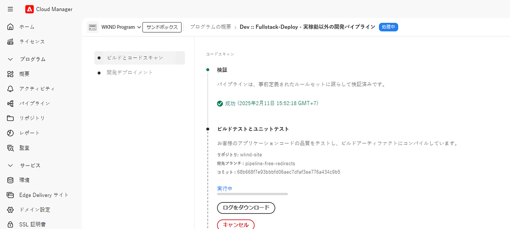

# パイプラインのない設定を使用した URL リダイレクト

リダイレクトの追加や更新が必要な場合に、AEM コードや設定パイプラインを使用せずに URL リダイレクトを管理する方法を説明します。 これにより、マーケティングチームは開発者を必要とせずにリダイレクトを管理することができる。

AEMでは、URL リダイレクトを管理するオプションが複数あります。詳しくは、[URL リダイレクト ](url-redirection.md) を参照してください。 このチュートリアルでは、[Apache RewriteMap](https://httpd.apache.org/docs/2.4/rewrite/rewritemap.html) のようなテキストファイルでキーと値のペアとして URL リダイレクトを作成することに重点を置き、AEM as a Cloud Service固有の設定を使用して、Apache/Dispatcher モジュールに読み込みます。

## 前提条件

このチュートリアルを完了するには、次が必要になります。

- AEM as a Cloud Service環境（バージョン **18311 以降**）

- サンプルの [WKND Sites](https://github.com/adobe/aem-guides-wknd) プロジェクトをこの環境にデプロイする必要があります。

## チュートリアルのユースケース

デモの目的で、WKND マーケティングチームが新しいスキーキャンペーンを開始するとします。 この会社は、スキーアドベンチャーページの短い URL を作成し、コンテンツの管理方法と同様に、独自に管理します。

マーケティングチームの要件に応じて、作成する必要がある URL リダイレクトを次に示します。

| SOURCE URL | ターゲット URL |
|------------|------------|
| /ski | /us/en/adventures.html |
| /ski/northamerica | /us/en/adventures/downhill-skiing-wyoming.html |
| /ski/westcoast | /us/en/adventures/tahoe-skiing.html |
| /ski/europe | /us/en/adventures/ski-touring-mont-blanc.html |

次に、これらの URL リダイレクトを管理する方法と、AEM as a Cloud Service環境で 1 回限りのDispatcher設定が必要な方法を見てみましょう。

## URL リダイレクトの管理方法{#manage-redirects}

URL リダイレクトを管理するために、複数のオプションを使用できます。これらのオプションを見てみましょう。

### DAM のテキストファイル

URL リダイレクトは、テキストファイルでキーと値のペアとして管理し、AEM Digital Asset Management （DAM）にアップロードすることができます。

例えば、上記の URL リダイレクトは、`skicampaign.txt` という名前のテキストファイルに保存して、DAM @ `/content/dam/wknd/redirects` フォルダーにアップロードすることができます。 レビューと承認が完了したら、マーケティングチームはテキストファイルを公開できます。

```
# Ski Campaign Redirects separated by the TAB character
/ski      /us/en/adventures.html
/ski/northamerica  /us/en/adventures/downhill-skiing-wyoming.html
/ski/westcoast   /us/en/adventures/tahoe-skiing.html
/ski/europe          /us/en/adventures/ski-touring-mont-blanc.html
```

### ACS Commons - リダイレクトマップマネージャ

[ACS Commons - リダイレクトマップマネージャ ](https://adobe-consulting-services.github.io/acs-aem-commons/features/redirect-map-manager/index.html) は、URL リダイレクトを管理するための使いやすいインターフェイスを提供します。

例えば、マーケティングチームは、「`SkiCampaign`」という名前の新しい *リダイレクトマップ* ページを作成し、「**エントリを編集**」タブを使用して上記の URL リダイレクトを追加できます。 URL リダイレクトは `/etc/acs-commons/redirect-maps/skicampaign/jcr:content.redirectmap.txt` で利用できます。


>[!IMPORTANT]
>
>リダイレクトマップマネージャを使用するには、ACS Commons バージョン **6.7.0 以降** が必要です。詳しくは、[ACS Commons - リダイレクトマネージャ ](https://adobe-consulting-services.github.io/acs-aem-commons/features/redirect-manager/index.html) を参照してください。

### ACS Commons - リダイレクトマネージャー

また、[ACS Commons - リダイレクトマネージャー ](https://adobe-consulting-services.github.io/acs-aem-commons/features/redirect-manager/index.html) には、URL リダイレクトを管理するための使いやすいインターフェイスも用意されています。

例えば、マーケティングチームが `/conf/wknd` という名前の新しい設定を作成し、「**+ リダイレクト設定**」ボタンを使用して上記の URL リダイレクトを追加できます。 URL リダイレクトは `/conf/wknd/settings/redirects.txt` で利用できます。


>[!IMPORTANT]
>
>リダイレクトマネージャーを使用するには、ACS Commons バージョン **6.10.0 以降** が必要です。詳しくは、[ACS Commons - リダイレクトマネージャー ](https://adobe-consulting-services.github.io/acs-aem-commons/features/redirect-manager/subpages/rewritemap.html) を参照してください。

## Dispatcherの設定方法

URL リダイレクトを RewriteMap として読み込み、受信リクエストに適用するには、次のDispatcher設定が必要です。

### フレキシブルモード用にDispatcher モジュールを有効にする

まず、Dispatcher モジュールで _フレキシブルモード_ が有効になっていることを確認します。 `dispatcher/src/opt-in` フォルダーにファイルが `USE_SOURCES_DIRECTLY` る場合は、Dispatcherがフレキシブルモードであることを示しています。

### URL リダイレクトを RewriteMap として読み込む

次に、新しい設定ファイル `managed-rewrite-maps.yaml` をフォルダー `dispatcher/src/opt-in` 次の構造で作成します。

```yaml
maps:
- name: <MAPNAME>.map # e.g. skicampaign.map
    path: <ABSOLUTE_PATH_TO_URL_REDIRECTS_FILE> # e.g. /content/dam/wknd/redirects/skicampaign.txt, /etc/acs-commons/redirect-maps/skicampaign/jcr:content.redirectmap.txt, /conf/wknd/settings/redirects.txt
    wait: false # Optional, default is false, when true, the Apache waits for the map to be loaded before starting
    ttl: 300 # Optional, default is 300 seconds, the reload interval for the map
```

デプロイ時に、Dispatcherは `<MAPNAME>.map` ファイルを `/tmp/rewrites` フォルダーに作成します。

>[!IMPORTANT]
>
> ファイル名（`managed-rewrite-maps.yaml`）と場所（`dispatcher/src/opt-in`）は上記と完全に同じにする必要があります。これは従うべき規則と考えてください。

### 受信リクエストへの URL リダイレクトの適用

最後に、上記のマップ（`<MAPNAME>.map`）を使用するように、Apache 書き換え設定ファイルを作成または更新します。 例えば、`dispatcher/src/conf.d/rewrites` フォルダーの `rewrite.rules` ファイルを使用して、URL リダイレクトを適用します。

```
...
# Use the RewriteMap to define the URL redirects
RewriteMap <MAPALIAS> dbm=sdbm:/tmp/rewrites/<MAPNAME>.map

RewriteCond ${<MAPALIAS>:$1} !=""
RewriteRule ^(.*)$ ${<MAPALIAS>:$1|/} [L,R=301]    
...
```

### 設定例

前述の [ 上記 ](#manage-redirects) の各 URL リダイレクト管理オプションのDispatcher設定を確認してみましょう。

>[!BEGINTABS]

>[!TAB DAM のテキストファイル ]

URL リダイレクトがテキストファイルでキーと値のペアとして管理され、DAM にアップロードされる場合、設定は次のようになります。

[!BADGE dispatcher/src/opt-in/managed-rewrite-maps.yaml]{type=Neutral tooltip="以下のコードサンプルのファイル名。"}

```yaml
maps:
- name: skicampaign.map
  path: /content/dam/wknd/redirects/skicampaign.txt
```

[!BADGE dispatcher/src/conf.d/rewrites/rewrite.rules]{type=Neutral tooltip="以下のコードサンプルのファイル名。"}

```
...

# The DAM-managed skicampaign.txt file as skicampaign.map
RewriteMap skicampaign dbm=sdbm:/tmp/rewrites/skicampaign.map

# Apply the RewriteMap for matching request URIs
RewriteCond ${skicampaign:%{$1}} !=""
RewriteRule ^(.*)$ ${skicampaign:%{$1}|/} [L,R=301]

...
```

>[!TAB ACS Commons - リダイレクトマップマネージャ]

ACS Commons - リダイレクトマップマネージャを使用して URL リダイレクトを管理する場合、設定は次のようになります。

[!BADGE dispatcher/src/opt-in/managed-rewrite-maps.yaml]{type=Neutral tooltip="以下のコードサンプルのファイル名。"}

```yaml
maps:
- name: skicampaign.map
  path: /etc/acs-commons/redirect-maps/skicampaign/jcr:content.redirectmap.txt
```

[!BADGE dispatcher/src/conf.d/rewrites/rewrite.rules]{type=Neutral tooltip="以下のコードサンプルのファイル名。"}

```
...

# The Redirect Map Manager-managed skicampaign.map
RewriteMap skicampaign dbm=sdbm:/tmp/rewrites/skicampaign.map

# Apply the RewriteMap for matching request URIs
RewriteCond ${skicampaign:%{$1}} !=""
RewriteRule ^(.*)$ ${skicampaign:%{$1}|/} [L,R=301]

...
```

>[!TAB ACS Commons - リダイレクトマネージャー]

ACS Commons - リダイレクトマネージャーを使用して URL リダイレクトを管理する場合、設定は次のようになります。

[!BADGE dispatcher/src/opt-in/managed-rewrite-maps.yaml]{type=Neutral tooltip="以下のコードサンプルのファイル名。"}

```yaml
maps:
- name: skicampaign.map
  path: /conf/wknd/settings/redirects.txt
```

[!BADGE dispatcher/src/conf.d/rewrites/rewrite.rules]{type=Neutral tooltip="以下のコードサンプルのファイル名。"}

```
...

# The Redirect Manager-managed skicampaign.map
RewriteMap skicampaign dbm=sdbm:/tmp/rewrites/skicampaign.map

# Apply the RewriteMap for matching request URIs
RewriteCond ${skicampaign:%{$1}} !=""
RewriteRule ^(.*)$ ${skicampaign:%{$1}|/} [L,R=301]

...
```

>[!ENDTABS]

## 設定のデプロイ方法

>[!IMPORTANT]
>
>*パイプラインフリー* という用語は、設定が *1 回だけデプロイ* されることを強調するために使用され、マーケティングチームは、テキストファイルを更新することで、URL リダイレクトを管理できます。

設定をデプロイするには、[Cloud Manager[ の ](https://experienceleague.adobe.com/ja/docs/experience-manager-cloud-service/content/implementing/using-cloud-manager/cicd-pipelines/introduction-ci-cd-pipelines#full-stack-pipeline) フルスタック ](https://my.cloudmanager.adobe.com/) または [web 階層設定 ](https://experienceleague.adobe.com/en/docs/experience-manager-cloud-service/content/implementing/using-cloud-manager/cicd-pipelines/introduction-ci-cd-pipelines#web-tier-config-pipelines) パイプラインを使用します。




デプロイメントが正常に完了すると、URL リダイレクトがアクティブになり、マーケティングチームは開発者を必要とせずにリダイレクトを管理できます。

## URL リダイレクトのテスト方法

ブラウザーまたは `curl` コマンドを使用して、URL リダイレクトをテストします。 `/ski/westcoast` URL にアクセスし、`/us/en/adventures/tahoe-skiing.html` にリダイレクトすることを確認します。

## 概要

このチュートリアルでは、AEM as a Cloud Service環境でパイプラインを使用しない設定を使用して URL リダイレクトを管理する方法を学びました。

マーケティングチームは、URL リダイレクトをキーと値のペアとしてテキストファイルに管理して DAM にアップロードするか、ACS Commons - リダイレクトマップマネージャーまたはリダイレクトマネージャーを使用することができます。 Dispatcherの設定が更新され、URL リダイレクトが RewriteMap として読み込まれ、受信リクエストに適用されます。

## その他のリソース

- [ パイプラインを使用しない URL リダイレクト ](https://experienceleague.adobe.com/ja/docs/experience-manager-cloud-service/content/implementing/content-delivery/pipeline-free-url-redirects)
- [URL リダイレクト](url-redirection.md)
