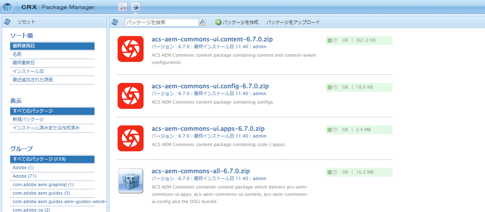

# サードパーティアーティファクトのインストール – 公開 Maven リポジトリでは使用できません

AEM プロジェクトをビルドしてデプロイする際に、*公開されている Maven リポジトリでは使用できない* サードパーティアーティファクトをインストールする方法を説明します。

**サードパーティアーティファクト** は次のようになります。

- [OSGi バンドル ](https://www.osgi.org/resources/architecture/): OSGi バンドルは、Java クラス、リソース、およびバンドルとその依存関係を説明するマニフェストを含む Java™ アーカイブファイルです。
- [Java jar](https://docs.oracle.com/javase/tutorial/deployment/jar/basicsindex.html):Java クラスとリソースを含む Java™ アーカイブファイル。
- [ パッケージ ](https://experienceleague.adobe.com/en/docs/experience-manager-65/content/sites/administering/contentmanagement/package-manager#what-are-packages)：パッケージは、リポジトリコンテンツをファイルシステムのシリアル化形式で含む zip ファイルです。

## 標準シナリオ

通常は、公開 Maven リポジトリーに、AEM プロジェクトの `pom.xml` ファイルの依存関係として *利用可能* サードパーティバンドルのパッケージをインストールします。

例：

- [AEM WCM コアコンポーネント ](https://github.com/adobe/aem-core-wcm-components) **bundle** が、依存関係として [WKND プロジェクト ](https://github.com/adobe/aem-guides-wknd/blob/main/pom.xml#L747-L753) `pom.xml` ファイルに追加されます。 ここでは、AEM ランタイムによって提供されるAEM WCM コアコンポーネントバンドルとして `provided` スコープが使用されます。 バンドルがAEM ランタイムによって提供されない場合は、`compile` スコープを使用します。これはデフォルトのスコープです。

- [WKND Shared](https://github.com/adobe/aem-guides-wknd-shared) **package** が [WKND プロジェクトの ](https://github.com/adobe/aem-guides-wknd/blob/main/pom.xml#L767-L773) `pom.xml` ファイルに依存関係として追加されます。


## まれなシナリオ

AEM プロジェクトを構築およびデプロイする際に、サードパーティのバンドルや jar またはパッケージ **使用できません** を {Maven Central リポジトリー [ または ](https://mvnrepository.com/)4}Adobeの公開リポジトリー ](https://repo.adobe.com/index.html) にインストールする必要が生じる場合があります。[

その理由は次のとおりです。

- バンドルまたはパッケージは、内部チームまたはサードパーティベンダーによって提供され、_公開 Maven リポジトリでは使用できません_。

- Java™ jar ファイル _OSGi バンドルではありません_ は、公開 Maven リポジトリで使用できる場合とできない場合があります。

- 公開 Maven リポジトリーで入手可能なサードパーティパッケージの最新バージョンでまだリリースされていない機能が必要です。 ローカルでビルドされた RELEASE バージョンまたは SNAPSHOT バージョンをインストールすることにしました。

## 前提条件

このチュートリアルに従うには、次が必要です。

- [ ローカル AEM開発環境 ](https://experienceleague.adobe.com/en/docs/experience-manager-learn/cloud-service/local-development-environment-set-up/overview) または [ 迅速な開発環境（RDE） ](https://experienceleague.adobe.com/en/docs/experience-manager-learn/cloud-service/developing/rde/overview) のセットアップ

- [AEM WKND プロジェクト ](https://github.com/adobe/aem-guides-wknd)_サードパーティのバンドル、jar またはパッケージを追加し_ 変更内容を確認します。

## 設定

- AEM 6.X、AEM as a Cloud Service（AEMCS）ローカル開発環境、RDE 環境をセットアップします。

- AEM WKND プロジェクトのクローンを作成してデプロイします。

  ```
  $ git clone git@github.com:adobe/aem-guides-wknd.git
  $ cd aem-guides-wknd
  $ mvn clean install -PautoInstallPackage 
  ```

  WKND サイトページが正しくレンダリングされていることを確認します。

## AEM プロジェクトへのサードパーティバンドルのインストール{#install-third-party-bundle}

_公開 Maven リポジトリでは利用できない_ デモ OSGi [my-example-bundle](./assets/install-third-party-articafcts/my-example-bundle.zip) をAEM WKND プロジェクトにインストールして使用します。

**my-example-bundle** は OSGi サービス `HelloWorldService` 書き出し、その `sayHello()` メソッドはメッセージ `Hello Earth!` 返します。

詳しくは、[my-example-bundle.zip](./assets/install-third-party-articafcts/my-example-bundle.zip) ファイルの README.md ファイルを参照してください。

### モジュールにバンドル `all` 追加

最初の手順では、`my-example-bundle` をAEM WKND プロジェクトの `all` モジュールに追加します。

- [my-example-bundle.zip](./assets/install-third-party-articafcts/my-example-bundle.zip) ファイルをダウンロードして解凍します。

- AEM WKND プロジェクトの `all` モジュールで、`all/src/main/content/jcr_root/apps/wknd-vendor-packages/container/install` ディレクトリ構造を作成します。 `/all/src/main/content` ディレクトリが存在します。`jcr_root/apps/wknd-vendor-packages/container/install` ディレクトリを作成するだけで済みます。

- 抽出された `target` ディレクトリから上記の `all/src/main/content/jcr_root/apps/wknd-vendor-packages/container/install` ディレクトリに `my-example-bundle-1.0-SNAPSHOT.jar` ファイルをコピーします。

  

### バンドルのサービスを使用

AEM WKND プロジェクトの `my-example-bundle` から `HelloWorldService` OSGi サービスを使用します。

- AEM WKND プロジェクトの `core` モジュールで、`SayHello.java` Sling サーブレット @ `core/src/main/java/com/adobe/aem/guides/wknd/core/servlet` を作成します。

  ```java
  package com.adobe.aem.guides.wknd.core.servlet;
  
  import java.io.IOException;
  
  import javax.servlet.Servlet;
  import javax.servlet.ServletException;
  
  import org.apache.sling.api.SlingHttpServletRequest;
  import org.apache.sling.api.SlingHttpServletResponse;
  import org.apache.sling.api.servlets.HttpConstants;
  import org.apache.sling.api.servlets.ServletResolverConstants;
  import org.apache.sling.api.servlets.SlingSafeMethodsServlet;
  import org.osgi.service.component.annotations.Component;
  import org.osgi.service.component.annotations.Reference;
  import com.example.services.HelloWorldService;
  
  @Component(service = Servlet.class, property = {
      ServletResolverConstants.SLING_SERVLET_PATHS + "=/bin/sayhello",
      ServletResolverConstants.SLING_SERVLET_METHODS + "=" + HttpConstants.METHOD_GET
  })
  public class SayHello extends SlingSafeMethodsServlet {
  
          private static final long serialVersionUID = 1L;
  
          // Injecting the HelloWorldService from the `my-example-bundle` bundle
          @Reference
          private HelloWorldService helloWorldService;
  
          @Override
          protected void doGet(SlingHttpServletRequest request, SlingHttpServletResponse response) throws ServletException, IOException {
              // Invoking the HelloWorldService's `sayHello` method
              response.getWriter().write("My-Example-Bundle service says: " + helloWorldService.sayHello());
          }
  }
  ```

- AEM WKND プロジェクトのルート `pom.xml` ファイルで、`my-example-bundle` を依存関係として追加します。

  ```xml
  ...
  <!-- My Example Bundle -->
  <dependency>
      <groupId>com.example</groupId>
      <artifactId>my-example-bundle</artifactId>
      <version>1.0-SNAPSHOT</version>
      <scope>system</scope>
      <systemPath>${maven.multiModuleProjectDirectory}/all/src/main/content/jcr_root/apps/wknd-vendor-packages/container/install/my-example-bundle-1.0-SNAPSHOT.jar</systemPath>
  </dependency>
  ...
  ```

  ここで：
   - `system` スコープは、公開 Maven リポジトリで依存関係を検索すべきでないことを示します。
   - `systemPath` は、AEM WKND プロジェクトの `all` モジュールの `my-example-bundle` ファイルへのパスです。
   - `${maven.multiModuleProjectDirectory}` は、マルチモジュールプロジェクトのルートディレクトリを指す Maven プロパティです。

- AEM WKND プロジェクトの `core` モジュールの `core/pom.xml` ファイルで、`my-example-bundle` を依存関係として追加します。

  ```xml
  ...
  <!-- My Example Bundle -->
  <dependency>
      <groupId>com.example</groupId>
      <artifactId>my-example-bundle</artifactId>
  </dependency>
  ...
  ```

- 次のコマンドを使用して、AEM WKND プロジェクトをビルドしてデプロイします。

  ```
  $ mvn clean install -PautoInstallPackage
  ```

- ブラウザーで `http://localhost:4502/bin/sayhello` された URL にアクセスして、`SayHello` サーブレットが期待どおりに動作することを確認します。

- 上記の変更をAEM WKND プロジェクトのリポジトリにコミットします。 次に、Cloud Manager パイプラインを実行して、RDE またはAEM環境で変更を検証します。

  

AEM WKND プロジェクトの [tutorial/install-3rd-party-bundle](https://github.com/adobe/aem-guides-wknd/compare/main...tutorial/install-3rd-party-bundle) ブランチには、参照用に上記の変更があります。

### 主な習得事項{#key-learnings-bundle}

公開 Maven リポジトリで利用できない OSGi バンドルは、次の手順に従ってAEM プロジェクトにインストールできます。

- OSGi バンドルを `all` モジュールの `jcr_root/apps/<PROJECT-NAME>-vendor-packages/container/install` ディレクトリにコピーします。 この手順は、バンドルをパッケージ化してAEM インスタンスにデプロイするために必要です。

- ルートおよびコアモジュールの `pom.xml` ファイルを更新し、`system` スコープを持つ依存関係として OSGi バンドルを追加し、バンドルファイルを指すよ `systemPath` にします。 この手順は、プロジェクトをコンパイルするために必要です。

## AEM プロジェクトへのサードパーティ JAR のインストール

この例では、`my-example-jar` は OSGi バンドルではなく、Java jar ファイルです。

_公開されている Maven リポジトリーでは利用できない ](./assets/install-third-party-articafcts/my-example-jar.zip) デモ [my-example-jar_ をAEM WKND プロジェクトにインストールして使用しましょう。

**my-example-jar** は Java jar ファイルで、メッセージを返す `sayHello()` メソッドを持つ `MyHelloWorldService` クラス `Hello World!` 含みます。

詳しくは、[my-example-jar.zip](./assets/install-third-party-articafcts/my-example-jar.zip) ファイルの README.md ファイルを参照してください。

### モジュールへの jar`all` 追加

最初の手順では、`my-example-jar` をAEM WKND プロジェクトの `all` モジュールに追加します。

- [my-example-jar.zip](./assets/install-third-party-articafcts/my-example-jar.zip) ファイルをダウンロードして抽出します。

- AEM WKND プロジェクトの `all` モジュールで、`all/resource/jar` ディレクトリ構造を作成します。

- 抽出された `target` ディレクトリから上記の `all/resource/jar` ディレクトリに `my-example-jar-1.0-SNAPSHOT.jar` ファイルをコピーします。

  

### jar からのサービスの使用

AEM WKND プロジェクトで `my-example-jar` の `MyHelloWorldService` を使用します。

- AEM WKND プロジェクトの `core` モジュールで、`SayHello.java` Sling サーブレット @ `core/src/main/java/com/adobe/aem/guides/wknd/core/servlet` を作成します。

  ```java
  package com.adobe.aem.guides.wknd.core.servlet;
  
  import java.io.IOException;
  
  import javax.servlet.Servlet;
  import javax.servlet.ServletException;
  
  import org.apache.sling.api.SlingHttpServletRequest;
  import org.apache.sling.api.SlingHttpServletResponse;
  import org.apache.sling.api.servlets.HttpConstants;
  import org.apache.sling.api.servlets.ServletResolverConstants;
  import org.apache.sling.api.servlets.SlingSafeMethodsServlet;
  import org.osgi.service.component.annotations.Component;
  
  import com.my.example.MyHelloWorldService;
  
  @Component(service = Servlet.class, property = {
          ServletResolverConstants.SLING_SERVLET_PATHS + "=/bin/sayhello",
          ServletResolverConstants.SLING_SERVLET_METHODS + "=" + HttpConstants.METHOD_GET
  })
  public class SayHello extends SlingSafeMethodsServlet {
  
      private static final long serialVersionUID = 1L;
  
      @Override
      protected void doGet(SlingHttpServletRequest request, SlingHttpServletResponse response)
              throws ServletException, IOException {
  
          // Creating an instance of MyHelloWorldService
          MyHelloWorldService myHelloWorldService = new MyHelloWorldService();
  
          // Invoking the MyHelloWorldService's `sayHello` method
          response.getWriter().write("My-Example-JAR service says: " + myHelloWorldService.sayHello());
      }
  }    
  ```

- AEM WKND プロジェクトのルート `pom.xml` ファイルで、`my-example-jar` を依存関係として追加します。

  ```xml
  ...
  <!-- My Example JAR -->
  <dependency>
      <groupId>com.my.example</groupId>
      <artifactId>my-example-jar</artifactId>
      <version>1.0-SNAPSHOT</version>
      <scope>system</scope>
      <systemPath>${maven.multiModuleProjectDirectory}/all/resource/jar/my-example-jar-1.0-SNAPSHOT.jar</systemPath>
  </dependency>            
  ...
  ```

  ここで：
   - `system` スコープは、公開 Maven リポジトリで依存関係を検索すべきでないことを示します。
   - `systemPath` は、AEM WKND プロジェクトの `all` モジュールの `my-example-jar` ファイルへのパスです。
   - `${maven.multiModuleProjectDirectory}` は、マルチモジュールプロジェクトのルートディレクトリを指す Maven プロパティです。

- AEM WKND プロジェクトの `core` モジュールの `core/pom.xml` ファイルで、次の 2 つの変更を行います。

   - `my-example-jar` を依存関係として追加します。

     ```xml
     ...
     <!-- My Example JAR -->
     <dependency>
         <groupId>com.my.example</groupId>
         <artifactId>my-example-jar</artifactId>
     </dependency>
     ...
     ```

   - 設定 `bnd-maven-plugin` 更新して、作成中の OSGi バンドル（aem-guides-wknd.core）に `my-example-jar` を含めます。

     ```xml
     ...
     <plugin>
         <groupId>biz.aQute.bnd</groupId>
         <artifactId>bnd-maven-plugin</artifactId>
         <executions>
             <execution>
                 <id>bnd-process</id>
                 <goals>
                     <goal>bnd-process</goal>
                 </goals>
                 <configuration>
                     <bnd><![CDATA[
                 Import-Package: javax.annotation;version=0.0.0,*
                 <!-- Include the 3rd party jar as inline resource-->
                 -includeresource: \
                 lib/my-example-jar.jar=my-example-jar-1.0-SNAPSHOT.jar;lib:=true
                         ]]></bnd>
                 </configuration>
             </execution>
         </executions>
     </plugin>        
     ...
     ```

- 次のコマンドを使用して、AEM WKND プロジェクトをビルドしてデプロイします。

  ```
  $ mvn clean install -PautoInstallPackage
  ```

- ブラウザーで `http://localhost:4502/bin/sayhello` された URL にアクセスして、`SayHello` サーブレットが期待どおりに動作することを確認します。

- 上記の変更をAEM WKND プロジェクトのリポジトリにコミットします。 次に、Cloud Manager パイプラインを実行して、RDE またはAEM環境で変更を検証します。

  

AEM WKND プロジェクトの [tutorial/install-3rd-party-jar](https://github.com/adobe/aem-guides-wknd/compare/main...tutorial/install-3rd-party-jar) ブランチには、参照用に上記の変更があります。

Java jar ファイル _公開 Maven リポジトリーでは使用可能だが OSGi バンドルではない_ が含まれているシナリオでは、`<dependency>` の `system` スコープと `systemPath` 要素を除き、上記の手順に従うことができます。

### 主な習得事項{#key-learnings-jar}

OSGi バンドルではなく Java JAR で、公開 Maven リポジトリで使用できる場合とできない場合は、次の手順に従ってAEM プロジェクトにインストールできます。

- コアモジュールの `pom.xml` ファイルの `bnd-maven-plugin` 設定を更新して、作成中の OSGi バンドルのインラインリソースとして Java jar を含めます。

次の手順は、Java jar が公開 Maven リポジトリで使用できない場合にのみ必要です。

- Java jar を `all` モジュールの `resource/jar` ディレクトリにコピーします。

- ルートおよびコアモジュールの `pom.xml` ファイルを更新し、`system` スコープを持つ依存関係として Java jar を追加し、jar ファイルを指すよ `systemPath` にします。

## AEM プロジェクトへのサードパーティパッケージのインストール

main ブランチからローカルに作成された [ACS AEM Commons](https://adobe-consulting-services.github.io/acs-aem-commons/)_SNAPSHOT_ バージョンをインストールします。

これは、公開 Maven リポジトリでは使用できないAEM パッケージをインストールする手順を示すためにのみ行われます。

ACS AEM Commons パッケージは、公開されている Maven リポジトリで入手できます。 詳しくは、[ACS AEM Commons のAEM Maven プロジェクトへの追加 ](https://adobe-consulting-services.github.io/acs-aem-commons/pages/maven.html) を参照して、AEM プロジェクトに追加します。

### パッケージをモジュール `all` 追加

最初の手順では、パッケージをAEM WKND プロジェクトの `all` モジュールに追加します。

- POM ファイルから ACS AEM Commons リリースの依存関係をコメントにするか削除します。 依存関係を特定するには、[AEM Maven プロジェクトへの ACS AEM Commons の追加 ](https://adobe-consulting-services.github.io/acs-aem-commons/pages/maven.html) を参照してください。

- [ACS AEM Commons リポジトリ ](https://github.com/Adobe-Consulting-Services/acs-aem-commons) の `master` ブランチをローカルマシンにクローンします。

- 次のコマンドを使用して、ACS AEM Commons SNAPSHOT バージョンをビルドします。

  ```
  $mvn clean install
  ```

- ローカルにビルドされたパッケージは@`all/target` にあり、2 つの.zip ファイルがあります。1 つは `-cloud` で終わり、もう 1 つはAEM as a Cloud Service用で、もう 1 つはAEM 6.X 用です。

- AEM WKND プロジェクトの `all` モジュールで、`all/src/main/content/jcr_root/apps/wknd-vendor-packages/container/install` ディレクトリ構造を作成します。 `/all/src/main/content` ディレクトリが存在します。`jcr_root/apps/wknd-vendor-packages/container/install` ディレクトリを作成するだけで済みます。

- ローカルで作成されたパッケージ（.zip）ファイルを `/all/src/main/content/jcr_root/apps/mysite-vendor-packages/container/install` ディレクトリにコピーします。

- 次のコマンドを使用して、AEM WKND プロジェクトをビルドしてデプロイします。

  ```
  $ mvn clean install -PautoInstallPackage
  ```

- インストールした ACS AEM Commons パッケージを確認します。

   - CRX パッケージマネージャー@ `http://localhost:4502/crx/packmgr/index.jsp`

     

   - OSGi コンソール @ `http://localhost:4502/system/console/bundles`

     

- 上記の変更をAEM WKND プロジェクトのリポジトリにコミットします。 次に、Cloud Manager パイプラインを実行して、RDE またはAEM環境で変更を検証します。

### 主な習得事項{#key-learnings-package}

公開 Maven リポジトリーで入手できないAEM パッケージは、次の手順に従ってAEM プロジェクトにインストールできます。

- パッケージを `all` モジュールの `jcr_root/apps/<PROJECT-NAME>-vendor-packages/container/install` ディレクトリにコピーします。 この手順は、パッケージをパッケージ化してAEM インスタンスにデプロイするために必要です。


## 概要

このチュートリアルでは、AEM プロジェクトの構築およびデプロイ時に、パブリック Maven リポジトリーでは使用できないサードパーティのアーティファクト（バンドル、Java jar およびパッケージ）をインストールする方法を学びました。
