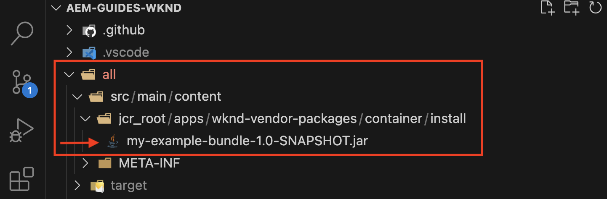

# サードパーティアーティファクトのインストール - 公開 Maven リポジトリでは入手できないもの

AEM プロジェクトを構築およびデプロイする際に、*公開 Maven リポジトリでは入手できない*&#x200B;サードパーティアーティファクトをインストールする方法について説明します。

**サードパーティアーティファクト**&#x200B;に該当するのは、以下のようなものです。

- [OSGi バンドル](https://www.osgi.org/resources/architecture/)：OSGi バンドルは、Java クラス、リソースおよびバンドルとその依存関係を記述するマニフェストを含む Java™ アーカイブファイルです。
- [Java jar](https://docs.oracle.com/javase/tutorial/deployment/jar/basicsindex.html)：Java クラスとリソースを含む Java™ アーカイブファイル。
- [パッケージ](https://experienceleague.adobe.com/ja/docs/experience-manager-65/content/sites/administering/contentmanagement/package-manager#what-are-packages)：パッケージは、ファイルシステムのシリアル化形式でリポジトリコンテンツを含む zip ファイルです。

## 標準シナリオ

通常は、AEM プロジェクトの `pom.xml` ファイルの依存関係として、公開 Maven リポジトリで&#x200B;*入手可能*&#x200B;なサードパーティのバンドルパッケージをインストールします。

例：

- [AEM WCM コアコンポーネント](https://github.com/adobe/aem-core-wcm-components)**バンドル**&#x200B;は、[WKND プロジェクトの](https://github.com/adobe/aem-guides-wknd/blob/main/pom.xml#L747-L753) `pom.xml` ファイルに依存関係として追加されます。ここでは、AEM WCM コアコンポーネントバンドルが AEM ランタイムによって提供されるので、`provided` 範囲が使用されます。バンドルが AEM ランタイムによって提供されない場合は、`compile` 範囲を使用します。これがデフォルトの範囲になります。

- [WKND 共有](https://github.com/adobe/aem-guides-wknd-shared)**パッケージ**&#x200B;は、[WKND プロジェクトの](https://github.com/adobe/aem-guides-wknd/blob/main/pom.xml#L767-L773) `pom.xml` ファイルに依存関係として追加されます。


## まれなシナリオ

場合によっては、AEM プロジェクトを構築およびデプロイする際に、[Maven Central リポジトリ](https://mvnrepository.com/)または[アドビの公開リポジトリ](https://repo.adobe.com/index.html)で&#x200B;**入手できない**&#x200B;サードパーティのバンドル、jar、パッケージをインストールする必要が生じることがあります。

理由は、以下が考えられます。

- バンドルまたはパッケージは内部チームまたはサードパーティベンダーによって提供され、_公開 Maven リポジトリでは入手できない_。

- Java™ jar ファイルは _OSGi バンドルではない_&#x200B;ので、公開 Maven リポジトリで使用できる場合とできない場合がある。

- 公開 Maven リポジトリで入手可能なサードパーティパッケージの最新バージョンでまだリリースされていない機能が必要。ローカルで構築されたリリースバージョンまたはスナップショットバージョンをインストールすることにした。

## 前提条件

このチュートリアルに従うには、以下が必要です。

- [ローカル AEM 開発環境](https://experienceleague.adobe.com/ja/docs/experience-manager-learn/cloud-service/local-development-environment-set-up/overview)または[高速開発環境（RDE）](https://experienceleague.adobe.com/ja/docs/experience-manager-learn/cloud-service/developing/rde/overview)の設定。

- _サードパーティのバンドル、jar、またはパッケージを追加_&#x200B;し、変更を確認するための [AEM WKND プロジェクト](https://github.com/adobe/aem-guides-wknd)。

## 設定

- AEM 6.X または AEM as a Cloud Service（AEMCS）のローカル開発環境または RDE 環境を設定します。

- AEM WKND プロジェクトのクローンを作成してデプロイします。

  ```
  $ git clone git@github.com:adobe/aem-guides-wknd.git
  $ cd aem-guides-wknd
  $ mvn clean install -PautoInstallPackage 
  ```

  WKND サイトページが正しくレンダリングされていることを確認します。

## AEM プロジェクトへのサードパーティバンドルのインストール{#install-third-party-bundle}

_公開 Maven リポジトリでは入手できない_&#x200B;デモ OSGi [my-example-bundle](./assets/install-third-party-articafcts/my-example-bundle.zip) を AEM WKND プロジェクトにインストールおよび使用しましょう。

**my-example-bundle** は `HelloWorldService` OSGi サービスを書き出し、その `sayHello()` メソッドは `Hello Earth!` メッセージを返します。

詳しくは、[my-example-bundle.zip](./assets/install-third-party-articafcts/my-example-bundle.zip) ファイル内の README.md ファイルを参照してください。

### `all` モジュールへのバンドルの追加

最初の手順では、`my-example-bundle` を AEM WKND プロジェクトの `all` モジュールに追加します。

- [my-example-bundle.zip](./assets/install-third-party-articafcts/my-example-bundle.zip) ファイルをダウンロードして抽出します。

- AEM WKND プロジェクトの `all` モジュールで、`all/src/main/content/jcr_root/apps/wknd-vendor-packages/container/install` ディレクトリ構造を作成します。`/all/src/main/content` ディレクトリが存在するので、`jcr_root/apps/wknd-vendor-packages/container/install` ディレクトリのみを作成する必要があります。

- 抽出した `target` ディレクトリから `my-example-bundle-1.0-SNAPSHOT.jar` ファイルを上記の `all/src/main/content/jcr_root/apps/wknd-vendor-packages/container/install` ディレクトリにコピーします。

  

### バンドルからのサービスの使用

AEM WKND プロジェクトの `my-example-bundle` から `HelloWorldService` OSGi サービスを使用しましょう。

- AEM WKND プロジェクトの `core` モジュールで、`core/src/main/java/com/adobe/aem/guides/wknd/core/servlet` に `SayHello.java` Sling サーブレットを作成します。

  ```java
  package com.adobe.aem.guides.wknd.core.servlet;
  
  import java.io.IOException;
  
  import javax.servlet.Servlet;
  import javax.servlet.ServletException;
  
  import org.apache.sling.api.SlingHttpServletRequest;
  import org.apache.sling.api.SlingHttpServletResponse;
  import org.apache.sling.api.servlets.HttpConstants;
  import org.apache.sling.api.servlets.ServletResolverConstants;
  import org.apache.sling.api.servlets.SlingSafeMethodsServlet;
  import org.osgi.service.component.annotations.Component;
  import org.osgi.service.component.annotations.Reference;
  import com.example.services.HelloWorldService;
  
  @Component(service = Servlet.class, property = {
      ServletResolverConstants.SLING_SERVLET_PATHS + "=/bin/sayhello",
      ServletResolverConstants.SLING_SERVLET_METHODS + "=" + HttpConstants.METHOD_GET
  })
  public class SayHello extends SlingSafeMethodsServlet {
  
          private static final long serialVersionUID = 1L;
  
          // Injecting the HelloWorldService from the `my-example-bundle` bundle
          @Reference
          private HelloWorldService helloWorldService;
  
          @Override
          protected void doGet(SlingHttpServletRequest request, SlingHttpServletResponse response) throws ServletException, IOException {
              // Invoking the HelloWorldService's `sayHello` method
              response.getWriter().write("My-Example-Bundle service says: " + helloWorldService.sayHello());
          }
  }
  ```

- AEM WKND プロジェクトのルート `pom.xml` ファイルに、依存関係として `my-example-bundle` を追加します。

  ```xml
  ...
  <!-- My Example Bundle -->
  <dependency>
      <groupId>com.example</groupId>
      <artifactId>my-example-bundle</artifactId>
      <version>1.0-SNAPSHOT</version>
      <scope>system</scope>
      <systemPath>${maven.multiModuleProjectDirectory}/all/src/main/content/jcr_root/apps/wknd-vendor-packages/container/install/my-example-bundle-1.0-SNAPSHOT.jar</systemPath>
  </dependency>
  ...
  ```

  この場合：
   - `system` 範囲は、依存関係を公開 Maven リポジトリで検索しないことを示します。
   - `systemPath` は、AEM WKND プロジェクトの `all` モジュール内の `my-example-bundle` ファイルへのパスです。
   - `${maven.multiModuleProjectDirectory}` は、マルチモジュールプロジェクトのルートディレクトリを指す Maven プロパティです。

- AEM WKND プロジェクトの `core` モジュールの `core/pom.xml` ファイルに、依存関係として `my-example-bundle` を追加します。

  ```xml
  ...
  <!-- My Example Bundle -->
  <dependency>
      <groupId>com.example</groupId>
      <artifactId>my-example-bundle</artifactId>
  </dependency>
  ...
  ```

- 次のコマンドを使用して、AEM WKND プロジェクトを構築およびデプロイします。

  ```
  $ mvn clean install -PautoInstallPackage
  ```

- ブラウザーで URL `http://localhost:4502/bin/sayhello` にアクセスして、`SayHello` サーブレットが期待どおりに動作することを確認します。

- 上記の変更を AEM WKND プロジェクトのリポジトリにコミットします。次に、Cloud Manager パイプラインを実行して、RDE または AEM 環境の変更を確認します。

  

AEM WKND プロジェクトの [tutorial/install-3rd-party-bundle](https://github.com/adobe/aem-guides-wknd/compare/main...tutorial/install-3rd-party-bundle) 分岐には、参照用に上記の変更が含まれます。

### 主な習得事項{#key-learnings-bundle}

公開 Maven リポジトリで使用できない OSGi バンドルは、次の手順に従って AEM プロジェクトにインストールできます。

- OSGi バンドルを `all` モジュールの `jcr_root/apps/<PROJECT-NAME>-vendor-packages/container/install` ディレクトリにコピーします。この手順は、バンドルをパッケージ化して AEM インスタンスにデプロイするために必要です。

- ルートおよびコアモジュールの `pom.xml` ファイルを更新して、`system` 範囲と `systemPath` がバンドルファイルを指す依存関係として OSGi バンドルを追加します。この手順は、プロジェクトをコンパイルするために必要です。

## AEM プロジェクトへのサードパーティ jar のインストール

この例では、`my-example-jar` は OSGi バンドルではなく、Java jar ファイルです。

_公開 Maven リポジトリでは入手できない_&#x200B;デモ用の [my-example-jar](./assets/install-third-party-articafcts/my-example-jar.zip) を AEM WKND プロジェクトにインストールおよび使用してみましょう。

**my-example-jar** は、`Hello World!` メッセージを返す `sayHello()` メソッドを持つ `MyHelloWorldService` クラスを含む Java jar ファイルです。

詳しくは、[my-example-jar.zip](./assets/install-third-party-articafcts/my-example-jar.zip) ファイル内の README.md ファイルを参照してください。

### `all` モジュールへの jar の追加

最初の手順では、`my-example-jar` を AEM WKND プロジェクトの `all` モジュールに追加します。

- [my-example-jar.zip](./assets/install-third-party-articafcts/my-example-jar.zip) ファイルをダウンロードして抽出します。

- AEM WKND プロジェクトの `all` モジュールで、`all/resource/jar` ディレクトリ構造を作成します。

- 抽出した `target` ディレクトリから `my-example-jar-1.0-SNAPSHOT.jar` ファイルを上記の `all/resource/jar` ディレクトリにコピーします。

  

### jar からのサービスの使用

AEM WKND プロジェクトの `my-example-jar` から `MyHelloWorldService` を使用しましょう。

- AEM WKND プロジェクトの `core` モジュールで、`core/src/main/java/com/adobe/aem/guides/wknd/core/servlet` に `SayHello.java` Sling サーブレットを作成します。

  ```java
  package com.adobe.aem.guides.wknd.core.servlet;
  
  import java.io.IOException;
  
  import javax.servlet.Servlet;
  import javax.servlet.ServletException;
  
  import org.apache.sling.api.SlingHttpServletRequest;
  import org.apache.sling.api.SlingHttpServletResponse;
  import org.apache.sling.api.servlets.HttpConstants;
  import org.apache.sling.api.servlets.ServletResolverConstants;
  import org.apache.sling.api.servlets.SlingSafeMethodsServlet;
  import org.osgi.service.component.annotations.Component;
  
  import com.my.example.MyHelloWorldService;
  
  @Component(service = Servlet.class, property = {
          ServletResolverConstants.SLING_SERVLET_PATHS + "=/bin/sayhello",
          ServletResolverConstants.SLING_SERVLET_METHODS + "=" + HttpConstants.METHOD_GET
  })
  public class SayHello extends SlingSafeMethodsServlet {
  
      private static final long serialVersionUID = 1L;
  
      @Override
      protected void doGet(SlingHttpServletRequest request, SlingHttpServletResponse response)
              throws ServletException, IOException {
  
          // Creating an instance of MyHelloWorldService
          MyHelloWorldService myHelloWorldService = new MyHelloWorldService();
  
          // Invoking the MyHelloWorldService's `sayHello` method
          response.getWriter().write("My-Example-JAR service says: " + myHelloWorldService.sayHello());
      }
  }    
  ```

- AEM WKND プロジェクトのルート `pom.xml` ファイルに、依存関係として `my-example-jar` を追加します。

  ```xml
  ...
  <!-- My Example JAR -->
  <dependency>
      <groupId>com.my.example</groupId>
      <artifactId>my-example-jar</artifactId>
      <version>1.0-SNAPSHOT</version>
      <scope>system</scope>
      <systemPath>${maven.multiModuleProjectDirectory}/all/resource/jar/my-example-jar-1.0-SNAPSHOT.jar</systemPath>
  </dependency>            
  ...
  ```

  この場合：
   - `system` 範囲は、依存関係を公開 Maven リポジトリで検索しないことを示します。
   - `systemPath` は、AEM WKND プロジェクトの `all` モジュール内の `my-example-jar` ファイルへのパスです。
   - `${maven.multiModuleProjectDirectory}` は、マルチモジュールプロジェクトのルートディレクトリを指す Maven プロパティです。

- AEM WKND プロジェクトの `core` モジュールの `core/pom.xml` ファイルで、次の 2 つの変更を行います。

   - `my-example-jar` を依存関係として追加します。

     ```xml
     ...
     <!-- My Example JAR -->
     <dependency>
         <groupId>com.my.example</groupId>
         <artifactId>my-example-jar</artifactId>
     </dependency>
     ...
     ```

   - `bnd-maven-plugin` 設定を更新して、構築中の OSGi バンドル（aem-guides-wknd.core）に `my-example-jar` を含めます。

     ```xml
     ...
     <plugin>
         <groupId>biz.aQute.bnd</groupId>
         <artifactId>bnd-maven-plugin</artifactId>
         <executions>
             <execution>
                 <id>bnd-process</id>
                 <goals>
                     <goal>bnd-process</goal>
                 </goals>
                 <configuration>
                     <bnd><![CDATA[
                 Import-Package: javax.annotation;version=0.0.0,*
                 <!-- Include the 3rd party jar as inline resource-->
                 -includeresource: \
                 lib/my-example-jar.jar=my-example-jar-1.0-SNAPSHOT.jar;lib:=true
                         ]]></bnd>
                 </configuration>
             </execution>
         </executions>
     </plugin>        
     ...
     ```

- 次のコマンドを使用して、AEM WKND プロジェクトを構築およびデプロイします。

  ```
  $ mvn clean install -PautoInstallPackage
  ```

- ブラウザーで URL `http://localhost:4502/bin/sayhello` にアクセスして、`SayHello` サーブレットが期待どおりに動作することを確認します。

- 上記の変更を AEM WKND プロジェクトのリポジトリにコミットします。次に、Cloud Manager パイプラインを実行して、RDE または AEM 環境の変更を確認します。

  

AEM WKND プロジェクトの [tutorial/install-3rd-party-jar](https://github.com/adobe/aem-guides-wknd/compare/main...tutorial/install-3rd-party-jar) 分岐には、参照用に上記の変更が含まれます。

Java jar ファイルが&#x200B;_公開 Maven リポジトリで使用可能であるが、OSGi バンドルではない_&#x200B;シナリオでは、`<dependency>` の `system` 範囲と `systemPath` 要素が必須ではないことを除いて、上記の手順に従うことができます。

### 主な習得事項{#key-learnings-jar}

OSGi バンドルではなく、公開 Maven リポジトリで使用できる場合と使用できない場合の Java jar は、次の手順に従って AEM プロジェクトにインストールできます。

- コアモジュールの `pom.xml` ファイル内の `bnd-maven-plugin` 設定を更新して、構築中の OSGi バンドルにインラインリソースとして Java jar を含めます。

次の手順は、Java jar が公開 Maven リポジトリで使用できない場合にのみ必要です。

- Java jar を `all` モジュールの `resource/jar` ディレクトリにコピーします。

- ルートおよびコアモジュールの `pom.xml` ファイルを更新して、`system` 範囲と `systemPath` が jar ファイルを指す依存関係として Java jar を追加します。

## AEM プロジェクトへのサードパーティパッケージのインストール

メイン分岐からローカルに構築された [ACS AEM Commons](https://adobe-consulting-services.github.io/acs-aem-commons/) _スナップショット_&#x200B;バージョンをインストールしましょう。

これは、公開 Maven リポジトリでは使用できない AEM パッケージをインストールする手順を示す目的でのみ行います。

ACS AEM Commons パッケージは、公開 Maven リポジトリで入手できます。AEM プロジェクトに追加する方法について詳しくは、[AEM Maven プロジェクトへの ACS AEM Commons の追加](https://adobe-consulting-services.github.io/acs-aem-commons/pages/maven.html)を参照してください。

### `all` モジュールへのパッケージの追加

最初の手順では、パッケージを AEM WKND プロジェクトの `all` モジュールに追加します。

- POM ファイルから ACS AEM Commons リリース依存関係をコメント化または削除します。依存関係を特定する方法について詳しくは、[AEM Maven プロジェクトへの ACS AEM Commons の追加](https://adobe-consulting-services.github.io/acs-aem-commons/pages/maven.html)を参照してください。

- [ACS AEM Commons リポジトリ](https://github.com/Adobe-Consulting-Services/acs-aem-commons)の `master` 分岐をローカルマシンにクローン作成します。

- 次のコマンドを使用して、ACS AEM Commons スナップショットバージョンを構築します。

  ```
  $mvn clean install
  ```

- ローカルに構築されたパッケージは `all/target` にあり、2 つの .zip ファイルがあります。`-cloud` で終了するファイルは AEM as a Cloud Service 用で、もう 1 つは AEM 6.X 用です。

- AEM WKND プロジェクトの `all` モジュールで、`all/src/main/content/jcr_root/apps/wknd-vendor-packages/container/install` ディレクトリ構造を作成します。`/all/src/main/content` ディレクトリが存在するので、`jcr_root/apps/wknd-vendor-packages/container/install` ディレクトリのみを作成する必要があります。

- ローカルに構築されたパッケージ（.zip）ファイルを `/all/src/main/content/jcr_root/apps/mysite-vendor-packages/container/install` ディレクトリにコピーします。

- 次のコマンドを使用して、AEM WKND プロジェクトを構築およびデプロイします。

  ```
  $ mvn clean install -PautoInstallPackage
  ```

- インストールされた ACS AEM Commons パッケージを確認します。

   - CRX パッケージマネージャー（`http://localhost:4502/crx/packmgr/index.jsp`）

     

   - OSGi コンソール（`http://localhost:4502/system/console/bundles`）

     

- 上記の変更を AEM WKND プロジェクトのリポジトリにコミットします。次に、Cloud Manager パイプラインを実行して、RDE または AEM 環境の変更を確認します。

### 主な習得事項{#key-learnings-package}

公開 Maven リポジトリで使用できない AEM パッケージは、次の手順に従って AEM プロジェクトにインストールできます。

- パッケージを `all` モジュールの `jcr_root/apps/<PROJECT-NAME>-vendor-packages/container/install` ディレクトリにコピーします。この手順は、パッケージをパッケージ化して AEM インスタンスにデプロイするのに必要です。


## 概要

このチュートリアルでは、AEM プロジェクトを構築およびデプロイする際に、公開 Maven リポジトリでは使用できないサードパーティアーティファクト（バンドル、Java jar およびパッケージ）をインストールする方法ついて説明しました。
