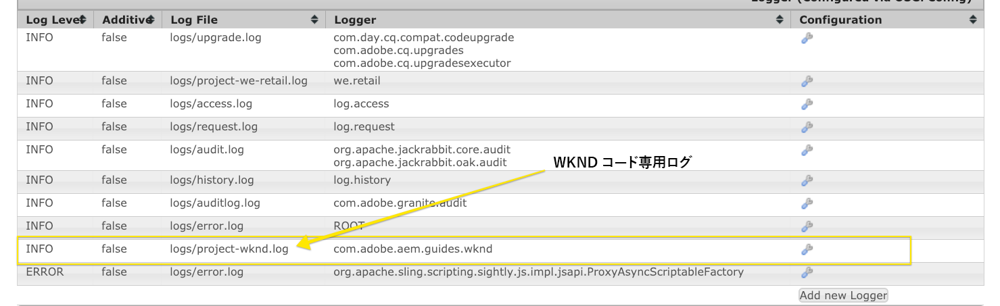
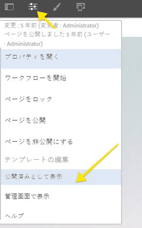
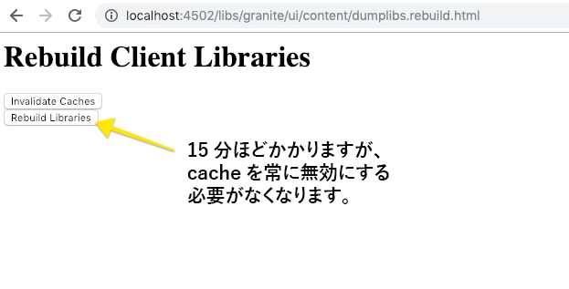

# ローカル AEM 開発環境の設定

AEM、Adobe Experience Managerの地域開発を始めるためのガイド。 ローカルインストール、Apache Maven、統合開発環境、デバッグ/トラブルシューティングの重要なトピックをカバーしています。 **[!DNL Eclipse IDE]、[!DNL CRXDE Lite]、[!DNL Visual Studio Code]、[!DNL IntelliJ]**&#x200B;との開発について説明します。

## 概要

Adobe Experience ManagerやAEM向けに開発する場合は、ローカル開発環境の設定が最初に行われます。 品質開発環境の設定に時間をかけて、生産性を高め、より優れたコードをより速く作成できます。 AEMのローカル開発環境を次の4つの領域に分割できます。

* ローカルAEMインスタンス
* [!DNL Apache Maven] project
* 統合開発環境(IDE)
* トラブルシューティング

## ローカルAEMインスタンスのインストール

ローカルのAEMインスタンスを指す場合、開発者のパーソナルマシン上で動作しているAdobe Experience Managerのコピーについてお話します。 ****** AllAEM開発では、ローカルのAEMインスタンスに対してコードを記述し、実行することで開始を行う必要があります。

AEMを初めて使用する場合は、次の2つの基本的な実行モードをインストールできます。***作成者***&#x200B;と&#x200B;***発行***。 ***作成者*** [runmode](https://helpx.adobe.com/experience-manager/6-5/sites/deploying/using/configure-runmodes.html)は、デジタルマーケターがコンテンツの作成と管理に使用する環境です。 **ほとんど**&#x200B;を開発する場合は、作成者インスタンスにコードをデプロイします。 これにより、新しいページを作成したり、コンポーネントを追加および設定したりできます。 AEM SitesはWYSIWYGオーサリングCMSなので、CSSとJavaScriptのほとんどはオーサリングインスタンスに対してテストできます。

また、ローカルの&#x200B;***発行***&#x200B;インスタンスに対する&#x200B;*重要な*&#x200B;テストコードです。 ***発行***&#x200B;インスタンスは、Webサイトの訪問者がやり取りするAEM環境です。 ***発行***&#x200B;インスタンスは&#x200B;***作成者***&#x200B;インスタンスと同じテクノロジースタックですが、設定と権限に関しては、いくつかの大きな違いがあります。 高いレベルの環境に昇格する前に、コードは常に&#x200B;*ローカルの***&#x200B;発行&#x200B;***インスタンスに対して*&#x200B;テストする必要があります。

### 手順

1. [Java](https://downloads.experiencecloud.adobe.com/content/software-distribution/en/general.html)がインストールされていることを確認します。
   * AEM 6.5+には[Java JDK 11](https://experience.adobe.com/#/downloads/content/software-distribution/en/general.html?1_group.propertyvalues.property=.%2Fjcr%3Content%2Fdc%3AsoftwareType&amp;1_group.propertyvalues.operation=equals&amp;1_group.propertyvalues.0_values=software-type%3Autoling&amp;orderby=%40jcr%3Fjcr%3AlastModified&amp;by.sort=&amp;layout=リスト&amp;p.offset=0&amp;p.limit=14)を優先
   * [AEM 6.5より前](https://www.oracle.com/technetwork/java/javase/downloads/index.html#JDK8) のAEMバージョン用Java JDK 8
2. [AEM QuickStart Jarと [!DNL license.properties]](https://helpx.adobe.com/experience-manager/6-5/sites/deploying/using/deploy.html#GettingtheSoftware)のコピーを取得します。
3. 次のようなフォルダー構造をコンピューター上に作成します。

   ```plain
   ~/aem-sdk
       /author
       /publish
   ```

4. [!DNL QuickStart] JARの名前を&#x200B;***aem-author-p4502.jar***&#x200B;に変更し、`/author`ディレクトリの下に配置します。 追加`/author`ディレクトリの下の&#x200B;***[!DNL license.properties]***&#x200B;ファイル。
5. [!DNL QuickStart] JARのコピーを作成し、***aem-publish-p4503.jar***&#x200B;に名前を変更して、`/publish`ディレクトリの下に配置します。 追加`/publish`ディレクトリの下の&#x200B;***[!DNL license.properties]***&#x200B;ファイルのコピー。

   ```plain
   ~/aem-sdk
       /author
           + aem-author-p4502.jar
           + license.properties
       /publish
           + aem-publish-p4503.jar
           + license.properties
   ```

6. ***aem-author-p4502.jar***&#x200B;ファイルを重複クリックし、**作成者**&#x200B;インスタンスをインストールします。 これは、ローカルコンピューターのポート&#x200B;**4502**&#x200B;で実行されている作成者インスタンスを開始します。

   ***aem-publish-p4503.jar***&#x200B;ファイルを重複クリックして、**発行**&#x200B;インスタンスをインストールします。 これは、ローカルコンピューターのポート&#x200B;**4503**&#x200B;で実行されている発行インスタンスを開始します。

   >[!NOTE]
   >
   >開発マシンのハードウェアによっては、**作成者インスタンスと発行**&#x200B;インスタンスの両方を同時に実行するのは難しい場合があります。 ローカルセットアップで同時に両方を実行する必要がある場合はほとんどありません。

   詳しくは、[AEMインスタンスのデプロイと保守](https://helpx.adobe.com/experience-manager/6-5/sites/deploying/using/deploy.html)を参照してください。

## Apache Mavenのインストール

***[!DNL Apache Maven]*** は、Javaベースのプロジェクトの構築と展開の手順を管理するツールです。AEMはJavaベースのプラットフォームで、[!DNL Maven]はAEMプロジェクトのコードを管理する標準的な方法です。 ***AEM Maven Project***&#x200B;または&#x200B;***AEM Project***&#x200B;のみと言うと、サイトの&#x200B;*カスタム*&#x200B;コードのすべてを含むMavenプロジェクトを参照します。

すべてのAEMプロジェクトは、最新バージョンの&#x200B;**[!DNL AEM Project Archetype]**&#x200B;で構築する必要があります。[https://github.com/Adobe-Marketing-Cloud/aem-project-archetype](https://github.com/Adobe-Marketing-Cloud/aem-project-archetype). [!DNL AEM Project Archetype]は、サンプルコードとコンテンツを持つAEMプロジェクトのブートストラップを作成します。 [!DNL AEM Project Archetype]には、プロジェクトで使用するように構成された&#x200B;**[!DNL AEM WCM Core Components]**&#x200B;も含まれます。

>[!CAUTION]
>
>新しいプロジェクトを開始する場合は、最新バージョンのアーキタイプを使用することをお勧めします。 アーキタイプには複数のバージョンがあり、すべてのバージョンが旧バージョンのAEMと互換性があるわけではありません。

### 手順

1. [Apache Maven](https://maven.apache.org/download.cgi)をダウンロード
2. [Apache Maven](https://maven.apache.org/install.html)をインストールし、インストールがコマンドライン`PATH`に追加されていることを確認します。
   * [!DNL macOS] ユーザーは、 [Homebrewを使用してMavenをインストールできます。](https://brew.sh/)
3. 新しいコマンドラインターミナルを開き、次のコマンドを実行して&#x200B;**[!DNL Maven]**&#x200B;がインストールされていることを確認します。

   ```shell
   $ mvn --version
   Apache Maven 3.3.9
   Maven home: /Library/apache-maven-3.3.9
   Java version: 1.8.0_111, vendor: Oracle Corporation
   Java home: /Library/Java/JavaVirtualMachines/jdk1.8.0_111.jdk/Contents/Home/jre
   Default locale: en_US, platform encoding: UTF-8
   ```

4. mavenのビルドプロセスに追加&#x200B;**[!DNL repo.adobe.com]**&#x200B;を自動的に追加するために、[!DNL Maven] [ settings.xml](https://maven.apache.org/settings.html)ファイルの&#x200B;**[!DNL adobe-public]**&#x200B;プロファイルーを指定します。

5. `settings.xml`という名前のファイルが存在しない場合は、`~/.m2/settings.xml`に作成します。

6. 追加[](https://repo.adobe.com/)に示す指示に基づく`settings.xml`ファイルへの&#x200B;**[!DNL adobe-public]**&#x200B;プロファイル。

   サンプル`settings.xml`を以下に示します。 *の命名規則 `settings.xml` と、ユーザーの `.m2` ディレクトリの下の配置が重要です。*

   ```xml
   <settings xmlns="https://maven.apache.org/SETTINGS/1.0.0"
     xmlns:xsi="https://www.w3.org/2001/XMLSchema-instance"
     xsi:schemaLocation="https://maven.apache.org/SETTINGS/1.0.0
                         https://maven.apache.org/xsd/settings-1.0.0.xsd">
   <profiles>
    <!-- ====================================================== -->
    <!-- A D O B E   P U B L I C   P R O F I L E                -->
    <!-- ====================================================== -->
        <profile>
            <id>adobe-public</id>
            <activation>
                <activeByDefault>true</activeByDefault>
            </activation>
            <properties>
                <releaseRepository-Id>adobe-public-releases</releaseRepository-Id>
                <releaseRepository-Name>Adobe Public Releases</releaseRepository-Name>
                <releaseRepository-URL>https://repo.adobe.com/nexus/content/groups/public</releaseRepository-URL>
            </properties>
            <repositories>
                <repository>
                    <id>adobe-public-releases</id>
                    <name>Adobe Public Repository</name>
                    <url>https://repo.adobe.com/nexus/content/groups/public</url>
                    <releases>
                        <enabled>true</enabled>
                        <updatePolicy>never</updatePolicy>
                    </releases>
                    <snapshots>
                        <enabled>false</enabled>
                    </snapshots>
                </repository>
            </repositories>
            <pluginRepositories>
                <pluginRepository>
                    <id>adobe-public-releases</id>
                    <name>Adobe Public Repository</name>
                    <url>https://repo.adobe.com/nexus/content/groups/public</url>
                    <releases>
                        <enabled>true</enabled>
                        <updatePolicy>never</updatePolicy>
                    </releases>
                    <snapshots>
                        <enabled>false</enabled>
                    </snapshots>
                </pluginRepository>
            </pluginRepositories>
        </profile>
   </profiles>
    <activeProfiles>
        <activeProfile>adobe-public</activeProfile>
    </activeProfiles>
   </settings>
   ```

7. 次のコマンドを実行して、**adobe-public**&#x200B;プロファイルがアクティブであることを確認します。

   ```shell
   $ mvn help:effective-settings
   ...
   <activeProfiles>
       <activeProfile>adobe-public</activeProfile>
   </activeProfiles>
   <pluginGroups>
       <pluginGroup>org.apache.maven.plugins</pluginGroup>
       <pluginGroup>org.codehaus.mojo</pluginGroup>
   </pluginGroups>
   </settings>
   [INFO] ------------------------------------------------------------------------
   [INFO] BUILD SUCCESS
   [INFO] ------------------------------------------------------------------------
   [INFO] Total time:  0.856 s
   ```

   **[!DNL adobe-public]**&#x200B;が表示されない場合は、`~/.m2/settings.xml`ファイルでAdobeレポートが正しく参照されていないことを示しています。 前の手順を再度実行し、settings.xmlファイルがAdobeレポートを参照していることを確認してください。

## 統合開発環境の設定

統合開発環境(IDE)は、テキストエディタ、構文サポート、および構築ツールを組み合わせたアプリケーションです。 開発の種類に応じて、IDEの方が他のIDEよりも優れている場合があります。 IDEに関係なく、ローカルAEMインスタンスに対して定期的に&#x200B;***プッシュ***&#x200B;コードをテストできることが重要です。 また、Gitのようなソース管理システムに持続させるために、時折、ローカルのAEMインスタンスから&#x200B;***pull***&#x200B;設定をAEMプロジェクトに取り込むことも重要です。

次に、ローカルAEMインスタンスとの統合を示す対応ビデオを含むAEM開発で使用される、より一般的なIDEのいくつかを示します。

>[!NOTE]
>
> WKNDプロジェクトは、AEMでCloud Serviceとして動作するようにデフォルトに更新されました。 6.5/6.4](https://github.com/adobe/aem-guides-wknd#building-for-aem-6xx)と[下位互換性を持つように更新されました。 AEM 6.5または6.4を使用している場合は、Mavenコマンドに`classic`プロファイルを追加します。

```shell
$ mvn clean install -PautoInstallSinglePackage -Pclassic
```

IDEを使用する場合は、Mavenプロファイルタブの`classic`を確認してください。


*IntelliJ Mavenプロファイル*

### [!DNL Eclipse] IDE

**[[!DNL Eclipse] IDE](https://www.eclipse.org/ide/)**&#x200B;は、Java開発で最も一般的なIDEの1つで、大部分はオープンソースで、***free***！です。 Adobeは、**[[!DNL AEM Developer Tools]](https://eclipse.adobe.com/aem/dev-tools/)**&#x200B;というプラグインを提供し、[!DNL Eclipse]の開発を容易にし、良いGUIでコードをローカルのAEMインスタンスと同期できるようにします。 [!DNL Eclipse] IDEは、AEMを初めて使う開発者には大部分推奨されます。これは、[!DNL AEM Developer Tools]がGUIをサポートしているからです。

#### インストールとセットアップ

1. [!DNL Eclipse] IDE for [!DNL Java EE Developers]をダウンロードしてインストールします。[https://www.eclipse.org](https://www.eclipse.org/)
1. 手順に従って[!DNL AEM Developer Tools]プラグインをインストールします。[https://eclipse.adobe.com/aem/dev-tools/](https://eclipse.adobe.com/aem/dev-tools/)

>[!VIDEO](https://video.tv.adobe.com/v/25906?quality=12&learn=on)

* 00:30 - Mavenプロジェクトのインポート
* 01:24 - Mavenを使用したソースコードの構築とデプロイ
* 04:33 - AEM Developer Toolでのプッシュコードの変更
* 10:55 - AEM Developer Toolでのプルコード変更
* 13:12 - Eclipseの統合デバッグツールの使用

### IntelliJ IDEA

**[IntelliJ IDEA](https://www.jetbrains.com/idea/)**&#x200B;は、Javaの専門的な開発を行う強力なIDEです。 [!DNL IntelliJ IDEA] フレディションとコマーシャル（有料）の2種類の味が ****** [!DNL Community] あ [!DNL Ultimate] ります。[!DNL Community]の無料版[!DNL IntellIJ IDEA]は、より多くのAEM開発を行うには十分ですが、[!DNL Ultimate] [は機能セット](https://www.jetbrains.com/idea/download)を拡張します。

#### [!DNL Installation and Setup]

1. [!DNL IntelliJ IDEA]をダウンロードしてインストールします。[https://www.jetbrains.com/idea/download](https://www.jetbrains.com/idea/download)
1. [!DNL Repo]をインストール（コマンドラインツール）:[https://github.com/Adobe-Marketing-Cloud/tools/tree/master/repo](https://github.com/Adobe-Marketing-Cloud/tools/tree/master/repo#installation)

>[!VIDEO](https://video.tv.adobe.com/v/26089/?quality=12&learn=on)

* 00:00 - Mavenプロジェクトのインポート
* 05:47 - Mavenを使用したソースコードの構築とデプロイ
* 08:17 — リポを使用したプッシュの変更
* 14:39 — リポで変更を取り込む
* 17:25 - IntelliJ IDEAの統合デバッグツールの使用

### [!DNL Visual Studio Code]

**[Visual Studio ](https://code.visualstudio.com/)** Codeは、強化されたJavaScriptのサポート、ブラウザのデバッグサポートを備えた、フロン ***トエンド*** 開発者のお気に入りのツールとなり [!DNL Intellisense]ました。**[!DNL Visual Studio Code]** オープンソースで、無料で、多くの強力な拡張機能を持つ。[!DNL Visual Studio Code] は、Adobeツール **[repoを使用してAEMとの統合を設定でき](https://github.com/Adobe-Marketing-Cloud/tools/tree/master/repo#integration-into-visual-studio-code)ます。** AEMと統合するためにインストールできる、コミュニティでサポートされる拡張機能もいくつかあります。

[!DNL Visual Studio Code] は、主にAEMクライアントライブラリを作成するためにCSS/LESSとJavaScriptコードを記述するフロントエンド開発者に最適です。ノード定義（ダイアログやコンポーネント）はすべて生のXMLで編集する必要があるので、新しいAEM開発者にとってこのツールは最適な選択ではないかもしれません。 [!DNL Visual Studio Code]にはいくつかのJava拡張が使用できますが、主にJava開発を行う場合は[!DNL Eclipse IDE]または[!DNL IntelliJ]をお勧めします。

#### 重要なリンク

* [**DownloadVisual Studio**](https://code.visualstudio.com/Download) **コード**
* **[repo](https://github.com/Adobe-Marketing-Cloud/tools/tree/master/repo#integration-into-visual-studio-code)**  - JCRコンテンツ用のFTPに似たツール
* **[aemfed](https://aemfed.io/)**  - AEMフロントエンドワークフローの高速化
* **[AEM同期](https://marketplace.visualstudio.com/items?itemName=Yinkai15.aemsync)**  — コミュニティでサポートされる* Visual Studioコードの拡張機能

>[!VIDEO](https://video.tv.adobe.com/v/25907?quality=12&learn=on)

* 00:30 - Mavenプロジェクトのインポート
* 00:53 - Mavenを使用したソースコードの構築とデプロイ
* 04:03 — リポコマンドラインツールを使用したプッシュコードの変更
* 08:29 — リポコマンドラインツールを使用したプルコードの変更
* 10:40 — 埋め込みツールを使用したプッシュコードの変更
* 14:24 — トラブルシューティング、クライアントライブラリの再構築

### [!DNL CRXDE Lite]

[CRXDE ](https://helpx.adobe.com/experience-manager/6-4/sites/developing/using/developing-with-crxde-lite.html) Liteは、AEMリポジトリのブラウザベースの表示です。[!DNL CRXDE Lite] はAEMに組み込まれており、開発者はファイルの編集、コンポーネント、ダイアログ、テンプレートの定義など、標準的な開発タスクを実行できます。[!DNL CRXDE Lite] は、完全な開発環境ではありま ****** せんが、デバッグツールとして非常に効果的です。[!DNL CRXDE Lite] は、コードベース外の製品コードを拡張する場合や、単に理解する場合に役立ちます。[!DNL CRXDE Lite] は、リポジトリの強力な表示と、権限を効果的にテストおよび管理する方法を提供します。

[!DNL CRXDE Lite] は、コードのテストとデバッグを行うために、常に他のIDEと組み合わせて使用する必要がありますが、主な開発ツールとしては使用できません。構文のサポートが制限され、オートコンプリート機能がなく、ソース管理システムとの統合も限られています。

>[!VIDEO](https://video.tv.adobe.com/v/25917?quality=12&learn=on)

## トラブルシューティング

***ヘルプ!*** コードが機能していません！すべての開発環境と同様に、コードが期待どおりに機能しない場合も（おそらく多く）あります。 AEMは強力なプラットフォームですが、強力なパワーを持つことで、非常に複雑になります。 以下に、問題のトラブルシューティングとトラッキングの要点をいくつか示します(ただし、問題が発生する可能性がある問題の完全なリストとは程遠い)。

### コードの導入の検証

問題が発生した場合は、まずコードがAEMに正しくデプロイおよびインストールされていることを確認します。

1. **「 [!UICONTROL パッケージ]** マネージャー」をチェックし、コードパッケージがアップロードおよびインストールされていることを確認します。 [http://localhost:4502/crx/packmgr/index.jsp](http://localhost:4502/crx/packmgr/index.jsp).タイムスタンプを確認して、パッケージが最近インストールされたことを確認します。
1. [!DNL Repo]や[!DNL AEM Developer Tools]のようなツールを使用してファイルの増分更新を行う場合、**は[!DNL CRXDE Lite]**&#x200B;にファイルがローカルのAEMインスタンスにプッシュされ、ファイルの内容が更新されたことを確認します。[http://localhost:4502/crx/de/index.jsp](http://localhost:4502/crx/de/index.jsp)
1. **OSGiバンドル内のJavaコードに関連する問題が見つかった場合に、バンドルがアップロードされていることを** 確認します。[!UICONTROL Adobe Experience ManagerWebコンソール]を開きます。[http://localhost:4502/system/console/bundles](http://localhost:4502/system/console/bundles)を開き、バンドルを検索します。 バンドルのステータスが&#x200B;**[!UICONTROL アクティブ]**&#x200B;であることを確認します。 **[!UICONTROL Installed]**&#x200B;状態のバンドルのトラブルシューティングに関する詳細は、以下を参照してください。

#### ログの確認

AEMはチャットプラットフォームで、多くの役に立つ情報を&#x200B;**error.log**&#x200B;に記録します。 **error.log**&#x200B;は、AEMがインストールされている場所です。&lt; `aem-installation-folder>/crx-quickstart/logs/error.log`.

問題を追跡するのに便利な方法は、Javaコードにログ文を追加することです。

```java
import org.slf4j.Logger;
import org.slf4j.LoggerFactory;
...

public class MyClass {
    private final Logger log = LoggerFactory.getLogger(getClass());

    ...

    String myVariable = "My Variable";

    log.debug("Debug statement of myVariable {}", myVariable);

    log.info("Info statement of myVariable {}", myVariable);
}
```

デフォルトでは、**error.log**&#x200B;は&#x200B;*[!DNL INFO]*&#x200B;文をログに記録するように設定されています。 ログレベルを変更する場合は、[!UICONTROL ログサポート]に移動して変更できます。[http://localhost:4502/system/console/slinglog](http://localhost:4502/system/console/slinglog). **error.log**&#x200B;がチャットしすぎていることもわかります。 [!UICONTROL ログのサポート]を使用して、指定したJavaパッケージのログ文を設定できます。 これは、カスタムコードの問題をOOTB AEMプラットフォームの問題から簡単に分離するための、プロジェクトのベストプラクティスです。



#### バンドルはインストール済み状態{#bundle-active}です

すべてのバンドル（フラグメントを除く）は、**[!UICONTROL アクティブ]**&#x200B;状態になっている必要があります。 コードバンドルが[!UICONTROL Installed]状態になっている場合は、解決する必要がある問題があります。 ほとんどの場合、依存関係の問題です。


上のスクリーンショットでは、[!DNL WKND Core bundle]は[!UICONTROL インストール済み]状態です。 これは、バンドルが予期している`com.adobe.cq.wcm.core.components.models`のバージョンが、AEMインスタンスで使用できるバージョンと異なるためです。

使用できる便利なツールは、[!UICONTROL 依存関係ファインダー]です。[http://localhost:4502/system/console/depfinder](http://localhost:4502/system/console/depfinder). AEM追加インスタンスで使用可能なバージョンを調べるJavaパッケージ名。


上記の例を続けて、AEMインスタンスにインストールされているバージョンが&#x200B;**12.2**&#x200B;対&#x200B;**12.6**&#x200B;で、バンドルが予期していたことがわかります。 そこから後ろ向きに作業し、AEMの[!DNL Maven]依存関係がAEMプロジェクトの[!DNL Maven]依存関係と一致しているかを調べることができます。 上記の例では、[!DNL Core Components] **v2.2.0**&#x200B;がAEMインスタンスにインストールされていますが、コードバンドルは&#x200B;**v2.2.2**&#x200B;に依存関係を持って構築されているので、依存関係の問題の原因となります。

#### Slingモデルの登録の確認{#osgi-component-sling-models}

AEMコンポーネントは、ビジネスロジックをカプセル化し、HTLレンダリングスクリプトをクリーンな状態に保つために、常に[!DNL Sling Model]によってバックアップする必要があります。 Slingモデルが見つからない問題が発生した場合は、コンソールから[!DNL Sling Models]をチェックすると便利です。[http://localhost:4502/system/console/status-slingmodels](http://localhost:4502/system/console/status-slingmodels). Slingモデルが登録済みかどうか、およびSlingモデルが関連付けられているリソースタイプ（コンポーネントパス）が表示されます。


`wknd/components/content/byline`のコンポーネントリソースタイプに結び付けられている[!DNL Sling Model]、`BylineImpl`の登録を表示します。

#### CSSまたはJavaScriptの問題

CSSとJavaScriptのほとんどの問題のトラブルシューティングを行うには、ブラウザーの開発ツールを使用するのが最も効果的です。 AEM作成者インスタンスに対して開発する際に問題を絞り込むには、「発行済みとして」ページを表示すると便利です。



[!UICONTROL ページのプロパティ]メニューを開き、[!UICONTROL 表示を発行済み]としてクリックします。 これにより、AEMエディターを使用せずにページが開き、クエリパラメーターが&#x200B;**wcmmode=disabled**&#x200B;に設定されます。 これにより、AEMオーサリングUIが効果的に無効になり、フロントエンドの問題のトラブルシューティング/デバッグがより簡単になります。

フロントエンドコードの開発時に、古い、または古いCSS/JSが読み込まれている場合に、よく発生する問題がもう1つあります。 最初の手順として、ブラウザー履歴がクリアされ、必要に応じて匿名ブラウザーまたは新規開始がクリアされていることを確認します。

#### クライアントライブラリのデバッグ

カテゴリや埋め込みの方法が異なれば、複数のクライアントライブラリを含めることができます。これはトラブルシューティングが困難になる場合があります。 AEM はそのためにいくつかのツールを公開しています。最も重要なツールの1つは、[!UICONTROL Rebuild Client Libraries]です。これは、AEMにLESSファイルを再コンパイルさせ、CSSを生成させるよう強制します。

* [Libsのダンプ](http://localhost:4502/libs/granite/ui/content/dumplibs.html) -AEMインスタンスに登録されているすべてのクライアントライブラリをリストします。&lt;host>/libs/granite/ui/content/dumplibs.html
* [出力テスト](http://localhost:4502/libs/granite/ui/content/dumplibs.test.html) - カテゴリ別を含む、clientlib の予想される HTML 出力を確認できます。&lt;host>/libs/granite/ui/content/dumplibs.test.html
* [Libraries Dependencies validation](http://localhost:4502/libs/granite/ui/content/dumplibs.validate.html)  — 見つからない依存関係や埋め込みカテゴリが強調表示されます。&lt;host>/libs/granite/ui/content/dumplibs.validate.html
* [クライアントライブラリの再ビルド](http://localhost:4502/libs/granite/ui/content/dumplibs.rebuild.html) - AEM はすべてのクライアントライブラリを強制的に再ビルドするか、クライアントライブラリのキャッシュを無効にできます。このツールでは、AEM が生成された CSS を強制的に再コンパイルするので、LESS を使用した開発において特に効果的です。一般的に、キャッシュを無効化した後にページの更新をおこなう方が、すべてのライブラリを再ビルドするよりも効果的です。&lt;host>/libs/granite/ui/content/dumplibs.rebuild.html



>[!NOTE]
>
>[!UICONTROL Rebuild Client Libraries]ツールを使用してキャッシュを継続的に無効にする必要がある場合は、すべてのクライアントライブラリを1回だけ再構築する必要があります。 これには約15分かかりますが、通常は将来キャッシュの問題が発生しなくなります。
