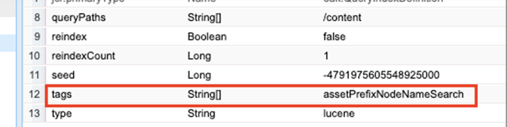

# AEM でのインデックス作成のベストプラクティス

Adobe Experience Manager（AEM）でのインデックス作成のベストプラクティスについて説明します。 Apache [Jackrabbit Oak](https://jackrabbit.apache.org/oak/docs/query/query.html) は、AEM のコンテンツ検索を強化します。重要なポイントは次のとおりです。

- 標準では、AEM は、検索やクエリ機能をサポートする様々なインデックスを提供します。例えば、`damAssetLucene`、`cqPageLucene` などです。
- すべてのインデックス定義は、`/oak:index` ノード下にあるリポジトリーに保存されます。
- AEM as a Cloud Service は Oak Lucene インデックスのみをサポートします。
- インデックスの設定は、AEM プロジェクトコードベースで管理し、Cloud Manager CI／CD パイプラインを使用してデプロイする必要があります。
- 特定のクエリに対して複数のインデックスが使用可能な場合、**推定コストが最も低い指標を使用**&#x200B;します。
- 特定のクエリに使用できるインデックスがない場合、一致するコンテンツを見つけるためにコンテンツツリが走査されます。 ただし、`org.apache.jackrabbit.oak.query.QueryEngineSettingsService` はデフォルトで、100,000 個のノードのみを走査します。
- 現在のユーザーが読み取りアクセス権を持っていることを確認するため、クエリの結果は&#x200B;**最終的にフィルタリングされ**&#x200B;ます。 つまり、クエリ結果は、インデックスで指定されたノードの数よりも少なくなる場合があります。
- インデックス定義を変更した後にリポジトリのインデックス再作成を行うには時間が必要で、リポジトリのサイズに応じて異なります。

AEM インスタンスのパフォーマンスに影響を与えない、効率的で正しい検索機能を使用するには、インデックス作成のベストプラクティスを理解することが重要です。

## カスタムと標準のインデックス

場合によっては、検索要件に対応するためにカスタムインデックスを作成する必要があります。 ただし、カスタムインデックスを作成する前に、次のガイドラインに従ってください。

- 検索要件を理解し、OOTB インデックスが検索要件をサポートできるかどうかを確認します。 [ローカル SDK](http://localhost:4502/libs/granite/operations/content/diagnosistools/queryPerformance.html) および開発者コンソールまたは `https://author-pXXXX-eYYYY.adobeaemcloud.com/ui#/aem/libs/granite/operations/content/diagnosistools/queryPerformance.html?appId=aemshell` 経由の AEMCS で利用可能な&#x200B;**クエリパフォーマンスツール**&#x200B;を使用します。

- 最適なクエリを定義します。[クエリの最適化](https://experienceleague.adobe.com/ja/docs/experience-manager-cloud-service/content/operations/query-and-indexing-best-practices)フローチャートと [JCR クエリチートシート](https://experienceleague.adobe.com/docs/experience-manager-65/assets/JCR_query_cheatsheet-v1.1.pdf?lang=ja)を参考にしてください。

- OOTB インデックスが検索要件をサポートしない場合は、2 つのオプションがあります。 ただし、[効率的なインデックス作成のヒント](https://experienceleague.adobe.com/ja/docs/experience-manager-65/content/implementing/deploying/practices/best-practices-for-queries-and-indexing)を確認してください。
   - OOTB インデックスのカスタマイズ：保守とアップグレードが簡単に行える、お勧めのオプション。
   - 完全なカスタムインデックス：上記のオプションが機能しない場合のみ。

### OOTB インデックスのカスタマイズ

- **AEMCS** では、OOTB インデックスをカスタマイズするときに、**\&lt;OOTBIndexName>-\&lt;productVersion>-custom-\&lt;customVersion>** 命名規則を使用します。 例えば、`cqPageLucene-custom-1` や `damAssetLucene-8-custom-1` です。 これは、OOTB インデックスが更新されるたびに、カスタマイズされたインデックス定義を結合するのに役立ちます。 詳しくは、[標準提供のインデックスの変更](https://experienceleague.adobe.com/ja/docs/experience-manager-cloud-service/content/operations/indexing)を参照してください。

- **AEM 6.X** では、上記の命名方法は&#x200B;_機能しません_。`indexRules` ノードの必要なプロパティで OOTB インデックスを更新するだけです。

- 常に CRX DE パッケージマネージャー（/crx/packmgr/）を使用して AEM インスタンスから最新の OOTB インデックス定義をコピーし、名前を変更して XML ファイル内にカスタマイズを追加します。

- インデックス定義を AEM プロジェクト（`ui.apps/src/main/content/jcr_root/_oak_index`）に格納して、Cloud Manager CI／CD パイプラインを使用してデプロイします。 詳しくは、[カスタムインデックス定義のデプロイ](https://experienceleague.adobe.com/ja/docs/experience-manager-cloud-service/content/operations/indexing)を参照してください。

### 完全なカスタムインデックス。

完全なカスタムインデックスの作成は、上記のオプションが機能しない場合にのみ、最後のオプションにする必要があります。

- 完全なカスタムインデックスを作成する場合は、**\&lt;接頭辞>.\&lt;customIndexName>-\&lt;version>-custom-\&lt;customVersion>** 命名規則を使用します。 例えば、`wknd.adventures-1-custom-1` のようになります。 これにより、名前の競合を回避できます。 ここで `wknd` は接頭辞で、`adventures` は、カスタムインデックス名です。 この規則は、AEM 6.X と AEMCS の両方に適用され、AEMCS への将来の移行に備えるのに役立ちます。

- AEMCS は Lucene インデックスのみをサポートしているので、AEMCS への今後の移行に備えて、常に Lucene インデックスを使用します。 詳しくは、[Lucene インデックスとプロパティインデックス](https://experienceleague.adobe.com/ja/docs/experience-manager-65/content/implementing/deploying/practices/best-practices-for-queries-and-indexing)を参照してください。

- OOTB インデックスと同じノードタイプでカスタムインデックスを作成しないでください。 代わりに、`indexRules` ノードの必要なプロパティを使用して OOTB インデックスをカスタマイズします。 例えば、`dam:Asset` ノードタイプにカスタムインデックスを作成せず、OOTB `damAssetLucene` インデックスをカスタマイズします。 _このことは、パフォーマンスと機能の問題の一般的な根本原因でした_。

- また、インデックス作成ルール（`indexRules`）ノードの下に複数のノードタイプ（`cq:Page` や `cq:Tag` など）を追加することは避けてください。 代わりに、ノードタイプごとに別々のインデックスを作成します。

- 上記の節で説明したように、インデックス定義をAEMプロジェクト（`ui.apps/src/main/content/jcr_root/_oak_index`）に格納して、Cloud Manager CI／CD パイプラインを使用してデプロイします。 詳しくは、[カスタムインデックス定義のデプロイ](https://experienceleague.adobe.com/ja/docs/experience-manager-cloud-service/content/operations/indexing)を参照してください。

- インデックス定義のガイドラインを次に示します。
   - ノードタイプ（`jcr:primaryType`）は `oak:QueryIndexDefinition`
   - インデックスのタイプ（`type`）は `lucene`
   - async プロパティ（`async`）は `async,nrt`
   - `includedPaths` を使用して `excludedPaths` プロパティを回避します。 常に `queryPaths` 値を `includedPaths` 値と同じ値に設定します。
   - パスの制限を適用するには、`evaluatePathRestrictions` プロパティを使用して `true` に設定します。
   - `tags` プロパティを使用してインデックスにタグを付け、クエリ時にこのタグ値を指定してインデックスを使用します。 一般的なクエリ構文は `<query> option(index tag <tagName>)` です。

  ```xml
  /oak:index/wknd.adventures-1-custom-1
      - jcr:primaryType = "oak:QueryIndexDefinition"
      - type = "lucene"
      - compatVersion = 2
      - async = ["async", "nrt"]
      - includedPaths = ["/content/wknd"]
      - queryPaths = ["/content/wknd"]
      - evaluatePathRestrictions = true
      - tags = ["customAdvSearch"]
  ...
  ```

### 例

ベストプラクティスを理解するために、いくつかの例を確認します。

#### タグプロパティの不適切な使用方法

以下の図は、カスタムおよび OOTB のインデックス定義を示し、`tags` プロパティがハイライトされています。両方のインデックスで同じ `visualSimilaritySearch` の値が使用されています。


##### 分析

これはカスタムインデックスの `tags` プロパティの不適切な使用です。 Oak クエリエンジンは、推定コストが最も低い原因となる OOTB インデックスを超えるカスタムインデックスを選択します。

正しい方法は、OOTB インデックスをカスタマイズし、`indexRules` ノードに必要なプロパティを追加することです。 詳しくは、[OOTB インデックスのカスタマイズ](#customize-the-ootb-index)を参照してください。

#### `dam:Asset` ノードタイプのインデックス

以下の画像は、`includedPaths` プロパティが特定のパスに設定された `dam:Asset` ノードタイプのカスタムインデックスを示しています。


##### 分析

Assets に対してオムニサーチを実行すると、誤った結果が返されるので、カスタムインデックスの推定コストが下がります。

`dam:Asset` ノードタイプにカスタムインデックスを作成せず、`indexRules` ノードの必要なプロパティを使用して OOTB `damAssetLucene` インデックスをカスタマイズします。

#### インデックス作成ルールの下の複数のノードタイプ

下の画像は、`indexRules` ノードの下に複数のノードタイプがあるカスタムインデックスを示しています。


##### 分析

1 つのインデックスに複数のノードタイプを追加することは推奨されませんが、`cq:Page` と `cq:PageContent` など、ノードタイプが密接に関連している場合は、同じインデックスに複数のノードタイプをインデックス化しても問題ありません。

有効な解決策は、OOTB の `cqPageLucene` と `damAssetLucene` インデックスをカスタマイズし、既存の `indexRules` ノードの下に必要なプロパティを追加することです。

#### `queryPaths` プロパティがない

以下の画像は、`queryPaths` プロパティがない（命名規則にも従っていない）カスタムインデックスを示しています。


##### 分析

常に `queryPaths` の値を `includedPaths` と同じ値に設定します。 また、パスの制限を適用するには、`evaluatePathRestrictions` プロパティを `true` に設定します。

#### インデックスタグを使用したクエリ

以下の画像は、`tags` プロパティを持つカスタムインデックスと、クエリ時にそれを使用する方法が示されています。



```
/jcr:root/content/dam//element(*,dam:Asset)[(jcr:content/@contentFragment = 'true' and jcr:contains(., '/content/sitebuilder/test/mysite/live/ja-jp/mypage'))]order by @jcr:created descending option (index tag assetPrefixNodeNameSearch)
```

##### 分析

インデックスに矛盾のない正しい `tags` プロパティ値を設定し、クエリ時に使用する方法を示しています。 一般的なクエリ構文は `<query> option(index tag <tagName>)` です。 [クエリオプションのインデックスタグ](https://jackrabbit.apache.org/oak/docs/query/query-engine.html#query-option-index-tag)も参照してください。

#### カスタムインデックス

以下の画像は、詳細検索機能を実現するための `suggestion` ノードを持つカスタムインデックスを示しています。


##### 分析

これは、[詳細検索](https://jackrabbit.apache.org/oak/docs/query/lucene.html#advanced-search-features)機能のためにカスタムインデックスを作成する、有効なユースケースです。 ただし、インデックス名は **\&lt;接頭辞>.\&lt;customIndexName>-\&lt;version>-custom-\&lt;customVersion>** の命名規則に従う必要があります。

## Apache Tika を無効にすることによるインデックスの最適化

AEM では、PDF、Word、Excel などのタイプの&#x200B;_ファイルからメタデータとテキストコンテンツを抽出_&#x200B;するのに [Apache Tika](https://tika.apache.org/) を使用します。 抽出されたコンテンツはリポジトリに保存され、Oak Lucene インデックスによってインデックスが作成されます。

ユーザーがファイル／アセットのコンテンツ内で検索する機能を必要としない場合があります。そのような場合は、Apache Tika を無効にすることで、インデックス作成のパフォーマンスを向上させることができます。 メリットは次のとおりです。

- インデックス作成の高速化
- インデックスサイズの削減
- ハードウェア使用量の削減

>[!CAUTION]
>
>Apache Tika を無効にする前に、検索要件でアセットのコンテンツ内を検索する機能が必要とされていないことを確認します。


### MIME タイプ別に無効にする

Apache Tika を MIME タイプ別に無効にするには、次の手順に従います。

- カスタムまたは OOBT インデックス定義の下に `nt:unstructured` タイプの `tika` ノードを追加します。 次の例では、PDF MIME タイプが OOTB `damAssetLucene` インデックスに対して無効になっています。

```xml
/oak:index/damAssetLucene
    - jcr:primaryType = "oak:QueryIndexDefinition"
    - type = "lucene"
    ...
    <tika jcr:primaryType="nt:unstructured">
        <config.xml/>
    </tika>
```

- 次の詳細を含む `config.xml` を `tika` ノードの下に追加します。

```xml
<properties>
  <parsers>
    <parser class="org.apache.tika.parser.EmptyParser">
      <mime>application/pdf</mime>
      <!-- Add more mime types to disable -->
  </parsers>
</properties>
```

- 保存されたインデックスを更新するには、インデックス定義ノードの下で、`refresh` プロパティを `true` に設定します。詳しくは、[インデックス定義プロパティ](https://jackrabbit.apache.org/oak/docs/query/lucene.html#index-definition:~:text=Defaults%20to%2010000-,refresh,-Optional%20boolean%20property)を参照してください。

次の画像は、PDF およびその他の MIME タイプを無効にする `tika` ノードと `config.xml` ファイルを含む OOTB `damAssetLucene` インデックスを示します。


### 完全に無効にする

Apache Tika を完全に無効にするには、次の手順に従います。

- `includePropertyTypes` プロパティを `/oak:index/<INDEX-NAME>/indexRules/<NODE-TYPE>` に追加し、値を `String` に設定します。 例えば、次の画像では、OOBT `damAssetLucene` インデックスの `dam:Asset` ノードタイプに `includePropertyTypes` プロパティが追加されています。


- 次のプロパティを持つ `data` を `properties` ノードの下に追加します。プロパティ定義の上の最初のノードであることを確認します。 例えば、次の画像を参照してください。

```xml
/oak:index/<INDEX-NAME>/indexRules/<NODE-TYPE>/properties/data
    - jcr:primaryType = "nt:unstructured"
    - type = "String"
    - name = "jcr:data"
    - nodeScopeIndex = false
    - propertyIndex = false
    - analyze = false
```


- インデックス定義ノードの下で `reindex` プロパティを `true` に設定して、更新されたインデックス定義のインデックスを再作成します。

## 便利なツール

インデックスの定義、分析、最適化に役立つツールをいくつか見てみましょう。

### インデックス作成ツールとOak ツール

[Oak Index Definition Generator](https://thomasmueller.github.io/oakTools/indexDefGenerator.html) ツールは、入力クエリに基づいて&#x200B;**インデックス定義を生成する**&#x200B;のに役立ちます。 カスタムインデックスを作成するための良い出発点となります。

[Oak ツール &#x200B;](https://thomasmueller.github.io/oakTools/index.html) には、他のものも含まれます
インデックス作成とクエリに関連するユーティリティ（例えば、JSON 形式と XML 形式の間でインデックスを変換する場合）
XPath クエリを SQL-2 に変換し、インデックスを比較します。

### クエリパフォーマンスツール

OOTB の&#x200B;_クエリパフォーマンスツール_&#x200B;は、[ローカル SDK](http://localhost:4502/libs/granite/operations/content/diagnosistools/queryPerformance.html) および AEMCS のDeveloper Console または `https://author-pXXXX-eYYYY.adobeaemcloud.com/ui#/aem/libs/granite/operations/content/diagnosistools/queryPerformance.html?appId=aemshell` から入手でき、**クエリのパフォーマンスを分析する**&#x200B;のに役立ちます。[JCR クエリチートシート](https://experienceleague.adobe.com/docs/experience-manager-65/assets/JCR_query_cheatsheet-v1.1.pdf?lang=ja)は最適なクエリの定義に役立ちます。

### トラブルシューティングのツールとヒント

以下のほとんどが、AEM 6.X およびローカルのトラブルシューティングの目的で適用できます。

- インデックスマネージャーが `http://host:port/libs/granite/operations/content/diagnosistools/indexManager.html` で入手でき、タイプ、最終更新日、サイズなどのインデックス情報を取得できます。

- Oak クエリの詳細なログと、インデックス作成に関連する Java™ パッケージ（`org.apache.jackrabbit.oak.plugins.index`、`org.apache.jackrabbit.oak.query`、`com.day.cq.search` など）が `http://host:port/system/console/slinglog` から入手でき、トラブルシューティングに利用できます。

- _IndexStats_ タイプの JMX MBean が `http://host:port/system/console/jmx` で入手でき、非同期インデックス作成に関連するステータス、進行状況、統計などのインデックス情報を取得できます。 また、_FailingIndexStats_ も提供されていて、ここに結果がない場合はインデックスが破損していないことを意味します。 AsyncIndexerService は、30 分間（設定可能）更新に失敗したインデックスを破損したものとしてマークし、インデックス作成を停止します。 クエリが期待した結果を返さない場合、インデックス再作成は計算コストが高く時間もかかるため、開発者はインデックス再作成を続行する前にこれを確認すると役に立ちます。

- _LuceneIndex_ タイプの JMX MBean が `http://host:port/system/console/jmx` で入手でき、サイズやインデックス定義ごとのドキュメント数などの Lucene インデックス統計を取得できます。

- _QueryStat_ タイプの JMX MBean が `http://host:port/system/console/jmx` で入手でき、遅いクエリや一般的なクエリを含む、クエリや実行時間などの詳細が付いた Oak クエリの統計を取得できます。

## その他のリソース

詳しくは、次のドキュメントを参照してください。

- [Oak クエリとインデックス作成](https://experienceleague.adobe.com/ja/docs/experience-manager-65/content/implementing/deploying/deploying/queries-and-indexing)
- [クエリとインデックス作成のベストプラクティス](https://experienceleague.adobe.com/ja/docs/experience-manager-cloud-service/content/operations/query-and-indexing-best-practices)
- [クエリとインデックス作成のベストプラクティス](https://experienceleague.adobe.com/ja/docs/experience-manager-65/content/implementing/deploying/practices/best-practices-for-queries-and-indexing)

