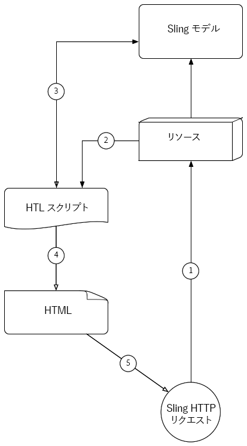
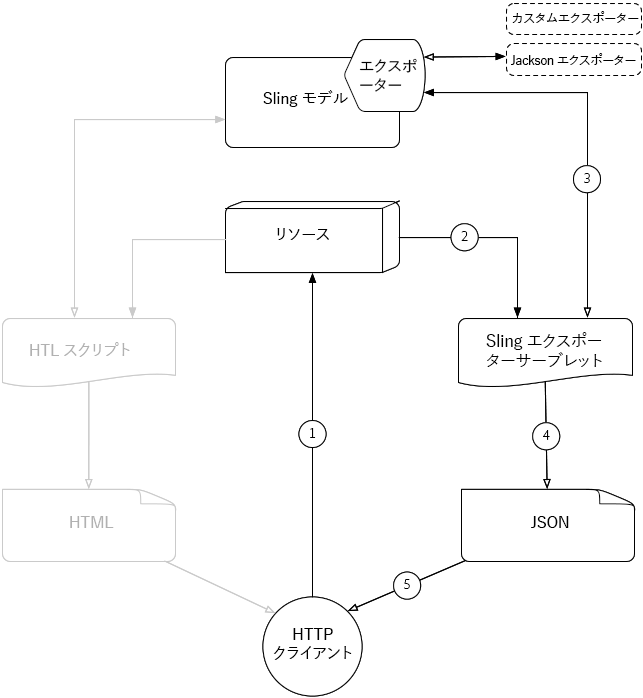

# [!DNL Sling Model Exporter]を理解

Apache [!DNL Sling Models] 1.3.0では、[!DNL Sling Model Exporter]オブジェクトをエクスポートまたはシリアル化してカスタムの抽象概念にするエレガントな方法が導入されています。 [!DNL Sling Model]この記事では、[!DNL Sling Models]を使用してHTLスクリプトを入力する従来の使用例と、[!DNL Sling Model Exporter]フレームワークを利用して[!DNL Sling Model]をJSONにシリアル化します。

## 従来のSlingモデルのHTTP要求フロー

[!DNL Sling Models]の従来の使用例は、HTLスクリプト（または、以前のJSP）とビジネス機能にアクセスするためのインターフェイスを提供する、リソースやリクエストのビジネス抽象化を提供することです。

一般的なパターンは、AEMのコンポーネントまたはページを表す[!DNL Sling Models]を開発し、[!DNL Sling Model]オブジェクトを使用してHTLスクリプトにデータを送り、ブラウザーに表示されるHTMLの結果を返しています。

### SlingモデルHTTP要求フロー

1. [!DNL HTTP GET] AEMでリソースのリクエストが行われました。

   例: `HTTP GET /content/my-resource.html`

1. リクエストリソースの`sling:resourceType`に基づいて、適切なスクリプトが解決されます。

1. スクリプトは、リクエストまたはリソースを目的の[!DNL Sling Model]に適合させます。

1. スクリプトは[!DNL Sling Model]オブジェクトを使用してHTMLレンダリングを生成します。

1. スクリプトによって生成されたHTMLがHTTP応答に返されます。

この従来のパターンはHTMLを生成する際にうまく機能します。[!DNL Sling Model]はHTLを使って簡単に利用できるからです。 JSONやXMLなど、構造化されたデータをより多く作成するのは、HTLが自然にこれらの形式の定義に役立つとは限らないので、はるかに退屈な作業です。

## [!DNL Sling Model Exporter] HTTP要求のフロー

Apache [!DNL Sling Model Exporter]には、Slingが提供するJackson Exporterが付属し、「通常の」[!DNL Sling Model]オブジェクトをJSONに自動的にシリアル化します。 Jackson Exporterは、極めて設定可能ですが、そのコアでは[!DNL Sling Model]オブジェクトを検査し、JSONキーとして「getter」メソッドを使用し、JSON値としてgetterの戻り値を生成します。

[!DNL Sling Models]を直接シリアル化すると、通常の[!DNL Sling Model]リクエストフロー（上記を参照）で作成されたHTML応答を使用して、両方の通常のWebリクエストに対応できますが、WebサービスやJavaScriptアプリケーションで使用できるJSONレンディションも公開されます。

*このフローは、提供されたJacksonエクスポーターを使用してJSON出力を生成するフローを説明します。カスタムエクスポーターの使用は、同じフローに従いますが、出力形式が使用されます。*

1. AEM内のリソースに対して、[!DNL Sling Model]のエクスポーターに登録されたセレクターと拡張子を持つHTTPGETリクエストが行われます。

   例: `HTTP GET /content/my-resource.model.json`

1. Slingは、要求されたリソースの`sling:resourceType`、セレクター、拡張を、動的に生成されるSling Exporterサーブレットに解決します。このサーブレットは、エクスポーターと共に[!DNL Sling Model]にマップされます。
1. 解決されたSling Exporterサーブレットは、（Slingモデルのアダプティブテーブルで決定される）要求またはリソースから適合された[!DNL Sling Model]オブジェクトに対して[!DNL Sling Model Exporter]を呼び出します。
1. エクスポーターは、エクスポーターオプションとエクスポーター固有のSlingモデルの注釈に基づいて[!DNL Sling Model]をシリアル化し、その結果をSlingエクスポーターサーブレットに返します。
1. Sling Exporterサーブレットは、[!DNL Sling Model]のJSONレンディションをHTTP応答に返します。

>[!NOTE]
>
>Apache Slingプロジェクトでは、[!DNL Sling Models]をJSONにシリアル化するJackson Exporterが提供されますが、エクスポーターフレームワークでは、カスタムエクスポーターもサポートされています。 例えば、プロジェクトで[!DNL Sling Model]をXMLにシリアル化するカスタムエクスポーターを実装できます。

>[!NOTE]
>
>[!DNL Sling Model Exporter] *serialize* [!DNL Sling Models]を行うだけでなく、Javaオブジェクトとして書き出すこともできます。 他のJavaオブジェクトへのエクスポートは、HTTPリクエストフローでは役割を果たさないので、上の図には表示されません。

## サポート資料

* [ApacheFramework [!DNL Sling Model Exporter] ドキュメント](https://sling.apache.org/documentation/bundles/models.html#exporter-framework-since-130)
