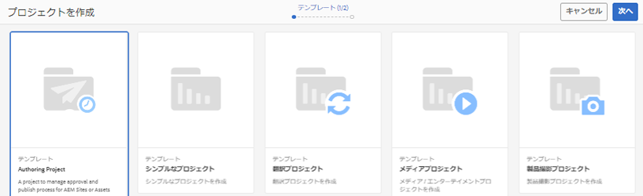
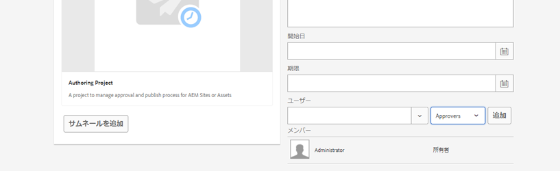
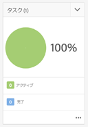
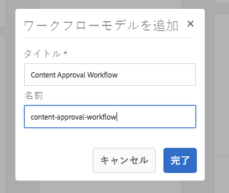

# AEMでのプロジェクトの開発

これは、[!DNL AEM Projects]の開発方法を示す開発チュートリアルです。  このチュートリアルでは、コンテンツオーサリングのワークフローとタスクを管理するためにAEM内で新しいプロジェクトを作成するために使用できるカスタムプロジェクトテンプレートを作成します。

>[!VIDEO](https://video.tv.adobe.com/v/16904/?quality=12&learn=on)

*このビデオでは、以下のチュートリアルで作成した、完了したワークフローの簡単なデモを提供します。*

## はじめに {#introduction}

[[!DNL AEM Projects]](https://helpx.adobe.com/experience-manager/6-5/sites/authoring/using/projects.html) はAEMの機能で、AEM SitesまたはAssets実装の一部として、コンテンツ作成に関連するすべてのワークフローとタスクを管理およびグループ化しやすくするように設計されています。

AEMプロジェクトには、複数の[OOTBプロジェクトテンプレート](https://helpx.adobe.com/experience-manager/6-5/sites/authoring/using/projects.html#ProjectTemplates)が付属しています。 作成者は、新しいプロジェクトを作成する際に、使用可能なテンプレートから選択できます。 独自のビジネス要件を持つ大規模なAEM実装では、ニーズに合わせてカスタマイズされたカスタムプロジェクトテンプレートを作成する必要があります。 カスタムプロジェクトテンプレートを作成することで、開発者は、プロジェクトダッシュボードの設定、カスタムワークフローへの接続、プロジェクトの追加のビジネスロールの作成をおこなうことができます。 プロジェクトテンプレートの構造を見て、サンプルを作成します。


## セットアップ

このチュートリアルでは、カスタムプロジェクトテンプレートを作成するために必要なコードを順を追って説明します。 チュートリアルに従うには、[添付のパッケージ](./assets/develop-aem-projects/projects-tasks-guide.ui.apps-0.0.1-SNAPSHOT.zip)をローカル環境にダウンロードしてインストールします。 [GitHub](https://github.com/Adobe-Marketing-Cloud/aem-guides/tree/feature/projects-tasks-guide)でホストされている完全なMavenプロジェクトにアクセスすることもできます。

* [終了したチュートリアルパッケージ](./assets/develop-aem-projects/projects-tasks-guide.ui.apps-0.0.1-SNAPSHOT.zip)
* [GitHubのフルコードリポジトリ](https://github.com/Adobe-Marketing-Cloud/aem-guides/tree/feature/projects-tasks-guide)

このチュートリアルでは、[AEM開発の実践](https://helpx.adobe.com/jp/experience-manager/6-5/sites/developing/using/the-basics.html)に関する基本的な知識と、[AEM Mavenプロジェクトの設定](https://helpx.adobe.com/jp/experience-manager/6-5/sites/developing/using/ht-projects-maven.html)に関する知識を前提としています。 前述のすべてのコードは参照として使用することを目的としており、[ローカル開発AEMインスタンス](https://helpx.adobe.com/experience-manager/6-5/sites/deploying/using/deploy.html#GettingStarted)にのみデプロイする必要があります。

## プロジェクトテンプレートの構造

プロジェクトテンプレートはソース管理下に置き、アプリケーションフォルダーの/apps下に置く必要があります。 これらは、***/projects/templates/**&lt;my-template>という命名規則でサブフォルダーに配置するのが理想的です。 この命名規則に従うと、作成者は、プロジェクトの作成時に新しいカスタムテンプレートを自動的に使用できるようになります。 使用可能なプロジェクトテンプレートの設定は、次の場所に設定されます。**/content/projects/jcr:content**&#x200B;ノードを&#x200B;**cq:allowedTemplates**&#x200B;プロパティで指定します。 デフォルトでは、次の正規表現が使用されます。**/(apps|libs)/.*/projects/templates/.***

プロジェクトテンプレートのルートノードには、**jcr:primaryType**&#x200B;が&#x200B;**cq:Template**&#x200B;になります。 のルートノードの下に、次の3つのノードがあります。**ガジェット**、**役割**、**ワークフロー**。 これらのノードはすべて&#x200B;**nt:unstructured**&#x200B;です。 また、ルートノードの下には、「プロジェクトを作成」ウィザードでテンプレートを選択したときに表示されるthumbnail.pngファイルを指定することもできます。

ノード構造全体：

```shell
/apps/<my-app>
    + projects (nt:folder)
         + templates (nt:folder)
              + <project-template-root> (cq:Template)
                   + gadgets (nt:unstructured)
                   + roles (nt:unstructured)
                   + workflows (nt:unstructured)
```

### プロジェクトテンプレートルート

プロジェクトテンプレートのルートノードのタイプは&#x200B;**cq:Template**&#x200B;になります。 このノードでは、プロジェクトの作成ウィザードに表示される&#x200B;**jcr:title**&#x200B;および&#x200B;**jcr:description**&#x200B;のプロパティを設定できます。 また、プロジェクトのプロパティを入力するフォームを指す&#x200B;**wizard**&#x200B;というプロパティもあります。 デフォルト値：**/libs/cq/core/content/projects/wizard/steps/defaultproject.html**&#x200B;は、基本的なプロジェクトプロパティを設定し、グループメンバーを追加できるので、ほとんどの場合に適しています。

**プロジェクトの作成ウィザードでは、SlingPOSTサーブレットを使用しません。代わりに、値がカスタムサーブレットにポストされます。**com.adobe.cq.probjects.impl.servlet.ProjectServlet**. カスタムフィールドを追加する際には、この点を考慮する必要があります。*

翻訳プロジェクトテンプレートのカスタムウィザードの例を次に示します。**/libs/cq/core/content/projects/wizard/translationproject/defaultproject**

### ガジェット {#gadgets}

このノードには追加のプロパティはありませんが、新しいプロジェクトの作成時にプロジェクトタイルがプロジェクトのダッシュボードに表示するガジェットノードの子は制御します。 [プロジェクトタイル](https://helpx.adobe.com/experience-manager/6-5/sites/authoring/using/projects.html#ProjectTiles) （ガジェットやポッドとも呼ばれます）は、プロジェクトの作業場に入力する簡単なカードです。標準タイルの完全なリストは、次の場所にあります。**/libs/cq/gui/components/projects/admin/pod **プロジェクトの所有者は、プロジェクトの作成後、常にタイルを追加/削除できます。

### 役割 {#roles}

各プロジェクトには、3つの[デフォルトの役割](https://helpx.adobe.com/experience-manager/6-5/sites/authoring/using/projects.html#UserRolesinaProject)があります。**Observers**、**Editors**、**Owners**。 ロールノードの下に子ノードを追加することで、テンプレートにビジネス固有のプロジェクトロールを追加できます。 その後、これらの役割を、プロジェクトに関連付けられた特定のワークフローに関連付けることができます。

### ワークフロー {#workflows}

カスタムプロジェクトテンプレートを作成する最も魅力的な理由の1つは、プロジェクトで使用可能なワークフローを設定できる点です。 OOTBワークフローやカスタムワークフローを使用できます。 **workflows**&#x200B;ノードの下に&#x200B;**models**&#x200B;ノード（また`nt:unstructured`）を配置し、その下に使用可能なワークフローモデルを指定する子ノードを配置する必要があります。 プロパティ**modelId **は/etc/workflowの下のワークフローモデルを指し、プロパティ&#x200B;**wizard**&#x200B;はワークフローの開始時に使用されるダイアログを指します。 プロジェクトの大きな利点は、ワークフローの開始時にカスタムダイアログ（ウィザード）を追加してビジネス固有のメタデータを取り込み、ワークフロー内でさらに多くのアクションを実行できることです。

```shell
<projects-template-root> (cq:Template)
    + workflows (nt:unstructured)
         + models (nt:unstructured)
              + <workflow-model> (nt:unstructured)
                   - modelId = points to the workflow model
                   - wizard = dialog used to start the workflow
```

## プロジェクトテンプレート{#creating-project-template}の作成

主にノードのコピー/設定を行うので、CRXDE Liteを使用します。 ローカルのAEMインスタンスで、[CRXDE Lite](http://localhost:4502/crx/de/index.jsp)を開きます。

1. まず、`/apps/&lt;your-app-folder&gt;`の下に`projects`という名前の新しいフォルダーを作成します。 その下に`templates`という名前の別のフォルダーを作成します。

   ```shell
   /apps/aem-guides/projects-tasks/
                       + projects (nt:folder)
                                + templates (nt:folder)
   ```

1. 作業を容易にするために、既存の単純なプロジェクトテンプレートからカスタムテンプレートを開始します。

   1. 手順1で作成した&#x200B;*templates*&#x200B;フォルダーの下にノード&#x200B;**/libs/cq/core/content/projects/templates/default**&#x200B;をコピーして貼り付けます。

   ```shell
   /apps/aem-guides/projects-tasks/
                + templates (nt:folder)
                     + default (cq:Template)
   ```

1. これで、**/apps/aem-guides/projects-tasks/projects/templates/authoring-project**&#x200B;のようなパスが作成されます。

   1. author-projectノードの&#x200B;**jcr:title**&#x200B;および&#x200B;**jcr:description**&#x200B;プロパティをカスタムのタイトルと説明の値に編集します。

      1. **wizard**&#x200B;プロパティは、デフォルトのプロジェクトプロパティを指すままにします。

   ```shell
   /apps/aem-guides/projects-tasks/projects/
            + templates (nt:folder)
                 + authoring-project (cq:Template)
                      - jcr:title = "Authoring Project"
                      - jcr:description = "A project to manage approval and publish process for AEM Sites or Assets"
                      - wizard = "/libs/cq/core/content/projects/wizard/steps/defaultproject.html"
   ```

1. このプロジェクトテンプレートでは、タスクを利用します。
   1. **tasks**&#x200B;という新しい&#x200B;**nt:unstructured**&#x200B;ノードをauthoring-project/gadgetsの下に追加します。
   1. **cardWeight** = &quot;100&quot;、**jcr:title**=&quot;Tasks&quot;、および&#x200B;**sling:resourceType**=&quot;cq/gui/components/admin/pod/taskpod&quot;のタスクノードにStringプロパティを追加します。

   これで、新しいプロジェクトの作成時に、[タスクタイル](https://docs.adobe.com/docs/en/aem/6-3/author/projects.html#Tasks)がデフォルトで表示されます。

   ```shell
   ../projects/templates/authoring-project
       + gadgets (nt:unstructured)
            + team (nt:unstructured)
            + asset (nt:unstructured)
            + work (nt:unstructured)
            + experiences (nt:unstructured)
            + projectinfo (nt:unstructured)
            ..
            + tasks (nt:unstructured)
                 - cardWeight = "100"
                 - jcr:title = "Tasks"
                 - sling:resourceType = "cq/gui/components/projects/admin/pod/taskpod"
   ```

1. カスタムの承認者の役割をプロジェクトテンプレートに追加します。

   1. プロジェクトテンプレート(authoring-project)ノードの下に、**roles**&#x200B;というラベルの付いた新しい&#x200B;**nt:unstructured**&#x200B;ノードを追加します。
   1. 承認者というラベルの付いた別の&#x200B;**nt:unstructured**&#x200B;ノードを役割ノードの子として追加します。
   1. 文字列プロパティ&#x200B;**jcr:title** = &quot;**Approvers**&quot;, **roleclass** =&quot;**owner**&quot;, **roleid**=&quot;**approvers**&quot;を追加します。
      1. 承認者ノードの名前、およびjcr:titleとroleidは、任意の文字列値にすることができます（roleidが一意である限り）。
      1. **** roleclassは、3つのOOTBロール(https://docs.adobe.com/docs/en/aem/6-3/author/projects.html#Userプロジェクト内のロ [ール)に基づいて、そのロールに適用される権限を管理します]。 **所有者**、 **編集者**、監視 **者**。
      1. 一般的に、カスタムロールが管理ロールの方が多い場合は、ロールクラスを&#x200B;**所有者にできます。**&#x200B;それがフォトグラファーやデザイナーのようなより具体的なオーサリングロールの場合は、**editor**&#x200B;ロールクラスで十分です。 **owner**&#x200B;と&#x200B;**editor**&#x200B;の大きな違いは、プロジェクトの所有者がプロジェクトのプロパティを更新し、新しいユーザーをプロジェクトに追加できる点です。

   ```shell
   ../projects/templates/authoring-project
       + gadgets (nt:unstructured)
       + roles (nt:unstructured)
           + approvers (nt:unstructured)
                - jcr:title = "Approvers"
                - roleclass = "owner"
                - roleid = "approver"
   ```

1. シンプルなプロジェクトテンプレートをコピーすると、4つのOOTBワークフローが設定されます。 ワークフロー/モデルの下の各ノードは、特定のワークフローと、そのワークフローの開始ダイアログウィザードを指します。 このチュートリアルの後半で、このプロジェクトのカスタムワークフローを作成します。 ここでは、ワークフロー/モデルの下のノードを削除します。

   ```shell
   ../projects/templates/authoring-project
       + gadgets (nt:unstructured)
       + roles (nt:unstructured)
       + workflows (nt:unstructured)
            + models (nt:unstructured)
               - (remove ootb models)
   ```

1. コンテンツ作成者がプロジェクトテンプレートを識別しやすくするために、カスタムサムネールを追加できます。 推奨サイズは319 x 319ピクセルです。
   1. CRXDE Liteで、**thumbnail.png**&#x200B;という名前のガジェット、役割、およびワークフローノードの兄弟として新しいファイルを作成します。
   1. 保存して`jcr:content`ノードに移動し、`jcr:data`プロパティをダブルクリックします（「表示」をクリックしないでください）。
      1. `jcr:data`ファイルを編集ダイアログが表示され、カスタムサムネールをアップロードできます。

   ```shell
   ../projects/templates/authoring-project
       + gadgets (nt:unstructured)
       + roles (nt:unstructured)
       + workflows (nt:unstructured)
       + thumbnail.png (nt:file)
   ```

プロジェクトテンプレートの完成したXML表現：

```xml
<?xml version="1.0" encoding="UTF-8"?>
<jcr:root xmlns:sling="http://sling.apache.org/jcr/sling/1.0" xmlns:cq="http://www.day.com/jcr/cq/1.0" xmlns:jcr="http://www.jcp.org/jcr/1.0" xmlns:nt="http://www.jcp.org/jcr/nt/1.0"
    jcr:description="A project to manage approval and publish process for AEM Sites or Assets"
    jcr:primaryType="cq:Template"
    jcr:title="Authoring Project"
    ranking="{Long}1"
    wizard="/libs/cq/core/content/projects/wizard/steps/defaultproject.html">
    <jcr:content
        jcr:primaryType="nt:unstructured"
        detailsHref="/projects/details.html"/>
    <gadgets jcr:primaryType="nt:unstructured">
        <team
            jcr:primaryType="nt:unstructured"
            jcr:title="Team"
            sling:resourceType="cq/gui/components/projects/admin/pod/teampod"
            cardWeight="60"/>
        <tasks
            jcr:primaryType="nt:unstructured"
            jcr:title="Tasks"
            sling:resourceType="cq/gui/components/projects/admin/pod/taskpod"
            cardWeight="100"/>
        <work
            jcr:primaryType="nt:unstructured"
            jcr:title="Workflows"
            sling:resourceType="cq/gui/components/projects/admin/pod/workpod"
            cardWeight="80"/>
        <experiences
            jcr:primaryType="nt:unstructured"
            jcr:title="Experiences"
            sling:resourceType="cq/gui/components/projects/admin/pod/channelpod"
            cardWeight="90"/>
        <projectinfo
            jcr:primaryType="nt:unstructured"
            jcr:title="Project Info"
            sling:resourceType="cq/gui/components/projects/admin/pod/projectinfopod"
            cardWeight="100"/>
    </gadgets>
    <roles jcr:primaryType="nt:unstructured">
        <approvers
            jcr:primaryType="nt:unstructured"
            jcr:title="Approvers"
            roleclass="owner"
            roleid="approvers"/>
    </roles>
    <workflows
        jcr:primaryType="nt:unstructured"
        tags="[]">
        <models jcr:primaryType="nt:unstructured">
        </models>
    </workflows>
</jcr:root>
```

## カスタムプロジェクトテンプレートのテスト

次に、新しいプロジェクトを作成して、プロジェクトテンプレートをテストします。

1. カスタムテンプレートは、プロジェクト作成のオプションの1つとして表示されます。

   

1. カスタムテンプレートを選択したら、「次へ」をクリックし、プロジェクトメンバーを入力する際に、承認者の役割として追加できることに注意してください。

   

1. 「作成」をクリックして、カスタムテンプレートに基づくプロジェクトの作成を終了します。 プロジェクトダッシュボードに、タスクタイルと、ガジェットの下に構成された他のタイルが自動的に表示されます。

   


## ワークフローを選択する理由

従来、承認プロセスを中心とするAEMワークフローでは、参加者ワークフローステップを使用していました。 AEM Inboxには、タスクとワークフローに関する詳細が含まれ、AEM Projectsとの統合が強化されました。 これらの機能は、プロジェクトタスクを作成プロセスステップを使用する方がより魅力的なオプションです。

### タスクを選択する理由

従来の参加者ステップと比較してタスク作成ステップを使用すると、次のような利点があります。

* **開始日と期限**  — 作成者が時間を簡単に管理できる、新しいカレンダー機能でこれらの日付を利用できます。
* **優先度**  — 低、標準、高の優先度を組み込むことで、作成者は作業を優先順位付けできます
* **スレッド化されたコメント**  — 作成者はタスクに対して作業を行い、コメントを残して共同作業を増やすことができます。
* **表示**  — プロジェクトを含むタスクタイルとビューを使用すると、マネージャーは時間の経過を確認できます
* **プロジェクトの統合**  — タスクは既にプロジェクトの役割およびダッシュボードと統合されています

参加者ステップと同様に、タスクを動的に割り当てたり、ルーティングしたりできます。 タイトル、優先度などのタスクメタデータも、次のチュートリアルで説明するように、以前のアクションに基づいて動的に設定できます。

タスクには、参加者ステップに比べていくつかの利点がありますが、追加のオーバーヘッドを伴い、プロジェクト以外では役に立ちません。 さらに、タスクのすべての動的動作は、独自の制限を持つecmaスクリプトを使用してコーディングする必要があります。

## 使用例の要件{#goals-tutorial}の例


上の図は、サンプルの承認ワークフローの要件の概要を示しています。

最初の手順は、コンテンツの一部の編集を終了するタスクを作成することです。 ワークフロー開始者がこの最初のタスクの担当者を選択できるようにします。

最初のタスクが完了すると、担当者はワークフローをルーティングする3つのオプションを持ちます。

**通常のルーティング** — 通常のルーティングでは、レビューおよび承認を行うために、プロジェクトの承認者グループに割り当てられたタスクが作成されます。 タスクの優先順位は「標準」で、期限は作成日から5日間です。

**ラッシュ**  — ラッシュルーティングでは、プロジェクトの承認者グループに割り当てられたタスクも作成されます。タスクの優先順位は「高」で、期限は1日のみです。

**バイパス**  — このサンプルワークフローでは、最初の参加者は承認グループをバイパスするオプションがあります。（「承認」ワークフローの目的を破る可能性がありますが、追加のルーティング機能を説明できます）

承認者グループは、コンテンツを承認するか、最初の担当者に返して再作業を行うことができます。 再作業用に送り返される場合は、新しいタスクが作成され、適切に「再作業用に送り返す」というラベルが付けられます。

ワークフローの最後の手順では、「ページ/アセットをアクティブ化」プロセスステップを利用し、ペイロードを複製します。

## ワークフローモデルの作成

1. AEM Startメニューで、ツール/ワークフロー/モデルに移動します。 右上隅の「作成」をクリックして、新しいワークフローモデルを作成します。

   新しいモデルにタイトルを付けます。「コンテンツ承認ワークフロー」およびURL名：&quot;content-approval-workflow&quot;と入力します。

   

   [ワークフローの作成に関する詳細は、](https://helpx.adobe.com/experience-manager/6-5/sites/developing/using/workflows-models.html)を参照してください。

1. ベストプラクティスとして、カスタムワークフローは、 /etc/workflow/modelsの下の独自のフォルダーにグループ化する必要があります。 CRXDE Liteで、/etc/workflow/modelsの下に&#x200B;**&#39;nt:folder&#39;**&#x200B;という名前の新しい&#x200B;**&quot;aem-guides&quot;**&#x200B;を作成します。 サブフォルダーを追加することで、アップグレード時やService Packのインストール時にカスタムワークフローが誤って上書きされるのを防ぎます。

   *サブフォルダー全体がアップグレードやサービスパックによって上書きされる可能性があるので、フォルダーやカスタムワークフローをootbサブフォルダーの下に配置しないことが重要です。

   

   6.3でのワークフローモデルの場所

   >[!NOTE]
   >
   >AEM 6.4以降を使用している場合、ワークフローの場所が変更されました。 詳しくは[を参照してください。](https://helpx.adobe.com/experience-manager/6-5/sites/developing/using/workflows-best-practices.html#LocationsWorkflowModels)

   AEM 6.4以降を使用している場合、ワークフローモデルは`/conf/global/settings/workflow/models`の下に作成されます。 上記の手順を/confディレクトリで繰り返し、`aem-guides`という名前のサブフォルダーを追加して、その下に`content-approval-workflow`を移動します。

   
ロー定義location6.4以降のワークフローモデルの場所

1. AEM 6.3で導入された機能は、特定のワークフローにワークフローステージを追加する機能です。 ステージは、「ワークフロー情報」タブのインボックスからユーザーに表示されます。 ワークフローの現在のステージと、その前後のステージが表示されます。

   ステージを設定するには、サイドキックからページのプロパティダイアログを開きます。 4番目のタブには、「ステージ」というラベルが付いています。 このワークフローの3つのステージを設定するには、次の値を追加します。

   1. コンテンツの編集
   1. 承認
   1. 公開

   

   ページのプロパティダイアログでワークフローステージを設定します。

   

   AEMインボックスに表示されるワークフローの進行状況バー。

   必要に応じて、ユーザーが選択したときにワークフローサムネールとして使用される&#x200B;**画像**&#x200B;をページプロパティにアップロードできます。 画像のサイズは319 x 319ピクセルにする必要があります。 ユーザーがワークフローを選択すると、ページプロパティに&#x200B;**説明**&#x200B;を追加することも表示されます。

1. プロジェクトタスクを作成ワークフロープロセスは、タスクをワークフローのステップとして作成するように設計されています。 タスクが完了した後にのみ、ワークフローが次に進みます。 プロジェクトタスクを作成ステップの強力な側面は、ワークフローのメタデータ値を読み取り、それらを使用してタスクを動的に作成できる点です。

   最初に、デフォルトで作成される参加者ステップを削除します。 コンポーネントメニューのサイドキックから、「**」「プロジェクト」「**」サブ見出しを展開し、「**」「プロジェクトタスクを作成」「**」をモデルにドラッグ&amp;ドロップします。

   「プロジェクトタスクを作成」の手順をダブルクリックして、ワークフローダイアログを開きます。 以下のプロパティを設定します。

   このタブは、すべてのワークフロープロセスステップで共通で、「タイトル」と「説明」を設定します（エンドユーザーには表示されません）。 設定する重要なプロパティは、ドロップダウンメニューから「ワークフローステージ」を「**コンテンツを編集」**&#x200B;にします。

   ```shell
   Common Tab
   -----------------
       Title = "Start Task Creation"
       Description = "This the first task in the Workflow"
       Workflow Stage = "Edit Content"
   ```

   プロジェクトタスクを作成ワークフロープロセスは、タスクをワークフローのステップとして作成するように設計されています。 「タスク」タブでは、タスクのすべての値を設定できます。 この場合、担当者を動的にして、空白のままにします。 残りのプロパティ値は次のとおりです。

   ```shell
   Task Tab
   -----------------
       Name* = "Edit Content"
       Task Priority = "Medium"
       Description = "Edit the content and finalize for approval. Once finished submit for approval."
       Due In - Days = "2"
   ```

   「ルーティング」タブは、タスクを完了するユーザーに対して使用可能なアクションを指定できるオプションのダイアログです。 これらのアクションは文字列値に過ぎず、ワークフローのメタデータに保存されます。 これらの値は、スクリプトや後のプロセスステップで読み取り、ワークフローを動的に「ルーティング」することができます。 [ワークフローの目標](#goals-tutorial)に基づいて、このタブに3つのアクションを追加します。

   ```shell
   Routing Tab
   -----------------
       Actions =
           "Normal Approval"
           "Rush Approval"
           "Bypass Approval"
   ```

   このタブでは、作成前のタスクスクリプトを設定し、作成前のタスクの様々な値をプログラムで決定できます。 スクリプトを外部ファイルに向けるか、ダイアログに直接短いスクリプトを埋め込むかの選択が可能です。 この例では、事前作成タスクスクリプトを外部ファイルに指します。 手順5で、そのスクリプトを作成します。

   ```shell
   Advanced Settings Tab
   -----------------
      Pre-Create Task Script = "/apps/aem-guides/projects/scripts/start-task-config.ecma"
   ```

1. 前の手順では、作成前のタスクスクリプトを参照しました。 ここで、ワークフローメタデータ値「**担当者**」の値に基づいてタスクの担当者を設定するスクリプトを作成します。 ワークフローがキックオフされると、 **&quot;assignee&quot;**&#x200B;値が設定されます。 また、ワークフローメタデータを読み取り、ワークフローのメタデータの「**taskPriority&quot;**」値と、最初のタスクの期限が来たときに動的に設定される「**」taskDueDate**」値を読み取って、タスクの優先度を動的に選択します。

   組織のために、アプリフォルダーの下にフォルダーを作成し、プロジェクト関連のすべてのスクリプトを格納します。**/apps/aem-guides/projects-tasks/projects/scripts**&#x200B;に置き換えます。 このフォルダーの下に、**&quot;start-task-config.ecma&quot;**&#x200B;という名前の新しいファイルを作成します。 *start-task-config.ecmaファイルへのパスが、手順4の「詳細設定」タブで設定したパスと一致することを確認してください。

   ファイルのコンテンツとして次を追加します。

   ```
   // start-task-config.ecma
   // Populate the task using values stored as workflow metadata originally posted by the start workflow wizard
   
   // set the assignee based on start workflow wizard
   var assignee = workflowData.getMetaDataMap().get("assignee", Packages.java.lang.String);
   task.setCurrentAssignee(assignee);
   
   //Set the due date for the initial task based on start workflow wizard
   var dueDate = workflowData.getMetaDataMap().get("taskDueDate", Packages.java.util.Date);
   if (dueDate != null) {
       task.setProperty("taskDueDate", dueDate);
   }
   
   //Set the priority based on start workflow wizard
   var taskPriority = workflowData.getMetaDataMap().get("taskPriority", "Medium");
   task.setProperty("taskPriority", taskPriority);
   ```

1. コンテンツ承認ワークフローに戻ります。 **OR分割**&#x200B;コンポーネント（サイドキックの「ワークフロー」カテゴリにある）を&#x200B;**タスクを開始**&#x200B;ステップの下にドラッグ&amp;ドロップします。 [共通ダイアログ]で、[3ブランチ]のラジオボタンを選択します。 OR分割は、ワークフローのルートを決定するために、ワークフローメタデータ値&#x200B;**&quot;lastTaskAction&quot;**&#x200B;を読み取ります。 **&quot;lastTaskAction&quot;**&#x200B;プロパティは、手順4で設定した「ルーティング」タブの値の1つに設定されます。 「ブランチ」タブごとに、次の値を持つ&#x200B;**スクリプト**&#x200B;テキスト領域に入力します。

   ```
   function check() {
   var lastAction = workflowData.getMetaDataMap().get("lastTaskAction","");
   
   if(lastAction == "Normal Approval") {
       return true;
   }
   
   return false;
   }
   ```

   ```
   function check() {
   var lastAction = workflowData.getMetaDataMap().get("lastTaskAction","");
   
   if(lastAction == "Rush Approval") {
       return true;
   }
   
   return false;
   }
   ```

   ```
   function check() {
   var lastAction = workflowData.getMetaDataMap().get("lastTaskAction","");
   
   if(lastAction == "Bypass Approval") {
       return true;
   }
   
   return false;
   }
   ```

   注意：ルートを決定するために、直接の文字列の一致を行っているので、ブランチスクリプトに設定された値が手順4で設定されたルート値と一致することが重要です。

1. 別の「**プロジェクトタスクを作成**」ステップをOR分割の下の左端（ブランチ1）のモデルにドラッグ&amp;ドロップします。 次のプロパティを指定してダイアログに入力します。

   ```
   Common Tab
   -----------------
       Title = "Approval Task Creation"
       Description = "Create a an approval task for Project Approvers. Priority is Medium."
       Workflow Stage = "Approval"
   
   Task Tab
   ------------
       Name* = "Approve Content for Publish"
       Task Priority = "Medium"
       Description = "Approve this content for publication."
       Days = "5"
   
   Routing Tab - Actions
   ----------------------------
       "Approve and Publish"
       "Send Back for Revision"
   ```

   これは通常の承認ルートなので、タスクの優先度は「中」に設定されます。 さらに、承認者グループに5日間タスクを完了させます。 「詳細設定」タブで動的に割り当てるので、「タスク」タブで担当者は空白のままにします。 このタスクを完了する際に、承認者グループに2つのルートを指定します。**&quot;承認して公開&quot;**&#x200B;コンテンツを承認し、公開できる場合は、元のエディターで修正が必要な問題がある場合は、**&quot;リビジョンの返送&quot;**&#x200B;を行います。 承認者は、元の編集者にワークフローが返されたかどうかを確認するコメントを残すことができます。

このチュートリアルでは、承認者の役割を含むプロジェクトテンプレートを作成しました。 このテンプレートから新しいプロジェクトが作成されるたびに、承認者の役割用にプロジェクト固有のグループが作成されます。 参加者ステップと同様に、タスクはユーザーまたはグループにのみ割り当てることができます。 このタスクを、承認者グループに対応するプロジェクトグループに割り当てます。 プロジェクト内から起動されるすべてのワークフローには、プロジェクトの役割をプロジェクト固有のグループにマッピングするメタデータが含まれます。

次のコードを「**詳細設定**」タブの&#x200B;**スクリプト**&#x200B;テキスト領域にコピー&amp;ペーストします。 このコードは、ワークフローのメタデータを読み取り、タスクをプロジェクトの承認者グループに割り当てます。 承認者グループの値が見つからない場合は、タスクをAdministratorsグループに割り当てることに戻ります。

```
var projectApproverGrp = workflowData.getMetaDataMap().get("project.group.approvers","administrators");

task.setCurrentAssignee(projectApproverGrp);
```

1. 別の「**プロジェクトタスクを作成**」ステップをOR分割の下の中央の分岐（分岐2）にドラッグ&amp;ドロップします。 次のプロパティを指定してダイアログに入力します。

   ```
   Common Tab
   -----------------
       Title = "Rush Approval Task Creation"
       Description = "Create a an approval task for Project Approvers. Priority is High."
       Workflow Stage = "Approval"
   
   Task Tab
   ------------
       Name* = "Rush Approve Content for Publish"
       Task Priority = "High"
       Description = "Rush approve this content for publication."
       Days = "1"
   
   Routing Tab - Actions
   ----------------------------
       "Approve and Publish"
       "Send Back for Revision"
   ```

   これはラッシュの承認ルートなので、タスクの優先度は「高」に設定されます。 さらに、承認者グループには1日だけタスクを完了するように指定します。 「詳細設定」タブで動的に割り当てるので、「タスク」タブで担当者は空白のままにします。

   手順7と同じスクリプトスニペットを再利用して、「**詳細設定**」タブの&#x200B;**スクリプト**&#x200B;テキスト領域に入力できます。 次のコードをコピー&amp;ペーストします。

   ```
   var projectApproverGrp = workflowData.getMetaDataMap().get("project.group.approvers","administrators");
   
   task.setCurrentAssignee(projectApproverGrp);
   ```

1. 右端の分岐（分岐3）に**操作なし**コンポーネントをドラッグ&amp;ドロップします。 操作なしコンポーネントは何も実行せず、即座に進行し、元の編集者が承認手順をスキップしたいという気持ちを表します。 技術的には、ワークフローステップなしでこのブランチを終了できますが、ベストプラクティスとして、操作なしのステップを追加します。 これにより、他の開発者に対して、ブランチ3の目的が何かが明確になります。

   ワークフローの手順をダブルクリックし、「タイトル」と「説明」を設定します。

   ```
   Common Tab
   -----------------
       Title = "Bypass Approval"
       Description = "Placeholder step to indicate that the original editor decided to bypass the approver group."
   ```

   

   OR分割の3つのブランチすべてが設定されたら、ワークフローモデルは次のようになります。

1. 承認者グループには、さらにリビジョンを受け取るために元のエディターにワークフローを送り返すオプションがあるので、最後に実行されたアクションを読み取り、ワークフローを先頭にルーティングするか、続行させます。 ****

   OR分割の下のサイドキックにある移動ステップコンポーネント（ワークフローの下の）を、再結合位置にドラッグ&amp;ドロップします。 ダブルクリックし、ダイアログで次のプロパティを設定します。

   ```
   Common Tab
   ----------------
       Title = "Goto Step"
       Description = "Based on the Approver groups action route the workflow to the beginning or continue and publish the payload."
   
   Process Tab
   ---------------
       The step to go to. = "Start Task Creation"
   ```

   最後に設定するのは、移動プロセスステップの一部としてのスクリプトです。 スクリプト値は、ダイアログを使用して埋め込むことも、外部ファイルを指すように設定することもできます。 移動スクリプトには、**関数check()**&#x200B;が含まれている必要があり、ワークフローが指定のステップに進む必要がある場合はtrueを返します。 ワークフローが次に進むと、falseの結果が返されます。

   承認者グループが「**リビジョン用に送り返す」**&#x200B;アクション（手順7と8で設定）を選択した場合、ワークフローを「**タスクの作成を開始」**&#x200B;ステップに戻します。

   「プロセス」タブで、スクリプトのテキスト領域に次のスニペットを追加します。

   ```
   function check() {
   var lastAction = workflowData.getMetaDataMap().get("lastTaskAction","");
   
   if(lastAction == "Send Back for Revision") {
       return true;
   }
   
   return false;
   }
   ```

1. ペイロードを公開するには、「**ページ/アセットをアクティブ化** 」プロセスステップを使用します。 このプロセス手順では、設定はほとんど必要なく、アクティベーション用にワークフローのペイロードをレプリケーションキューに追加します。 承認者グループが公開用のコンテンツを承認した場合、または元のエディターが承認のバイパスルートを選択した場合にのみ、移動ステップの下に手順を追加します。

   モデルの移動ステップの下のサイドキックにある「**ページ/アセットをアクティベート**&#x200B;プロセス」ステップをドラッグ&amp;ドロップします。

   

   移動ステップおよびページ/アセットをアクティブ化ステップを追加した後のワークフローモデルの表示

1. 承認者グループがリビジョン用にコンテンツを返信する場合は、元の編集者に通知します。 これは、タスク作成プロパティを動的に変更することで実現できます。 **&quot;Send Back for Revision&quot;**&#x200B;のlastActionTakenプロパティ値のキーはオフにします。 その値が存在する場合は、タイトルと説明を変更して、このタスクがリビジョン用に送り返されたコンテンツの結果であることを示します。 また、優先度を&#x200B;**&quot;High&quot;**&#x200B;に更新し、エディターが最初に操作する項目にします。 最後に、ワークフローがリビジョン用に送り返された日から1日後に、タスクの期限を設定します。

   （手順5で作成した）start `start-task-config.ecma`スクリプトを次のように置き換えます。

   ```
   // start-task-config.ecma
   // Populate the task using values stored as workflow metadata originally posted by the start workflow wizard
   
   // set the assignee based on start workflow wizard
   var assignee = workflowData.getMetaDataMap().get("assignee", Packages.java.lang.String);
   task.setCurrentAssignee(assignee);
   
   //Set the due date for the initial task based on start workflow wizard
   var dueDate = workflowData.getMetaDataMap().get("taskDueDate", Packages.java.util.Date);
   if (dueDate != null) {
       task.setProperty("taskDueDate", dueDate);
   }
   
   //Set the priority based on start workflow wizard
   var taskPriority = workflowData.getMetaDataMap().get("taskPriority", "Medium");
   task.setProperty("taskPriority", taskPriority);
   
   var lastAction = workflowData.getMetaDataMap().get("lastTaskAction","");
   
   //change the title and priority if the approver group sent back the content
   if(lastAction == "Send Back for Revision") {
     var taskName = "Review and Revise Content";
   
     //since the content was rejected we will set the priority to High for the revison task
     task.setProperty("taskPriority", "High"); 
   
     //set the Task name (displayed as the task title in the Inbox) 
     task.setProperty("name", taskName);
     task.setProperty("nameHierarchy", taskName);
   
     //set the due date of this task 1 day from current date
     var calDueDate = Packages.java.util.Calendar.getInstance();
     calDueDate.add(Packages.java.util.Calendar.DATE, 1);
     task.setProperty("taskDueDate", calDueDate.getTime());
   
   }
   ```

## 「ワークフローを開始」ウィザード{#start-workflow-wizard}を作成します

プロジェクト内からワークフローを開始する場合は、ワークフローを開始するウィザードを指定する必要があります。 デフォルトのウィザード：`/libs/cq/core/content/projects/workflowwizards/default_workflow`を使用すると、実行するワークフローのタイトル、開始コメント、ペイロードパスをユーザーが入力できます。 その他の例も以下に示します。`/libs/cq/core/content/projects/workflowwizards`.

ワークフローを開始する前に重要な情報を収集できるので、カスタムウィザードの作成は非常に強力です。 データはワークフローのメタデータの一部として保存され、ワークフロープロセスはこの読み取りを行い、入力された値に基づいて動的に動作を変更します。 カスタムウィザードを作成し、開始ウィザードの値に基づいて、ワークフロー内の最初のタスクを動的に割り当てます。

1. CRXDE Liteでは、`/apps/aem-guides/projects-tasks/projects`フォルダーの下に「wizards」というサブフォルダーを作成します。 次の場所からデフォルトのウィザードをコピーします。`/libs/cq/core/content/projects/workflowwizards/default_workflow`を新しく作成したウィザードフォルダーの下に置き、名前を&#x200B;**content-approval-start**&#x200B;に変更します。 完全パスは次のようになります。`/apps/aem-guides/projects-tasks/projects/wizards/content-approval-start`.

   デフォルトのウィザードは2列のウィザードで、最初の列にワークフローモデルのタイトル、説明、サムネールが選択されています。 2番目の列には、「ワークフローのタイトル」、「開始コメント」、「ペイロードパス」の各フィールドが含まれます。 ウィザードは標準のタッチUIフォームで、標準の[Granite UIフォームコンポーネント](https://docs.adobe.com/docs/en/aem/6-5/develop/ref/granite-ui/api/jcr_root/libs/granite/ui/components/coral/foundation/form/index.html)を使用してフィールドに入力します。

   

1. ウィザードにフィールドを追加します。このフィールドを使用して、ワークフローの最初のタスクの担当者を設定します（[ワークフローモデルの作成](#create-workflow-model)を参照）。手順5)。

   `../content-approval-start/jcr:content/items/column2/items`の下に、**&quot;assign&quot;**&#x200B;という名前の新しいノードを作成します。 `nt:unstructured`プロジェクトユーザーピッカーコンポーネント（[Graniteユーザーピッカーコンポーネント](https://docs.adobe.com/docs/en/aem/6-5/develop/ref/granite-ui/api/jcr_root/libs/granite/ui/components/coral/foundation/form/userpicker/index.html)に基づく）を使用します。 このフォームフィールドを使用すると、ユーザーとグループの選択を、現在のプロジェクトに属するユーザーのみに制限することが簡単にできます。

   以下は、**assign**&#x200B;ノードのXML表現です。

   ```xml
   <assign
       granite:class="js-cq-project-user-picker"
       jcr:primaryType="nt:unstructured"
       sling:resourceType="cq/gui/components/projects/admin/userpicker"
       fieldLabel="Assign To"
       hideServiceUsers="{Boolean}true"
       impersonatesOnly="{Boolean}true"
       showOnlyProjectMembers="{Boolean}true"
       name="assignee"
       projectPath="${param.project}"
       required="{Boolean}true"/>
   ```

1. また、ワークフローの最初のタスクの優先度を決定する優先度選択フィールドも追加します（[ワークフローモデルの作成](#create-workflow-model)を参照）。手順5)。

   `/content-approval-start/jcr:content/items/column2/items`の下に、**priority**&#x200B;という名前の新しいノードを作成します。 `nt:unstructured`[Granite UIコンポーネント](https://docs.adobe.com/docs/en/aem/6-2/develop/ref/granite-ui/api/jcr_root/libs/granite/ui/components/coral/foundation/form/select/index.html)を使用して、フォームフィールドに入力します。

   **priority**&#x200B;ノードの下に、**nt:unstructured**&#x200B;の&#x200B;**items**&#x200B;ノードを追加します。 **items**&#x200B;ノードの下に、3つのノードを追加して、「高」、「中」、「低」の選択オプションを設定します。 各ノードのタイプは&#x200B;**nt:unstructured**&#x200B;で、**text**&#x200B;と&#x200B;**value**&#x200B;プロパティを持つ必要があります。 テキストと値の両方が同じ値である必要があります。

   1. 高
   1. 中
   1. 低

   Mediumノードに、値を&#x200B;**true**&#x200B;に設定して、&quot;**selected&quot;**&#x200B;という名前の追加のBooleanプロパティを追加します。 これにより、選択フィールドのデフォルト値が「中」になります。

   以下に、ノード構造とプロパティのXML表現を示します。

   ```xml
   <priority
       jcr:primaryType="nt:unstructured"
       sling:resourceType="granite/ui/components/coral/foundation/form/select"
       fieldLabel="Task Priority"
       name="taskPriority">
           <items jcr:primaryType="nt:unstructured">
               <high
                   jcr:primaryType="nt:unstructured"
                   text="High"
                   value="High"/>
               <medium
                   jcr:primaryType="nt:unstructured"
                   selected="{Boolean}true"
                   text="Medium"
                   value="Medium"/>
               <low
                   jcr:primaryType="nt:unstructured"
                   text="Low"
                   value="Low"/>
               </items>
   </priority>
   ```

1. ワークフロー開始者が最初のタスクの期限を設定できるようにします。 この入力を取り込むには、[Granite UI DatePicker](https://docs.adobe.com/docs/en/aem/6-5/develop/ref/granite-ui/api/jcr_root/libs/granite/ui/components/coral/foundation/form/datepicker/index.html)フォームフィールドを使用します。 また、[TypeHint](https://sling.apache.org/documentation/bundles/manipulating-content-the-slingpostservlet-servlets-post.html#typehint)を含む非表示フィールドを追加し、入力がJCRのDateタイププロパティとして保存されるようにします。

   XMLで以下に示すプロパティを持つ&#x200B;**nt:unstructured**&#x200B;ノードを2つ追加します。

   ```xml
   <duedate
       granite:rel="project-duedate"
       jcr:primaryType="nt:unstructured"
       sling:resourceType="granite/ui/components/coral/foundation/form/datepicker"
       displayedFormat="YYYY-MM-DD HH:mm"
       fieldLabel="Due Date"
       minDate="today"
       name="taskDueDate"
       type="datetime"/>
   <duedatetypehint
       jcr:primaryType="nt:unstructured"
       sling:resourceType="granite/ui/components/coral/foundation/form/hidden"
       name="taskDueDate@TypeHint"
       type="datetime"
       value="Calendar"/>
   ```

1. ここで[](https://github.com/Adobe-Marketing-Cloud/aem-guides/blob/master/projects-tasks-guide/ui.apps/src/main/content/jcr_root/apps/aem-guides/projects-tasks/projects/wizards/content-approval-start/.content.xml)にウィザードの起動ダイアログの完全なコードを表示できます。

## ワークフローとプロジェクトテンプレートの接続{#connecting-workflow-project}

最後に実行する必要があるのは、ワークフローモデルを1つのプロジェクト内から確実にキックオフできるようにすることです。 これをおこなうには、このシリーズのパート1で作成したプロジェクトテンプレートに再度アクセスする必要があります。

ワークフロー設定は、そのプロジェクトで使用できるワークフローを指定する、プロジェクトテンプレートの領域です。 この設定は、（前の手順で作成した）ワークフローをキックオフする際に、ワークフローを開始ウィザード([)](#start-workflow-wizard)を指定する役割も果たします。 プロジェクトテンプレートのワークフロー設定は「ライブ」です。つまり、ワークフロー設定を更新すると、新しく作成されたプロジェクトと、そのテンプレートを使用する既存のプロジェクトに影響が及びます。

1. CRXDE-Liteで、`/apps/aem-guides/projects-tasks/projects/templates/authoring-project/workflows/models`で作成したオーサリングプロジェクトテンプレートに移動します。

   modelsノードの下に、**contentapproval**&#x200B;という名前の新しいノードを追加し、ノードタイプ&#x200B;**nt:unstructured**&#x200B;を持ちます。 この  ノードに次のプロパティを追加します。

   ```xml
   <contentapproval
       jcr:primaryType="nt:unstructured"
       modelId="/etc/workflow/models/aem-guides/content-approval-workflow/jcr:content/model"
       wizard="/apps/aem-guides/projects-tasks/projects/wizards/content-approval-start.html"
   />
   ```

   >[!NOTE]
   >
   >AEM 6.4を使用している場合、ワークフローの場所が変更されました。 `modelId`プロパティが`/var/workflow/models/aem-guides/content-approval-workflow`の下のランタイムワークフローモデルの場所を指すように設定します。
   >
   >
   >ワークフローの場所の変更について詳しくは、[ここを参照してください。](https://helpx.adobe.com/experience-manager/6-5/sites/developing/using/workflows-best-practices.html#LocationsWorkflowModels)

   ```xml
   <contentapproval
       jcr:primaryType="nt:unstructured"
       modelId="/var/workflow/models/aem-guides/content-approval-workflow"
       wizard="/apps/aem-guides/projects-tasks/projects/wizards/content-approval-start.html"
   />
   ```

1. コンテンツ承認ワークフローをプロジェクトテンプレートに追加したら、プロジェクトのワークフロータイルから開始できます。 先に進み、私たちが作成した様々なルーティングを起動し、遊びます。

## サポート資料

* [完了したチュートリアルパッケージをダウンロード](./assets/develop-aem-projects/projects-tasks-guide.ui.apps-0.0.1-SNAPSHOT.zip)
* [GitHubのフルコードリポジトリ](https://github.com/Adobe-Marketing-Cloud/aem-guides/tree/feature/projects-tasks-guide)
* [AEMプロジェクトドキュメント](https://helpx.adobe.com/experience-manager/6-5/sites/authoring/using/projects.html)
