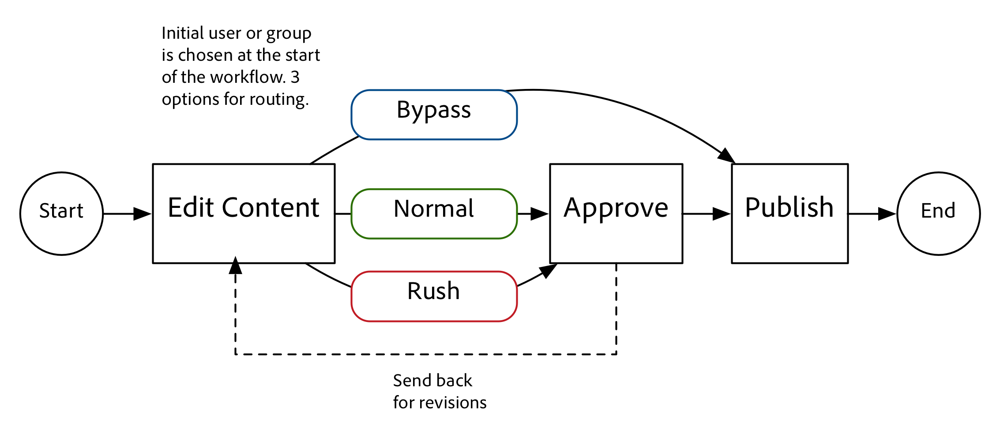

# AEMでのプロジェクトの開発

これは、の開発方法を示す開発チュートリアルです。 [!DNL AEM Projects].  このチュートリアルでは、AEM内で新しいプロジェクトを作成して、コンテンツオーサリングワークフローとタスクを管理するために使用できるカスタムプロジェクトテンプレートを作成します。

>[!VIDEO](https://video.tv.adobe.com/v/16904/?quality=12&learn=on)

*このビデオでは、以下のチュートリアルで作成した完了したワークフローの簡単なデモを提供します。*

## はじめに {#introduction}

[[!DNL AEM Projects]](https://helpx.adobe.com/experience-manager/6-5/sites/authoring/using/projects.html) はAEMの機能で、AEM Sitesまたは Assets の実装の一環として、コンテンツ作成に関連するすべてのワークフローとタスクを簡単に管理およびグループ化できるように設計されています。

AEMプロジェクトには複数の機能が付属しています [OOTB プロジェクトテンプレート](https://helpx.adobe.com/experience-manager/6-5/sites/authoring/using/projects.html#ProjectTemplates). 新しいプロジェクトを作成する際に、作成者は使用可能なテンプレートから選択できます。 独自のビジネス要件を持つ大規模なAEM実装では、ニーズに合わせてカスタマイズされたカスタムプロジェクトテンプレートを作成する必要があります。 カスタムプロジェクトテンプレートを作成することで、開発者はプロジェクトダッシュボードを設定し、カスタムワークフローに関連付けて、プロジェクト用の追加のビジネスロールを作成できます。 プロジェクトテンプレートの構造を見て、サンプルを作成します。


## セットアップ

このチュートリアルでは、カスタムプロジェクトテンプレートの作成に必要なコードを順を追って説明します。 次をダウンロードしてインストールできます。 [添付のパッケージ](./assets/develop-aem-projects/projects-tasks-guide.ui.apps-0.0.1-SNAPSHOT.zip) をローカル環境に追加して、チュートリアルに従います。 また、でホストされる完全な Maven プロジェクトにアクセスすることもできます。 [GitHub](https://github.com/Adobe-Marketing-Cloud/aem-guides/tree/feature/projects-tasks-guide).

* [チュートリアルパッケージの完了](./assets/develop-aem-projects/projects-tasks-guide.ui.apps-0.0.1-SNAPSHOT.zip)
* [GitHub のフルコードリポジトリ](https://github.com/Adobe-Marketing-Cloud/aem-guides/tree/feature/projects-tasks-guide)

このチュートリアルでは、 [AEM開発プラクティス](https://helpx.adobe.com/jp/experience-manager/6-5/sites/developing/using/the-basics.html) そして何かに精通している [AEM Maven プロジェクトの設定](https://helpx.adobe.com/jp/experience-manager/6-5/sites/developing/using/ht-projects-maven.html). 前述のすべてのコードは参照として使用することを目的としており、にのみデプロイする必要があります。 [ローカル開発AEMインスタンス](https://helpx.adobe.com/experience-manager/6-5/sites/deploying/using/deploy.html#GettingStarted).

## プロジェクトテンプレートの構造

プロジェクトテンプレートはソース管理下に置き、/apps の下のアプリケーションフォルダーの下に置く必要があります。 名前付け規則がのサブフォルダーに配置するのが理想です。 **&#42;/projects/templates/**&lt;my-template>. この命名規則に従うと、作成者は、プロジェクトの作成時に新しいカスタムテンプレートを自動的に使用できるようになります。 使用可能なプロジェクトテンプレートの設定は、次の場所に設定されます。 **/content/projects/jcr:content** ノードを **cq:allowedTemplates** プロパティ。 デフォルトでは、次の正規表現を使用します。 **/(apps|libs)/.&#42;/projects/templates/.&#42;**

プロジェクトテンプレートのルートノードには、 **jcr:primaryType** / **cq:Template**. のルートノードの下に、次の 3 つのノードがあります。 **ガジェット**, **役割**、および **workflows**. これらのノードはすべて **nt:unstructured**. また、ルートノードの下に、「プロジェクトを作成」ウィザードでテンプレートを選択すると表示される thumbnail.png ファイルを指定することもできます。

完全なノード構造は次のとおりです。

```shell
/apps/<my-app>
    + projects (nt:folder)
         + templates (nt:folder)
              + <project-template-root> (cq:Template)
                   + gadgets (nt:unstructured)
                   + roles (nt:unstructured)
                   + workflows (nt:unstructured)
```

### プロジェクトテンプレートルート

プロジェクトテンプレートのルートノードのタイプはです **cq:Template**. このノードでは、プロパティを設定できます **jcr:title** および **jcr:description** プロジェクトの作成ウィザードに表示されます。 また、 **ウィザード** これは、プロジェクトのプロパティを入力するフォームを指しています。 デフォルト値： **/libs/cq/core/content/projects/wizard/steps/defaultproject.html** ほとんどの場合は正常に機能します。ユーザーは基本的なプロジェクトプロパティに入力し、グループメンバーを追加できます。

*&#42;プロジェクトの作成ウィザードでは、SlingPOSTサーブレットは使用されません。 代わりに、値はカスタムサーブレットに投稿されます。**com.adobe.cq.projects.impl.servlet.ProjectServlet**. これは、カスタムフィールドを追加する際に考慮する必要があります。*

翻訳プロジェクトテンプレートのカスタムウィザードの例を次に示します。 **/libs/cq/core/content/projects/wizard/translationproject/defaultproject**.

### ガジェット {#gadgets}

このノードには追加のプロパティはありませんが、ガジェットノードの子は、新しいプロジェクトの作成時にプロジェクトのダッシュボードに表示されるプロジェクトタイルを制御します。 [プロジェクトタイル](https://helpx.adobe.com/experience-manager/6-5/sites/authoring/using/projects.html#ProjectTiles) （ガジェットやポッドとも呼ばれます）は、プロジェクトの作業場に入り込む簡単なカードです。 標準タイルの完全なリストは、次の場所にあります。**/libs/cq/gui/components/projects/admin/pod。 **プロジェクトの所有者は、プロジェクトの作成後、いつでもタイルの追加や削除をおこなうことができます。

### ロール {#roles}

次の 3 つがあります。 [デフォルトの役割](https://helpx.adobe.com/experience-manager/6-5/sites/authoring/using/projects.html#UserRolesinaProject) すべてのプロジェクトに対して： **監視者**, **エディター**、および **所有者**. ロールノードの下に子ノードを追加すると、ビジネス固有のプロジェクトロールをテンプレートに追加できます。 その後、これらの役割を、プロジェクトに関連付けられた特定のワークフローに関連付けることができます。

### ワークフロー {#workflows}

カスタムプロジェクトテンプレートを作成する最も魅力的な理由の 1 つは、プロジェクトで使用可能なワークフローを設定できる点です。 OOTB ワークフローやカスタムワークフローを使用できます。 の **workflows** ノードが必要です **モデル** ノード ( `nt:unstructured`) およびの下の子ノードは、使用可能なワークフローモデルを指定します。 プロパティ**modelId **は、/etc/workflow の下のワークフローモデルとプロパティを指します **ウィザード** は、ワークフローの開始時に使用されるダイアログを指します。 プロジェクトの大きな利点は、ワークフローの開始時にビジネス固有のメタデータをキャプチャするカスタムダイアログ（ウィザード）を追加できることで、ワークフロー内でさらに多くのアクションを実行できます。

```shell
<projects-template-root> (cq:Template)
    + workflows (nt:unstructured)
         + models (nt:unstructured)
              + <workflow-model> (nt:unstructured)
                   - modelId = points to the workflow model
                   - wizard = dialog used to start the workflow
```

## プロジェクトテンプレートの作成 {#creating-project-template}

主にノードをコピー/設定するので、CRXDE Liteを使用します。 ローカルのAEMインスタンスでを開きます。 [CRXDE Lite](http://localhost:4502/crx/de/index.jsp).

1. まず、の下に新しいフォルダーを作成します。 `/apps/&lt;your-app-folder&gt;` 名前付き `projects`. その下に、という名前の別のフォルダーを作成します。 `templates`.

   ```shell
   /apps/aem-guides/projects-tasks/
                       + projects (nt:folder)
                                + templates (nt:folder)
   ```

1. 作業を容易にするために、既存の単純なプロジェクトテンプレートからカスタムテンプレートを開始します。

   1. ノードをコピーして貼り付けます。 **/libs/cq/core/content/projects/templates/default** の下 *テンプレート* 手順 1 で作成したフォルダ。

   ```shell
   /apps/aem-guides/projects-tasks/
                + templates (nt:folder)
                     + default (cq:Template)
   ```

1. これで、次のようなパスになります。 **/apps/aem-guides/projects-tasks/projects/templates/authoring-project**.

   1. を編集します。 **jcr:title** および **jcr:description** author-project ノードのプロパティを、カスタムのタイトルと説明の値に設定します。

      1. を **ウィザード** プロパティが既定の Project プロパティを指している。

   ```shell
   /apps/aem-guides/projects-tasks/projects/
            + templates (nt:folder)
                 + authoring-project (cq:Template)
                      - jcr:title = "Authoring Project"
                      - jcr:description = "A project to manage approval and publish process for AEM Sites or Assets"
                      - wizard = "/libs/cq/core/content/projects/wizard/steps/defaultproject.html"
   ```

1. このプロジェクトテンプレートでは、タスクを利用します。
   1. 新しい **nt:unstructured** 次の名前の authoring-project/gadgets の下のノード **タスク**.
   1. String プロパティをのタスクノードに追加します。 **cardWeight** = &quot;100&quot;, **jcr:title**=&quot;タスク&quot;、および **sling:resourceType**=&quot;cq/gui/components/projects/admin/pod/taskpod&quot;

   次に、 [タスクタイル](https://experienceleague.adobe.com/docs/#Tasks) は、新しいプロジェクトが作成される際にデフォルトで表示されます。

   ```shell
   ../projects/templates/authoring-project
       + gadgets (nt:unstructured)
            + team (nt:unstructured)
            + asset (nt:unstructured)
            + work (nt:unstructured)
            + experiences (nt:unstructured)
            + projectinfo (nt:unstructured)
            ..
            + tasks (nt:unstructured)
                 - cardWeight = "100"
                 - jcr:title = "Tasks"
                 - sling:resourceType = "cq/gui/components/projects/admin/pod/taskpod"
   ```

1. プロジェクトテンプレートにカスタム承認者の役割を追加します。

   1. プロジェクトテンプレート (authoring-project) ノードの下に、新しい **nt:unstructured** ラベル付きノード **役割**.
   1. 別の **nt:unstructured** 「rovers」というラベルが付けられたノードは、「roles」ノードの子として表示されます。
   1. 文字列プロパティを追加 **jcr:title** = &quot;**承認者**&quot;, **ロールクラス** =&quot;**所有者**&quot;, **ロール**=&quot;**承認者**&quot;.
      1. 承認者ノードの名前、および jcr:title と roleid には、任意の文字列値を指定できます（roleid が一意である限り）。
      1. **ロールクラス** は、 [3 つの OOTB ロール](https://docs.adobe.com/docs/en/aem/6-3/author/projects.html#Userプロジェクト内の役割 ): **所有者**, **編集者**、および **監視者**.
      1. 一般に、カスタムロールが管理ロールの方が多い場合、ロールクラスは **所有者；** 写真家やデザイナーのような、より具体的なオーサリングの役割を持つ場合は、 **編集者** ロールクラスで十分です。 ～間の大きな違い **所有者** および **編集者** は、プロジェクトの所有者がプロジェクトのプロパティを更新し、新しいユーザーをプロジェクトに追加できることを意味します。

   ```shell
   ../projects/templates/authoring-project
       + gadgets (nt:unstructured)
       + roles (nt:unstructured)
           + approvers (nt:unstructured)
                - jcr:title = "Approvers"
                - roleclass = "owner"
                - roleid = "approver"
   ```

1. シンプルなプロジェクトテンプレートをコピーすると、4 つの標準ワークフローが設定されます。 workflows/models の下の各ノードは、特定のワークフローと、そのワークフローの開始ダイアログウィザードを指します。 このチュートリアルの後半では、このプロジェクトのカスタムワークフローを作成します。 ここでは、workflow/models の下のノードを削除します。

   ```shell
   ../projects/templates/authoring-project
       + gadgets (nt:unstructured)
       + roles (nt:unstructured)
       + workflows (nt:unstructured)
            + models (nt:unstructured)
               - (remove ootb models)
   ```

1. コンテンツ作成者がプロジェクトテンプレートを簡単に識別できるように、カスタムサムネールを追加できます。 推奨サイズは 319 x 319 ピクセルです。
   1. CRXDE Liteで、名前を付けたガジェット、役割、およびワークフローノードの兄弟として新しいファイルを作成します。 **thumbnail.png**.
   1. 保存して、 `jcr:content` ノードに移動し、 `jcr:data` プロパティ（「表示」をクリックしないでください）。
      1. これにより、編集を求めるメッセージが表示されます `jcr:data` ファイルダイアログに表示され、カスタムサムネールをアップロードできます。

   ```shell
   ../projects/templates/authoring-project
       + gadgets (nt:unstructured)
       + roles (nt:unstructured)
       + workflows (nt:unstructured)
       + thumbnail.png (nt:file)
   ```

プロジェクトテンプレートの XML 表現が完了しました：

```xml
<?xml version="1.0" encoding="UTF-8"?>
<jcr:root xmlns:sling="http://sling.apache.org/jcr/sling/1.0" xmlns:cq="http://www.day.com/jcr/cq/1.0" xmlns:jcr="http://www.jcp.org/jcr/1.0" xmlns:nt="http://www.jcp.org/jcr/nt/1.0"
    jcr:description="A project to manage approval and publish process for AEM Sites or Assets"
    jcr:primaryType="cq:Template"
    jcr:title="Authoring Project"
    ranking="{Long}1"
    wizard="/libs/cq/core/content/projects/wizard/steps/defaultproject.html">
    <jcr:content
        jcr:primaryType="nt:unstructured"
        detailsHref="/projects/details.html"/>
    <gadgets jcr:primaryType="nt:unstructured">
        <team
            jcr:primaryType="nt:unstructured"
            jcr:title="Team"
            sling:resourceType="cq/gui/components/projects/admin/pod/teampod"
            cardWeight="60"/>
        <tasks
            jcr:primaryType="nt:unstructured"
            jcr:title="Tasks"
            sling:resourceType="cq/gui/components/projects/admin/pod/taskpod"
            cardWeight="100"/>
        <work
            jcr:primaryType="nt:unstructured"
            jcr:title="Workflows"
            sling:resourceType="cq/gui/components/projects/admin/pod/workpod"
            cardWeight="80"/>
        <experiences
            jcr:primaryType="nt:unstructured"
            jcr:title="Experiences"
            sling:resourceType="cq/gui/components/projects/admin/pod/channelpod"
            cardWeight="90"/>
        <projectinfo
            jcr:primaryType="nt:unstructured"
            jcr:title="Project Info"
            sling:resourceType="cq/gui/components/projects/admin/pod/projectinfopod"
            cardWeight="100"/>
    </gadgets>
    <roles jcr:primaryType="nt:unstructured">
        <approvers
            jcr:primaryType="nt:unstructured"
            jcr:title="Approvers"
            roleclass="owner"
            roleid="approvers"/>
    </roles>
    <workflows
        jcr:primaryType="nt:unstructured"
        tags="[]">
        <models jcr:primaryType="nt:unstructured">
        </models>
    </workflows>
</jcr:root>
```

## カスタムプロジェクトテンプレートのテスト

次に、新しいプロジェクトを作成して、プロジェクトテンプレートをテストできます。

1. カスタムテンプレートが、プロジェクト作成用のオプションの 1 つとして表示されます。

   

1. カスタムテンプレートを選択したら、「次へ」をクリックし、プロジェクトメンバーに入力する際に、承認者の役割として追加できることに注意してください。

   

1. 「作成」をクリックして、カスタムテンプレートに基づいてプロジェクトの作成を終了します。 プロジェクトダッシュボードに、タスクタイルと、ガジェットの下に構成された他のタイルが自動的に表示されます。

   


## ワークフローを使用する理由

従来、承認プロセスを中心とするAEMワークフローは、参加者ワークフローステップを使用していました。 AEM Inbox には、タスクとワークフローに関する詳細が含まれており、AEM Projects との統合が強化されています。 これらの機能は、プロジェクトのタスクを作成プロセスを使用すると、より魅力的なオプションになります。

### タスクを実行する理由

従来の参加者ステップに対してタスク作成ステップを使用すると、次のような利点があります。

* **開始日と期限** ：作成者が時間を簡単に管理できるように、新しいカレンダー機能でこれらの日付を利用できます。
* **優先度**  — 低、標準、高の優先度が組み込まれているので、作成者は作業を優先順位付けできます
* **スレッドコメント**  — 作成者はタスクに取り組むので、コメントを残して共同作業を進めることができます
* **表示**  — プロジェクトを含むタスクタイルとビューを使用すると、マネージャは時間の経過を表示できます
* **プロジェクトの統合**  — タスクは既にプロジェクトの役割およびダッシュボードと統合されています

参加者ステップと同様に、タスクを動的に割り当てたり、ルーティングしたりできます。 タイトル、優先度などのタスクメタデータは、次のチュートリアルで見るように、以前のアクションに基づいて動的に設定することもできます。

タスクには参加者ステップよりもいくつかの利点がありますが、追加のオーバーヘッドが伴い、プロジェクト以外では役に立ちません。 さらに、タスクのすべての動的な動作は、独自の制限を持つ ecma スクリプトを使用してコーディングする必要があります。

## 使用例の要件 {#goals-tutorial}



上の図は、サンプルの承認ワークフローの要件の概要を示しています。

最初の手順は、コンテンツの一部の編集を完了するためのタスクを作成することです。 ワークフロー開始者がこの最初のタスクの担当者を選択できるようにします。

最初のタスクが完了すると、担当者はワークフローをルーティングする次の 3 つのオプションを使用できます。

**通常の** — 通常のルーティングでは、レビューと承認を行うために、プロジェクトの承認者グループに割り当てられたタスクを作成します。 タスクの優先順位は「標準」で、期限は作成日から 5 日間です。

**急ぐ**  — ラッシュルーティングは、プロジェクトの承認者グループに割り当てられたタスクも作成します。 タスクの優先順位が「高」で、期限は 1 日だけです。

**バイパス** ：このサンプルワークフローでは、最初の参加者は承認グループをバイパスするオプションを使用します。 （「承認」ワークフローの目的を破る可能性がありますが、追加のルーティング機能を説明できます）

承認者グループは、コンテンツを承認するか、再作業用に最初の担当者に返送できます。 再作業用に送り返される場合、新しいタスクが作成され、「再作業用に送り返す」という適切なラベルが付けられます。

ワークフローの最後のステップは、標準のページ/アセットのアクティベートプロセスステップを利用し、ペイロードを複製します。

## ワークフローモデルの作成

1. AEM Start メニューで、ツール/ワークフロー/モデルに移動します。 右上隅の「作成」をクリックして、新しいワークフローモデルを作成します。

   新しいモデルにタイトルを付けます。「コンテンツ承認ワークフロー」および URL 名：&quot;content-approval-workflow&quot;と入力します。

   

   詳しくは、 [ワークフローの作成（こちらを参照）](https://helpx.adobe.com/experience-manager/6-5/sites/developing/using/workflows-models.html).

1. ベストプラクティスとして、カスタムワークフローは、 /etc/workflow/models の下の独自のフォルダーにグループ化する必要があります。 CRXDE Liteで、新しい **&#39;nt:folder&#39;** /etc/workflow/models の下で、次の名前を付けます。 **&quot;aem-guides&quot;**. サブフォルダーを追加することで、アップグレード時や Service Pack のインストール時にカスタムワークフローが誤って上書きされるのを防ぐことができます。

   &#42;フォルダーまたはカスタムワークフローは、 /etc/workflow/models/dam や/etc/workflow/models/projects などの ootb サブフォルダーの下に配置しないことが重要です。サブフォルダー全体がアップグレードやサービスパックによって上書きされる場合もあるからです。

   

   6.3 でのワークフローモデルの場所

   >[!NOTE]
   >
   >AEM 6.4 以降を使用している場合、ワークフローの場所が変更されました。 詳しくは、[こちらを参照してください。](https://helpx.adobe.com/experience-manager/6-5/sites/developing/using/workflows-best-practices.html#LocationsWorkflowModels)

   AEM 6.4 以降を使用している場合、ワークフローモデルは以下に作成されます。 `/conf/global/settings/workflow/models`. 上記の手順を/conf ディレクトリで繰り返し、という名前のサブフォルダーを追加します。 `aem-guides` そして、 `content-approval-workflow` その下に

   
6.4 以降のワークフローモデルの場所

1. AEM 6.3 で導入された機能は、特定のワークフローにワークフローステージを追加する機能です。 ステージは、「ワークフロー情報」タブのインボックスからユーザーに表示されます。 ワークフローの現在のステージと、その前後のステージがユーザーに表示されます。

   ステージを設定するには、サイドキックからページのプロパティダイアログを開きます。 4 番目のタブには、「ステージ」というラベルが付けられます。 このワークフローの 3 つのステージを設定するには、以下の値を追加します。

   1. コンテンツの編集
   1. 承認
   1. パブリッシュ

   

   ページのプロパティダイアログで、ワークフローステージを設定します。

   

   AEM Inbox から見たワークフローの進行状況バー。

   オプションで、 **画像** をページのプロパティに追加します。この画像は、ユーザーが選択したときにワークフローサムネールとして使用されます。 画像のサイズは 319 x 319 ピクセルにする必要があります。 の追加 **説明** をページのプロパティに追加すると、ユーザーがワークフローを選択したときにも表示されます。

1. プロジェクトタスクを作成ワークフロープロセスは、ワークフローのステップとしてタスクを作成するように設計されています。 タスクを完了した後にのみ、ワークフローが前に進みます。 プロジェクトタスクの作成手順の強力な側面は、ワークフローのメタデータ値を読み取り、それらを使用してタスクを動的に作成できる点です。

   最初に、デフォルトで作成される参加者ステップを削除します。 コンポーネントメニューのサイドキックから、 **&quot;プロジェクト&quot;** サブ見出しとドラッグ&amp;ドロップ **&quot;プロジェクトタスクを作成&quot;** をモデルに貼り付けます。

   「プロジェクトタスクを作成」ステップをダブルクリックして、ワークフローダイアログを開きます。 以下のプロパティを設定します。

   このタブは、すべてのワークフロープロセスステップで共通で、「タイトル」と「説明」を設定します（これらはエンドユーザーには表示されません）。 設定する重要なプロパティは、ワークフローステージです。 **&quot;コンテンツを編集&quot;** をクリックします。

   ```shell
   Common Tab
   -----------------
       Title = "Start Task Creation"
       Description = "This the first task in the Workflow"
       Workflow Stage = "Edit Content"
   ```

   プロジェクトタスクを作成ワークフロープロセスは、ワークフローのステップとしてタスクを作成するように設計されています。 「タスク」タブでは、タスクのすべての値を設定できます。 担当者を動的にしたい場合は、空白のままにします。 残りのプロパティ値は次のとおりです。

   ```shell
   Task Tab
   -----------------
       Name* = "Edit Content"
       Task Priority = "Medium"
       Description = "Edit the content and finalize for approval. Once finished submit for approval."
       Due In - Days = "2"
   ```

   「ルーティング」タブは、タスクを完了するユーザーが使用できるアクションを指定するオプションのダイアログです。 これらのアクションは文字列値に過ぎず、ワークフローのメタデータに保存されます。 これらの値は、スクリプトや、ワークフローの後のプロセスステップで読み取り、ワークフローを動的に「ルーティング」することができます。 次に基づいて [ワークフローの目標](#goals-tutorial) このタブに 3 つのアクションを追加します。

   ```shell
   Routing Tab
   -----------------
       Actions =
           "Normal Approval"
           "Rush Approval"
           "Bypass Approval"
   ```

   このタブでは、タスクの作成前にタスクの様々な値をプログラムで決定できるタスクスクリプトを設定できます。 スクリプトを外部ファイルに向けるか、ダイアログに直接短いスクリプトを埋め込むかを選択できます。 この例では、事前作成タスクスクリプトを外部ファイルに指定します。 手順 5 で、そのスクリプトを作成します。

   ```shell
   Advanced Settings Tab
   -----------------
      Pre-Create Task Script = "/apps/aem-guides/projects/scripts/start-task-config.ecma"
   ```

1. 前の手順では、タスクスクリプトの作成前の手順を参照しました。 ここで、ワークフローメタデータ値の値に基づいてタスクの担当者を設定するスクリプトを作成します。**担当者**&quot;. この **&quot;assignee&quot;** の値は、ワークフローがキックオフされたときに設定されます。 また、ワークフローメタデータを読み取り、「**taskPriority&quot;** 最初のタスクの期限が来る時に動的に設定される**&quot;taskDueDate&quot; **と共に、ワークフローのメタデータの値。

   組織のために、app フォルダーの下にフォルダーを作成し、プロジェクト関連のすべてのスクリプトを格納します。 **/apps/aem-guides/projects-tasks/projects/scripts**. このフォルダーの下に、という名前の新しいファイルを作成します。 **&quot;start-task-config.ecma&quot;**. &#42;start-task-config.ecma ファイルへのパスが、手順 4 の「詳細設定」タブで設定したパスと一致していることを確認してください。

   ファイルのコンテンツとして以下を追加します。

   ```
   // start-task-config.ecma
   // Populate the task using values stored as workflow metadata originally posted by the start workflow wizard
   
   // set the assignee based on start workflow wizard
   var assignee = workflowData.getMetaDataMap().get("assignee", Packages.java.lang.String);
   task.setCurrentAssignee(assignee);
   
   //Set the due date for the initial task based on start workflow wizard
   var dueDate = workflowData.getMetaDataMap().get("taskDueDate", Packages.java.util.Date);
   if (dueDate != null) {
       task.setProperty("taskDueDate", dueDate);
   }
   
   //Set the priority based on start workflow wizard
   var taskPriority = workflowData.getMetaDataMap().get("taskPriority", "Medium");
   task.setProperty("taskPriority", taskPriority);
   ```

1. コンテンツ承認ワークフローに戻ります。 ドラッグ&amp;ドロップ **OR 分割** （「ワークフロー」カテゴリの下のサイドキックにある）コンポーネント ( **タスクを開始** ステップ。 [ 共通ダイアログ ] で、[3 ブランチ ] のラジオボタンを選択します。 OR 分割は、ワークフローメタデータの値を読み取ります **&quot;lastTaskAction&quot;** をクリックして、ワークフローのルートを決定します。 この **&quot;lastTaskAction&quot;** プロパティは、手順 4 で設定した「ルーティング」タブの値の 1 つに設定されます。 「ブランチ」タブごとに、 **スクリプト** 次の値を持つテキスト領域：

   ```
   function check() {
   var lastAction = workflowData.getMetaDataMap().get("lastTaskAction","");
   
   if(lastAction == "Normal Approval") {
       return true;
   }
   
   return false;
   }
   ```

   ```
   function check() {
   var lastAction = workflowData.getMetaDataMap().get("lastTaskAction","");
   
   if(lastAction == "Rush Approval") {
       return true;
   }
   
   return false;
   }
   ```

   ```
   function check() {
   var lastAction = workflowData.getMetaDataMap().get("lastTaskAction","");
   
   if(lastAction == "Bypass Approval") {
       return true;
   }
   
   return false;
   }
   ```

   &#42;ルートを決定するために、直接の String の一致を行っているので、Branch スクリプトに設定された値が手順 4 で設定された Route 値と一致することが重要です。

1. 別の「**プロジェクトタスクを作成**&quot; OR 分割の下の左端（分岐 1）のモデルに進みます。 次のプロパティを使用してダイアログに入力します。

   ```
   Common Tab
   -----------------
       Title = "Approval Task Creation"
       Description = "Create a an approval task for Project Approvers. Priority is Medium."
       Workflow Stage = "Approval"
   
   Task Tab
   ------------
       Name* = "Approve Content for Publish"
       Task Priority = "Medium"
       Description = "Approve this content for publication."
       Days = "5"
   
   Routing Tab - Actions
   ----------------------------
       "Approve and Publish"
       "Send Back for Revision"
   ```

   これは「通常の承認」ルートなので、タスクの優先度は「中」に設定されます。 さらに、Approvers グループに 5 日間、Task を完了させます。 「詳細設定」タブで動的に割り当てるので、「タスク」タブで担当者は空白のままにします。 このタスクを完了する際に、承認者グループに 2 つのルートを指定します。 **&quot;承認して公開&quot;** コンテンツを承認し、公開できる場合、 **&quot;リビジョン用に送り返す&quot;** 元のエディターで修正が必要な問題がある場合。 承認者は、元の編集者に対して、ワークフローが元の編集者に返されたかどうかを確認するコメントを残すことができます。

このチュートリアルでは、先ほど、承認者の役割を含むプロジェクトテンプレートを作成しました。 このテンプレートから新しいプロジェクトが作成されるたびに、承認者の役割用にプロジェクト固有のグループが作成されます。 参加者ステップと同様に、タスクはユーザーまたはグループにのみ割り当てることができます。 このタスクを、承認者グループに対応するプロジェクトグループに割り当てます。 プロジェクト内から起動されるすべてのワークフローには、プロジェクトの役割をプロジェクト固有のグループにマッピングするメタデータが含まれます。

次のコードを **スクリプト** 「**詳細設定**」タブのテキスト領域 このコードは、ワークフローメタデータを読み取り、タスクをプロジェクトの承認者グループに割り当てます。 承認者グループの値が見つからない場合は、タスクを Administrators グループに割り当てることに戻ります。

```
var projectApproverGrp = workflowData.getMetaDataMap().get("project.group.approvers","administrators");

task.setCurrentAssignee(projectApproverGrp);
```

1. 別の「**プロジェクトタスクを作成**&quot; OR 分割の下の中央の分岐（分岐 2）にモデルを進めます。 次のプロパティを使用してダイアログに入力します。

   ```
   Common Tab
   -----------------
       Title = "Rush Approval Task Creation"
       Description = "Create a an approval task for Project Approvers. Priority is High."
       Workflow Stage = "Approval"
   
   Task Tab
   ------------
       Name* = "Rush Approve Content for Publish"
       Task Priority = "High"
       Description = "Rush approve this content for publication."
       Days = "1"
   
   Routing Tab - Actions
   ----------------------------
       "Approve and Publish"
       "Send Back for Revision"
   ```

   これは [ ラッシュの承認 ] ルートなので、タスクの優先度は [ 高 ] に設定されます。 さらに、「承認者」グループには、タスクを完了するのに 1 日のみ与えます。 「詳細設定」タブで動的に割り当てるので、「タスク」タブで担当者は空白のままにします。

   手順 7 と同じスクリプトスニペットを再利用し、 **スクリプト** 「**詳細設定**」タブのテキスト領域 次のコードをコピー&amp;ペーストします。

   ```
   var projectApproverGrp = workflowData.getMetaDataMap().get("project.group.approvers","administrators");
   
   task.setCurrentAssignee(projectApproverGrp);
   ```

1. 右端の分岐（分岐 3）に「**操作なし**」コンポーネントをドラッグ&amp;ドロップします。 操作なしコンポーネントは何も実行しないので、すぐに進行し、元のエディターが承認ステップをスキップしたいという願いを表します。 技術的には、このブランチをワークフローステップなしで終了できますが、ベストプラクティスとして、操作なしのステップを追加します。 これにより、他の開発者に対して、Branch 3 の目的が何かが明確になります。

   ワークフローステップをダブルクリックし、「タイトル」と「説明」を設定します。

   ```
   Common Tab
   -----------------
       Title = "Bypass Approval"
       Description = "Placeholder step to indicate that the original editor decided to bypass the approver group."
   ```

   

   OR 分割の 3 つのブランチすべてが設定されたら、ワークフローモデルは次のようになります。

1. 「承認者」グループには、以降のリビジョンに対して、元のエディターにワークフローを送り返すオプションがあるので、以下の項目に依存します。 **移動** 最後に実行されたアクションを読み取り、ワークフローを最初にルーティングするか、続行させる手順です。

   OR 分割の下のサイドキックにある移動ステップコンポーネント（ワークフローの下）を、再結合する場所にドラッグ&amp;ドロップします。 ダブルクリックして、ダイアログで次のプロパティを設定します。

   ```
   Common Tab
   ----------------
       Title = "Goto Step"
       Description = "Based on the Approver groups action route the workflow to the beginning or continue and publish the payload."
   
   Process Tab
   ---------------
       The step to go to. = "Start Task Creation"
   ```

   最後に設定するのは、移動プロセスステップの一部としてのスクリプトです。 スクリプトの値は、ダイアログを使用して埋め込むことも、外部ファイルを指すように設定することもできます。 移動スクリプトには **関数 check()** ワークフローが指定された手順に進む必要がある場合は true を返します。 false を返すと、ワークフローが次に進みます。

   承認者グループが **&quot;リビジョン用に送り返す&quot;** アクション（手順 7 と 8 で設定）を実行した後、ワークフローを **&quot;タスク作成を開始&quot;** 手順

   「プロセス」タブで、次のスニペットを「スクリプト」テキスト領域に追加します。

   ```
   function check() {
   var lastAction = workflowData.getMetaDataMap().get("lastTaskAction","");
   
   if(lastAction == "Send Back for Revision") {
       return true;
   }
   
   return false;
   }
   ```

1. ペイロードを公開するには、標準の **ページ/アセットをアクティベート** 処理ステップ。 このプロセスステップでは、ほとんど設定が必要ではなく、アクティベーション用にワークフローのペイロードをレプリケーションキューに追加します。 移動ステップの下にステップを追加します。この方法では、承認者グループが公開用にコンテンツを承認した場合、または元の編集者が承認をバイパスルートを選択した場合にのみ、このステップに到達できます。

   ドラッグ&amp;ドロップ **ページ/アセットをアクティベート** モデル内の移動ステップの下のサイドキック（WCM ワークフローの下）にあるプロセスステップ。

   

   移動ステップおよびページ/アセットをアクティベートステップを追加した後のワークフローモデルの表示内容

1. 承認者グループがリビジョン用にコンテンツを送り返した場合、元の編集者に通知します。 これを実現するには、Task 作成プロパティを動的に変更します。 次の lastActionTaken プロパティ値のキーを設定します： **&quot;リビジョン用に送り返す&quot;**. その値が存在する場合は、タイトルと説明を変更して、このタスクがリビジョン用に送り返されたコンテンツの結果であることを示します。 優先度もに更新します。 **&quot;高&quot;** 編集者が最初に作業する項目になります。 最後に、タスクの期限を、リビジョン用にワークフローが送り返された日から 1 日に設定します。

   開始を置き換える `start-task-config.ecma` スクリプト（手順 5 で作成）には、次の情報が含まれます。

   ```
   // start-task-config.ecma
   // Populate the task using values stored as workflow metadata originally posted by the start workflow wizard
   
   // set the assignee based on start workflow wizard
   var assignee = workflowData.getMetaDataMap().get("assignee", Packages.java.lang.String);
   task.setCurrentAssignee(assignee);
   
   //Set the due date for the initial task based on start workflow wizard
   var dueDate = workflowData.getMetaDataMap().get("taskDueDate", Packages.java.util.Date);
   if (dueDate != null) {
       task.setProperty("taskDueDate", dueDate);
   }
   
   //Set the priority based on start workflow wizard
   var taskPriority = workflowData.getMetaDataMap().get("taskPriority", "Medium");
   task.setProperty("taskPriority", taskPriority);
   
   var lastAction = workflowData.getMetaDataMap().get("lastTaskAction","");
   
   //change the title and priority if the approver group sent back the content
   if(lastAction == "Send Back for Revision") {
     var taskName = "Review and Revise Content";
   
     //since the content was rejected we will set the priority to High for the revison task
     task.setProperty("taskPriority", "High"); 
   
     //set the Task name (displayed as the task title in the Inbox) 
     task.setProperty("name", taskName);
     task.setProperty("nameHierarchy", taskName);
   
     //set the due date of this task 1 day from current date
     var calDueDate = Packages.java.util.Calendar.getInstance();
     calDueDate.add(Packages.java.util.Calendar.DATE, 1);
     task.setProperty("taskDueDate", calDueDate.getTime());
   
   }
   ```

## 「ワークフローを開始」ウィザードを作成する {#start-workflow-wizard}

プロジェクト内からワークフローを開始する場合は、ワークフローを開始するウィザードを指定する必要があります。 デフォルトのウィザード： `/libs/cq/core/content/projects/workflowwizards/default_workflow` ワークフローのタイトル、開始コメント、実行するワークフローのペイロードパスを入力できます。 その他の例も以下に示します。 `/libs/cq/core/content/projects/workflowwizards`.

ワークフローを開始する前に重要な情報を収集できるので、カスタムウィザードの作成は非常に強力です。 データはワークフローのメタデータの一部として保存されます。ワークフロープロセスは、この読み取りをおこない、入力された値に基づいて動的に動作を変更できます。 カスタムウィザードを作成し、開始ウィザードの値に基づいて、ワークフローの最初のタスクを動的に割り当てます。

1. CRXDE-Lite では、の下にサブフォルダーを作成します。 `/apps/aem-guides/projects-tasks/projects` &quot;wizards&quot;という名前のフォルダ。 デフォルトのウィザードのコピー元： `/libs/cq/core/content/projects/workflowwizards/default_workflow` 新しく作成された wizards フォルダーの下で、名前をに変更します。 **content-approval-start**. フルパスは次のようになります。 `/apps/aem-guides/projects-tasks/projects/wizards/content-approval-start`.

   デフォルトのウィザードは 2 列のウィザードで、最初の列にワークフローモデルの「タイトル」、「説明」、「サムネール」が選択されています。 2 番目の列には、「ワークフロータイトル」、「コメントを開始」、「ペイロードパス」のフィールドが含まれます。 ウィザードは標準のタッチ UI フォームで、標準の [Granite UI フォームコンポーネント](https://experienceleague.adobe.com/docs/?lang=ja) をクリックしてフィールドに値を入力します。

   

1. ウィザードにフィールドを追加します。このフィールドを使用して、ワークフローの最初のタスクの担当者を設定します ( [ワークフローモデルの作成](#create-workflow-model):手順 5)。

   の下 `../content-approval-start/jcr:content/items/column2/items` タイプの新しいノードを作成 `nt:unstructured` 名前付き **&quot;assign&quot;**. プロジェクトのユーザーピッカーコンポーネント ( [Granite ユーザーピッカーコンポーネント](https://experienceleague.adobe.com/docs/)) をクリックします。 このフォームフィールドを使用すると、ユーザーやグループの選択を、現在のプロジェクトに属するもののみに簡単に制限できます。

   以下は、 **割り当て** ノード：

   ```xml
   <assign
       granite:class="js-cq-project-user-picker"
       jcr:primaryType="nt:unstructured"
       sling:resourceType="cq/gui/components/projects/admin/userpicker"
       fieldLabel="Assign To"
       hideServiceUsers="{Boolean}true"
       impersonatesOnly="{Boolean}true"
       showOnlyProjectMembers="{Boolean}true"
       name="assignee"
       projectPath="${param.project}"
       required="{Boolean}true"/>
   ```

1. また、ワークフローの最初のタスクの優先度を決定する優先度選択フィールドも追加します ( [ワークフローモデルの作成](#create-workflow-model):手順 5)。

   の下 `/content-approval-start/jcr:content/items/column2/items` タイプの新しいノードを作成 `nt:unstructured` 名前付き **優先度**. 以下を使用します。 [Granite UI 選択コンポーネント](https://experienceleague.adobe.com/docs/experience-manager-release-information/aem-release-updates/previous-updates/aem-previous-versions.html?lang=ja) をクリックして、フォームフィールドに入力します。

   の **優先度** 追加するノード **項目** のノード **nt:unstructured**. の **項目** ノードに、「高」、「中」、「低」の選択オプションを設定する 3 つのノードを追加します。 各ノードのタイプは **nt:unstructured** そして、 **テキスト** および **値** プロパティ。 テキストと値の両方が同じ値である必要があります。

   1. 高
   1. 中
   1. 低

   メディアノードの場合、「 」という名前の追加のブール型プロパティを追加します。**選択済み&quot;** 値を **true**. これにより、選択フィールドのデフォルト値が「中」になります。

   以下に、ノードの構造とプロパティを XML で表します。

   ```xml
   <priority
       jcr:primaryType="nt:unstructured"
       sling:resourceType="granite/ui/components/coral/foundation/form/select"
       fieldLabel="Task Priority"
       name="taskPriority">
           <items jcr:primaryType="nt:unstructured">
               <high
                   jcr:primaryType="nt:unstructured"
                   text="High"
                   value="High"/>
               <medium
                   jcr:primaryType="nt:unstructured"
                   selected="{Boolean}true"
                   text="Medium"
                   value="Medium"/>
               <low
                   jcr:primaryType="nt:unstructured"
                   text="Low"
                   value="Low"/>
               </items>
   </priority>
   ```

1. ワークフロー開始者が最初のタスクの期限を設定できるようにします。 以下を使用します。 [Granite UI DatePicker](https://experienceleague.adobe.com/docs/) この入力を取り込むためのフォームフィールド。 また、 [TypeHint](https://sling.apache.org/documentation/bundles/manipulating-content-the-slingpostservlet-servlets-post.html#typehint) 入力が Date タイプのプロパティとして JCR に保存されるようにします。

   2 つ追加 **nt:unstructured** 以下に示す XML プロパティを持つノード

   ```xml
   <duedate
       granite:rel="project-duedate"
       jcr:primaryType="nt:unstructured"
       sling:resourceType="granite/ui/components/coral/foundation/form/datepicker"
       displayedFormat="YYYY-MM-DD HH:mm"
       fieldLabel="Due Date"
       minDate="today"
       name="taskDueDate"
       type="datetime"/>
   <duedatetypehint
       jcr:primaryType="nt:unstructured"
       sling:resourceType="granite/ui/components/coral/foundation/form/hidden"
       name="taskDueDate@TypeHint"
       type="datetime"
       value="Calendar"/>
   ```

1. ウィザードの開始ダイアログの完全なコードを表示できます [ここ](https://github.com/Adobe-Marketing-Cloud/aem-guides/blob/master/projects-tasks-guide/ui.apps/src/main/content/jcr_root/apps/aem-guides/projects-tasks/projects/wizards/content-approval-start/.content.xml).

## ワークフローとプロジェクトテンプレートの接続 {#connecting-workflow-project}

最後に実行する必要があるのは、ワークフローモデルを 1 つのプロジェクト内から確実に開始できるようにすることです。 そのためには、このシリーズのパート 1 で作成したプロジェクトテンプレートに再度アクセスする必要があります。

ワークフロー設定は、そのプロジェクトで使用できるワークフローを指定するプロジェクトテンプレートの領域です。 また、この設定では、( [前の手順 )](#start-workflow-wizard). プロジェクトテンプレートのワークフロー設定は「ライブ」です。つまり、ワークフロー設定を更新すると、新しく作成されたプロジェクトと、そのテンプレートを使用する既存のプロジェクトに影響します。

1. CRXDE-Lite で、前に作成したオーサリングプロジェクトテンプレート ( ) に移動します。 `/apps/aem-guides/projects-tasks/projects/templates/authoring-project/workflows/models`.

   models ノードの下に、という名前の新しいノードを追加します。 **contentapproval** ノードタイプが **nt:unstructured**. ノードに次のプロパティを追加します。

   ```xml
   <contentapproval
       jcr:primaryType="nt:unstructured"
       modelId="/etc/workflow/models/aem-guides/content-approval-workflow/jcr:content/model"
       wizard="/apps/aem-guides/projects-tasks/projects/wizards/content-approval-start.html"
   />
   ```

   >[!NOTE]
   >
   >AEM 6.4 を使用している場合、ワークフローの場所が変更されました。 次をポイント： `modelId` の下のランタイムワークフローモデルの場所に対するプロパティ `/var/workflow/models/aem-guides/content-approval-workflow`
   >
   >
   >詳しくは、 [ワークフローの場所の変更について詳しくは、こちらを参照してください。](https://helpx.adobe.com/experience-manager/6-5/sites/developing/using/workflows-best-practices.html#LocationsWorkflowModels)

   ```xml
   <contentapproval
       jcr:primaryType="nt:unstructured"
       modelId="/var/workflow/models/aem-guides/content-approval-workflow"
       wizard="/apps/aem-guides/projects-tasks/projects/wizards/content-approval-start.html"
   />
   ```

1. コンテンツ承認ワークフローをプロジェクトテンプレートに追加したら、プロジェクトのワークフロータイルから開始できるようになります。 先に進んで、様々なルーティングを開始し、再生してください。

## サポート資料

* [完了したチュートリアルパッケージをダウンロード](./assets/develop-aem-projects/projects-tasks-guide.ui.apps-0.0.1-SNAPSHOT.zip)
* [GitHub のフルコードリポジトリ](https://github.com/Adobe-Marketing-Cloud/aem-guides/tree/feature/projects-tasks-guide)
* [AEM Projects ドキュメント](https://helpx.adobe.com/experience-manager/6-5/sites/authoring/using/projects.html)
