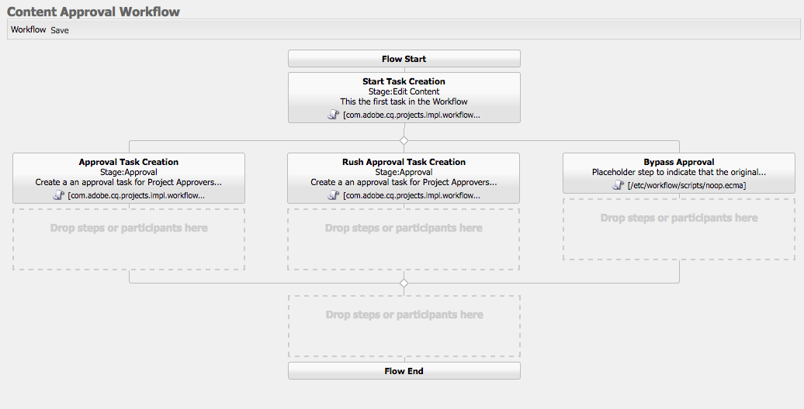

# AEMでのプロジェクトの開発

これは[!DNL AEM Projects]の開発方法を示した開発チュートリアルです。  このチュートリアルでは、コンテンツオーサリングのワークフローとタスクを管理するために、AEM内で新しいプロジェクトを作成するのに使用できるカスタムプロジェクトテンプレートを作成します。

>[!VIDEO](https://video.tv.adobe.com/v/16904/?quality=12&learn=on)

*このビデオでは、以下のチュートリアルで作成したワークフローの概要を簡単に説明します。*

## 概要 {#introduction}

[[!DNL AEM Projects]](https://helpx.adobe.com/experience-manager/6-5/sites/authoring/using/projects.html) は、コンテンツ作成に関連するすべてのワークフローとタスクを、AEM Sitesやアセットの実装の一部として管理およびグループ化しやすくするように設計されたAEMの機能です。

AEMプロジェクトには、[OOTBプロジェクトテンプレート](https://helpx.adobe.com/experience-manager/6-5/sites/authoring/using/projects.html#ProjectTemplates)がいくつか付属しています。 新しいプロジェクトを作成する場合、作成者はこれらの利用可能なテンプレートから選択できます。 独自のビジネス要件を持つ大規模なAEMでは、ニーズに合わせてカスタマイズしたカスタムプロジェクトテンプレートを作成する必要があります。 カスタムプロジェクトテンプレートを作成することで、開発者はプロジェクトダッシュボードを設定し、カスタムワークフローにフックして、プロジェクトの追加のビジネスロールを作成できます。 プロジェクトテンプレートの構造を見て、サンプルテンプレートを作成します。


## セットアップ

このチュートリアルでは、カスタムプロジェクトテンプレートを作成するのに必要なコードを順を追って説明します。 チュートリアルに従うために、[添付のパッケージ](./assets/develop-aem-projects/projects-tasks-guide.ui.apps-0.0.1-SNAPSHOT.zip)をローカル環境にダウンロードしてインストールできます。 [GitHub](https://github.com/Adobe-Marketing-Cloud/aem-guides/tree/feature/projects-tasks-guide)でホストされている完全なMavenプロジェクトにアクセスすることもできます。

* [チュートリアルパッケージの完了](./assets/develop-aem-projects/projects-tasks-guide.ui.apps-0.0.1-SNAPSHOT.zip)
* [GitHub上のフルコードリポジトリ](https://github.com/Adobe-Marketing-Cloud/aem-guides/tree/feature/projects-tasks-guide)

このチュートリアルでは、[AEM開発慣行](https://helpx.adobe.com/jp/experience-manager/6-5/sites/developing/using/the-basics.html)の基本的な知識と、[AEM Mavenプロジェクトの設定](https://helpx.adobe.com/jp/experience-manager/6-5/sites/developing/using/ht-projects-maven.html)に関する知識を前提としています。 前述のすべてのコードは参照として使用することを目的としており、[ローカル開発AEMインスタンス](https://helpx.adobe.com/experience-manager/6-5/sites/deploying/using/deploy.html#GettingStarted)にのみデプロイする必要があります。

## プロジェクトテンプレートの構造

プロジェクトテンプレートは、ソース管理の下に置き、アプリケーションフォルダーの下の/appsの下に置く必要があります。 名前付け規則が&#x200B;***/projects/templates/**&lt;my-template>のサブフォルダーに配置するのが理想的です。 この命名規則に従うと、プロジェクトの作成時に、作成者が新しいカスタムテンプレートを自動的に使用できるようになります。 使用可能なプロジェクトテンプレートの構成は、次の場所で設定されます。**cq:allowedTemplates**&#x200B;プロパティによる&#x200B;**/content/projects/jcr:content**&#x200B;ノード。 デフォルトでは、次の正規式が使用されます。**/(apps|libs)/.*/projects/templates/.***

プロジェクトテンプレートのルートノードには、**jcr:primaryType**&#x200B;が&#x200B;**cq:Template**&#x200B;になります。 のルートノードの下に3つのノードがあります。**gadgets**、**roles**、**ワークフロー** これらのノードはすべて&#x200B;**nt:unstructured**&#x200B;です。 ルートノードの下には、プロジェクトを作成ウィザードでテンプレートを選択したときに表示されるthumbnail.pngファイルを置くこともできます。

完全なノード構造：

```shell
/apps/<my-app>
    + projects (nt:folder)
         + templates (nt:folder)
              + <project-template-root> (cq:Template)
                   + gadgets (nt:unstructured)
                   + roles (nt:unstructured)
                   + workflows (nt:unstructured)
```

### プロジェクトテンプレートルート

プロジェクトテンプレートのルートノードのタイプは&#x200B;**cq:Template**&#x200B;です。 このノードでは、プロジェクトを作成ウィザードに表示される&#x200B;**jcr:title**&#x200B;および&#x200B;**jcr:description**&#x200B;のプロパティを設定できます。 また、プロジェクトのプロパティを入力するフォームを指す&#x200B;**ウィザード**&#x200B;というプロパティもあります。 デフォルト値：**/libs/cq/core/content/projects/wizard/steps/defaultproject.html**&#x200B;は、基本的なプロジェクトプロパティを設定し、グループメンバーを追加できるので、ほとんどの場合に適しています。

**プロジェクトの作成ウィザードは、SlingPOSTサーブレットを使用しないことに注意してください。代わりに、値はカスタムサーブレットにポストされます。**com.adobe.cq.projects.impl.servlet.ProjectServlet**. これは、カスタムフィールドを追加する際に考慮する必要があります。*

カスタムウィザードの例は、翻訳プロジェクトテンプレート用に次の場合にあります。**/libs/cq/core/content/projects/wizard/translationproject/defaultproject**

### ガジェット {#gadgets}

このノードには追加のプロパティはありませんが、ガジェットノードの子は、新しいプロジェクトの作成時にプロジェクトのダッシュボードに自動入力するプロジェクトタイルを制御します。 [プロジェクトタイル](https://helpx.adobe.com/experience-manager/6-5/sites/authoring/using/projects.html#ProjectTiles) （ガジェットやポッドとも呼ばれます）は、プロジェクトの職場に入力する簡単なカードです。Ootbタイルの完全なリストは、次の場所にあります。**/libs/cq/gui/components/projects/admin/pod. **プロジェクトの所有者は、プロジェクトの作成後、常にタイルを追加または削除できます。

### 役割 {#roles}

各プロジェクトには、3つの[デフォルトのロール](https://helpx.adobe.com/experience-manager/6-5/sites/authoring/using/projects.html#UserRolesinaProject)があります。**オブザーバー**、**エディター**、**所有者**。 ロールノードの下に子ノードを追加することで、テンプレートにビジネス固有のプロジェクトロールを追加できます。 その後、これらのロールを、プロジェクトに関連付けられた特定のワークフローに関連付けることができます。

### ワークフロー {#workflows}

カスタムプロジェクトテンプレートを作成する最も良い理由の1つは、カスタムプロジェクトテンプレートを使用して、プロジェクトで使用できるワークフローを設定できる点です。 OOTBワークフローやカスタムワークフローを使用できます。 **ワークフロー**&#x200B;ノードの下には、**モデル**&#x200B;ノード（`nt:unstructured`も含む）と子ノードが必要です。このノードは、使用可能なワークフローモデルを指定する下にあります。 **modelId **は/etc/workflowの下のワークフローモデルを指し、**wizard**&#x200B;はワークフローの開始時に使用されるダイアログを指します。 プロジェクトの大きな利点は、ワークフローの開始でビジネス固有のメタデータを取り込むためのカスタムダイアログ（ウィザード）を追加できることです。これにより、ワークフロー内でのさらなる操作を促進できます。

```shell
<projects-template-root> (cq:Template)
    + workflows (nt:unstructured)
         + models (nt:unstructured)
              + <workflow-model> (nt:unstructured)
                   - modelId = points to the workflow model
                   - wizard = dialog used to start the workflow
```

## プロジェクトテンプレートの作成{#creating-project-template}

主にノードのコピー/設定を行うので、CRXDE Liteを使用します。 ローカルAEMインスタンスで、[CRXDE Lite](http://localhost:4502/crx/de/index.jsp)を開きます。

1. `projects`という名前の`/apps/&lt;your-app-folder&gt;`の下に新しいフォルダーを作成して開始します。 `templates`という名前の下に別のフォルダーを作成します。

   ```shell
   /apps/aem-guides/projects-tasks/
                       + projects (nt:folder)
                                + templates (nt:folder)
   ```

1. 作業を容易にするために、既存の単純なプロジェクトテンプレートからカスタムテンプレートを開始します。

   1. 手順1で作成した&#x200B;*templates*&#x200B;フォルダーの下に、ノード&#x200B;**/libs/cq/core/content/projects/templates/default**&#x200B;をコピーして貼り付けます。

   ```shell
   /apps/aem-guides/projects-tasks/
                + templates (nt:folder)
                     + default (cq:Template)
   ```

1. これで、**/apps/aem-guides/projects-projects/projects/templates/authoring-project**&#x200B;のようなパスになります。

   1. 作成者プロジェクトノードの&#x200B;**jcr:title**&#x200B;および&#x200B;**jcr:description**&#x200B;プロパティを、カスタムのタイトルと説明の値に編集します。

      1. **ウィザード**&#x200B;プロパティは、既定のプロジェクトプロパティを示すままにします。

   ```shell
   /apps/aem-guides/projects-tasks/projects/
            + templates (nt:folder)
                 + authoring-project (cq:Template)
                      - jcr:title = "Authoring Project"
                      - jcr:description = "A project to manage approval and publish process for AEM Sites or Assets"
                      - wizard = "/libs/cq/core/content/projects/wizard/steps/defaultproject.html"
   ```

1. このプロジェクトテンプレートでは、タスクを利用します。
   1. authoring-project/gadgetsの下に新しい追加&#x200B;**nt:unstructured**&#x200B;タスク&#x200B;**が追加されました。このノードは、**&#x200B;と呼ばれます。
   1. **cardWeight** = &quot;100&quot;、**jcr:title**=&quot;タスク&quot;、追加および&#x200B;**sling:resourceType**=&quot;cq/gui/components/projects/admin/pod/taskpod&quot;のタスクノードへの文字列プロパティ。

   これで、新しいプロジェクトが作成されると、[タスクタイル](https://docs.adobe.com/docs/en/aem/6-3/author/projects.html#Tasks)がデフォルトで表示されます。

   ```shell
   ../projects/templates/authoring-project
       + gadgets (nt:unstructured)
            + team (nt:unstructured)
            + asset (nt:unstructured)
            + work (nt:unstructured)
            + experiences (nt:unstructured)
            + projectinfo (nt:unstructured)
            ..
            + tasks (nt:unstructured)
                 - cardWeight = "100"
                 - jcr:title = "Tasks"
                 - sling:resourceType = "cq/gui/components/projects/admin/pod/taskpod"
   ```

1. プロジェクトテンプレートにカスタムの承認者の役割を追加します。

   1. プロジェクトテンプレート(authoring-project)ノードの下に、**roles**&#x200B;という新しい&#x200B;**nt:unstructured**&#x200B;ノードを追加します。
   1. 別の追加&#x200B;**nt:unstructured**&#x200B;ノードは、承認者をロールノードの子としてラベル付けします。
   1. 文字列追加プロパティ&#x200B;**jcr:title** = &quot;**承認者**&quot;, **roleclass** =&quot;**所有者**&quot;, **roleid**=&quot;**承認者**&quot;.
      1. 承認者のノードの名前、jcr:titleとroleidには、任意の文字列値を指定できます（roleidが一意である限り）。
      1. **** roleclassは、 [3つのOOTBロール](https://docs.adobe.com/docs/en/aem/6-3/author/projects.html#Userプロジェクトでのロールの管理)に基づいて、そのロールに適用される権限を管理します。 **所有者**、 **編集者**、監視者 ****。
      1. 一般的に、カスタムロールが管理的な役割を果たす場合は、ロールクラスを&#x200B;**所有者にし、**&#x200B;フォトグラファーやデザイナーのような特別なオーサリングロールの場合は&#x200B;**editor**&#x200B;の役割で十分です。 **owner**&#x200B;と&#x200B;**editor**&#x200B;の大きな違いは、プロジェクト所有者がプロジェクトのプロパティを更新して、新しいユーザーをプロジェクトに追加できることです。

   ```shell
   ../projects/templates/authoring-project
       + gadgets (nt:unstructured)
       + roles (nt:unstructured)
           + approvers (nt:unstructured)
                - jcr:title = "Approvers"
                - roleclass = "owner"
                - roleid = "approver"
   ```

1. 単純なプロジェクトテンプレートをコピーすると、4つのOOTBワークフローが構成されます。 ワークフロー/モデルの下の各ノードは、特定のワークフローと、そのワークフローの開始ダイアログウィザードを指し示します。 このチュートリアルの後半で、このプロジェクトのカスタムワークフローを作成します。 ここでは、ワークフロー/モデルの下のノードを削除します。

   ```shell
   ../projects/templates/authoring-project
       + gadgets (nt:unstructured)
       + roles (nt:unstructured)
       + workflows (nt:unstructured)
            + models (nt:unstructured)
               - (remove ootb models)
   ```

1. コンテンツ作成者がプロジェクトテンプレートを特定しやすくするために、カスタムサムネールを追加できます。 推奨サイズは319 x 319ピクセルです。
   1. CRXDE Liteで、ガジェット、ロール、ワークフローの各ノードの兄弟として、**thumbnail.png**&#x200B;という名前の新しいファイルを作成します。
   1. 保存して`jcr:content`ノードに移動し、重複で`jcr:data`プロパティをクリックします(「表示」をクリックしないでください)。
      1. これにより、`jcr:data`ファイルの編集ダイアログが表示され、カスタムサムネールをアップロードできます。

   ```shell
   ../projects/templates/authoring-project
       + gadgets (nt:unstructured)
       + roles (nt:unstructured)
       + workflows (nt:unstructured)
       + thumbnail.png (nt:file)
   ```

プロジェクトテンプレートのXML表現の完了：

```xml
<?xml version="1.0" encoding="UTF-8"?>
<jcr:root xmlns:sling="http://sling.apache.org/jcr/sling/1.0" xmlns:cq="http://www.day.com/jcr/cq/1.0" xmlns:jcr="http://www.jcp.org/jcr/1.0" xmlns:nt="http://www.jcp.org/jcr/nt/1.0"
    jcr:description="A project to manage approval and publish process for AEM Sites or Assets"
    jcr:primaryType="cq:Template"
    jcr:title="Authoring Project"
    ranking="{Long}1"
    wizard="/libs/cq/core/content/projects/wizard/steps/defaultproject.html">
    <jcr:content
        jcr:primaryType="nt:unstructured"
        detailsHref="/projects/details.html"/>
    <gadgets jcr:primaryType="nt:unstructured">
        <team
            jcr:primaryType="nt:unstructured"
            jcr:title="Team"
            sling:resourceType="cq/gui/components/projects/admin/pod/teampod"
            cardWeight="60"/>
        <tasks
            jcr:primaryType="nt:unstructured"
            jcr:title="Tasks"
            sling:resourceType="cq/gui/components/projects/admin/pod/taskpod"
            cardWeight="100"/>
        <work
            jcr:primaryType="nt:unstructured"
            jcr:title="Workflows"
            sling:resourceType="cq/gui/components/projects/admin/pod/workpod"
            cardWeight="80"/>
        <experiences
            jcr:primaryType="nt:unstructured"
            jcr:title="Experiences"
            sling:resourceType="cq/gui/components/projects/admin/pod/channelpod"
            cardWeight="90"/>
        <projectinfo
            jcr:primaryType="nt:unstructured"
            jcr:title="Project Info"
            sling:resourceType="cq/gui/components/projects/admin/pod/projectinfopod"
            cardWeight="100"/>
    </gadgets>
    <roles jcr:primaryType="nt:unstructured">
        <approvers
            jcr:primaryType="nt:unstructured"
            jcr:title="Approvers"
            roleclass="owner"
            roleid="approvers"/>
    </roles>
    <workflows
        jcr:primaryType="nt:unstructured"
        tags="[]">
        <models jcr:primaryType="nt:unstructured">
        </models>
    </workflows>
</jcr:root>
```

## カスタムプロジェクトテンプレートのテスト

ここで、新しいプロジェクトを作成して、プロジェクトテンプレートをテストできます。

1. カスタムテンプレートは、プロジェクト作成のオプションの1つとして表示されます。

   

1. カスタムテンプレートを選択した後、「次へ」をクリックすると、プロジェクトメンバーを設定する際に、承認者の役割として追加できることに注意してください。

   

1. 「作成」をクリックして、カスタムテンプレートに基づくプロジェクトの作成を終了します。 プロジェクトダッシュボードで、タスクタイルとガジェットの下に構成された他のタイルが自動的に表示されます。

   


## ワークフローを選ぶ理由

従来、承認プロセスを中心とするAEMワークフローでは、参加者ワークフロー手順が使用されていました。 AEMインボックスには、タスクとワークフローに関する詳細が含まれ、AEMプロジェクトとの統合が強化されました。 これらの機能を使用すると、プロジェクトの作成タスクプロセスを使用した場合の魅力的なオプションが得られます。

### なぜタスク?

従来の参加者の手順と比較したタスクの作成手順を使用すると、オファーには次のような利点があります。

* **開始と期限**  — 作成者が時間を簡単に管理できる新しいカレンダー機能では、これらの日付を利用できます。
* **優先度**  — 低、標準、高の優先度を組み込むことで、作業に優先度を付与できます。
* **スレッドコメント**  — 作成者はタスク上で作業を行う際、コラボレーションの増加に伴うコメントを残すことができます。
* **表示** -タスクタイルおよびプロジェクトを使用した表示を使用すると、マネージャは時間の経過を表示できます。
* **プロジェクトの統合** -タスクは既にプロジェクトの役割とダッシュボードと統合されています。

参加者の手順と同様に、タスクを動的に割り当てたり、ルーティングしたりできます。 タイトル、優先度などのタスクメタデータも、以下のチュートリアルで示すように、以前のアクションに基づいて動的に設定できます。

タスクは「参加者ステップ」と比較していくつかの利点がありますが、間接的なオーバーヘッドを伴うものであり、プロジェクト以外ではあまり役に立ちません。 さらに、タスクの動的な動作はすべて、独自の制限を持つecmaスクリプトを使用して記述する必要があります。

## 使用事例の要件の例{#goals-tutorial}


上の図は、サンプルの承認ワークフローに関する高レベルの要件を示しています。

最初の手順は、コンテンツの編集を終了するタスクを作成することです。 ワークフロー開始者は、この最初のタスクの担当者を選択できます。

最初のタスクが完了すると、担当者は次の3つの方法でワークフローをルーティングできます。

**通常** — 通常のルーティングは、確認および承認を行うためにプロジェクトの承認者グループに割り当てられたタスクを作成します。 タスクの優先度は「標準」で、期限は作成日から5日です。

**ラッシュ**  — ラッシュルーティングは、プロジェクトの承認者グループに割り当てられたタスクも作成します。タスクの優先度は「高」で、期限は1日のみです。

**バイパス**  — このサンプルワークフローでは、最初の参加者が承認グループをバイパスするオプションを持ちます。(「承認」ワークフローの目的を破る可能性はありますが、追加のルーティング機能を説明できます)。

承認者グループは、コンテンツを承認するか、最初の担当者に送り返して再作業を行うことができます。 再作業用に送り返される場合は、新しいタスクが作成され、「再作業用に戻る」というラベルが適切に付けられます。

ワークフローの最後の手順では、ootbのページ/アセットのアクティブ化プロセス手順を使用し、ペイロードを複製します。

## ワークフローモデルの作成

1. AEM開始メニューで、ツール/ワークフロー/モデルに移動します。 右上隅の「作成」をクリックして、新しいワークフローモデルを作成します。

   新しいモデルにタイトルを付けます。「コンテンツ承認ワークフロー」とURL名：&quot;content-approval-workflow&quot;と設定します。

   

   [ワークフローの作成に関する詳細は、](https://helpx.adobe.com/experience-manager/6-5/sites/developing/using/workflows-models.html)を参照してください。

1. ベストプラクティスとして、カスタムワークフローは/etc/workflow/modelsの下の独自のフォルダーにグループ化する必要があります。 CRXDE Liteで、/etc/workflow/modelsの下に&#x200B;**&quot;aem-guides&quot;**&#x200B;という名前の新しい&#x200B;**&#39;nt:folder&#39;**&#x200B;を作成します。 サブフォルダーを追加すると、アップグレード中やService Packのインストール中にカスタムワークフローが誤って上書きされるのを防ぐことができます。

   *フォルダーやカスタムワークフローーを/etc/workflow/models/damや/etc/workflow/models/projectsのようなootbサブフォルダーの下に置かないようにすることが重要です。サブフォルダー全体がアップグレードやサービスパックによって上書きされる場合もあります。

   

   6.3でのワークフローモデルの場所

   >[!NOTE]
   >
   >AEM 6.4以降を使用している場合、ワークフローの場所が変更されています。 詳細は[こちらを参照。](https://helpx.adobe.com/experience-manager/6-5/sites/developing/using/workflows-best-practices.html#LocationsWorkflowModels)

   AEM 6.4以降を使用している場合、ワークフローモデルは`/conf/global/settings/workflow/models`の下に作成されます。 上記の手順を/confディレクトリで繰り返し、`aem-guides`という名前のサブフォルダーを追加し、その下に`content-approval-workflow`を移動します。

   
場所6.4以降でのワークフローモデルの場所

1. AEM 6.3で導入された機能は、特定のワークフローにワークフローステージを追加する機能です。 ステージが、「ワークフロー情報」タブのインボックスからユーザーに表示されます。 ワークフロー内の現在のステージと、前後のステージが表示されます。

   ステージを設定するには、サイドキックからページプロパティダイアログを開きます。 4番目のタブには「Stages」というラベルが付いています。 次の追加値を使用して、このワークフローの3つのステージを設定します。

   1. コンテンツの編集
   1. 承認
   1. 公開

   

   ページプロパティダイアログで、ワークフローステージを設定します。

   

   AEM受信トレイに表示されるワークフローの進行状況バーです。

   必要に応じて、ユーザーが選択したときにワークフローサムネールとして使用されるページプロパティに&#x200B;**画像**&#x200B;をアップロードできます。 画像のサイズは319 x 319ピクセルにする必要があります。 **説明**&#x200B;をページプロパティに追加すると、ユーザーがワークフローを選択したときにも表示されます。

1. プロジェクトタスクの作成ワークフロープロセスは、ワークフローのステップとしてタスクを作成するように設計されています。 タスクが完了した後にのみ、ワークフローは次に進みます。 プロジェクトタスクの作成手順の強力な側面は、ワークフローのメタデータ値を読み取り、値を使用してタスクを動的に作成できる点です。

   最初に、デフォルトで作成される参加者ステップを削除します。 コンポーネントメニューのサイドキックから、「**プロジェクト」サブ見出しを展開し、**「プロジェクトタスクを作成」**をモデルにドラッグ&amp;ドロップします。**

   重複を押しながら「プロジェクトタスクを作成」の手順をクリックして、ワークフローダイアログを開きます。 以下のプロパティを設定します。

   このタブは、すべてのワークフロープロセスの手順で共通で、「タイトル」と「説明」を設定します（エンドユーザーには表示されません）。 ここで設定する重要なプロパティは、ドロップダウンメニューから「ワークフローステージ」を&#x200B;**「コンテンツを編集」を**&#x200B;に設定することです。

   ```shell
   Common Tab
   -----------------
       Title = "Start Task Creation"
       Description = "This the first task in the Workflow"
       Workflow Stage = "Edit Content"
   ```

   プロジェクトタスクの作成ワークフロープロセスは、ワークフローのステップとしてタスクを作成するように設計されています。 「タスク」タブでは、タスクのすべての値を設定できます。 担当者を動的に設定して、空白のままにします。 残りのプロパティ値は次のとおりです。

   ```shell
   Task Tab
   -----------------
       Name* = "Edit Content"
       Task Priority = "Medium"
       Description = "Edit the content and finalize for approval. Once finished submit for approval."
       Due In - Days = "2"
   ```

   「ルーティング」タブは、タスクを完了するユーザーに対して使用可能なアクションを指定できるオプションのダイアログです。 これらのアクションは単なる文字列値で、ワークフローのメタデータに保存されます。 これらの値は、ワークフローの後半のスクリプトやプロセスステップで読み取り、ワークフローを動的に「ルーティング」することができます。 [ワークフローの目標](#goals-tutorial)に基づいて、このタブに3つのアクションを追加します。

   ```shell
   Routing Tab
   -----------------
       Actions =
           "Normal Approval"
           "Rush Approval"
           "Bypass Approval"
   ```

   このタブでは、作成前のタスクスクリプトを設定できます。このスクリプトでは、タスクの作成前に、プログラムによって様々な値を決定できます。 スクリプトを外部ファイルに指定するか、短いスクリプトを直接ダイアログに埋め込むかを選択できます。 この場合、作成前のタスクスクリプトに外部ファイルを指定します。 手順5で、このスクリプトを作成します。

   ```shell
   Advanced Settings Tab
   -----------------
      Pre-Create Task Script = "/apps/aem-guides/projects/scripts/start-task-config.ecma"
   ```

1. 前の手順では、作成前のタスクスクリプトを参照しました。 ここで、ワークフローのメタデータ値「**assignee**」の値に基づいてタスクの担当者を設定するスクリプトを作成します。 ワークフローを開始すると、**&quot;assignee&quot;**&#x200B;の値が設定されます。 また、ワークフローのメタデータを読み取り、最初のタスクが期限切れの場合に動的に設定される**&quot;taskDueDate&quot; **と共に、タスクの優先度を動的に選択します。****

   整理のために、アプリフォルダーの下にフォルダーを作成し、プロジェクト関連のすべてのスクリプトを保持します。**/apps/aem-guides/projects-タスク/projects/scripts**&#x200B;に置き換えます。 このフォルダーの下に、**&quot;開始タスク-config.ecma&quot;**&#x200B;という名前の新しいファイルを作成します。 *開始タスク-config.ecmaファイルのパスが、手順4の「詳細設定」タブで設定したパスと一致することを確認してください。

   ファイル追加の内容として次のように指定します。

   ```
   // start-task-config.ecma
   // Populate the task using values stored as workflow metadata originally posted by the start workflow wizard
   
   // set the assignee based on start workflow wizard
   var assignee = workflowData.getMetaDataMap().get("assignee", Packages.java.lang.String);
   task.setCurrentAssignee(assignee);
   
   //Set the due date for the initial task based on start workflow wizard
   var dueDate = workflowData.getMetaDataMap().get("taskDueDate", Packages.java.util.Date);
   if (dueDate != null) {
       task.setProperty("taskDueDate", dueDate);
   }
   
   //Set the priority based on start workflow wizard
   var taskPriority = workflowData.getMetaDataMap().get("taskPriority", "Medium");
   task.setProperty("taskPriority", taskPriority);
   ```

1. コンテンツ承認ワークフローに戻ります。 **開始タスク**&#x200B;ステップの下に&#x200B;**OR分割**&#x200B;コンポーネント(サイドキックの「ワークフロー」カテゴリの下)をドラッグ&amp;ドロップします。 [共通のダイアログ]で、[3分岐]のラジオボタンを選択します。 OR分割は、ワークフローのルートを決定するために、ワークフローメタデータ値&#x200B;**&quot;lastTaskAction&quot;**&#x200B;を読み取ります。 **&quot;lastTaskAction&quot;**&#x200B;プロパティは、手順4で設定したルーティングタブの値の1つに設定されます。 各ブランチタブに対して、次の値を持つ&#x200B;**スクリプト**&#x200B;テキスト領域に入力します。

   ```
   function check() {
   var lastAction = workflowData.getMetaDataMap().get("lastTaskAction","");
   
   if(lastAction == "Normal Approval") {
       return true;
   }
   
   return false;
   }
   ```

   ```
   function check() {
   var lastAction = workflowData.getMetaDataMap().get("lastTaskAction","");
   
   if(lastAction == "Rush Approval") {
       return true;
   }
   
   return false;
   }
   ```

   ```
   function check() {
   var lastAction = workflowData.getMetaDataMap().get("lastTaskAction","");
   
   if(lastAction == "Bypass Approval") {
       return true;
   }
   
   return false;
   }
   ```

   *ルートを決定するために、直接の文字列の一致を行っているので、ブランチスクリプトに設定された値が手順4で設定されたルート値と一致することが重要です。

1. 別の「**プロジェクトタスクを作成**」ステップを、OR分割の下の左端（分岐1）のモデルにドラッグ&amp;ドロップします。 次のプロパティでダイアログに入力します。

   ```
   Common Tab
   -----------------
       Title = "Approval Task Creation"
       Description = "Create a an approval task for Project Approvers. Priority is Medium."
       Workflow Stage = "Approval"
   
   Task Tab
   ------------
       Name* = "Approve Content for Publish"
       Task Priority = "Medium"
       Description = "Approve this content for publication."
       Days = "5"
   
   Routing Tab - Actions
   ----------------------------
       "Approve and Publish"
       "Send Back for Revision"
   ```

   これはNormal Approvalルートなので、タスクの優先度はMediumに設定されます。 さらに、承認者グループに5日間のタスクを完了させるようにします。 「タスク」タブで担当者は空白のままになっています。「詳細設定」タブで動的に割り当てます。 このタスクを完了する際に、承認者グループに2つのルートを指定します。**&quot;承認して発行&quot;**&#x200B;でコンテンツを承認し、公開できる場合は、**&quot;リビジョン用に返信&quot;**&#x200B;です（元のエディタで修正する必要がある問題がある場合）。 承認者は、元の編集者にワークフローが返された場合に元の編集者に対して表示されるコメントを残すことができます。

このチュートリアルでは、承認者の役割を含むプロジェクトテンプレートを作成しました。 このテンプレートから新しいプロジェクトが作成されるたびに、承認者ロール用にプロジェクト固有のグループが作成されます。 参加者ステップと同様に、タスクはユーザーまたはグループにのみ割り当てることができます。 このタスクを、承認者グループに対応するプロジェクトグループに割り当てます。 プロジェクト内から起動されるすべてのワークフローには、プロジェクトの役割をプロジェクト固有のグループにマップするメタデータが含まれます。

次のコードをコピー&amp;ペーストして、「**詳細設定**」タブの「**スクリプト**」テキスト領域に貼り付けます。 このコードは、ワークフローメタデータを読み取り、タスクをプロジェクトの承認者グループに割り当てます。 承認者のグループ値が見つからない場合は、タスクをAdministratorsグループに割り当てることに戻ります。

```
var projectApproverGrp = workflowData.getMetaDataMap().get("project.group.approvers","administrators");

task.setCurrentAssignee(projectApproverGrp);
```

1. 別の「**プロジェクトタスクを作成**」ステップを、OR分割の下の真ん中の分岐（分岐2）にドラッグ&amp;ドロップします。 次のプロパティでダイアログに入力します。

   ```
   Common Tab
   -----------------
       Title = "Rush Approval Task Creation"
       Description = "Create a an approval task for Project Approvers. Priority is High."
       Workflow Stage = "Approval"
   
   Task Tab
   ------------
       Name* = "Rush Approve Content for Publish"
       Task Priority = "High"
       Description = "Rush approve this content for publication."
       Days = "1"
   
   Routing Tab - Actions
   ----------------------------
       "Approve and Publish"
       "Send Back for Revision"
   ```

   これはRash Approvalルートなので、タスクの優先度は「高」に設定されます。 さらに、承認者グループに与えるタスクは1日のみです。 「タスク」タブで担当者は空白のままになっています。「詳細設定」タブで動的に割り当てます。

   手順7と同じスクリプトスニペットを再使用して、「**詳細設定**」タブの&#x200B;**スクリプト**&#x200B;テキスト領域に入力できます。 次のコードをコピー&amp;ペーストします。

   ```
   var projectApproverGrp = workflowData.getMetaDataMap().get("project.group.approvers","administrators");
   
   task.setCurrentAssignee(projectApproverGrp);
   ```

1. a**操作なし**コンポーネントを右端の分岐（分岐3）にドラッグ&amp;ドロップします。 操作なしコンポーネントは何も実行せず、すぐに進行します。これは、元のエディターが承認手順を省略したいと望んでいることを表しています。 技術的には、ワークフロー手順を実行せずにこのブランチを終了できますが、ベストプラクティスとして、操作なしの手順を追加します。 これにより、他の開発者に対して、Branch 3の目的が何かが明確になります。

   重複がワークフローの手順をクリックし、タイトルと説明を設定します。

   ```
   Common Tab
   -----------------
       Title = "Bypass Approval"
       Description = "Placeholder step to indicate that the original editor decided to bypass the approver group."
   ```

   

   OR分割の3つのブランチすべてが設定された後、ワークフローモデルは次のようになります。

1. 承認者グループは、さらにリビジョンを取得するためにワークフローを元のエディタに戻すオプションを持つので、**Goto**&#x200B;手順に従って、最後に実行されたアクションを読み取り、ワークフローを先頭にルーティングするか、続行します。

   OR分割の下のGoto Stepコンポーネント（ワークフローの下のサイドキックにある）を、再結合する位置にドラッグ&amp;ドロップします。 重複がクリックし、ダイアログで次のプロパティを設定します。

   ```
   Common Tab
   ----------------
       Title = "Goto Step"
       Description = "Based on the Approver groups action route the workflow to the beginning or continue and publish the payload."
   
   Process Tab
   ---------------
       The step to go to. = "Start Task Creation"
   ```

   最後に設定する部分は、Gotoプロセス手順の一部としてのスクリプトです。 スクリプトの値は、ダイアログを介して埋め込んだり、外部ファイルを指すように設定したりできます。 Gotoスクリプトには&#x200B;**関数check()**&#x200B;が含まれている必要があります。ワークフローが指定の手順に進む場合はtrueを返します。 ワークフローが次に進むと、falseの結果が返されます。

   承認者グループが「**リビジョン用に戻す」**&#x200B;アクション（手順7と8で設定）を選択した場合は、開始を&#x200B;**「タスクの作成」**&#x200B;ステップに戻します。

   「プロセス」タブで、スクリプトのテキスト領域に次のスニペットを追加します。

   ```
   function check() {
   var lastAction = workflowData.getMetaDataMap().get("lastTaskAction","");
   
   if(lastAction == "Send Back for Revision") {
       return true;
   }
   
   return false;
   }
   ```

1. ペイロードを発行するには、ootb **ページ/アセットをアクティブ化**&#x200B;プロセス手順を使用します。 このプロセス手順で必要な構成はほとんどありません。アクティベーションのために、ワークフローのペイロードをレプリケーションキューに追加します。 「Goto」手順の下に手順を追加します。この方法では、承認者グループが投稿用のコンテンツを承認した場合、または元のエディターが「Bypass Approval」ルートを選択した場合にのみ、この手順に到達できます。

   モデルのGotoステップの下に、**ページ/アセットをアクティブ化**&#x200B;プロセスステップ（WCMワークフローのサイドキック内）をドラッグ&amp;ドロップします。

   

   「Goto」手順と「ページ/アセットをアクティブにする」手順を追加した後のワークフローモデルの外観。

1. 承認者グループがリビジョンのコンテンツを返送した場合は、元のエディタに通知します。 これは、タスク作成のプロパティを動的に変更することで達成できます。 **&quot;Send Back for Revision&quot;**&#x200B;のlastActionTakenプロパティ値をキーオフします。 この値が存在する場合は、タイトルと説明を変更して、このタスクがリビジョン用に送り返されたコンテンツの結果であることを示します。 また、優先度を&#x200B;**&quot;High&quot;**&#x200B;に更新して、エディタが最初に作業する項目にします。 最後に、タスクの期限を、リビジョン用にワークフローが返送された日から1日に設定します。

   開始`start-task-config.ecma`スクリプト（手順5で作成）を次のスクリプトに置き換えます。

   ```
   // start-task-config.ecma
   // Populate the task using values stored as workflow metadata originally posted by the start workflow wizard
   
   // set the assignee based on start workflow wizard
   var assignee = workflowData.getMetaDataMap().get("assignee", Packages.java.lang.String);
   task.setCurrentAssignee(assignee);
   
   //Set the due date for the initial task based on start workflow wizard
   var dueDate = workflowData.getMetaDataMap().get("taskDueDate", Packages.java.util.Date);
   if (dueDate != null) {
       task.setProperty("taskDueDate", dueDate);
   }
   
   //Set the priority based on start workflow wizard
   var taskPriority = workflowData.getMetaDataMap().get("taskPriority", "Medium");
   task.setProperty("taskPriority", taskPriority);
   
   var lastAction = workflowData.getMetaDataMap().get("lastTaskAction","");
   
   //change the title and priority if the approver group sent back the content
   if(lastAction == "Send Back for Revision") {
     var taskName = "Review and Revise Content";
   
     //since the content was rejected we will set the priority to High for the revison task
     task.setProperty("taskPriority", "High"); 
   
     //set the Task name (displayed as the task title in the Inbox) 
     task.setProperty("name", taskName);
     task.setProperty("nameHierarchy", taskName);
   
     //set the due date of this task 1 day from current date
     var calDueDate = Packages.java.util.Calendar.getInstance();
     calDueDate.add(Packages.java.util.Calendar.DATE, 1);
     task.setProperty("taskDueDate", calDueDate.getTime());
   
   }
   ```

## 「開始ワークフロー」ウィザード{#start-workflow-wizard}を作成

プロジェクト内からワークフローをキックオフする場合は、ワークフローを開始するウィザードを指定する必要があります。 デフォルトのウィザード：`/libs/cq/core/content/projects/workflowwizards/default_workflow`は、実行するワークフローのタイトル、開始コメント、ペイロードパスを入力することを許可します。 その他の例は、次の場所にもいくつかあります。`/libs/cq/core/content/projects/workflowwizards`.

カスタムウィザードの作成は、ワークフロー開始の前に重要な情報を収集できるので、非常に強力な機能を持ちます。 データはワークフローのメタデータの一部として保存され、ワークフロープロセスはこの読み取りと、入力された値に基づく動的な変更動作を実行できます。 カスタムウィザードを作成し、開始ウィザードの値に基づいて、ワークフロー内の最初のタスクを動的に割り当てます。

1. CRXDE-Liteでは、`/apps/aem-guides/projects-tasks/projects`フォルダの下に「wizards」というサブフォルダを作成します。 次の場所からデフォルトのウィザードをコピーします。新しく作成したwizardsフォルダーの下の`/libs/cq/core/content/projects/workflowwizards/default_workflow`を&#x200B;**content-approval-folder**&#x200B;に名前を変更します。 フルパスは次のようになります。`/apps/aem-guides/projects-tasks/projects/wizards/content-approval-start`.

   デフォルトのウィザードは2列のウィザードで、最初の列に選択したワークフローモデルのタイトル、説明、およびサムネールが表示されます。 2番目の列には、「ワークフロータイトル」、「開始コメント」および「ペイロードパス」のフィールドが含まれます。 このウィザードは、標準のタッチUIフォームで、標準の[Granite UI Formコンポーネント](https://docs.adobe.com/docs/en/aem/6-5/develop/ref/granite-ui/api/jcr_root/libs/granite/ui/components/coral/foundation/form/index.html)を使用してフィールドに入力します。

   

1. ワークフロー内の最初のタスクの担当者の設定に使用するフィールドをウィザードに追加します（「[ワークフローモデルの作成](#create-workflow-model)」を参照）。手順5)。

   `../content-approval-start/jcr:content/items/column2/items`の下に、**&quot;assign&quot;**&#x200B;という名前の新しいノードタイプ`nt:unstructured`を作成します。 プロジェクトユーザーピッカーコンポーネント（[Granite User Picker Component](https://docs.adobe.com/docs/en/aem/6-5/develop/ref/granite-ui/api/jcr_root/libs/granite/ui/components/coral/foundation/form/userpicker/index.html)のベース）を使用します。 このフォームフィールドを使用すると、ユーザーおよびグループの選択を、現在のプロジェクトに属するユーザーのみに簡単に制限できます。

   次に、**assign**&#x200B;ノードのXML表現を示します。

   ```xml
   <assign
       granite:class="js-cq-project-user-picker"
       jcr:primaryType="nt:unstructured"
       sling:resourceType="cq/gui/components/projects/admin/userpicker"
       fieldLabel="Assign To"
       hideServiceUsers="{Boolean}true"
       impersonatesOnly="{Boolean}true"
       showOnlyProjectMembers="{Boolean}true"
       name="assignee"
       projectPath="${param.project}"
       required="{Boolean}true"/>
   ```

1. また、ワークフロー内の最初のタスクの優先度を決定する優先度選択フィールドも追加します（「[ワークフローモデルの作成](#create-workflow-model)」を参照）。手順5)。

   `/content-approval-start/jcr:content/items/column2/items`の下に、**priority**&#x200B;という名前の新しいタイプ`nt:unstructured`のノードを作成します。 [Granite UI Select component](https://docs.adobe.com/docs/en/aem/6-2/develop/ref/granite-ui/api/jcr_root/libs/granite/ui/components/coral/foundation/form/select/index.html)を使用して、フォームフィールドに入力します。

   **priority**&#x200B;ノードの下に、**nt:unstructured**&#x200B;の&#x200B;**items**&#x200B;ノードを追加します。 **items**&#x200B;ノードの下に3つのノードを追加し、「高」、「中」、「低」の選択オプションを設定します。 各ノードのタイプは&#x200B;**nt:unstructured**&#x200B;で、**text**&#x200B;と&#x200B;**value**&#x200B;のプロパティが必要です。 テキストと値は両方とも同じ値である必要があります。

   1. 高
   1. 中
   1. 低

   Mediumノードの場合、&quot;**selected&quot;**&#x200B;という名前のブール型プロパティを追加し、値を&#x200B;**true**&#x200B;に設定します。 これにより、「中」が選択フィールドのデフォルト値になります。

   次に、ノード構造とプロパティのXML表現を示します。

   ```xml
   <priority
       jcr:primaryType="nt:unstructured"
       sling:resourceType="granite/ui/components/coral/foundation/form/select"
       fieldLabel="Task Priority"
       name="taskPriority">
           <items jcr:primaryType="nt:unstructured">
               <high
                   jcr:primaryType="nt:unstructured"
                   text="High"
                   value="High"/>
               <medium
                   jcr:primaryType="nt:unstructured"
                   selected="{Boolean}true"
                   text="Medium"
                   value="Medium"/>
               <low
                   jcr:primaryType="nt:unstructured"
                   text="Low"
                   value="Low"/>
               </items>
   </priority>
   ```

1. ワークフロー開始者が初期タスクの期日を設定できるようにします。 [Granite UI DatePicker](https://docs.adobe.com/docs/en/aem/6-5/develop/ref/granite-ui/api/jcr_root/libs/granite/ui/components/coral/foundation/form/datepicker/index.html)フォームフィールドを使用して、この入力を取り込みます。 また、[TypeHint](https://sling.apache.org/documentation/bundles/manipulating-content-the-slingpostservlet-servlets-post.html#typehint)を含む非表示フィールドを追加して、入力がDate typeプロパティとしてJCRに保存されるようにします。

   XMLで次のプロパティを表す追加2つの&#x200B;**nt:unstructured**&#x200B;ノード。

   ```xml
   <duedate
       granite:rel="project-duedate"
       jcr:primaryType="nt:unstructured"
       sling:resourceType="granite/ui/components/coral/foundation/form/datepicker"
       displayedFormat="YYYY-MM-DD HH:mm"
       fieldLabel="Due Date"
       minDate="today"
       name="taskDueDate"
       type="datetime"/>
   <duedatetypehint
       jcr:primaryType="nt:unstructured"
       sling:resourceType="granite/ui/components/coral/foundation/form/hidden"
       name="taskDueDate@TypeHint"
       type="datetime"
       value="Calendar"/>
   ```

1. 開始ウィザードのダイアログ[ここ](https://github.com/Adobe-Marketing-Cloud/aem-guides/blob/master/projects-tasks-guide/ui.apps/src/main/content/jcr_root/apps/aem-guides/projects-tasks/projects/wizards/content-approval-start/.content.xml)の完全なコードを表示できます。

## ワークフローとプロジェクトテンプレートの接続{#connecting-workflow-project}

最後に行う必要があるのは、ワークフローモデルがプロジェクトの1つから開始できることを確認することです。 これを行うには、このシリーズのパート1で作成したプロジェクトテンプレートに再度アクセスする必要があります。

ワークフロー設定は、そのプロジェクトで使用する使用可能なワークフローを指定するプロジェクトテンプレートの領域です。 また、この設定では、（前の[手順で作成した）開始を蹴り落とす際のワークフローウィザードを指定します。](#start-workflow-wizard) プロジェクトテンプレートのワークフロー設定は「ライブ」です。つまり、ワークフロー設定を更新すると、新しく作成されたプロジェクトと、そのテンプレートを使用する既存のプロジェクトに影響が及びます。

1. CRXDE-Liteで、`/apps/aem-guides/projects-tasks/projects/templates/authoring-project/workflows/models`で前に作成したオーサリングプロジェクトテンプレートに移動します。

   モデルノードの下に、**contentapproval**&#x200B;という名前の新しいノードを追加します。このノードタイプは&#x200B;**nt:unstructured**&#x200B;です。 この  ノードに次のプロパティを追加します。

   ```xml
   <contentapproval
       jcr:primaryType="nt:unstructured"
       modelId="/etc/workflow/models/aem-guides/content-approval-workflow/jcr:content/model"
       wizard="/apps/aem-guides/projects-tasks/projects/wizards/content-approval-start.html"
   />
   ```

   >[!NOTE]
   >
   >AEM 6.4を使用している場合、ワークフローの場所が変更されました。 `modelId`プロパティが`/var/workflow/models/aem-guides/content-approval-workflow`の下のランタイムワークフローモデルの場所を指すように指定します
   >
   >
   >ワークフローの場所の変更について詳しくは、[ここを参照してください。](https://helpx.adobe.com/experience-manager/6-5/sites/developing/using/workflows-best-practices.html#LocationsWorkflowModels)

   ```xml
   <contentapproval
       jcr:primaryType="nt:unstructured"
       modelId="/var/workflow/models/aem-guides/content-approval-workflow"
       wizard="/apps/aem-guides/projects-tasks/projects/wizards/content-approval-start.html"
   />
   ```

1. コンテンツ承認ワークフローがプロジェクトテンプレートに追加されたら、プロジェクトのワークフロータイルから開始できるはずです。 先ほど作成した様々なルーティングを使用して、開始して再生してください。

## サポート資料

* [完了したチュートリアルパッケージのダウンロード](./assets/develop-aem-projects/projects-tasks-guide.ui.apps-0.0.1-SNAPSHOT.zip)
* [GitHub上のフルコードリポジトリ](https://github.com/Adobe-Marketing-Cloud/aem-guides/tree/feature/projects-tasks-guide)
* [AEMプロジェクトドキュメント](https://helpx.adobe.com/experience-manager/6-5/sites/authoring/using/projects.html)
