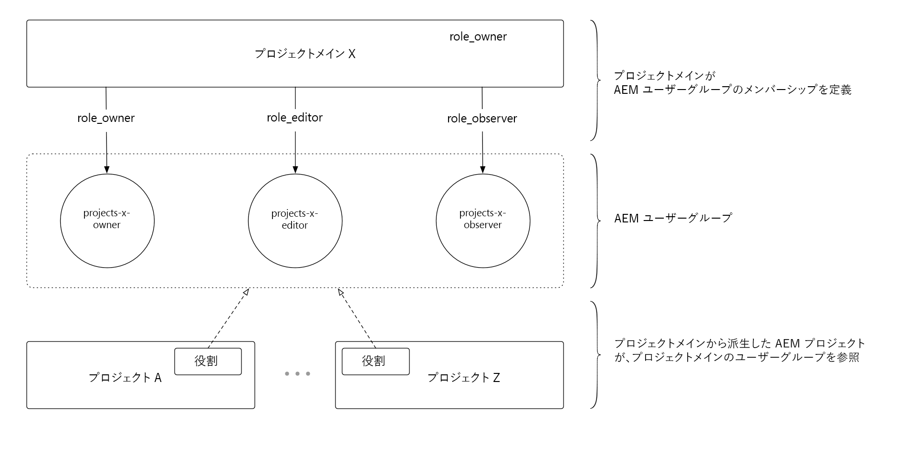

# プロジェクトマスターの使用

プロジェクトマスターは、[!DNL AEM Projects]を使ってユーザーとチームの管理を大幅に簡素化します。

>[!VIDEO](https://video.tv.adobe.com/v/17740/?quality=9&learn=on)

管理者は、**[!DNL Master Project]**&#x200B;を作成し、プロジェクトチームの一部としてユーザーをロール/権限に割り当てることができるようになりました。 プロジェクトはマスタープロジェクトから作成でき、チームメンバーシップを自動的に継承します。 このオファーには、次のいくつかの利点があります。

* 複数のプロジェクトで既存のチームを再利用
* チームが手作業で再作成する必要がないため、プロジェクトの作成を高速化
* 一元的な場所からチームメンバーシップを管理し、チームに対するすべての更新はプロジェクトに自動的に継承されます
* パフォーマンスの問題を引き起こす可能性のある重複ACLの作成を回避

[!DNL Master Projects] は、AEMプロジェクトの下の  Mastersフォルダに作成でき [!UICONTROL ます]。[!DNL Master Project]を作成すると、新しいプロジェクトを作成する際に、ウィザードで使用可能なテンプレートと一緒にオプションとして表示されます。

[!DNL Project Masters] URL（ローカルAEM作成者インスタンス）: [http://localhost:4502/projects.html/content/projects/masters](http://localhost:4502/projects.html/content/projects/masters)

## 削除 [!DNL Project Masters]

マスタープロジェクトを削除すると、使用できない派生プロジェクトになります。

マスタープロジェクトを削除する前に、すべての派生プロジェクトが完了し、AEMから削除されていることを確認します。 派生プロジェクトを削除する前に、必要なプロジェクトデータを必ず保存してください。 すべての派生プロジェクトをAEMから削除すると、マスタープロジェクトを安全に削除できます。

## [!DNL Project Masters]を非アクティブにする

プロジェクトのプロパティでマスタープロジェクトの状態を非アクティブに変更すると、非アクティブなマスタープロジェクトはマスタープロジェクトリストから消えます。

非アクティブなマスタープロジェクトを表示するには、上部バー(リスト表示の切り替えの横)の「アクティブ」フィルターボタンを切り替えます。 非アクティブなプロジェクトを再度アクティブにするには、非アクティブなマスタープロジェクトを選択し、プロジェクトプロパティを編集し、もう一度アクティブに設定します。

## [!DNL Project Masters]を理解

[!DNL Project Masters] aemユーザーグループのセット（所有者、編集者、監視者）を定義し、派生プロジェクトがそれらの一元的に定義されたユーザーグループを参照して再利用することを可能にする作業。

これにより、AEMで必要なユーザーグループの全体数が減ります。 [!DNL Project Masters]以前は、各プロジェクトは3つのユーザーグループを作成し、それに付随するACEを使用して権限付与を強制していたため、100のプロジェクトは300のユーザーグループを生成していました。 プロジェクトマスターでは、共有メンバーシップがプロジェクト全体のビジネス要件に適合すると仮定して、任意の数のプロジェクトが同じ3つのグループを再利用できます。
