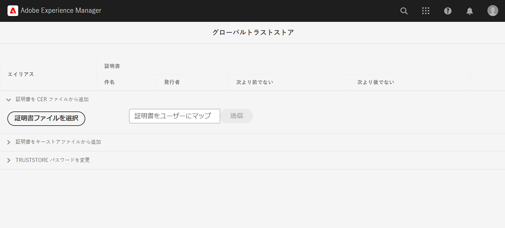

# プライベート証明書を使用した内部 API の呼び出し

プライベート証明書または自己署名証明書を使用した、AEM から web API への HTTPS 呼び出し方法を説明します。

>[!VIDEO](https://video.tv.adobe.com/v/3424853?quality=12&learn=on)

デフォルトでは、自己署名証明書を使用する web API に HTTPS 接続を確立しようとすると、次のエラーで接続が失敗します。

```
PKIX path building failed: sun.security.provider.certpath.SunCertPathBuilderException: unable to find valid certification path to requested target
```

この問題は、通常、**API の SSL 証明書が認定された認証局（CA）によって発行されておらず**、Java™ アプリケーションが SSL／TLS 証明書を検証できない場合に発生します。

[Apache HttpClient](https://hc.apache.org/httpcomponents-client-4.5.x/index.html) と **AEM のグローバル TrustStore** を使用して、プライベート証明書または自己署名証明書を使用する API を正常に呼び出す方法を学びましょう。


## HttpClient を使用したプロトタイプの API 呼び出しコード

次のコードでは、web API への HTTPS 接続を行います。

```java
...
String API_ENDPOINT = "https://example.com";

// Create HttpClientBuilder
HttpClientBuilder httpClientBuilder = HttpClientBuilder.create();

// Create HttpClient
CloseableHttpClient httpClient = httpClientBuilder.build();

// Invoke API
CloseableHttpResponse closeableHttpResponse = httpClient.execute(new HttpGet(API_ENDPOINT));

// Code that reads response code and body from the 'closeableHttpResponse' object
...
```

このコードでは、[Apache HttpComponent](https://hc.apache.org/) の [HttpClient](https://hc.apache.org/httpcomponents-client-4.5.x/index.html) ライブラリクラスとそのメソッドを使用します。


## HttpClient と、AEM TrustStore でのマテリアルの読み込み

_プライベート証明書または自己署名証明書_&#x200B;を使用する API エンドポイントを呼び出すには、[HttpClient](https://hc.apache.org/httpcomponents-client-4.5.x/index.html) の `SSLContextBuilder` を AEM の TrustStore で読み込み、接続を簡単にするために使用する必要があります。

次の手順に従います。

1. **AEM オーサー**&#x200B;に&#x200B;**管理者**&#x200B;としてログインします。
1. **AEM オーサー／ツール／セキュリティ／トラストストア**&#x200B;に移動し、**グローバルトラストストア**&#x200B;を開きます。初めてにアクセスする場合は、グローバルトラストストアのパスワードを設定します。

   

1. プライベート証明書を読み込むには、「**証明書ファイルを選択**」ボタンをクリックし、`.cer` 拡張子が付いた目的の証明書ファイルを選択します。「**送信**」ボタンをクリックして読み込みます。

1. Java™コードを以下のように更新します。`@Reference` を使用して AEM の `KeyStoreService` を取得するには、呼び出しコードを OSGi コンポーネント／サービスや、Sling モデルにする必要があります（そこで `@OsgiService` を使用します）。

   ```java
   ...
   
   // Get AEM's KeyStoreService reference
   @Reference
   private com.adobe.granite.keystore.KeyStoreService keyStoreService;
   
   ...
   
   // Get AEM TrustStore using KeyStoreService
   KeyStore aemTrustStore = getAEMTrustStore(keyStoreService, resourceResolver);
   
   if (aemTrustStore != null) {
   
       // Create SSL Context
       SSLContextBuilder sslbuilder = new SSLContextBuilder();
   
       // Load AEM TrustStore material into above SSL Context
       sslbuilder.loadTrustMaterial(aemTrustStore, null);
   
       // Create SSL Connection Socket using above SSL Context
       SSLConnectionSocketFactory sslsf = new SSLConnectionSocketFactory(
               sslbuilder.build(), NoopHostnameVerifier.INSTANCE);
   
       // Create HttpClientBuilder
       HttpClientBuilder httpClientBuilder = HttpClientBuilder.create();
       httpClientBuilder.setSSLSocketFactory(sslsf);
   
       // Create HttpClient
       CloseableHttpClient httpClient = httpClientBuilder.build();
   
       // Invoke API
       closeableHttpResponse = httpClient.execute(new HttpGet(API_ENDPOINT));
   
       // Code that reads response code and body from the 'closeableHttpResponse' object
       ...
   } 
   
   /**
    * 
    * Returns the global AEM TrustStore
    * 
    * @param keyStoreService OOTB OSGi service that makes AEM based KeyStore
    *                         operations easy.
    * @param resourceResolver
    * @return
    */
   private KeyStore getAEMTrustStore(KeyStoreService keyStoreService, ResourceResolver resourceResolver) {
   
       // get AEM TrustStore from the KeyStoreService and ResourceResolver
       KeyStore aemTrustStore = keyStoreService.getTrustStore(resourceResolver);
   
       return aemTrustStore;
   }
   
   ...
   ```

   * OOTB `com.adobe.granite.keystore.KeyStoreService` OSGi サービスを OSGi コンポーネントに挿入します。
   * `KeyStoreService` と `ResourceResolver` を使用してグローバル AEM TrustStore を取得します。これは `getAEMTrustStore(...)` メソッドで行います。
   * `SSLContextBuilder` のオブジェクトを作成します。Java™ [API の詳細](https://javadoc.io/static/org.apache.httpcomponents/httpcore/4.4.8/index.html?org/apache/http/ssl/SSLContextBuilder.html)を参照してください。
   * `loadTrustMaterial(KeyStore truststore,TrustStrategy trustStrategy)` メソッドを使用して、グローバル AEM TrustStore を `SSLContextBuilder` に読み込みます。
   * 上記のメソッドで `TrustStrategy` に `null` を渡すと、API の実行中に AEM の信頼済み証明書のみが成功することが保証されます。


>[!CAUTION]
>
>前述の方法を使用して実行すると、CA 発行の有効な証明書を使用した API 呼び出しは失敗します。このメソッドに従う場合、AEM の信頼済み証明書を使用した API 呼び出しのみが成功します。
>
>有効な CA 発行の証明書の API 呼び出しを実行するには、[標準的な方法](#prototypical-api-invocation-code-using-httpclient)を使用します。つまり、プライベート証明書に関連付けられた API のみを、前述のメソッドを使用して実行する必要があります。

## JVM キーストアの変更の回避

プライベート証明書を使用して内部 API を効果的に呼び出す従来の方法には、JVM キーストアの変更が含まれます。これは、Java™ [keytool](https://docs.oracle.com/en/java/javase/11/tools/keytool.html#GUID-5990A2E4-78E3-47B7-AE75-6D1826259549) コマンドを使用してプライベート証明書を読み込むことで実現します。

ただし、この方法はセキュリティのベストプラクティスと一致していないので、AEM では&#x200B;**グローバルトラストストア**&#x200B;と [KeyStoreService](https://javadoc.io/doc/com.adobe.aem/aem-sdk-api/latest/com/adobe/granite/keystore/KeyStoreService.html) を利用することで優れたオプションを提供します。


## ソリューションパッケージ

ビデオでデモされているサンプル Node.js プロジェクトは、[こちら](assets/internal-api-call/REST-APIs.zip)からダウンロードできます。

AEM サーブレットコードは、WKND Sites プロジェクトの `tutorial/web-api-invocation` ブランチで入手できます。[こちら](https://github.com/adobe/aem-guides-wknd/tree/tutorial/web-api-invocation/core/src/main/java/com/adobe/aem/guides/wknd/core/servlets)を参照してください。
