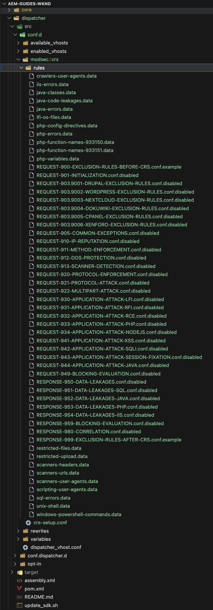
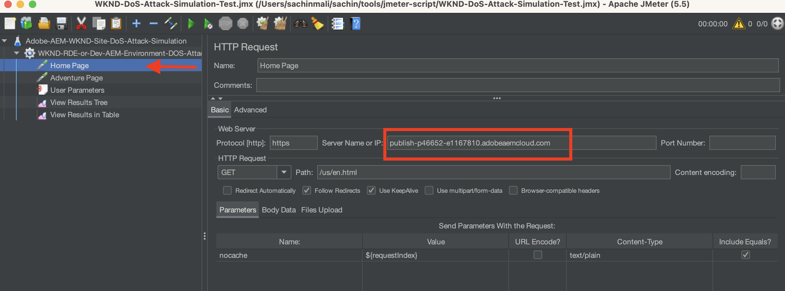
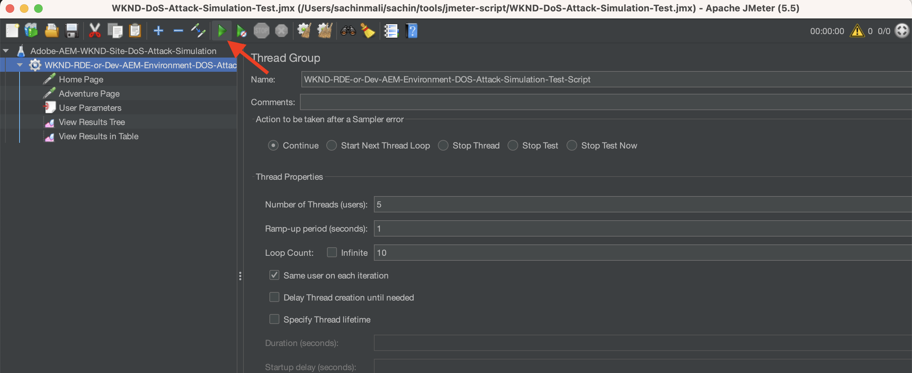

# ModSecurity を使用して AEM サイトを DoS 攻撃から保護する方法

ModSecurity を有効にして、Adobe Experience Manager（AEM）パブリッシュ Dispatcher 上で **OWASP ModSecurity Core Rule Set（CRS）**&#x200B;を使用してサイトをサービス拒否（DoS）攻撃から保護する方法を説明します。


>[!VIDEO](https://video.tv.adobe.com/v/3422976?quality=12&learn=on)

## 概要

[Open Web Application Security Project®（OWASP）](https://owasp.org/)Foundation では、web アプリケーションに関するセキュリティ上の10 件の最も重大な懸念事項を概説する [**OWASP Top 10**](https://owasp.org/www-project-top-ten/) を提供しています。

ModSecurity は、web アプリケーションに対する様々な攻撃から保護する、オープンソースのクロスプラットフォームソリューションです。また、これを使用すると、HTTP トラフィックのモニタリング、ログおよびリアルタイム分析も可能になります。

OWSAP® は、[OWASP® ModSecurity Core Rule Set（CRS）](https://github.com/coreruleset/coreruleset)も提供します。CRS は、ModSecurity で使用する汎用の&#x200B;**攻撃検出**&#x200B;ルールセットです。したがって、CRS は、誤った警告を最小限に抑えながら、OWASP Top 10 などの幅広い攻撃から web アプリケーションを保護することを目的としています。

このチュートリアルでは、**DOS-PROTECTION** CRS ルールを有効にし設定して、潜在的な DoS 攻撃からサイトを保護する方法を説明します。

>[!TIP]
>
>AEM as a Cloud Service の[管理による CDN](https://experienceleague.adobe.com/docs/experience-manager-cloud-service/content/implementing/content-delivery/cdn.html?lang=ja) では、顧客のパフォーマンス要件とセキュリティ要件のほとんどを満たしていることに留意することが重要です。ただし、ModSecurity は追加のセキュリティレイヤーを提供するほか、顧客固有のルールと設定を可能にします。

## Dispatcher プロジェクトモジュールへの CRS の追加

1. [最新の OWASP ModSecurity Core Rule Set](https://github.com/coreruleset/coreruleset/releases) をダウンロードして解凍します。

   ```shell
   # Replace the X.Y.Z with relevent version numbers.
   $ wget https://github.com/coreruleset/coreruleset/archive/refs/tags/vX.Y.Z.tar.gz
   
   # For version v3.3.5 when this tutorial is published
   $ wget https://github.com/coreruleset/coreruleset/archive/refs/tags/v3.3.5.tar.gz
   
   # Extract the downloaded file
   $ tar -xvzf coreruleset-3.3.5.tar.gz
   ```

1. AEM プロジェクトのコードの `dispatcher/src/conf.d/` 内に `modsec/crs` フォルダーを作成します。例えば、[AEM WKND Sites プロジェクト](https://github.com/adobe/aem-guides-wknd)のローカルコピー内です。

   {width="200" zoomable="yes"}

1. ダウンロードした CRS リリースパッケージの `coreruleset-X.Y.Z/rules` フォルダーを `dispatcher/src/conf.d/modsec/crs` フォルダーにコピーします。
1. ダウンロードした CRS リリースパッケージの `coreruleset-X.Y.Z/crs-setup.conf.example` ファイルを `dispatcher/src/conf.d/modsec/crs` フォルダーにコピーし、名前を `crs-setup.conf` に変更します。
1. `dispatcher/src/conf.d/modsec/crs/rules` からコピーしたすべての CRS ルールの名前を `XXXX-XXX-XXX.conf.disabled` に変更して無効にします。下記のコマンドを使用すると、すべてのファイルの名前を一度に変更できます。

   ```shell
   # Go inside the newly created rules directory within the dispathcher module
   $ cd dispatcher/src/conf.d/modsec/crs/rules
   
   # Rename all '.conf' extension files to '.conf.disabled'
   $ for i in *.conf; do mv -- "$i" "$i.disabled"; done
   ```

   下図のとおり、WKND プロジェクトコード内で CRS ルールと設定ファイルの名前が変更されことがわかります。

   {width="200" zoomable="yes"}

## サービス拒否（DoS）保護ルールの有効化と設定

サービス拒否（DoS）保護ルールを有効にし設定するには、次の手順に従います。

1. DoS 保護ルールを有効にするには、`dispatcher/src/conf.d/modsec/crs/rules` フォルダー内で `REQUEST-912-DOS-PROTECTION.conf.disabled` の名前を `REQUEST-912-DOS-PROTECTION.conf` に変更（またはルール名の拡張子から `.disabled` を削除）します。
1. ルールを設定するには、**DOS_COUNTER_THRESHOLD、DOS_BURST_TIME_SLICE、DOS_BLOCK_TIMEOUT** の各変数を定義します。
   1. `dispatcher/src/conf.d/modsec/crs` フォルダー内に `crs-setup.custom.conf` ファイルを作成します。
   1. 新しく作成したファイルに下記のルールスニペットを追加します。

   ```
   # The Denial of Service (DoS) protection against clients making requests too quickly.
   # When a client is making more than 25 requests (excluding static files) within
   # 60 seconds, this is considered a 'burst'. After two bursts, the client is
   # blocked for 600 seconds.
   SecAction \
       "id:900700,\
       phase:1,\
       nolog,\
       pass,\
       t:none,\
       setvar:'tx.dos_burst_time_slice=60',\
       setvar:'tx.dos_counter_threshold=25',\
       setvar:'tx.dos_block_timeout=600'"    
   ```

この例のルール設定では、**DOS_COUNTER_THRESHOLD** は 25、**DOS_BURST_TIME_SLICE** は 60 秒、**DOS_BLOCK_TIMEOUT** は 600 秒になっています。この設定では、60 秒以内に 25 件を超えるリクエスト（静的ファイルを除く）が 2 回発生すると DoS 攻撃と見なされ、その結果、リクエスト元のクライアントが 600 秒間（つまり 10 分間）ブロックされます。

>[!WARNING]
>
>ニーズに適した値を定義するには、web セキュリティチームと協力してください。

## CRS の初期化

CRS を初期化し、よくある誤検知を削除して、サイトのローカルの例外を追加するには、次の手順に従います。

1. CRS を初期化するには、**REQUEST-901-INITIALIZATION** ファイルから `.disabled` を削除します。つまり、`REQUEST-901-INITIALIZATION.conf.disabled` ファイルの名前を `REQUEST-901-INITIALIZATION.conf` に変更します。
1. ローカル IP （127.0.0.1） ping などの一般的な誤検出を削除するには、**REQUEST-905-COMMON-EXCEPTIONS** ファイルから `.disabled` を削除します。
1. AEM プラットフォームまたはサイト固有のパスなど、ローカルの例外を追加するには、`REQUEST-900-EXCLUSION-RULES-BEFORE-CRS.conf.example` の名前を `REQUEST-900-EXCLUSION-RULES-BEFORE-CRS.conf` に変更します。
   1. 新しく名前を変更したファイルに AEM プラットフォーム固有のパス例外を追加します。

   ```
   ########################################################
   # AEM as a Cloud Service exclusions                    #
   ########################################################
   # Ignoring AEM-CS Specific internal and reserved paths
   
   SecRule REQUEST_URI "@beginsWith /systemready" \
       "id:1010,\
       phase:1,\
       pass,\
       nolog,\
       ctl:ruleEngine=Off"    
   
   SecRule REQUEST_URI "@beginsWith /system/probes" \
       "id:1011,\
       phase:1,\
       pass,\
       nolog,\
       ctl:ruleEngine=Off"
   
   SecRule REQUEST_URI "@beginsWith /gitinit-status" \
       "id:1012,\
       phase:1,\
       pass,\
       nolog,\
       ctl:ruleEngine=Off"
   
   ########################################################
   # ADD YOUR SITE related exclusions                     #
   ########################################################
   ...
   ```

1. また、IP レピュテーションブロックチェック用の **REQUEST-910-IP-REPUTATION.conf.disabled** と異常スコアチェック用の `REQUEST-949-BLOCKING-EVALUATION.conf.disabled` から `.disabled` を削除します。

>[!TIP]
>
>AEM 6.5 環境で設定する場合は、上記のパスを、AEM のヘルスを確認するそれぞれの AMS パスまたはオンプレミスパス（別名ハートビートパス）に置き換える必要があります。

## ModSecurity Apache 設定の追加

ModSecurity（別名 `mod_security` Apache モジュール）を有効にするには、次の手順に従います。

1. 次のキー設定を含んだ `modsecurity.conf`（`dispatcher/src/conf.d/modsec/modsecurity.conf`）を作成します。

   ```
   # Include the baseline crs setup
   Include conf.d/modsec/crs/crs-setup.conf
   
   # Include your customizations to crs setup if exist
   IncludeOptional conf.d/modsec/crs/crs-setup.custom.conf
   
   # Select all available CRS rules:
   #Include conf.d/modsec/crs/rules/*.conf
   
   # Or alternatively list only specific ones you want to enable e.g.
   Include conf.d/modsec/crs/rules/REQUEST-900-EXCLUSION-RULES-BEFORE-CRS.conf
   Include conf.d/modsec/crs/rules/REQUEST-901-INITIALIZATION.conf
   Include conf.d/modsec/crs/rules/REQUEST-905-COMMON-EXCEPTIONS.conf
   Include conf.d/modsec/crs/rules/REQUEST-910-IP-REPUTATION.conf
   Include conf.d/modsec/crs/rules/REQUEST-912-DOS-PROTECTION.conf
   Include conf.d/modsec/crs/rules/REQUEST-949-BLOCKING-EVALUATION.conf
   
   # Start initially with engine off, then switch to detection and observe, and when sure enable engine actions
   #SecRuleEngine Off
   #SecRuleEngine DetectionOnly
   SecRuleEngine On
   
   # Remember to use relative path for logs:
   SecDebugLog logs/httpd_mod_security_debug.log
   
   # Start with low debug level
   SecDebugLogLevel 0
   #SecDebugLogLevel 1
   
   # Start without auditing
   SecAuditEngine Off
   #SecAuditEngine RelevantOnly
   #SecAuditEngine On
   
   # Tune audit accordingly:
   SecAuditLogRelevantStatus "^(?:5|4(?!04))"
   SecAuditLogParts ABIJDEFHZ
   SecAuditLogType Serial
   
   # Remember to use relative path for logs:
   SecAuditLog logs/httpd_mod_security_audit.log
   
   # You might still use /tmp for temporary/work files:
   SecTmpDir /tmp
   SecDataDir /tmp
   ```

1. AEM プロジェクトの Dispatcher モジュール `dispatcher/src/conf.d/available_vhosts` から目的の `.vhost`（`wknd.vhost` など）を選択し、`<VirtualHost>` ブロックの外側に次のエントリを追加します。

   ```
   # Enable the ModSecurity and OWASP CRS
   <IfModule mod_security2.c>
       Include conf.d/modsec/modsecurity.conf
   </IfModule>
   
   ...
   
   <VirtualHost *:80>
       ServerName    "publish"
       ...
   </VirtualHost>
   ```

上記の _ModSecurity CRS_ 設定と _DOS-PROTECTION_ 設定はすべて、AEM WKND Sites プロジェクトの [tutorial/enable-modsecurity-crs-dos-protection](https://github.com/adobe/aem-guides-wknd/tree/tutorial/enable-modsecurity-crs-dos-protection) 分岐で確認できます。

### Dispatcher 設定の検証

AEM as a Cloud Service を使用する場合は、_Dispatcher 設定_&#x200B;の変更をデプロイする前に、[AEM SDK の Dispatcher ツール](https://experienceleague.adobe.com/docs/experience-manager-learn/cloud-service/local-development-environment-set-up/dispatcher-tools.html?lang=ja)の `validate` スクリプトを使用して変更内容をローカルで検証することをお勧めします。

```
# Go inside Dispatcher SDK 'bin' directory
$ cd <YOUR-AEM-SDK-DIR>/<DISPATCHER-SDK-DIR>/bin

# Validate the updated Dispatcher configurations
$ ./validate.sh <YOUR-AEM-PROJECT-CODE-DIR>/dispatcher/src
```

## デプロイ

ローカルで検証した Dispatcher 設定を、Cloud Manager の [web 層](https://experienceleague.adobe.com/docs/experience-manager-cloud-service/content/implementing/using-cloud-manager/cicd-pipelines/configuring-production-pipelines.html?lang=ja#web-tier-config)または[フルスタック](https://experienceleague.adobe.com/docs/experience-manager-cloud-service/content/implementing/using-cloud-manager/cicd-pipelines/configuring-production-pipelines.html?lang=ja#full-stack-code)パイプラインを使用してデプロイします。また、[迅速な開発環境](https://experienceleague.adobe.com/docs/experience-manager-learn/cloud-service/developing/rde/overview.html?lang=ja)を使用して、短期間で開発することもできます。

## 確認

この例では、DoS 保護を検証するために、60 秒以内に 50 件（リクエスト件数のしきい値 25 x 発生回数 2）を超えるリクエストを送信します。ただし、これらのリクエストは、AEM as a Cloud Service の[ビルトイン](https://experienceleague.adobe.com/docs/experience-manager-cloud-service/content/implementing/content-delivery/cdn.html?lang=ja) CDN または web サイトの前面にある[その他の CDN](https://experienceleague.adobe.com/docs/experience-manager-cloud-service/content/implementing/content-delivery/cdn.html?lang=ja#point-to-point-CDN) を通過する必要があります。

CDN の通過を実現する 1 つの手法は、**各サイトページリクエストに新しいランダム値**&#x200B;を持つクエリパラメーターを追加することです。

短時間（60 秒など）内に多数のリクエスト（50 件以上）をトリガーするには、Apache [JMeter](https://jmeter.apache.org/) または [Benchmark または ab ツール](https://httpd.apache.org/docs/2.4/programs/ab.html)を使用します。

### JMeter スクリプトを使用した DoS 攻撃のシミュレーション

JMeter を使用して DoS 攻撃をシミュレートするには、次の手順に従います。

1. [Apache JMeter をダウンロード](https://jmeter.apache.org/download_jmeter.cgi)してローカルに[インストール](https://jmeter.apache.org/usermanual/get-started.html#install)します。
1. `<JMETER-INSTALL-DIR>/bin` ディレクトリの `jmeter` スクリプトを使用してローカルで[実行](https://jmeter.apache.org/usermanual/get-started.html#running)します。
1. **開く**&#x200B;ツールメニューを使用して、サンプルの [WKND-DoS- Attack-Simulation-Test](assets/modsecurity-crs/WKND-DoS-Attack-Simulation-Test.jmx) JMX スクリプトを JMeter で開きます。

   

1. _Home ページ_&#x200B;および _Adventure ページ_&#x200B;の HTTP リクエストサンプラーの「**サーバー名または IP**」フィールドの値を更新して、テスト AEM 環境の URL と一致させます。サンプル JMeter スクリプトのその他の詳細を確認します。

   

1. ツールメニューから&#x200B;**開始**&#x200B;ボタンを押して、スクリプトを実行します。このスクリプトは、WKND サイトの _Home ページ_&#x200B;と _Adventure ページ_&#x200B;に対して 50 件の HTTP リクエスト（ユーザー数 5、ループ回数 10）を送信します。こうして、非静的ファイルに対する合計 100 件のリクエストは、**DOS-PROTECTION** CRS ルールのカスタム設定に従って DoS 攻撃と見なされます。

   

1. JMeter の&#x200B;**結果を表で表示**&#x200B;リスナーには、リクエスト番号 53 以降の&#x200B;**失敗**&#x200B;応答ステータスが表示されます。

   

1. 失敗したリクエストに対して **503 HTTP 応答コード**&#x200B;が返された場合は、JMeter の&#x200B;**結果ツリーを表示**&#x200B;リスナーを使用して詳細を表示できます。

   

### ログを確認

ModSecurity ロガー設定は、DoS 攻撃インシデントの詳細をログ記録します。詳細を表示するには、次の手順に従います。

1. **Dispatcher を公開**&#x200B;の `httpderror` ログファイルをダウンロードして開きます。
1. ログファイル内で単語 `burst` を検索し、**エラー**&#x200B;行を確認します。

   ```
   Tue Aug 15 15:19:40.229262 2023 [security2:error] [pid 308:tid 140200050567992] [cm-p46652-e1167810-aem-publish-85df5d9954-bzvbs] [client 192.150.10.209] ModSecurity: Warning. Operator GE matched 2 at IP:dos_burst_counter. [file "/etc/httpd/conf.d/modsec/crs/rules/REQUEST-912-DOS-PROTECTION.conf"] [line "265"] [id "912170"] [msg "Potential Denial of Service (DoS) Attack from 192.150.10.209 - # of Request Bursts: 2"] [ver "OWASP_CRS/3.3.5"] [tag "application-multi"] [tag "language-multi"] [tag "platform-multi"] [tag "paranoia-level/1"] [tag "attack-dos"] [tag "OWASP_CRS"] [tag "capec/1000/210/227/469"] [hostname "publish-p46652-e1167810.adobeaemcloud.com"] [uri "/content/wknd/us/en/adventures.html"] [unique_id "ZNuXi9ft_9sa85dovgTN5gAAANI"]
   
   ...
   
   Tue Aug 15 15:19:40.515237 2023 [security2:error] [pid 309:tid 140200051428152] [cm-p46652-e1167810-aem-publish-85df5d9954-bzvbs] [client 192.150.10.209] ModSecurity: Access denied with connection close (phase 1). Operator EQ matched 0 at IP. [file "/etc/httpd/conf.d/modsec/crs/rules/REQUEST-912-DOS-PROTECTION.conf"] [line "120"] [id "912120"] [msg "Denial of Service (DoS) attack identified from 192.150.10.209 (1 hits since last alert)"] [ver "OWASP_CRS/3.3.5"] [tag "application-multi"] [tag "language-multi"] [tag "platform-multi"] [tag "paranoia-level/1"] [tag "attack-dos"] [tag "OWASP_CRS"] [tag "capec/1000/210/227/469"] [hostname "publish-p46652-e1167810.adobeaemcloud.com"] [uri "/us/en.html"] [unique_id "ZNuXjAN7ZtmIYHGpDEkmmwAAAQw"]
   ```

1. _クライアント IP アドレス_、アクション、エラーメッセージ、リクエストの詳細などの詳細を確認します。

## ModSecurity がパフォーマンスに与える影響

ModSecurity と関連ルールを有効にすると、パフォーマンスに多少の影響が生じるので、必要なルール、冗長ルール、スキップされるルールに留意してください。 Web セキュリティの専門家と協力して、CRS ルールを有効にし、カスタマイズします。

### 追加のルール

このチュートリアルでは、デモ目的で **DOS 保護** CRS ルールを有効にして、カスタマイズするだけです。適切なルールを理解、確認、設定するには、web セキュリティの専門家と提携することをお勧めします。
