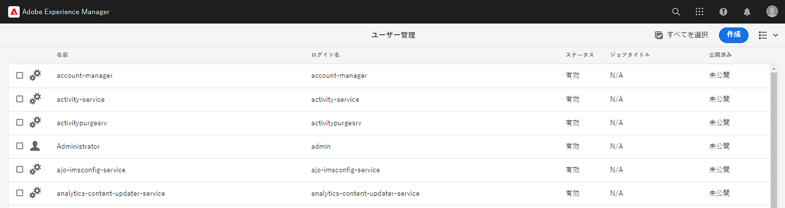
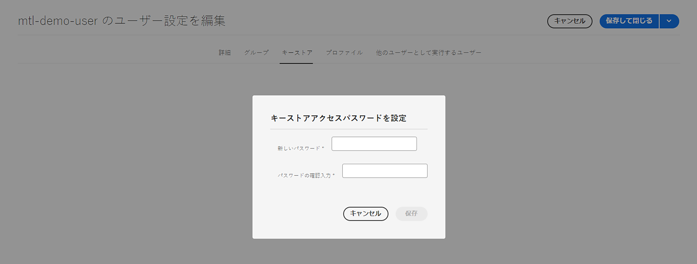
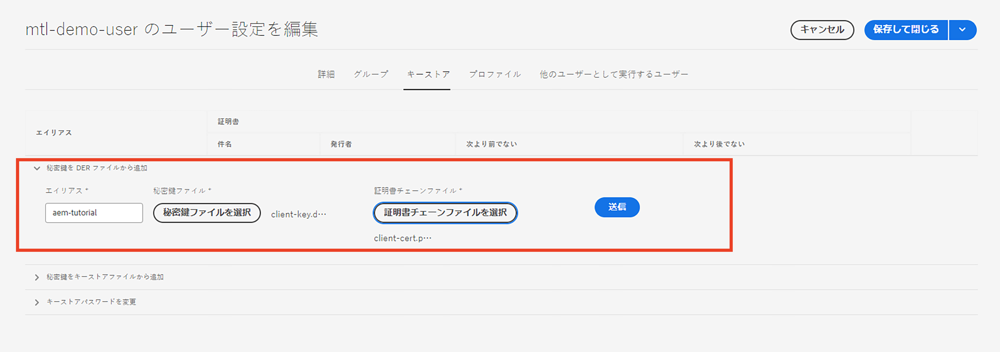
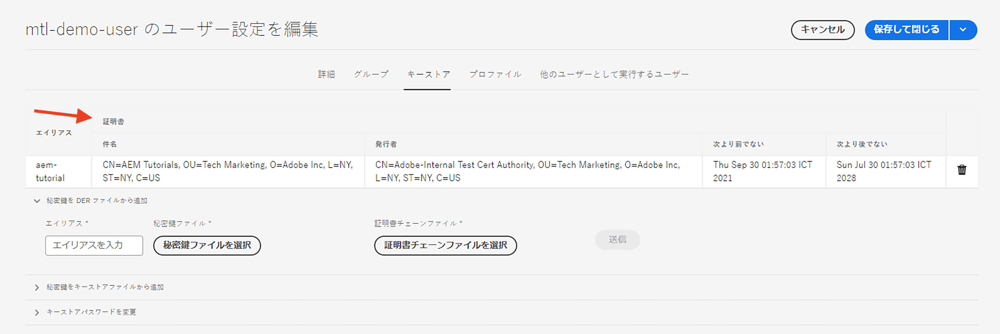

# AEM からの Mutual Transport Layer Security（mTLS）認証

AEM から Mutual Transport Layer Security（mTLS）認証を必要とする web API への HTTPS 呼び出しを行う方法について説明します。

>[!VIDEO](https://video.tv.adobe.com/v/3447860?captions=jpn&quality=12&learn=on)

mTLS または双方向 TLS 認証は、**クライアントとサーバーの両方に相互認証**&#x200B;をリクエストすることで、TLS プロトコルのセキュリティを強化します。この認証は、電子証明書を使用して実行されます。これは、強力なセキュリティと ID 検証が重要なシナリオで一般的に使用されます。

デフォルトでは、mTLS 認証を必要とする web API に HTTPS 接続を確立しようとすると、次のエラーで接続が失敗します。

```
javax.net.ssl.SSLHandshakeException: Received fatal alert: certificate_required
```

この問題は、クライアントが自身を認証する証明書を提示しない場合に発生します。

[Apache HttpClient](https://hc.apache.org/httpcomponents-client-4.5.x/index.html) と **AEM のキーストアおよびトラストストア**&#x200B;を使用して、mTLS 認証を必要とする API を正常に呼び出す方法を学びましょう。


## HttpClient と、AEM キーストアでのマテリアルの読み込み

AEM から mTLS で保護された API を呼び出すには、大まかには、次の手順を実行する必要があります。

### AEM 証明書の生成

組織のセキュリティチームと連携して、AEM 証明書をリクエストします。セキュリティチームは、キー、証明書署名要求（CSR）、CSR を使用して証明書が発行されるなど、証明書関連の詳細を提供または要求します。

デモの目的で、キー、証明書署名要求（CSR）など、証明書関連の詳細を生成します。次の例では、自己署名 CA を使用して証明書を発行します。

- まず、内部証明機関（CA）証明書を生成します。

  ```shell
  # Create an internal Certification Authority (CA) certificate
  openssl req -new -x509 -days 9999 -keyout internal-ca-key.pem -out internal-ca-cert.pem
  ```

- AEM 証明書を生成します。

  ```shell
  # Generate Key
  openssl genrsa -out client-key.pem
  
  # Generate CSR
  openssl req -new -key client-key.pem -out client-csr.pem
  
  # Generate certificate and sign with internal Certification Authority (CA)
  openssl x509 -req -days 9999 -in client-csr.pem -CA internal-ca-cert.pem -CAkey internal-ca-key.pem -CAcreateserial -out client-cert.pem
  
  # Verify certificate
  openssl verify -CAfile internal-ca-cert.pem client-cert.pem
  ```

- AEM 秘密鍵を DER 形式に変換します。AEM のキーストアには、DER 形式の秘密鍵が必要です。

  ```shell
  openssl pkcs8 -topk8 -inform PEM -outform DER -in client-key.pem -out client-key.der -nocrypt
  ```

>[!TIP]
>
>自己署名 CA 証明書は、開発目的でのみ使用されます。実稼動環境では、信頼できる証明機関（CA）を使用して証明書を発行します。


### 証明書の交換

上記のように、AEM 証明書に自己署名 CA を使用する場合は、証明書または内部証明機関（CA）証明書を API プロバイダーに送信します。

また、API プロバイダーが自己署名 CA 証明書を使用している場合は、API プロバイダーから証明書または内部証明機関（CA）証明書を受信します。

### 証明書の読み込み

AEM 証明書を読み込むには、次の手順に従います。

1. **AEM オーサー**&#x200B;に&#x200B;**管理者**&#x200B;としてログインします。

1. **AEM オーサー／ツール／セキュリティ／ユーザー／既存のユーザーを作成または選択**&#x200B;に移動します。

   

   デモの目的で、`mtl-demo-user` という名前の新しいユーザーが作成されます。

1. **ユーザープロパティ**&#x200B;を開くには、ユーザー名をクリックします。

1. 「**キーストア**」タブ、「**キーストアを作成**」ボタンの順にクリックします。次に、**キーストアアクセスパスワードを設定**&#x200B;ダイアログで、このユーザーのキーストアのパスワードを設定し、「保存」をクリックします。

   

1. 新しい画面の「**DER ファイルから秘密鍵を追加**」セクションで、次の手順に従います。

   1. エイリアスを入力

   1. 上記で生成した AEM 秘密鍵を DER 形式で読み込みます。

   1. 上記で生成した証明書チェーンファイルを読み込みます。

   1. 「送信」をクリックします

      

1. 証明書が正常に読み込まれたことを確認します。

   

API プロバイダーが自己署名 CA 証明書を使用している場合は、[こちら](https://experienceleague.adobe.com/docs/experience-manager-learn/foundation/security/call-internal-apis-having-private-certificate.html?lang=ja#httpclient-and-load-aem-truststore-material)の手順に従って、受信した証明書を AEM のトラストストアに読み込みます。

同様に、AEM が自己署名 CA 証明書を使用している場合は、API プロバイダーに読み込むようにリクエストします。

### HttpClient を使用したプロトタイプの mTLS API 呼び出しコード

Java™コードを以下のように更新します。`@Reference` の注釈を使用して AEM の `KeyStoreService` サービスを取得するには、呼び出しコードを OSGi コンポーネント／サービスや、Sling モデルにする必要があります（そこで `@OsgiService` を使用します）。


```java
...

// Get AEM's KeyStoreService reference
@Reference
private com.adobe.granite.keystore.KeyStoreService keyStoreService;

...

// Get AEM KeyStore using KeyStoreService
KeyStore aemKeyStore = getAEMKeyStore(keyStoreService, resourceResolver);

if (aemKeyStore != null) {

    // Create SSL Context
    SSLContextBuilder sslbuilder = new SSLContextBuilder();

    // Load AEM KeyStore material into above SSL Context with keystore password
    // Ideally password should be encrypted and stored in OSGi config
    sslbuilder.loadKeyMaterial(aemKeyStore, "admin".toCharArray());

    // If API provider cert is self-signed, load AEM TrustStore material into above SSL Context
    // Get AEM TrustStore
    KeyStore aemTrustStore = getAEMTrustStore(keyStoreService, resourceResolver);
    sslbuilder.loadTrustMaterial(aemTrustStore, null);

    // Create SSL Connection Socket using above SSL Context
    SSLConnectionSocketFactory sslsf = new SSLConnectionSocketFactory(
            sslbuilder.build(), NoopHostnameVerifier.INSTANCE);

    // Create HttpClientBuilder
    HttpClientBuilder httpClientBuilder = HttpClientBuilder.create();
    httpClientBuilder.setSSLSocketFactory(sslsf);

    // Create HttpClient
    CloseableHttpClient httpClient = httpClientBuilder.build();

    // Invoke API
    closeableHttpResponse = httpClient.execute(new HttpGet(MTLS_API_ENDPOINT));

    // Code that reads response code and body from the 'closeableHttpResponse' object
    ...
} 

/**
 * Returns the AEM KeyStore of a user. In this example we are using the
 * 'mtl-demo-user' user.
 * 
 * @param keyStoreService
 * @param resourceResolver
 * @return AEM KeyStore
 */
private KeyStore getAEMKeyStore(KeyStoreService keyStoreService, ResourceResolver resourceResolver) {

    // get AEM KeyStore of 'mtl-demo-user' user, you can create a user or use an existing one. 
    // Then create keystore and upload key, certificate files.
    KeyStore aemKeyStore = keyStoreService.getKeyStore(resourceResolver, "mtl-demo-user");

    return aemKeyStore;
}

/**
 * 
 * Returns the global AEM TrustStore
 * 
 * @param keyStoreService OOTB OSGi service that makes AEM based KeyStore
 *                         operations easy.
 * @param resourceResolver
 * @return
 */
private KeyStore getAEMTrustStore(KeyStoreService keyStoreService, ResourceResolver resourceResolver) {

    // get AEM TrustStore from the KeyStoreService and ResourceResolver
    KeyStore aemTrustStore = keyStoreService.getTrustStore(resourceResolver);

    return aemTrustStore;
}

...
```

- OOTB `com.adobe.granite.keystore.KeyStoreService` OSGi サービスを OSGi コンポーネントに挿入します。
- `KeyStoreService` と `ResourceResolver` を使用して AEM キーストアを取得します。これは `getAEMKeyStore(...)` メソッドで行います。
- API プロバイダーが自己署名 CA 証明書を使用している場合は、グローバル AEM トラストストアを取得します。これは `getAEMTrustStore(...)` メソッドで行います。
- `SSLContextBuilder` のオブジェクトを作成します。Java™ [API の詳細](https://javadoc.io/static/org.apache.httpcomponents/httpcore/4.4.8/index.html?org/apache/http/ssl/SSLContextBuilder.html)を参照してください。
- `loadKeyMaterial(final KeyStore keystore,final char[] keyPassword)` メソッドを使用して、AEM キーストアを `SSLContextBuilder` に読み込みます。
- キーストアのパスワードは、キーストアの作成時に設定したパスワードで、OSGi 設定に保存する必要があります。[秘密の設定値](https://experienceleague.adobe.com/docs/experience-manager-cloud-service/content/implementing/deploying/configuring-osgi.html#secret-configuration-values?lang=ja)を参照してください。

## JVM キーストアの変更の回避

プライベート証明書を使用して mTLS API を効果的に呼び出す従来の方法には、JVM キーストアの変更が含まれます。これは、Java™ [keytool](https://docs.oracle.com/en/java/javase/11/tools/keytool.html#GUID-5990A2E4-78E3-47B7-AE75-6D1826259549) コマンドを使用してプライベート証明書を読み込むことで実現します。

ただし、この方法はセキュリティのベストプラクティスと一致していないので、AEM では&#x200B;**ユーザー固有のキーストアおよびグローバルトラストストア**&#x200B;と [KeyStoreService](https://javadoc.io/doc/com.adobe.aem/aem-sdk-api/latest/com/adobe/granite/keystore/KeyStoreService.html) を利用することで優れたオプションを提供します。

## ソリューションパッケージ

ビデオでデモされているサンプル Node.js プロジェクトは、[こちら](assets/internal-api-call/REST-APIs.zip)からダウンロードできます。

AEM サーブレットコードは、WKND Sites プロジェクトの `tutorial/web-api-invocation` ブランチで入手できます。[こちら](https://github.com/adobe/aem-guides-wknd/tree/tutorial/web-api-invocation/core/src/main/java/com/adobe/aem/guides/wknd/core/servlets)を参照してください。
