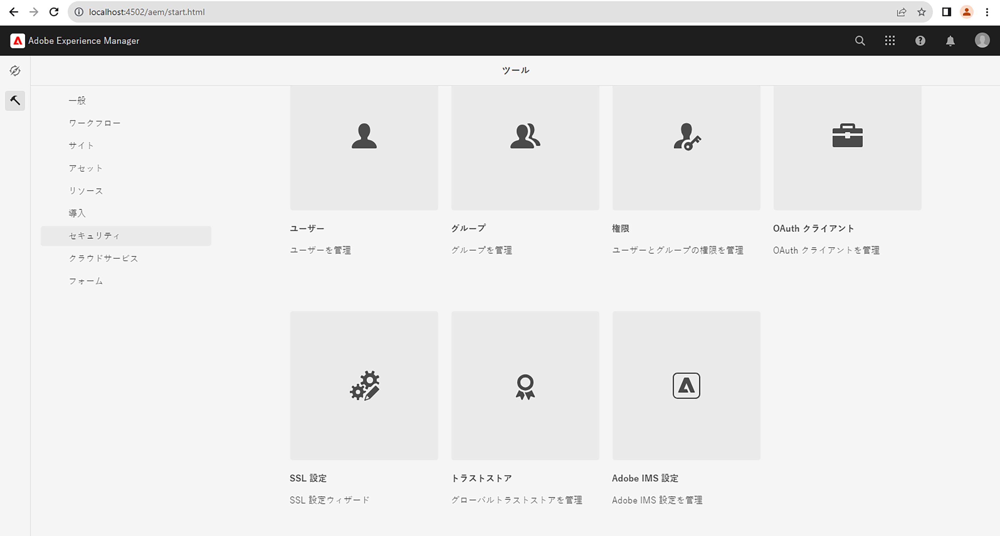
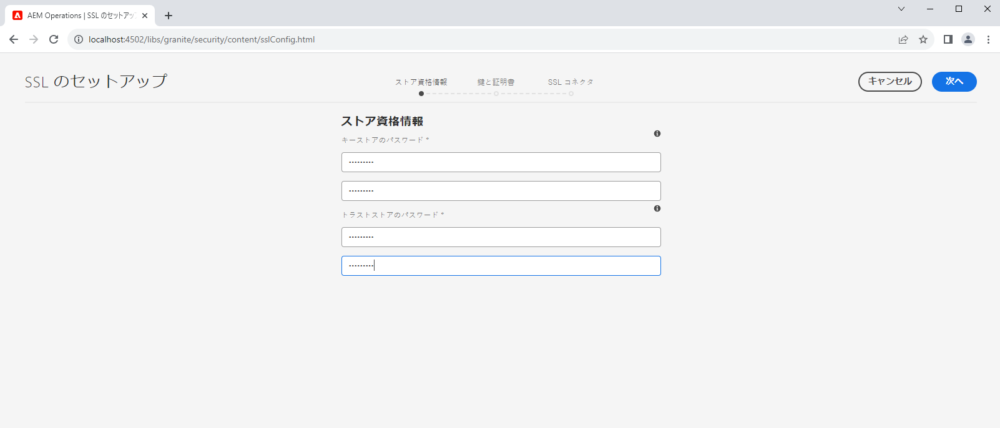
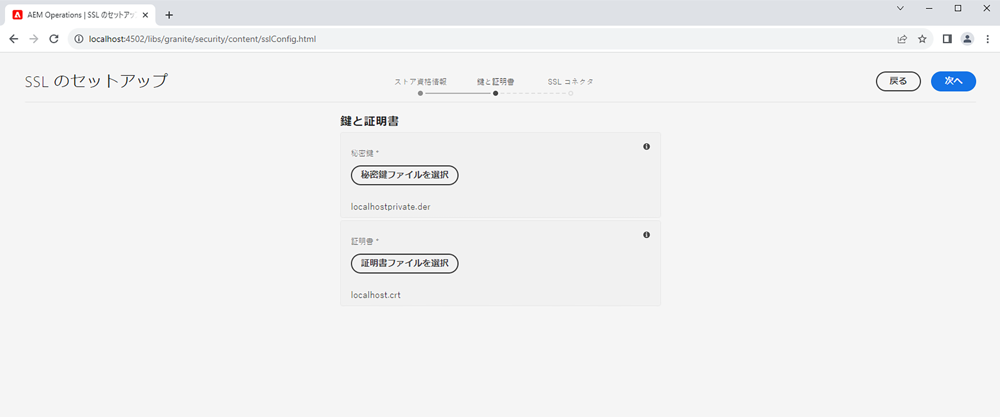
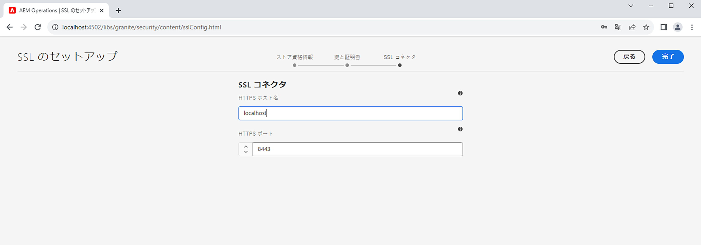
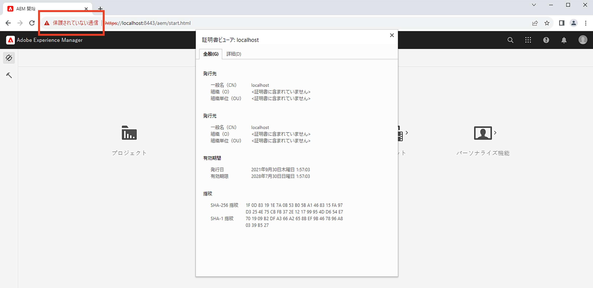

# AEM での SSL ウィザードの使用

組み込みの SSL ウィザードを使用して、Adobe Experience Manager で SSL を設定し、HTTPS で実行する方法を説明します。

>[!VIDEO](https://video.tv.adobe.com/v/17993?quality=12&learn=on)


>[!NOTE]
>
>管理環境の場合、IT 部門が CA に信頼された証明書と鍵を提供するのが最適です。
>
>自己署名証明書は、開発目的でのみ使用されます。

## SSL 設定ウィザードの使用

__AEM オーサー／ツール／セキュリティ／SSL 設定__&#x200B;に移動し、__SSL 設定ウィザード__&#x200B;を開きます。



### ストア資格情報を作成

`ssl-service` システムユーザーおよびグローバル&#x200B;_トラストストア_&#x200B;に関連する&#x200B;_キーストア_&#x200B;を作成するには、__ストア資格情報__&#x200B;ウィザードの手順を使用します。

1. パスワードを入力して、`ssl-service` システムユーザーに関連する&#x200B;__キーストア__&#x200B;のパスワードを確認します。
1. パスワードを入力して、グローバル&#x200B;__トラストストア__&#x200B;のパスワードを確認します。システム全体のトラストストアで、既にトラストストアが作成されている場合、入力されたパスワードは無視されることに注意してください。

   

### 秘密鍵と証明書をアップロード

_秘密鍵_&#x200B;および _SSL 証明書_&#x200B;をアップロードするには、__キーと証明書__&#x200B;ウィザードの手順を使用します。

通常、IT 部門が CA 信頼済みの証明書とキーを提供しますが、自己署名済みの証明書は&#x200B;__開発__&#x200B;および&#x200B;__テスト__&#x200B;の目的で使用できます。

自己署名証明書を作成またはダウンロードするには、[自己署名の秘密鍵および証明書](#self-signed-private-key-and-certificate)を参照してください。

1. DER（Distinguished Encoding Rules）形式の&#x200B;__秘密鍵__&#x200B;をアップロードします。PEM とは異なり、DER でエンコードされたファイルには、`-----BEGIN CERTIFICATE-----` のようなプレーンテキストステートメントは含まれません。
1. `.crt` 形式の関連する __SSL 証明書__&#x200B;をアップロードします。

   

### SSL コネクターの詳細を更新

_hostname_ および&#x200B;_ポート_&#x200B;をアップロードするには、__SSL コネクター__&#x200B;ウィザードの手順を使用します。

1. __HTTPS ホスト名__&#x200B;値を更新または検証し、証明書の `Common Name (CN)` を一致させる必要があります。
1. __HTTPS ポート__&#x200B;の値を更新または検証します。

   

### SSL 設定の検証

1. SSL を検証するには、「__HTTPS URL に移動__」ボタンをクリックします。
1. 自己署名証明書を使用している場合は、`Your connection is not private` エラーが表示されます。

   

## 自己署名秘密鍵および証明書

次の ZIP には、ローカルで AEM SSL を設定するために必要な [!DNL DER] および [!DNL CRT] のファイルが含まれており、ローカルでの開発のみを目的としています。

この [!DNL DER] および [!DNL CERT] ファイルは、便宜上提供され、次の「秘密鍵と自己署名証明書を生成する」のセッションで説明されている手順を使用して生成されます。

必要な場合、証明書のパスフレーズは **admin** です。

この localhost - 秘密鍵および自己署名証明書.zip（有効期限 2028年7月）

[証明書ファイルをダウンロードする](assets/use-the-ssl-wizard/certificate.zip)

### 秘密鍵と自己署名証明書の生成

上記のビデオでは、自己署名付き証明書を使用した AEM オーサーインスタンス上の SSL の設定と構成を示しています。[[!DNL OpenSSL] ](https://www.openssl.org/) を使用して次のコマンドを実行すると、ウィザードの手順 2 で使用する秘密鍵と証明書を生成することができます。

```shell
### Create Private Key
$ openssl genrsa -aes256 -out localhostprivate.key 4096

### Generate Certificate Signing Request using private key
$ openssl req -sha256 -new -key localhostprivate.key -out localhost.csr -subj '/CN=localhost'

### Generate the SSL certificate and sign with the private key, will expire one year from now
$ openssl x509 -req -extfile <(printf "subjectAltName=DNS:localhost") -days 365 -in localhost.csr -signkey localhostprivate.key -out localhost.crt

### Convert Private Key to DER format - SSL wizard requires key to be in DER format
$ openssl pkcs8 -topk8 -inform PEM -outform DER -in localhostprivate.key -out localhostprivate.der -nocrypt
```
