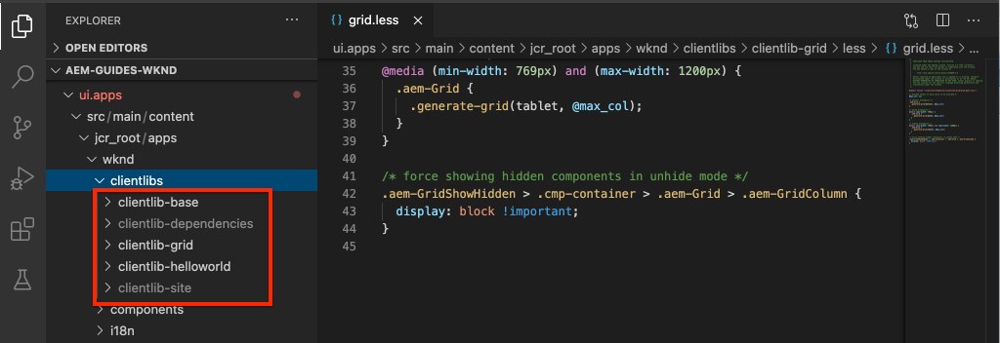
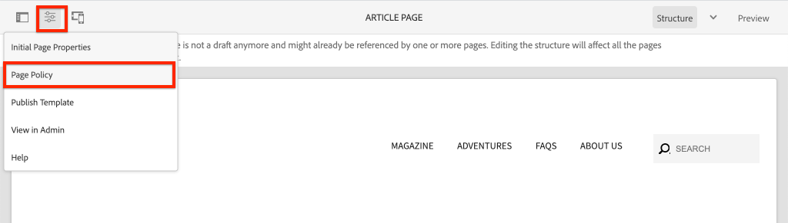
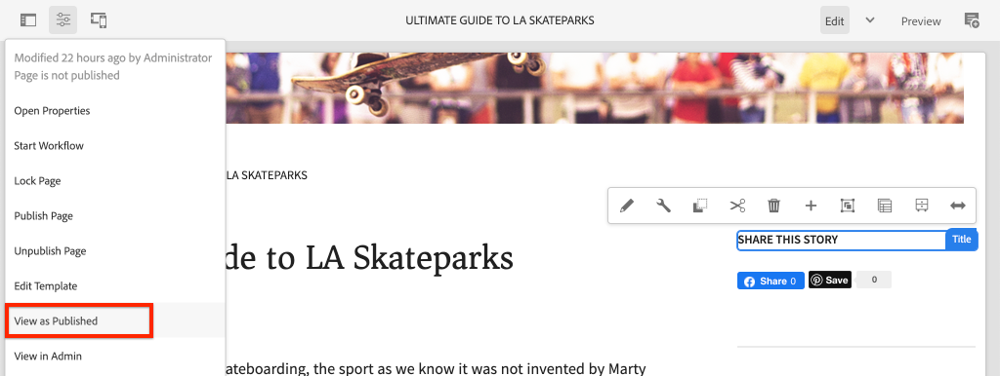

# クライアント側ライブラリとフロントエンドワークフロー{#client-side-libraries}

Adobe Experience Manager(AEM)サイト実装のCSSとJavaScriptをデプロイおよび管理するために、クライアント側ライブラリまたはclientlibを使用する方法について説明します。 このチュートリアルでは、[ui.frontend](https://docs.adobe.com/content/help/ja-JP/experience-manager-core-components/using/developing/archetype/uifrontend.html)モジュール（デカップされた[webpack](https://webpack.js.org/)プロジェクト）をエンドツーエンドのビルドプロセスに統合する方法についても説明します。

## 前提条件 {#prerequisites}

[ローカル開発環境](overview.md#local-dev-environment)の設定に必要なツールと手順を確認します。

また、[基本コンポーネント](component-basics.md#client-side-libraries)チュートリアルを確認して、クライアント側のライブラリとAEMの基本事項を理解することをお勧めします。

### スタータープロジェクト

チュートリアルが構築する基本行コードを調べます。

1. [github.com/adobe/aem-guides-wknd](https://github.com/adobe/aem-guides-wknd)リポジトリをコピーします。
1. `client-side-libraries/start`ブランチをチェックアウト

   ```shell
   $ git clone git@github.com:adobe/aem-guides-wknd.git ~/code/aem-guides-wknd
   $ cd ~/code/aem-guides-wknd
   $ git checkout client-side-libraries/start
   ```

1. Mavenのスキルを使用して、ローカルAEMインスタンスにコードベースをデプロイします。

   ```shell
   $ cd ~/code/aem-guides-wknd
   $ mvn clean install -PautoInstallSinglePackage
   ```

終了したコードは、[GitHub](https://github.com/adobe/aem-guides-wknd/tree/client-side-libraries/solution)に常に表示できます。また、ブランチ`client-side-libraries/solution`に切り替えて、コードをローカルでチェックアウトすることもできます。

## 目的

1. 編集可能なテンプレートを使用して、クライアントサイドライブラリをページに含める方法を理解します。
1. UI.Frontend ModuleとWebPack開発サーバーを使用して、専用のフロントエンド開発を行う方法を説明します。
1. コンパイル済みCSSとJavaScriptをSites実装に配信する、エンドツーエンドのワークフローを理解します。

## 作成する内容 {#what-you-will-build}

この章では、実装を[UIデザインのモックアップ](assets/pages-templates/wknd-article-design.xd)に近づけるために、WKNDサイトと記事ページテンプレートに基本スタイルを追加します。 高度なフロントエンドワークフローを使用して、WebPackプロジェクトをAEMクライアントライブラリに統合します。

>[!VIDEO](https://video.tv.adobe.com/v/30359/?quality=12&learn=on)

## 背景 {#background}

クライアント側ライブラリは、AEM Sites の実装で必要な CSS および JavaScript ファイルの編成および管理のための仕組みを提供します。クライアント側のライブラリまたはclientlibの基本的な目標は次のとおりです。

1. CSS／JS を、開発および管理が簡単な個別の小さなファイルに保存する
1. 組織立った方法で、サードパーティのフレームワークへの依存関係を管理する
1. CSS／JS を 1～2 個の要求に連結することで、クライアント側の要求数を最小限にする。

クライアント側ライブラリの使用の詳細については、[こちら](https://docs.adobe.com/content/help/ja-JP/experience-manager-65/developing/introduction/clientlibs.html)を参照してください。

クライアント側のライブラリにはいくつかの制限があります。 特に顕著なのは、Sass、LESS、TypeScriptなどの一般的なフロントエンド言語に対する限定的なサポートです。 このチュートリアルでは、**ui.frontend**&#x200B;モジュールがこの問題を解決する方法を見ていきます。

スターターコードベースをローカルAEMインスタンスにデプロイし、[http://localhost:4502/editor.html/content/wknd/us/en/magazine/guide-la-skateparks.html](http://localhost:4502/editor.html/content/wknd/us/en/magazine/guide-la-skateparks.html)に移動します。 このページのスタイルは現在解除されています。 次に、WKNDブランド用のクライアント側ライブラリを実装し、ページにCSSとJavaScriptを追加します。

## クライアント側ライブラリ組織{#organization}

次に、[AEMプロジェクトのアーキタイプ](https://docs.adobe.com/content/help/ja-JP/experience-manager-core-components/using/developing/archetype/overview.html)で生成されたclientlibの組織を調べます。


*ハイレベルな図クライアント側ライブラリの構成とページの組み込み*

>[!NOTE]
>
> 以下のクライアント側ライブラリ組織は、AEM Project Archetypeによって生成されますが、単なる出発点に過ぎません。 プロジェクトがCSSとJavaScriptを最終的にどのように管理し、Sites実装に配信するかは、リソース、スキルセットおよび要件に応じて大きく異なります。

1. Eclipseまたは他のIDEを使用して、**ui.apps**&#x200B;モジュールを開きます。
1. パス`/apps/wknd/clientlibs`を展開し、アーキタイプで生成されたclientlibを表示します。

   

   以下では、これらのclientlibを詳しく調べます。

1. `clientlibs/clientlib-base`の特性をInspectに伝えます。

   **clientlib-** baseは、WKNDサイトが機能するために必要なCSSとJavaScriptの基本レベルを表します。`categories`プロパティが`wknd.base`に設定されていることに注意してください。 `categories` はclientlibのタグ付けメカニズムで、これらを参照する方法です。

   値の`embed`プロパティと`String[]`に注目してください。 `embed`プロパティは、カテゴリに基づいて他のclientlibを埋め込みます。 **clientlib-** baseには、必要なAEMコアコンポーネントのクライアントライブラリがすべて含まれます。これには、カルーセル用のjavascriptやクイック検索コンポーネントなど、機能するアーティファクトが含まれます。 **clientlib-** baseには、独自のCSSとJavascriptは含まれず、他のクライアントライブラリも埋め込まれます。**clientlib-** basembedsは、のカテゴリで **clientlib-** gridclientlibを埋め込み `wknd.grid`ます。

   `allowProxy`プロパティが`true`に設定されていることに注意してください。 clientlibに常に`allowProxy=true`を設定するのがベストプラクティスです。 `allowProxy`プロパティを使用すると、clientlibを`/apps` **の下に格納できますが、**&#x200B;は`/etc.clientlibs`というプリフィックスが付いたパスにclientlibを配信し、エンドユーザーに対してアプリケーションコードが公開されないようにします。 [allowProxyプロパティの詳細については、こちらを参照してください。](https://docs.adobe.com/content/help/en/experience-manager-65/developing/introduction/clientlibs.html#locating-a-client-library-folder-and-using-the-proxy-client-libraries-servlet)

1. `clientlibs/clientlib-grid`の特性をInspectに伝えます。

   **clientlib-** gridisは、AEM Sitesエディタで [レイアウト](https://docs.adobe.com/content/help/ja-JP/experience-manager-65/authoring/siteandpage/responsive-layout.html) モードを使用する際に必要なCSSを含めたり生成したりします。**clientlib-** gridは、にカテゴリを設定し `wknd.grid` 、clientlib-baseを介して埋め込ま **れています**。

   グリッドは、様々な量の列とブレークポイントを使用するようにカスタマイズできます。 次に、生成されたデフォルトのブレークポイントを更新します。

1. ファイルを更新`/apps/wknd/clientlibs/clientlib-grid/less/grid.less`:

   ```css
   @import (once) "/libs/wcm/foundation/clientlibs/grid/grid_base.less";
   
   /* maximum amount of grid cells to be provided */
   @max_col: 12;
   @screen-small: 767px;
   @screen-medium: 1024px;
   @screen-large: 1200px;
   @gutter-padding: 14px;
   
   /* default breakpoint */
   .aem-Grid {
       .generate-grid(default, @max_col);
   }
   
   /* phone breakpoint */
   @media (max-width: @screen-small) {
       .aem-Grid {
           .generate-grid(phone, @max_col);
       }
   }
   /* tablet breakpoint */
   @media (min-width: (@screen-small + 1)) and (max-width: @screen-medium) {
       .aem-Grid {
           .generate-grid(tablet, @max_col);
       }
   }
   
   .aem-GridColumn {
       padding: 0 @gutter-padding;
   }
   
   .responsivegrid.aem-GridColumn {
       padding-left: 0;
       padding-right: 0;
   }
   ```

   これにより、`/ui.content/src/main/content/jcr_root/conf/wknd/settings/wcm/templates/article-page-template/structure/.content.xml`に設定されたテンプレートのブレークポイントに対応するようにブレークポイントが変更されます。

   このファイルは、実際に`/libs`の下の`grid_base.less`ファイルを参照しています。このファイルには、グリッドを生成するカスタムミックスインが含まれています。

1. `clientlibs/clientlib-site`のプロパティをInspectに渡します。

   **clientlib-** siteには、WKNDブランド用のサイト固有のスタイルがすべて含まれます。`wknd.site`のカテゴリをメモしておきます。 このclientlibを生成するCSSとJavaScriptは、実際には`ui.frontend`モジュールで管理されます。 次に、この統合について検討します。

1. `clientlibs/clientlib-dependencies`のプロパティをInspectに渡します。

   **clientlib-** dependenciesは、サードパーティの依存関係を埋め込むためのものです。これは別のclientlibで、必要に応じてHTMLページの先頭に読み込むことができます。 `wknd.dependencies`のカテゴリをメモしておきます。 このclientlibを生成するCSSとJavaScriptは、実際には`ui.frontend`モジュールで管理されます。 この統合については、チュートリアルの後半で説明します。

## ui.frontendモジュール{#ui-frontend}を使用する

次に、**[ui.frontend](https://docs.adobe.com/content/help/en/experience-manager-core-components/using/developing/archetype/uifrontend.html)**&#x200B;モジュールの使い方を見てみましょう。

### 動機

[Sass](https://sass-lang.com/)や[TypeScript](https://www.typescriptlang.org/)のような言語をサポートする場合、クライアント側ライブラリにはいくつかの制限があります。 また、[NPM](https://www.npmjs.com/)や[webpack](https://webpack.js.org/)のようなオープンソースツールが爆発的に増え、フロントエンド開発を加速し最適化している。

**ui.frontend**&#x200B;モジュールの基本的な考え方は、NPMやWebpackのような優れたツールを使って、ほとんどのフロントエンド開発を管理できることです。 **ui.frontend**&#x200B;モジュール[aem-clientlib-generator](https://github.com/wcm-io-frontend/aem-clientlib-generator)に組み込まれた主な統合要素は、webpack/npmプロジェクトからコンパイルされたCSSとJSアーティファクトを取り込み、AEMクライアント側ライブラリに変換します。 これにより、フロントエンド開発者は、様々なツールやテクノロジーを選択する自由度が向上します。


### 使用方法

次に、**ui.frontend**&#x200B;モジュールを介してSassファイル（`.scss`拡張子）をいくつか追加し、WKNDブランドの基本スタイルを追加します。

1. **ui.frontend**&#x200B;モジュールを開き、`src/main/webpack/base/sass`に移動します。

   

1. フォルダー`src/main/webpack/base/sass`の下に`_variables.scss`という名前の新しいファイルを作成します。
1. `_variables.scss` に以下を入力します。

   ```scss
   //== Colors
   //
   //## Gray and brand colors for use across theme.
   
   $black:                  #202020;
   $gray:                   #696969;
   $gray-light:             #EBEBEB;
   $gray-lighter:           #F7F7F7;
   $white:                  #ffffff;
   $yellow:                 #FFE900;
   $blue:                   #0045FF;
   $pink:                   #FF0058;
   
   $brand-primary:           $yellow;
   
   //== Layout
   $gutter-padding: 14px;
   $max-width: 1164px;
   $max-body-width: 1680px;
   $screen-xsmall: 475px;
   $screen-small: 767px;
   $screen-medium: 1024px;
   $screen-large: 1200px;
   
   //== Scaffolding
   //
   //## Settings for some of the most global styles.
   $body-bg:                   $white;
   $text-color:                $black;
   $text-color-inverse:        $gray-light;
   
   $brand-secondary:           $black;
   
   $brand-third:               $gray-light;
   $link-color:                $blue;
   $link-hover-color:          $link-color;
   $link-hover-decoration:     underline;
   $nav-link:                  $black;
   $nav-link-inverse:          $gray-light;
   
   //== Typography
   //
   //## Font, line-height, and color for body text, headings, and more.
   
   $font-family-sans-serif:  "Source Sans Pro", "Helvetica Neue", Helvetica, Arial, sans-serif;
   $font-family-serif:       "Asar",Georgia, "Times New Roman", Times, serif;
   $font-family-base:        $font-family-sans-serif;
   
   $font-size-base:          18px;
   $font-size-large:         24px;
   $font-size-xlarge:        48px;
   $font-size-medium:        18px;
   $font-size-small:         14px;
   $font-size-xsmall:        12px;
   
   $font-size-h1:            40px;
   $font-size-h2:            36px;
   $font-size-h3:            24px;
   $font-size-h4:            16px;
   $font-size-h5:            14px;
   $font-size-h6:            10px;
   
   $line-height-base:        1.5;
   $line-height-computed:    floor(($font-size-base * $line-height-base)); // ~20px
   
   $font-weight-light:      300;
   $font-weight-normal:     normal;
   $font-weight-semi-bold:  400;
   $font-weight-bold:       600;
   ```

   Sassを使用すると、変数を作成できます。変数は異なるファイル全体で使用でき、一貫性を確保できます。 フォントファミリーに注目してください。 これらのフォントを使用するために、Google Webフォントへの呼び出しを含める方法について、チュートリアルの後半で説明します。

1. `src/main/webpack/base/sass`の下に`_elements.scss`という名前の別のファイルを作成し、次の内容を入力します。

   ```scss
   body {
       background-color: $body-bg;
       font-family: $font-family-base;
       margin: 0;
       padding: 0;
       font-size: $font-size-base;
       text-align: left;
       color: $text-color;
       line-height: $line-height-base;
   
       .root {
           max-width: $max-width;
           margin: 0 auto;
       }
   }
   
   // Headings
   // -------------------------
   
   h1, h2, h3, h4, h5, h6,
   .h1, .h2, .h3, .h4, .h5, .h6 {
       line-height: $line-height-base;
       color: $text-color;
   }
   
   h1, .h1,
   h2, .h2,
   h3, .h3 {
       font-family: $font-family-serif;
       font-weight: $font-weight-normal;
       margin-top: $line-height-computed;
       margin-bottom: ($line-height-computed / 2);
   }
   
   h4, .h4,
   h5, .h5,
   h6, .h6 {
       font-family: $font-family-sans-serif;
       text-transform: uppercase;
       font-weight: $font-weight-bold;
   }
   
   h1, .h1 { font-size: $font-size-h1; }
   h2, .h2 { font-size: $font-size-h2; }
   h3, .h3 { font-size: $font-size-h3; }
   h4, .h4 { font-size: $font-size-h4; }
   h5, .h5 { font-size: $font-size-h5; }
   h6, .h6 { font-size: $font-size-h6; }
   
   a {
       color: $link-color;
       text-decoration: none;
   }
   
   h1 a, h2 a, h3 a {
       color: $pink; /* for wednesdays :-) */
   }
   
   // Body text
   // -------------------------
   
   p {
       margin: 0 0 ($line-height-computed / 2);
       font-size: $font-size-base;
       line-height: $line-height-base + 1;
       text-align: justify;
   }
   ```

   `_elements.scss`ファイルでは、`_variables.scss`内の変数が使用されます。

1. `src/main/webpack/base/sass`の下の`_shared.scss`を更新して、`_elements.scss`ファイルと`_variables.scss`ファイルを含めます。

   ```css
   @import './variables';
   @import './elements';
   ```

1. コマンドラインターミナルを開き、`npm install`コマンドを使用して&#x200B;**ui.frontend**&#x200B;モジュールをインストールします。

   ```shell
   $ cd ~/code/aem-guides-wknd/ui.frontend
   $ npm install
   ```

   >[!NOTE]
   >
   >`npm install` 新しいクローンまたはプロジェクトの生成の後、1回だけ実行する必要があります。

1. 同じターミナルで、**ui.frontend**&#x200B;モジュールを構築し、展開します。その際には、`npm run dev`コマンドを使用します。

   ```shell
   $ npm run dev
   ...
   Entrypoint site = clientlib-site/css/site.css clientlib-site/js/site.js
   Entrypoint dependencies = clientlib-dependencies/js/dependencies.js
   start aem-clientlib-generator
   ...
   copy: dist/clientlib-site/css/site.css ../ui.apps/src/main/content/jcr_root/apps/wknd/clientlibs/clientlib-site/css/site.css
   ```

   `npm run dev`コマンドは、Webpackプロジェクトのソースコードを構築してコンパイルし、最終的には&#x200B;**ui.apps**&#x200B;モジュールの&#x200B;**clientlib-site**&#x200B;と&#x200B;**clientlib-dependencies**&#x200B;に設定する必要があります。

   >[!NOTE]
   >
   >JSとCSSを縮小する`npm run prod`プロファイルもあります。 Mavenを介してWebPackビルドがトリガーされるたびに、標準コンパイルが実行されます。 [ui.frontendモジュールの詳細は、](https://docs.adobe.com/content/help/en/experience-manager-core-components/using/developing/archetype/uifrontend.html)を参照してください。

1. `ui.frontend/dist/clientlib-site/css/site.css`の下の`site.css`ファイルをInspectします。 CSSは、ほとんどが前に作成した`_elements.scss`ファイルの内容で構成されていますが、変数は実際の値に置き換えられています。

   

1. `ui.frontend/clientlib.config.js` ファイルを検査します。次に、npmプラグイン[aem-clientlib-generator](https://github.com/wcm-io-frontend/aem-clientlib-generator)の設定ファイルを示します。 **aem-clientlib-** generatorは、コンパイル済みのCSS/JavaScriptを変換し、 **ui.** appsmoduleにコピーするツールです。

1. `ui.apps/src/main/content/jcr_root/apps/wknd/clientlibs/clientlib-site/css/site.css`の&#x200B;**ui.apps**&#x200B;モジュールの`site.css`ファイルをInspectします。 これは、**ui.frontend**&#x200B;モジュールの`site.css`ファイルと同じコピーである必要があります。 これで、**ui.apps**&#x200B;モジュールに入ったので、AEMにデプロイできます。

   

   >[!NOTE]
   >
   > **clientlib-site**&#x200B;はビルド時に実際にコンパイルされるので、**npm**&#x200B;または&#x200B;**maven**&#x200B;を使用して、**ui.apps**&#x200B;モジュールのソース管理から無視することができます。 **ui.apps**&#x200B;の下の`.gitignore`ファイルをInspectに置きます。

>[!CAUTION]
>
> **ui.frontend**&#x200B;モジュールの使用は、すべてのプロジェクトで必要とは限りません。 **ui.frontend**&#x200B;モジュールは複雑さを増します。これらの高度なフロントエンドツール(Sass、webpack、npm...)を使う必要がない場合は、過剰に殺される可能性があります。 このため、AEMプロジェクトアーキタイプのオプションの一部と見なされ、標準のクライアント側ライブラリ、バニラCSSおよびJavaScriptの使用は引き続き完全にサポートされます。

## ページとテンプレートを含める{#page-inclusion}

次に、AEMのテンプレート/ページにclientlibを含めるようにプロジェクトがどのように設定されているかを確認します。 Web開発の一般的なベストプラクティスは、`</body>`タグを閉じる直前に、CSSをHTMLヘッダー`<head>`とJavaScriptに含めることです。

1. **ui.apps**&#x200B;モジュールで`ui.apps/src/main/content/jcr_root/apps/wknd/components/structure/page`に移動します。

   

   これは、WKND実装のすべてのページをレンダリングするために使用される`page`コンポーネントです。

1. `customheaderlibs.html` ファイルを開きます。`${clientlib.css @ categories='wknd.base'}`行に注目してください。 これは、カテゴリ`wknd.base`のclientlibのCSSが、このファイルを介して含まれることを示しています。これは、当社の全ページのヘッダーに&#x200B;**clientlib-base**&#x200B;を含めることになります。

1. `customheaderlibs.html`を更新し、**ui.frontend**&#x200B;モジュールで前に指定したGoogleフォントスタイルへの参照を含めます。 ContextHubについてもコメントアウトします。

   ```html
   <link href="//fonts.googleapis.com/css?family=Source+Sans+Pro:400,600|Asar&display=swap" rel="stylesheet">
   <sly data-sly-use.clientLib="/libs/granite/sightly/templates/clientlib.html"
    data-sly-call="${clientlib.css @ categories='wknd.base'}"/>
   
   <!--/* Include Context Hub
   <sly data-sly-resource="${'contexthub' @ resourceType='granite/contexthub/components/contexthub'}"/>
   */-->
   ```

1. `customfooterlibs.html` ファイルを検査します。`customheaderlibs.html`のように、このファイルはプロジェクトを実装する際に上書きすることを目的としています。 ここで`${clientlib.js @ categories='wknd.base'}`行は、**clientlib-base**&#x200B;のJavaScriptが、すべてのページの末尾に含まれることを意味します。

1. Mavenを使用して、プロジェクトを構築し、ローカルのAEMインスタンスにデプロイします。

   ```shell
   $ cd ~/code/aem-guides-wknd
   $ mvn clean install -PautoInstallSinglePackage
   ```

1. [http://localhost:4502/libs/wcm/core/content/sites/templates.html/conf/wknd](http://localhost:4502/libs/wcm/core/content/sites/templates.html/conf/wknd)にあるWKND Templatesを参照します。

1. テンプレートエディターで&#x200B;**記事ページテンプレート**&#x200B;を選択して開きます。

   

1. **ページ情報**&#x200B;アイコンをクリックし、メニューで「**ページポリシー**」を選択して&#x200B;**ページポリシー**&#x200B;ダイアログを開きます。

   

   *ページ情報/ページポリシー*

1. `wknd.dependencies`と`wknd.site`のカテゴリがここに表示されています。 デフォルトでは、ページポリシーで設定したclientlibは分割され、ページのheadにCSSが含まれ、本文の末尾にJavaScriptが含まれます。 必要に応じて、ページのheadにclientlib JavaScriptが読み込まれることを明示的にリストできます。 これは`wknd.dependencies`の場合です。

   

   >[!NOTE]
   >
   > また、`wknd.base` clientlibの前述の例のように、`customheaderlibs.html`または`customfooterlibs.html`スクリプトを使用して、ページコンポーネントから直接`wknd.site`または`wknd.dependencies`を参照することもできます。 テンプレートを使用すると、テンプレートごとに使用するclientlibを柔軟に選択できます。 例えば、非常に重いJavaScriptライブラリがあり、選択したテンプレートでのみ使用される場合、

1. **記事ページテンプレート**&#x200B;を使用して作成した&#x200B;**LA Skateparks**&#x200B;ページに移動します。[http://localhost:4502/editor.html/content/wknd/us/en/magazine/guide-la-skateparks.html](http://localhost:4502/editor.html/content/wknd/us/en/magazine/guide-la-skateparks.html). フォントの違いと、**ui.frontend**&#x200B;モジュールで作成されたCSSが動作していることを示す基本的なスタイルが適用されています。

1. **ページ情報**&#x200B;アイコンをクリックし、メニューで「**発行済みの表示**」を選択して、AEMエディターの外部で記事ページを開きます。

   

1. [http://localhost:4502/content/wknd/us/en/magazine/guide-la-skateparks.html?wcmmode=disabled](http://localhost:4502/content/wknd/us/en/magazine/guide-la-skateparks.html?wcmmode=disabled)のページソースを表示すると、`<head>`に次のclientlib参照が表示されます。

   ```html
   <head>
   ...
   <link rel="stylesheet" href="/etc.clientlibs/wknd/clientlibs/clientlib-base.css" type="text/css">
   <script type="text/javascript" src="/etc.clientlibs/wknd/clientlibs/clientlib-dependencies.js"></script>
   <link rel="stylesheet" href="/etc.clientlibs/wknd/clientlibs/clientlib-dependencies.css" type="text/css">
   <link rel="stylesheet" href="/etc.clientlibs/wknd/clientlibs/clientlib-site.css" type="text/css">
   ...
   </head>
   ```

   clientlibsはプロキシ`/etc.clientlibs`エンドポイントを使用しています。 また、次のclientlibインクルードがページの最下部に表示されます。

   ```html
   ...
   <script type="text/javascript" src="/etc.clientlibs/wknd/clientlibs/clientlib-site.js"></script>
   <script type="text/javascript" src="/etc.clientlibs/wknd/clientlibs/clientlib-base.js"></script>
   ...
   </body>
   ```

   >[!WARNING]
   >
   >セキュリティ上の理由から、/apps パスは&#x200B;**** Dispatcher の filter セクション&#x200B;**にのみ使用すべきであるので、パブリッシュ側では、クライアントライブラリを /apps から提供**&#x200B;しない[](https://docs.adobe.com/content/help/en/experience-manager-dispatcher/using/configuring/dispatcher-configuration.html#example-filter-section)ことが重要となります。クライアントライブラリの[allowProxyプロパティ](https://docs.adobe.com/content/help/en/experience-manager-65/developing/introduction/clientlibs.html#locating-a-client-library-folder-and-using-the-proxy-client-libraries-servlet)は、CSSとJSが&#x200B;**/etc.clientlibs**&#x200B;から提供されることを保証します。

## Webpack DevServer {#webpack-dev-server}

前の2つの演習では、**ui.frontend**&#x200B;モジュール内の複数のSassファイルを更新し、構築プロセスを通じて、最終的にこれらの変更がAEMに反映されていることを確認しました。 次に、[webpack-dev-server](https://webpack.js.org/configuration/dev-server/)を活用して、フロントエンドのスタイルを迅速に開発します。

>[!VIDEO](https://video.tv.adobe.com/v/30352/?quality=12&learn=on)

次に、このビデオに示す高レベルの手順を示します。

1. **ui.frontend**&#x200B;モジュール内で次のコマンドを実行して、webpackデベロッパーサーバーを開始します。

   ```shell
   $ cd ~/code/aem-guides-wknd/ui.frontend/
   $ npm start
   
   > aem-maven-archetype@1.0.0 start code/aem-guides-wknd/ui.frontend
   > webpack-dev-server --open --config ./webpack.dev.js
   ```

1. これにより、[http://localhost:8080/](http://localhost:8080/)に静的なマークアップで新しいブラウザウィンドウが開きます。
1. [http://localhost:4502/content/wknd/us/en/magazine/guide-la-skateparks.html?wcmmode=disabled](http://localhost:4502/content/wknd/us/en/magazine/guide-la-skateparks.html?wcmmode=disabled)にあるLA skatepark記事ページのページソースをコピーします。
1. コピーしたマークアップをAEMから`src/main/webpack/static`の下の&#x200B;**ui.frontend**&#x200B;モジュールの`index.html`に貼り付けます。
1. コピーしたマークアップを編集し、**clientlib-site**&#x200B;と&#x200B;**clientlib-dependencies**&#x200B;への参照を削除します。

   ```html
   <!-- remove -->
   <script type="text/javascript" src="/etc.clientlibs/wknd/clientlibs/clientlib-dependencies.js"></script>
   <link rel="stylesheet" href="/etc.clientlibs/wknd/clientlibs/clientlib-dependencies.css" type="text/css">
   <link rel="stylesheet" href="/etc.clientlibs/wknd/clientlibs/clientlib-site.css" type="text/css">
   ...
   <script type="text/javascript" src="/etc.clientlibs/wknd/clientlibs/clientlib-site.js"></script>
   ```

   これらの参照は削除できます。これは、webpack開発サーバーがこれらのアーティファクトを自動的に生成するからです。

1. `.scss`ファイルを編集し、変更内容が自動的にブラウザーに反映されることを確認します。
1. `/aem-guides-wknd.ui.frontend/webpack.dev.js`ファイルを確認します。 webpack-dev-serverの開始に使用するwebpack設定が含まれます。 AEMのローカルで実行されているインスタンスから`/content`と`/etc.clientlibs`のパスをプロキシします。 これは、イメージや他のclientlib （**ui.frontend**&#x200B;コードでは管理されていない）を利用できるようにする方法です。

   >[!CAUTION]
   >
   > 静的マークアップの画像srcは、ローカルAEMインスタンス上のライブ画像コンポーネントを指します。 画像へのパスが変更された場合、AEMが起動されていない場合、またはブラウザーが使用しているローカルのAEMインスタンスにログインしていない場合、画像は壊れて表示されます。
1. **コマンドラインから`CTRL+C`と入力して、WebPackサーバーを&lt;a0/>停止**&#x200B;できます。

## まとめ {#putting-it-together}

このチュートリアルでは、クライアント側のライブラリと、AEMとの統合に必要な潜在的なフロントエンドワークフローに焦点を当てます。 これを念頭に置いて、[client-side-libraries-final-styles.zip](assets/client-side-libraries/client-side-libraries-final-styles.zip)をインストールし、実装を高速化します。ここには、記事ページテンプレートで使用されるコアコンポーネントのデフォルトのスタイルがいくつか用意されています。

* [パンくず](https://docs.adobe.com/content/help/jp/experience-manager-core-components/using/components/breadcrumb.html)
* [ダウンロード](https://docs.adobe.com/content/help/en/experience-manager-core-components/using/components/download.html)
* [画像](https://docs.adobe.com/content/help/ja-JP/experience-manager-core-components/using/components/image.html)
* [リスト](https://docs.adobe.com/content/help/ja-JP/experience-manager-core-components/using/components/list.html)
* [ナビゲーション](https://docs.adobe.com/content/help/jp/experience-manager-core-components/using/components/navigation.html)
* [クイック検索](https://docs.adobe.com/content/help/jp/experience-manager-core-components/using/components/quick-search.html)
* [区切り文字](https://docs.adobe.com/content/help/en/experience-manager-core-components/using/components/separator.html)

>[!VIDEO](https://video.tv.adobe.com/v/30351/?quality=12&learn=on)

次に、このビデオに示す高レベルの手順を示します。

1. [client-side-libraries-final-styles.zip](assets/client-side-libraries/client-side-libraries-final-styles.zip)をダウンロードし、`ui.frontend/src/main/webpack`の下の内容を解凍します。 zipの内容によって次のフォルダーが上書きされます。

   ```plain
   /src/main/webpack
            /base
            /components
            /resources
   ```

1. webpack devサーバーを使用して新しいスタイルをプレビューします。

   ```shell
    $ cd ~/code/aem-guides-wknd/ui.frontend/
    $ npm start
   
    > aem-maven-archetype@1.0.0 start code/aem-guides-wknd/ui.frontend
    > webpack-dev-server --open --config ./webpack.dev.js
   ```

1. コードベースをローカルAEMインスタンスにデプロイし、LA skate park記事に適用された新しいスタイルを確認します。

   ```shell
    $ cd ~/code/aem-guides-wknd
    $ mvn -PautoInstallSinglePackage clean install
   ```

## バリデーターが{#congratulations}

おめでとうございます。記事ページにはWKNDブランドと一致する一貫したスタイルがいくつか用意され、**ui.frontend**&#x200B;モジュールに慣れています。

### 次の手順 {#next-steps}

Experience Managerのスタイルシステムを使用して、個々のスタイルを実装し、コアコンポーネントを再利用する方法を説明します。 [スタイル](style-system.md) システムを使用した開発では、スタイルシステムを使用して、コアコンポーネントをブランド固有のCSSおよびテンプレートエディターの高度なポリシー設定で拡張する方法について説明します。

[GitHub](https://github.com/adobe/aem-guides-wknd)上の完了したコードを表示するか、Gitブラック`client-side-libraries/solution`上のローカルにコードを確認して展開します。

1. [github.com/adobe/aem-wknd-guides](https://github.com/adobe/aem-guides-wknd)リポジトリをコピーします。
1. `client-side-libraries/solution`ブランチを調べます。

## その他のツールとリソース{#additional-resources}

### aemfed{#develop-aemfed} 

[**aemfedは、フロントエンドの開発速度を上げるために使用できるオープンソースのコマンドラインツールです。**](https://aemfed.io/) [aemsync](https://www.npmjs.com/package/aemsync), [Browsersync](https://www.npmjs.com/package/browser-sync), [Sling Log Tracer](https://sling.apache.org/documentation/bundles/log-tracers.html)で動作します。

**aemfed**&#x200B;は、**ui.apps**&#x200B;モジュール内のファイル変更をリッスンし、実行中のAEMインスタンスに自動的に同期するように設計されています。 変更に基づき、ローカルブラウザーが自動更新されるので、フロントエンド開発がスピードアップします。また、Slingログトレーサと連携して、サーバ側のエラーを端末に直接表示するように設計されています。

**ui.apps**&#x200B;モジュール内で多くの作業を行っている場合、HTLスクリプトを変更し、カスタムコンポーネントを作成すると、**aemfed**&#x200B;は非常に強力なツールとなります。 [完全なドキュメントは、こちらを参照してください。](https://github.com/abmaonline/aemfed).

### クライアント側ライブラリのデバッグ{#debugging-clientlibs}

**カテゴリ**&#x200B;と&#x200B;**は異なる方法で**&#x200B;を埋め込み、複数のクライアントライブラリを含めるので、トラブルシューティングが面倒になります。 AEM はそのためにいくつかのツールを公開しています。最も重要なツールの1つは、**Rebuild Client Libraries**&#x200B;です。これは、AEMにLESSファイルを再コンパイルさせ、CSSを生成させるよう強制します。

* [**Libsのダンプ**](http://localhost:4502/libs/granite/ui/content/dumplibs.html) -AEMインスタンスに登録されているすべてのクライアントライブラリをリストします。  `<host>/libs/granite/ui/content/dumplibs.html`

* [**Test Output**](http://localhost:4502/libs/granite/ui/content/dumplibs.test.html)  -カテゴリに基づいてclientlibインクルードのHTML出力が期待通りに表示されることをユーザーに示します。  `<host>/libs/granite/ui/content/dumplibs.test.html`

* [**Libraries Dependencies validation**](http://localhost:4502/libs/granite/ui/content/dumplibs.validate.html)  — 見つからない依存関係や埋め込みカテゴリが強調表示されます。  `<host>/libs/granite/ui/content/dumplibs.validate.html`

* [**クライアントライブラリの再ビルド**](http://localhost:4502/libs/granite/ui/content/dumplibs.rebuild.html) - AEM はすべてのクライアントライブラリを強制的に再ビルドするか、クライアントライブラリのキャッシュを無効にできます。このツールでは、AEM が生成された CSS を強制的に再コンパイルするので、LESS を使用した開発において特に効果的です。一般的に、キャッシュを無効化した後にページの更新をおこなう方が、すべてのライブラリを再ビルドするよりも効果的です。`<host>/libs/granite/ui/content/dumplibs.rebuild.html`


