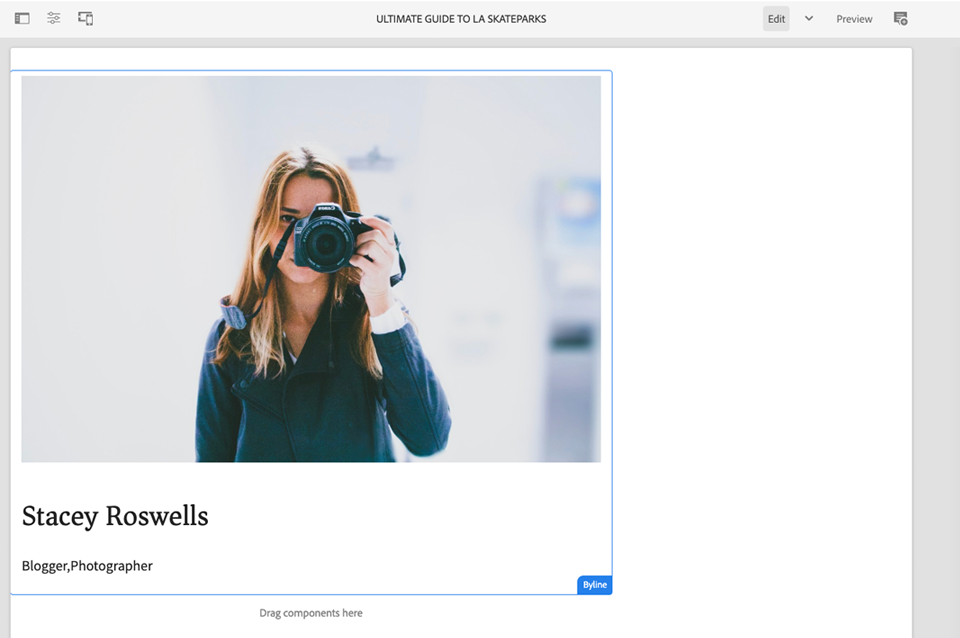

# カスタムコンポーネント {#custom-component}

このチュートリアルでは、ダイアログで作成されたコンテンツを表示するAEM Bylineコンポーネントのエンドツーエンドの作成について説明し、Slingモデルの開発を進め、コンポーネントのHTLを埋め込むビジネスロジックをカプセル化します。

## 前提条件 {#prerequisites}

Review the required tooling and instructions for setting up a [local development environment](overview.md#local-dev-environment).

### スタータープロジェクト

>[!NOTE]
>
> チュートリアルの前の部分を進めている場合は、この章のスタータープロジェクトによって実装が高速化されていることに注意してください。 これには、さらに数個のテンプレートと多くのコンテンツが含まれます。 お得な点として、カスタムコンポーネントの開発以外の新しいコンテンツや導入の他の領域を自由に調べてみてください。

チュートリアルが構築する基本行コードを調べます。

1. github.com/adobe/aem-guides-wknd [リポジトリをコピーします](https://github.com/adobe/aem-guides-wknd) 。
1. ブランチをチェックアウトし `custom-component/start` ます

   ```shell
   $ git clone git@github.com:adobe/aem-guides-wknd.git ~/code/aem-guides-wknd
   $ cd ~/code/aem-guides-wknd
   $ git checkout custom-component/start
   ```

1. Mavenのスキルを使用して、ローカルAEMインスタンスにコードベースをデプロイします。

   ```shell
   $ cd ~/code/aem-guides-wknd
   $ mvn clean install -PautoInstallSinglePackage
   ```

GitHubでの完了したコードの表示を常に行う [か](https://github.com/adobe/aem-guides-wknd/tree/custom-component/solution) 、ブランチに切り替えてコードをローカルでチェックアウトすることができ `custom-component/solution`ます。

## 目的

1. カスタムAEMコンポーネントの構築方法を理解する
1. Slingモデルにビジネスロジックをカプセル化する方法を学びます。
1. HTLスクリプト内からSlingモデルを使用する方法を理解します。

## 作成する内容 {#byline-component}

>[!VIDEO](https://video.tv.adobe.com/v/30181/?quality=12&learn=on)

WKNDチュートリアルのこの部分では、Bylineコンポーネントが作成され、記事の寄稿者に関する作成済み情報を表示するのに使用されます。


*WKND設計チームが提供するBylineコンポーネントのビジュアルデザイン*

Bylineコンポーネントの実装には、署名の内容を収集するダイアログと、署名の内容を取得するカスタムSlingモデルが含まれます。

* 名前
* 画像
* 職業

を使用すると、ブラウザーが最終的に表示するHTMLをレンダリングします。


*署名コンポーネントの分解*

## 署名コンポーネントの作成 {#create-byline-component}

最初に、Bylineコンポーネントのノード構造を作成し、ダイアログを定義します。 これは、AEM のコンポーネントを表し、JCR 内のその場所によってコンポーネントのリソースタイプを暗黙的に定義します。

ダイアログは、コンテンツ作成者が提供できるインターフェイスを表示します。For this implementation, the AEM WCM Core Component&#39;s **Image** component will be leveraged to handle the authoring and rendering of the Byline&#39;s image, so it will be set as our component&#39;s `sling:resourceSuperType`.

### コンポーネントノードを作成 {#create-component-node}

1. ui.apps **モジュールで、「byline**`/apps/wknd/components/content` 」という名前のタイプの新しいノードに移動し **て作成**`cq:Component`します。

   

1. Add the following properties to the Byline component&#39;s `cq:Component` node.

   ```plain
   jcr:title = Byline
   jcr:description = Displays a contributor's byline.
   componentGroup = WKND.Content
   sling:resourceSuperType =  core/wcm/components/image/v2/image
   ```

   

   Which results in this `.content.xml` XML:

   ```xml
   <?xml version="1.0" encoding="UTF-8"?>
   <jcr:root
       xmlns:sling="https://sling.apache.org/jcr/sling/1.0" xmlns:jcr="https://www.jcp.org/jcr/1.0"
       jcr:primaryType="cq:Component"
       jcr:title="Byline"
       jcr:description="Displays a contributor's byline."
       componentGroup="WKND.Content"
       sling:resourceSuperType="core/wcm/components/image/v2/image"/>
   ```

### HTL スクリプトの作成 {#create-the-htl-script}

1. Beneath the `byline` node, add a new file `byline.html`, which is responsible for the HTML presentation of the component. Naming the file the same as the `cq:Component` node is important as it becomes the default script Sling will use to render this resource type.

1. 以下のコードを `byline.html` に追加します。

   ```xml
   <!--/* byline.html */-->
   <div data-sly-use.placeholderTemplate="core/wcm/components/commons/v1/templates.html">
   </div>
   <sly data-sly-call="${placeholderTemplate.placeholder @ isEmpty=true}"></sly>
   ```

`byline.html` は、後で [、Slingモデルが作成された後で](#byline-htl)再訪問されます。 HTLファイルの現在の状態では、コンポーネントをページ上にドラッグ&amp;ドロップしたときに、AEMサイトのページエディターに空の状態で表示できます。

### ダイアログ定義の作成 {#create-the-dialog-definition}

次に、以下のフィールドを含む、署名コンポーネント用のダイアログを定義します。

* **名前**：寄稿者の名前のテキストフィールド。
* **画像**：寄稿者の自己紹介写真への参照。
* **職業**：寄稿者に起因する職業のリスト。職業は、アルファベットの昇順（a～z）で並べ替えられる必要があります。

1. Beneath the `byline` component node create a new node named `cq:dialog` of type `nt:unstructured`.
1. Update the `cq:dialog` with the following XML. It is easiest to open up the `.content.xml` and copy/paste the following XML into it.

   ```xml
   <?xml version="1.0" encoding="UTF-8"?>
   <jcr:root xmlns:sling="http://sling.apache.org/jcr/sling/1.0" xmlns:jcr="http://www.jcp.org/jcr/1.0"
           xmlns:nt="http://www.jcp.org/jcr/nt/1.0"
           jcr:primaryType="nt:unstructured"
           jcr:title="Byline"
           sling:resourceType="cq/gui/components/authoring/dialog">
       <content
               jcr:primaryType="nt:unstructured"
               sling:resourceType="granite/ui/components/coral/foundation/container">
           <items jcr:primaryType="nt:unstructured">
               <tabs
                       jcr:primaryType="nt:unstructured"
                       sling:resourceType="granite/ui/components/coral/foundation/tabs"
                       maximized="{Boolean}false">
                   <items jcr:primaryType="nt:unstructured">
                       <asset
                               jcr:primaryType="nt:unstructured"
                               sling:hideResource="{Boolean}false"/>
                       <metadata
                               jcr:primaryType="nt:unstructured"
                               sling:hideResource="{Boolean}true"/>
                       <properties
                               jcr:primaryType="nt:unstructured"
                               jcr:title="Properties"
                               sling:resourceType="granite/ui/components/coral/foundation/container"
                               margin="{Boolean}true">
                           <items jcr:primaryType="nt:unstructured">
                               <columns
                                       jcr:primaryType="nt:unstructured"
                                       sling:resourceType="granite/ui/components/coral/foundation/fixedcolumns"
                                       margin="{Boolean}true">
                                   <items jcr:primaryType="nt:unstructured">
                                       <column
                                               jcr:primaryType="nt:unstructured"
                                               sling:resourceType="granite/ui/components/coral/foundation/container">
                                           <items jcr:primaryType="nt:unstructured">
                                               <name
                                                       jcr:primaryType="nt:unstructured"
                                                       sling:resourceType="granite/ui/components/coral/foundation/form/textfield"
                                                       emptyText="Enter the contributor's name to display."
                                                       fieldDescription="The contributor's name to display."
                                                       fieldLabel="Name"
                                                       name="./name"
                                                       required="{Boolean}true"/>
                                               <occupations
                                                       jcr:primaryType="nt:unstructured"
                                                       sling:resourceType="granite/ui/components/coral/foundation/form/multifield"
                                                       fieldDescription="A list of the contributor's occupations."
                                                       fieldLabel="Occupations"
                                                       required="{Boolean}false">
                                                   <field
                                                           jcr:primaryType="nt:unstructured"
                                                           sling:resourceType="granite/ui/components/coral/foundation/form/textfield"
                                                           emptyText="Enter an occupation"
                                                           name="./occupations"/>
                                               </occupations>
                                           </items>
                                       </column>
                                   </items>
                               </columns>
                           </items>
                       </properties>
                   </items>
               </tabs>
           </items>
       </content>
   </jcr:root>
   ```

   These node definitions use [Sling Resource Merger](https://sling.apache.org/documentation/bundles/resource-merger.html) to control which dialog tabs are inherited from the `sling:resourceSuperType` component, in this case the **Core Components&#39; Image component**.

   

### ポリシーダイアログの作成 {#create-the-policy-dialog}

ダイアログ作成と同じ方法でポリシーダイアログ（以前のデザインダイアログ）を作成して、コアコンポーネントの画像コンポーネントから継承されたポリシー設定の不要なフィールドを非表示にします。

1. Beneath the `byline` `cq:Component` node, create a new node named `cq:design_dialog` of type `nt:unstructured`.
1. Update the `cq:design_dialog` with the following XML. It is easiest to open up the `.content.xml` and copy/paste the XML below into it.

   ```xml
   <?xml version="1.0" encoding="UTF-8"?>
   <jcr:root xmlns:sling="http://sling.apache.org/jcr/sling/1.0" xmlns:granite="http://www.adobe.com/jcr/granite/1.0" xmlns:cq="http://www.day.com/jcr/cq/1.0" xmlns:jcr="http://www.jcp.org/jcr/1.0" xmlns:nt="http://www.jcp.org/jcr/nt/1.0"
       jcr:primaryType="nt:unstructured"
       jcr:title="Byline"
       sling:resourceType="cq/gui/components/authoring/dialog">
       <content
               jcr:primaryType="nt:unstructured">
           <items jcr:primaryType="nt:unstructured">
               <tabs
                       jcr:primaryType="nt:unstructured">
                   <items jcr:primaryType="nt:unstructured">
                       <properties
                               jcr:primaryType="nt:unstructured">
                           <items jcr:primaryType="nt:unstructured">
                               <content
                                       jcr:primaryType="nt:unstructured">
                                   <items jcr:primaryType="nt:unstructured">
                                       <decorative
                                               jcr:primaryType="nt:unstructured"
                                               sling:hideResource="{Boolean}true"/>
                                       <altValueFromDAM
                                               jcr:primaryType="nt:unstructured"
                                               sling:hideResource="{Boolean}true"/>
                                       <titleValueFromDAM
                                               jcr:primaryType="nt:unstructured"
                                               sling:hideResource="{Boolean}true"/>
                                       <displayCaptionPopup
                                               jcr:primaryType="nt:unstructured"
                                               sling:hideResource="{Boolean}true"/>
                                       <disableUuidTracking
                                               jcr:primaryType="nt:unstructured"
                                               sling:hideResource="{Boolean}true"/>
                                   </items>
                               </content>
                           </items>
                       </properties>
                       <features
                               jcr:primaryType="nt:unstructured">
                           <items jcr:primaryType="nt:unstructured">
                               <content
                                       jcr:primaryType="nt:unstructured">
                                   <items jcr:primaryType="nt:unstructured">
                                       <accordion
                                               jcr:primaryType="nt:unstructured">
                                           <items jcr:primaryType="nt:unstructured">
                                               <orientation
                                                       jcr:primaryType="nt:unstructured"
                                                       sling:hideResource="{Boolean}true"/>
                                               <crop
                                                       jcr:primaryType="nt:unstructured"
                                                       sling:hideResource="{Boolean}true"/>
                                           </items>
                                       </accordion>
                                   </items>
                               </content>
                           </items>
                       </features>
                   </items>
               </tabs>
           </items>
       </content>
   </jcr:root>
   ```

   The basis for the preceding **Policy dialog** XML was obtained from the [Core Components Image component](https://github.com/adobe/aem-core-wcm-components/blob/master/content/src/content/jcr_root/apps/core/wcm/components/image/v2/image/_cq_design_dialog/.content.xml).

   Like in the Dialog configuration, [Sling Resource Merger](https://sling.apache.org/documentation/bundles/resource-merger.html) is used to hide irrelevant fields that are otherwise inherited from the `sling:resourceSuperType`, as seen by the node definitions with `sling:hideResource="{Boolean}true"` property.

### コードのデプロイ {#deploy-the-code}

1. Mavenのスキルを使用して、更新したコードベースをローカルのAEMインスタンスにデプロイします。

   ```shell
   $ cd ~/code/aem-guides-wknd
   $ mvn clean install -PautoInstallPackage
   ```

### Add the component to a page {#add-the-component-to-a-page}

AEMコンポーネントの開発に重点を置いたシンプルな作業を維持するために、記事ページに現在の状態のBylineコンポーネントを追加して、 `cq:Component` ノード定義がデプロイされて正しいこと、AEMが新しいコンポーネント定義を認識し、コンポーネントのダイアログがオーサリングで動作することを確認します。

Bylineコンポーネントを [WKND.Content **コンポーネントグループに** プロパティを介して追加したので](#create-component-node)、記事のコンテナを含むLayoutPolicyコンテナLayoutPolicyを使用するLayoutPolicyLogeLayoutLoutLaut.ConteConteContContCopopn `/apps/wknd/components/content/byline@componentGroup=WKND.Content` を使用するC ************ を使用するLoNoNoNopNoNoNoNoNoNoNoNoNoNoNoNoNoNoNoNoNoNoNoNoNoNoNoNoNoNoNoNoNoNoNoNoNoNoNoNoNoNoNoNoNoNoNoNoNoNoNoNoNoNoNoNo

#### コンポーネントをページにドラッグ＆ドロップする {#drag-and-drop-the-component-onto-the-page}

1. **記事を編集するには** 、 **AEM/サイト/WKNDサイト/言語マスター/英語/雑誌/Ultimate Guide to LA Skateparks**.
1. From the left sidebar, drag and drop a **Byline component** on to **bottom** of the Layout Container of the opened article page.

   

#### コンポーネントの作成 {#author-the-component}

AEM作成者は、ダイアログを使用してコンポーネントを設定およびオーサリングします。 Bylineコンポーネントの開発のこの時点では、データ収集用のダイアログが含まれていますが、オーサリングされたコンテンツをレンダリングするロジックはまだ追加されていません。

1. **左側のサイドバーが開いて**&#x200B;表示されたことと、**アセットファインダー**&#x200B;が選択されていることを確認します。

   

1. Select the **Byline component placeholder**, which in turn displays the action bar and tap the **wrench** icon to open the dialog.

   

1. ダイアログを開き、最初のタブ（アセット）をアクティブにして、左側のサイドバーを開き、アセットファインダーから画像を画像ドロップゾーンにドラッグします。 WKND ui.contentパッケージで提供されるStacey Roswellsのプロフィールの画像を探すには、「stacey」を探します。

   **[stacey-roswells.jpg](assets/custom-component/stacey-roswells.jpg)**

   

1. 画像を追加したら、「**プロパティ**」タブをクリックして「**名前**」および「**職業**」に入力します。

   When entering occupations, enter them in **reverse alphabetical** order so the alphabetizing business logic we&#39;ll implement in the Sling Model is readily apparent.

   Tap the **Done** button in the bottom right to save the changes.

   

1. After saving the dialog, navigate to [CRXDE Lite](http://localhost:4502/crx/de/index.jsp#/content/wknd/language-masters/en/magazine/guide-la-skateparks/jcr:content/root/responsivegrid/responsivegrid/byline) and review how the component&#39;s content is stored on the byline component content node under the AEM page.

   ノードの下にあるBylineコンポーネントのコンテンツ `jcr:content/root/responsivegrid/responsivegrid` ノードを探し `/content/wknd/language-masters/en/magazine/guide-la-skateparks/jcr:content/root/responsivegrid/responsivegrid/byline`ます。

   プロパティ名 `name`、、 `occupations`および `fileReference` が **bylineノードに格納されていることに注意してください**。

   Also, notice the `sling:resourceType` of the node is set to `wknd/components/content/byline` which is what binds this content node to the Byline component implementation.

   

   */content/wknd/language-masters/en/magazine/guide-la-skateparks/jcr:content/root/responsevegrid/responsivegrid/byline*

## 署名スリングモデルの作成 {#create-sling-model}

次に、データモデルとして機能し、署名コンポーネントのビジネスロジックを格納する Sling Model を作成します。

Slingモデルは、JCRからJava変数へのデータのマッピングを容易にし、AEMのコンテキストで開発する際に、様々な点を提供する注釈駆動のJava 「POJO」(Plain Old Java Objects)です。

### Mavenの依存関係の確認 {#maven-dependency}

Byline Slingモデルは、AEMが提供する複数のJava APIに依存します。 これらのAPIは、モジュールのPOMファイルに記載さ `dependencies` れているAPIで使用でき `core` ます。

1. 下の `pom.xml` ファイルを開き `<src>/aem-guides-wknd/core/pom.xml`ます。
1. pomファイルの「依存関係」セクション `uber-jar` で、の依存関係を確認します。

   ```xml
   ...
       <dependency>
           <groupId>com.adobe.aem</groupId>
           <artifactId>uber-jar</artifactId>
           <classifier>apis</classifier>
       </dependency>
   ...
   ```

   uber-jar [には](https://docs.adobe.com/content/help/en/experience-manager-65/developing/devtools/ht-projects-maven.html#experience-manager-api-dependencies) 、AEMで公開されているすべてのパブリックJava APIが含まれています。 ファイル内でバージョンが指定されていないことに注意してくだ `core/pom.xml` さい。 バージョンは、プロジェクトのルートにある親リアクタのpomに維持され `aem-guides-wknd/pom.xml`ます。

1. 次の依存関係を検索し `core.wcm.components.core`ます。

   ```xml
    <!-- Core Component Dependency -->
       <dependency>
           <groupId>com.adobe.cq</groupId>
           <artifactId>core.wcm.components.core</artifactId>
       </dependency>
   ```

   これは、AEMコアコンポーネントで公開されているすべてのパブリックJava APIです。 AEMコアコンポーネントは、AEMの外部で管理されるプロジェクトなので、別のリリースサイクルを持ちます。 このため、これは個別に含める必要がある依存関係であり、uber-jarには含め **られません** 。

   uber-jarと同様、この依存関係のバージョンは、にある親リアクタpomファイルに保持され `aem-guides-wknd/pom.xml`ます。

   このチュートリアルの後半では、Core Component Imageクラスを使用して、Bylineコンポーネントに画像を表示します。 Slingモデルを構築してコンパイルするには、コアコンポーネントの依存関係が必要です。

### Byline インターフェイス {#byline-interface}

署名用の公開Javaインターフェイスを作成します。 `Byline.java` は、 `byline.html` HTLスクリプトを実行するのに必要なパブリックメソッドを定義します。

1. モジュール内で、 `aem-guides-wknd.core` パッケージを右クリックし、「New」/「Interface `src/main/java,` 」を選択して、名前の付いた新しいJavaインターフェイスを `Byline.java` 作成します `com.adobe.aem.guides.wknd.core.models`****。 Enter **Byline** as the interface Name, and click Finish.

   

1. 以下のメソッドで `Byline.java` を更新します。

   ```java
   package com.adobe.aem.guides.wknd.core.models;
   
   import java.util.List;
   
   /**
   * Represents the Byline AEM Component for the WKND Site project.
   **/
   public interface Byline {
       /***
       * @return a string to display as the name.
       */
       String getName();
   
       /***
       * Occupations are to be sorted alphabetically in a descending order.
       *
       * @return a list of occupations.
       */
       List<String> getOccupations();
   
       /***
       * @return a boolean if the component has enough content to display.
       */
       boolean isEmpty();
   }
   ```

   The first two methods expose the values for the **name** and **occupations** for the Byline component.

   The `isEmpty()` method is used to determine if the component has any content to render or if it is waiting to be configured.

   Notice there is no method for the Image; [we&#39;ll take a look at as to why that is later](#tackling-the-image-problem).

### 署名実装 {#byline-implementation}

`BylineImpl.java` は、前に定義したインター `Byline.java` フェイスを実装するSlingモデルの実装です。 `BylineImpl.java` の完全なコードは、この節の最後に記載しています。

1. Within the `core` module beneath `src/main/java`, create a new class file named **BylineImpl.java** by right-clicking the `com.adobe.aem.guides.wknd.core.models.impl` package and selecting **New > Class**.

   名前として、&quot;**BylineImpl**&quot; と入力します。**Byline インターフェイス**&#x200B;を実装インターフェイスとして追加します。

   

1. 開く `BylineImpl.java`. インターフェイス `Byline.java` で定義されたすべてのメソッドを使用して自動的に入力されています。以下のクラスレベルの注釈で `BylineImpl.java` を更新して、Sling Model 注釈を追加します。This `@Model(..)`annotation is what turns the class into a Sling Model.

   ```java
   import org.apache.sling.api.SlingHttpServletRequest;
   import org.apache.sling.models.annotations.Model;
   import org.apache.sling.models.annotations.DefaultInjectionStrategy;
   ...
   @Model(
           adaptables = {SlingHttpServletRequest.class},
           adapters = {Byline.class},
           resourceType = {BylineImpl.RESOURCE_TYPE},
           defaultInjectionStrategy = DefaultInjectionStrategy.OPTIONAL
   )
   public class BylineImpl implements Byline {
       protected static final String RESOURCE_TYPE = "wknd/components/content/byline";
       ...
   }
   ```

   この注釈とそのパラメーターを確認してみましょう:

   * The `@Model` annotation registers BylineImpl as a Sling Model when it is deployed to AEM.
   * The `adaptables` parameter specifies that this model can be adapted by the request.
   * The `adapters` parameter allows the implementation class to be registered under the Byline interface. これにより、HTLスクリプトは、（implを直接呼び出すのではなく）インターフェイスを介してSlingモデルを呼び出すことができます。 adapters について詳しくは、[こちら](https://sling.apache.org/documentation/bundles/models.html#specifying-an-alternate-adapter-class-since-110)を参照してください。
   * The `resourceType` points to the Byline component resource type (created earlier) and helps to resolve the correct model if there are multiple implementations. モデルクラスのリソースタイプとの関連付けについて詳しくは、[こちら](https://sling.apache.org/documentation/bundles/models.html#associating-a-model-class-with-a-resource-type-since-130)を参照してください。

### Sling Model メソッドの実装 {#implementing-the-sling-model-methods}

#### getName() {#implementing-get-name}

The first method we&#39;ll tackle is `getName()` which simply returns the value stored to the byline&#39;s JCR content node under the property `name`.

この場合、Sling `@ValueMapValue` モデル注釈を使用して、要求のリソースのValueMapを使用してJavaフィールドに値を挿入します。

```java
...
import org.apache.sling.models.annotations.injectorspecific.ValueMapValue;
...
public class BylineImpl implements Byline {
    ...

    @ValueMapValue
    private String name;

    ...
    @Override
    public String getName() {
        return name;
    }
    ...
}
```

Because the JCR property shares the same name as the Java field (both are &quot;name&quot;), `@ValueMapValue` automatically resolves this association and injects the value of the property into the Java field.

#### getOccuptions() {#implementing-get-occupations}

次に実装する方法はです `getOccupations()`。 このメソッドは、JCRプロパティに保存されているすべての職業を収集 `occupations` し、ソートされた（アルファベット順）コレクションを返します。

Using the same technique explored in `getName()` the property value can be injected into the Sling Model&#39;s field.

Once the JCR property values are available in the Sling Model via the injected Java field `occupations`, the sorting business logic can be applied in the `getOccupations()` method.

```java
import java.util.ArrayList;
import java.util.Collections;
...

public class BylineImpl implements Byline {
    ...
    @ValueMapValue
    private List<String> occupations;
    ...
    public List<String> getOccupations() {
        if (occupations != null) {
            Collections.sort(occupations);
            return new ArrayList<String>(occupations);
        } else {
            return Collections.emptyList();
        }
    }
    ...
}
...
```

#### isEmpty() {#implementing-is-empty}

The last public method is `isEmpty()` which determines when the component should consider itself &quot;authored enough&quot; to render.

For this component, we have business requirements stating that all three fields, name, image and occupations must be filled out *before* the component can be rendered.

```java
import org.apache.commons.lang3.StringUtils;
...
public class BylineImpl implements Byline {
    ...
    @Override
    public boolean isEmpty() {
        if (StringUtils.isBlank(name)) {
            // Name is missing, but required
            return true;
        } else if (occupations == null || occupations.isEmpty()) {
            // At least one occupation is required
            return true;
        } else if (/* image is not null, logic to be determined */) {
            // A valid image is required
            return true;
        } else {
            // Everything is populated, so this component is not considered empty
            return false;
        }
    }
    ...
}
```

#### Tackling the &quot;Image problem&quot; {#tackling-the-image-problem}

Checking the name and occupation conditions are trivial (and the Apache Commons Lang3 provides the always handy [StringUtils](https://commons.apache.org/proper/commons-lang/apidocs/org/apache/commons/lang3/StringUtils.html) class), however, it&#39;s unclear how the **presence of the Image** can be validated since the Core Components Image component is used to surface the image.

これに対処するには、2 つの方法があります。

1. Check if the `fileReference` JCR property resolves to an asset.
1. Convert this resource into a Core Component Image Sling Model and ensure the `getSrc()` method is not empty.

   第 **2のアプローチを選択します** 。 最初のアプローチは十分と思われますが、このチュートリアルでは、Slingモデルの他の機能を調べるのに後者を使用します。

1. 画像を取得するプライベートメソッドを作成します。 このメソッドをプライベートにしておくのは、HTL 自体の画像オブジェクトを公開する必要がなく、`isEmpty().` () を実行するためにのみ使用するからです。

   次の専用メソッドを使用し `getImage()`ます。

   ```java
   import com.adobe.cq.wcm.core.components.models.Image;
   ...
   private Image getImage() {
       Image image = null;
       // Figure out how to populate the image variable!
       return image;
   }
   ```

   上記のように、 **画像スリングモデルを取得するには、さらに2つの方法があります**。

   1つ目は `@Self` 注釈を使用し、現在の要求をコアコンポーネントの `Image.class`

   ```java
   @Self
   private Image image;
   ```

   The second uses the [Apache Sling ModelFactory](https://sling.apache.org/apidocs/sling10/org/apache/sling/models/factory/ModelFactory.html) OSGi service, which is a very handy service, and helps us create Sling Models of other types in Java code.

   第2のアプローチを選択します。

   >[!NOTE]
   >
   >In a real-world implementation, approach &quot;One&quot;, using `@Self` is preferred since it&#39;s the simpler, more elegant solution. このチュートリアルでは、2つ目のアプローチを使用します。非常に役立つSlingモデルのファセットをさらに検討する必要があるので、より複雑なコンポーネントを使用します。

   SlingモデルはJava POJOであり、OSGi Servicesではないので、通常のOSGi挿入注釈は使用 `@Reference` できま **せん** 。代わりに、Slingモデルでは、同様の機能を提供する特別な **[@OSGiService](https://sling.apache.org/documentation/bundles/models.html#injector-specific-annotations)** 注釈が提供されます。

1. を更新 `BylineImpl.java` して、注釈を挿入する `OSGiService` 注釈を含めます `ModelFactory`。

   ```java
   import org.apache.sling.models.factory.ModelFactory;
   import org.apache.sling.models.annotations.injectorspecific.OSGiService;
   ...
   public class BylineImpl implements Byline {
       ...
       @OSGiService
       private ModelFactory modelFactory;
   }
   ```

   を `ModelFactory` 使用して、次を使用してコアコンポーネントの画像スリングモデルを作成できます。

   ```java
   modelFactory.getModelFromWrappedRequest(SlingHttpServletRequest request, Resource resource, java.lang.Class<T> targetClass)
   ```

   ただし、このメソッドには要求とリソースの両方が必要で、Slingモデルではまだ使用できません。 これらを取得するには、より多くのSlingモデル注釈が使用されます。

   現在のリクエストを取得するには、 **[@Self](https://sling.apache.org/documentation/bundles/models.html#injector-specific-annotations)**`adaptable` 注釈を使用して、 `@Model(..)``SlingHttpServletRequest.class`（「as」で定義されている）をJavaクラスフィールドに挿入できます。

1. SlingHttpServletRequest追加リクエストを取得する **ための@Self** 注釈 ****:

   ```java
   import org.apache.sling.models.annotations.injectorspecific.Self;
   ...
   @Self
   private SlingHttpServletRequest request;
   ```

   Remember, using `@Self Image image` to inject the Core Component Image Sling Model was an option above - the `@Self` annotation tries to inject the adaptable object (in our case a SlingHttpServletRequest), and adapt to the annotation field type. コアコンポーネントの画像 Sling Model は SlingHttpServletRequest オブジェクトから適応可能なので、これなら機能したはずです。また、説明的な 2 番目の方法よりも少ないコードで済みます。

   これで、ModelFactory API で画像モデルをインスタンス化するために必要な変数を挿入できました。次に、Sling Model の **[@PostConstruct](https://sling.apache.org/documentation/bundles/models.html#postconstruct-methods) 注釈を使用して、Sling Model をインスタンス化した後、このオブジェクトを取得します。**

   `@PostConstruct` は非常に役に立ち、コンストラクターと同様の機能を持ちますが、クラスをインスタンス化し、注釈を付けたすべてのJavaフィールドを挿入した後に呼び出されます。 Whereas other Sling Model annotations annotate Java class fields (variables), `@PostConstruct` annotates a void, zero parameter method, typically named `init()` (but can be named anything).

1. 追加 **@PostConstruct** method:

   ```java
   import javax.annotation.PostConstruct;
   ...
   public class BylineImpl implements Byline {
       ...
       private Image image;
   
       @PostConstruct
       private void init() {
           image = modelFactory.getModelFromWrappedRequest(request,
                                                           request.getResource(),
                                                           Image.class);
       }
       ...
   }
   ```

   Sling Model は OSGi サービス&#x200B;**ではない**&#x200B;ので、クラスの状態を安全に管理できます。Often `@PostConstruct` derives and sets up Sling Model class state for later use, similar to what a plain constructor does.

   Note that if the `@PostConstruct` method throws an exception, the Sling Model will not instantiate (it will be null).

1. **getImage()** を更新して、単にイメージオブジェクトを返すことができるようになりました。

   ```java
   /**
       * @return the Image Sling Model of this resource, or null if the resource cannot create a valid Image Sling Model.
   */
   private Image getImage() {
       return image;
   }
   ```

1. Let&#39;s head back to `isEmpty()` and finish the implementation:

   ```java
   @Override
   public boolean isEmpty() {
       ...
       } else if (getImage() == null || StringUtils.isBlank(getImage().getSrc())) {
           // A valid image is required
           return true;
       } else {
       ...
   }
   ```

   Note multiple calls to `getImage()` is not problematic as returns the initialized `image` class variable and does not invoke `modelFactory.getModelFromWrappedRequest(...)` which isn&#39;t an overly costly, but worth avoiding calling unnecessarily.

1. The final `BylineImpl.java` should look like:

   ```java
   package com.adobe.aem.guides.wknd.core.models.impl;
   
   import java.util.ArrayList;
   import java.util.Collections;
   import java.util.List;
   
   import javax.annotation.PostConstruct;
   
   import org.apache.commons.lang3.StringUtils;
   import org.apache.sling.api.SlingHttpServletRequest;
   import org.apache.sling.models.annotations.DefaultInjectionStrategy;
   import org.apache.sling.models.annotations.Model;
   import org.apache.sling.models.annotations.injectorspecific.OSGiService;
   import org.apache.sling.models.annotations.injectorspecific.Self;
   import org.apache.sling.models.annotations.injectorspecific.ValueMapValue;
   import org.apache.sling.models.factory.ModelFactory;
   
   import com.adobe.aem.guides.wknd.core.models.Byline;
   import com.adobe.cq.wcm.core.components.models.Image;
   
   @Model(
           adaptables = {SlingHttpServletRequest.class},
           adapters = {Byline.class},
           resourceType = {BylineImpl.RESOURCE_TYPE},
           defaultInjectionStrategy = DefaultInjectionStrategy.OPTIONAL
   )
   public class BylineImpl implements Byline {
       protected static final String RESOURCE_TYPE = "wknd/components/content/byline";
   
       @Self
       private SlingHttpServletRequest request;
   
       @OSGiService
       private ModelFactory modelFactory;
   
       @ValueMapValue
       private String name;
   
       @ValueMapValue
       private List<String> occupations;
   
       private Image image;
   
       @PostConstruct
       private void init() {
           image = modelFactory.getModelFromWrappedRequest(request, request.getResource(), Image.class);
       }
   
       @Override
       public String getName() {
           return name;
       }
   
       @Override
       public List<String> getOccupations() {
           if (occupations != null) {
               Collections.sort(occupations);
               return new ArrayList<String>(occupations);
           } else {
               return Collections.emptyList();
           }
       }
   
       @Override
       public boolean isEmpty() {
           final Image image = getImage();
   
           if (StringUtils.isBlank(name)) {
               // Name is missing, but required
               return true;
           } else if (occupations == null || occupations.isEmpty()) {
               // At least one occupation is required
               return true;
           } else if (image == null || StringUtils.isBlank(image.getSrc())) {
               // A valid image is required
               return true;
           } else {
               // Everything is populated, so this component is not considered empty
               return false;
           }
       }
   
       /**
       * @return the Image Sling Model of this resource, or null if the resource cannot create a valid Image Sling Model.
       */
       private Image getImage() {
           return image;
       }
   }
   ```

## 署名 HTL {#byline-htl}

In the `ui.apps` module, open `/apps/wknd/components/content/byline/byline.html` we created in the earlier set up of the AEM Component.

```html
<div data-sly-use.placeholderTemplate="core/wcm/components/commons/v1/templates.html">
</div>
<sly data-sly-call="${placeholderTemplate.placeholder @ isEmpty=false}"></sly>
```

この HTL スクリプトでおこなうことを確認しましょう。

* The `placeholderTemplate` points to Core Components&#39; placeholder, which displays when the component is not fully configured. This renders in AEM Sites Page Editor as a box with the component title, as defined above in the `cq:Component`&#39;s  `jcr:title` property.

* The `data-sly-call="${placeholderTemplate.placeholder @ isEmpty=false}` loads the `placeholderTemplate` defined above and passes in a boolean value (currently hard-coded to `false`) into the placeholder template. When `isEmpty` is true, the placeholder template renders the grey box, else it renders nothing.

### 署名HTLの更新

1. 以下のスケルタル HTML 構造で **byline.html** を更新します。

   ```xml
   <div data-sly-use.placeholderTemplate="core/wcm/components/commons/v1/templates.html"
       class="cmp-byline">
           <div class="cmp-byline__image">
               <!-- Include the Core Components Image Component -->
           </div>
           <h2 class="cmp-byline__name"><!-- Include the name --></h2>
           <p class="cmp-byline__occupations"><!-- Include the occupations --></p>
   </div>
   <sly data-sly-call="${placeholderTemplate.placeholder @ isEmpty=true}"></sly>
   ```

   CSS クラスは [BEM 命名規則](https://getbem.com/naming/)に従うことに注意してください。BEM 規則の使用は必須ではありませんが、コアコンポーネント CSS クラスで使用され、一般的にクリーンで読みやすい CSS ルールになるので、BEM をお勧めします。

#### HTL での Sling Model オブジェクトのインスタンス化 {#instantiating-sling-model-objects-in-htl}

The [Use block statement](https://github.com/adobe/htl-spec/blob/master/SPECIFICATION.md#221-use) is used to instantiate Sling Model objects in the HTL script and assign it to an HTL variable.

`data-sly-use.byline="com.adobe.aem.guides.wknd.models.Byline"` は、BylineImplによって実装されるBylineインターフェイス(com.adobe.aem.guides.wknd.models.Byline)を使用し、現在のSlingHttpServletRequestを調整し、結果をbyline ( `data-sly-use.<variable-name>`)というHTL変数名に格納します。

1. 外側を更新 `div` して、 **Byline** Slingモデルをパブリックインターフェイスで参照します。

   ```xml
   <div data-sly-use.byline="com.adobe.aem.guides.wknd.core.models.Byline"
       data-sly-use.placeholderTemplate="core/wcm/components/commons/v1/templates.html"
       class="cmp-byline">
       ...
   </div>
   ```

#### Sling Model メソッドへのアクセス {#accessing-sling-model-methods}

HTLはJSTLから参照し、Java getterメソッド名と同じ短縮形を使用します。

For example, invoking the Byline Sling Model&#39;s `getName()` method can be shortened to `byline.name`, similarly instead of `byline.isEmpty`, this can be shorted to `byline.empty`. Using full method names, `byline.getName` or `byline.isEmpty`, works as well. Note the `()` are never used to invoke methods in HTL (similar to JSTL).

Java methods that require a parameter **cannot** be used in HTL. これは、HTL のロジックをシンプルにするための設計によるものです。

1. The Byline name can be added to the component by invoking the `getName()` method on the Byline Sling Model, or in HTL: `${byline.name}`.

   タグの更新 `h2` :

   ```xml
   <h2 class="cmp-byline__name">${byline.name}</h2>
   ```

#### HTL 式のオプションの使用 {#using-htl-expression-options}

[HTL式オプション](https://github.com/adobe/htl-spec/blob/master/SPECIFICATION.md#12-available-expression-options) は、HTL内のコンテンツに対する修飾子として機能し、日付の書式設定からi18nへの変換の範囲を持ちます。 また、式は、リストの結合や値の配列に使用でき、職業をコンマ区切り形式で表示するのに必要です。

Expressions are added via the `@` operator in the HTL expression.

1. 職業のリストを「,」で結合するには、以下のコードを使用します。

   ```html
   <p class="cmp-byline__occupations">${byline.occupations @ join=', '}</p>
   ```

#### プレースホルダーの条件付き表示 {#conditionally-displaying-the-placeholder}

Most HTL scripts for AEM Components leverage the **placeholder paradigm** to provide a visual cue to authors **indicating a component is incorrectly authored and will not display on AEM Publish**. この判断を推進するには、コンポーネントの背後の Sling Model のメソッド（この場合 `Byline.isEmpty()`()）を実装する必要があります。

`isEmpty()` がByline Slingモデルで呼び出され、結果(または `!` 演算子を介した負の値)が次のHTL変数に保存され `hasContent`ます。

1. 外側のファイルを更新 `div` して、次の名前のHTL変数を保存し `hasContent`ます。

   ```html
    <div data-sly-use.byline="com.adobe.aem.guides.wknd.core.models.Byline"
         data-sly-use.placeholderTemplate="core/wcm/components/commons/v1/templates.html"
         data-sly-test.hasContent="${!byline.empty}"
         class="cmp-byline">
         ...
   </div>
   ```

   Note the use of `data-sly-test`, the HTL `test` block is interesting in that it both sets an HTL variable AND renders/doesn&#39;t render the HTML element it&#39;s on, based on if the result of the HTL expression is truthy or not. 「truthy」の場合、HTML要素はレンダリングされ、そうでない場合はレンダリングされません。

   This HTL variable `hasContent` can now be re-used to conditionally show/hide the placeholder.

1. 次の内容を含めて、ファイルの下部 `placeholderTemplate` にあるのを条件付き呼び出しで更新します。

   ```html
   <sly data-sly-call="${placeholderTemplate.placeholder @ isEmpty=!hasContent}"></sly>
   ```

#### コアコンポーネントを使用した画像の表示 {#using-the-core-components-image}

The HTL script for `byline.html` is now almost complete and is only missing the image.

```html
<!--/* current progress of byline.html */-->
<div data-sly-use.byline="com.adobe.aem.guides.wknd.core.models.Byline"
     data-sly-use.placeholderTemplate="core/wcm/components/commons/v1/templates.html"
     data-sly-test.hasContent="${!byline.empty}"
     class="cmp-byline">
    <div class="cmp-byline__image">
        <!-- Include the Core Components Image component -->
    </div>
    <h2 class="cmp-byline__name">${byline.name}</h2>
    <p class="cmp-byline__occupations">${byline.occupations @ join=', '}</p>
</div>
<sly data-sly-call="${placeholderTemplate.placeholder @ isEmpty=!hasContent}"></sly>
```

コアコンポーネントの画像コンポーネント `sling:resourceSuperType` を使用して画像のオーサリングを提供しているので、コアコンポーネントの画像コンポーネントを使用して画像をレンダリングすることもできます。

この場合、現在の署名リソースを含める必要がありますが、リソースタイプ `core/wcm/components/image/v2/image`. これは、コンポーネントを再利用するための強力なパターンです。 For this, HTL&#39;s `data-sly-resource` block is used.

1. を、のクラス `div` に置き換え `cmp-byline__image` て次のようにします。

   ```html
   <div class="cmp-byline__image"
       data-sly-resource="${ '.' @ resourceType = 'core/wcm/components/image/v2/image' }"></div>
   ```

   これ `data-sly-resource`は、相対パスを介して現在のリソースを含み、現在のリソース（またはバイラインコンテンツリソース）をリソースタイプのに強制的に含め `'.'``core/wcm/components/image/v2/image`ます。

   コアコンポーネントのリソースタイプは、スクリプト内で使用され、コンテンツに対して保持されないので、プロキシ経由ではなく直接使用されます。

2. Completed `byline.html` below:

   ```html
   <div data-sly-use.byline="com.adobe.aem.guides.wknd.core.models.Byline"
       data-sly-use.placeholderTemplate="core/wcm/components/commons/v1/templates.html"
       data-sly-test.hasContent="${!byline.empty}"
       class="cmp-byline">
       <div class="cmp-byline__image"
            data-sly-resource="${ '.' @ resourceType = 'core/wcm/components/image/v2/image' }">
       </div>
           <h2 class="cmp-byline__name">${byline.name}</h2>
           <p class="cmp-byline__occupations">${byline.occupations @ join=','}</p>
   </div>
   <sly data-sly-call="${placeholderTemplate.placeholder @ isEmpty=!hasContent}"></sly>
   ```

3. コードベースをローカルの AEM インスタンスにデプロイします。POMファイルに大幅な変更が加えられたので、プロジェクトのルートディレクトリから完全なMavenビルドを実行します。

   >[!WARNING]
   >
   > WKNDプロジェクトはJCRの変更を上書きするように設定されているので、前の記事ページに追加したBylineコンポーネントを消去しないように、必ず `ui.content``ui.apps` プロジェクトをデプロイしてください。

   ```shell
   $ cd ~/code/aem-guides-wknd/ui.apps
   $ mvn -PautoInstallPackage clean install
   ...
   Package imported.
   Package installed in 338ms.
   [INFO] ------------------------------------------------------------------------
   [INFO] BUILD SUCCESS
   [INFO] ------------------------------------------------------------------------
   ```

#### Reviewing the un-styled Byline component {#reviewing-the-unstyled-byline-component}

1. アップデートをデプロイした後、『 [Ultimate Guide to LA Skateparks ](http://localhost:4502/editor.html/content/wknd/language-masters/en/magazine/guide-la-skateparks.html) 』ページに移動するか、前の章でBylineコンポーネントを追加した任意の場所に移動します。

1. **画像**、 **名前**、 **** 職業が表示され、スタイルは設定されていませんが、Bylineコンポーネントが使用されています。

   

#### Sling Model 登録の確認 {#reviewing-the-sling-model-registration}

[AEM Web コンソールの Sling Models Status 表示](http://localhost:4502/system/console/status-slingmodels)には、AEM に登録されたすべての Sling Model が表示されます。署名 Sling Model は、このリストを確認することで、インストールされ、認識されていることを検証できます。

BylineImpl **** がこのリストに表示されない場合は、Slingモデルの注釈に問題があるか、Slingモデルがコアプロジェクトの登録済みSlingモデルパッケージ(com.adobe.aem.guides.wknd.core.models)に追加されなかった可能性があります。


*http://localhost:4502/system/console/status-slingmodels*

## 署名のスタイル {#byline-styles}

署名コンポーネントは、署名コンポーネントのクリエイティブデザインに沿ってスタイルを設定する必要があります。これは、 **ui.frontend** Mavenサブプロジェクト経由でのサポートを提供するSCSSを使用して行います。

スタイル設定後、署名コンポーネントは以下のような外観になります。


*WKND クリエイティブチームによって定義されたとおりの署名コンポーネントデザイン*

### 追加デフォルトのスタイル

署名コンポーネントのデフォルトスタイルを追加します。ui. **frontend** プロジェクトの下 `/src/main/webpack/components/content`:

1. `byline` という名前の新しいフォルダーを作成します。
1. Create a new folder beneath the `byline` folder named `scss`.
1. Create a new file beneath `byline/scss` folder named `byline.scss`.
1. Create a new folder beneath the `byline/scss` folder named `styles`.
1. Create a new file beneath `byline/scss/styles` folder named `default.scss`.

   

1. Start by populating **byline.scss** to include the default style:

   ```scss
    /* WKND Byline styles */
   @import 'styles/default';
   ```

1. バイ追加ライン実装CSS（SCSSとして書き込まれる）を次の場所に置き `default.scss`ます。

   ```scss
   .cmp-byline {
       $imageSize: 60px;
   
       .cmp-byline__image {
           float: left;
   
       /* This class targets a Core Component Image CSS class */
       .cmp-image__image {
           width: $imageSize;
           height: $imageSize;
           border-radius: $imageSize / 2;
           object-fit: cover;
           }
       }
   
       .cmp-byline__name {
           font-size: $font-size-large;
           font-family: $font-family-serif;
           padding-top: 0.5rem;
           margin-left: $imageSize + 25px;
           margin-bottom: .25rem;
           margin-top:0rem;
       }
   
       .cmp-byline__occupations {
           margin-left: $imageSize + 25px;
           color: $gray;
           font-size: $font-size-xsmall;
           text-transform: uppercase;
       }
   }
   ```

1. の `main.scss` ui.frontend **プロジェクトにあるファイルを開き** 、次の行を `/src/main/webpack/site``/* Components */` セクションに追加します。

   ```scss
   @import '../components/content/byline/scss/byline.scss';
   ```

1. NPMを使用して `ui.frontend` モジュールを構築しコンパイルします。

   ```shell
    $ cd ~/code/aem-guides-wknd/ui.frontend
    $ npm run dev
   ```

1. プロジェクトを構築し、Mavenを使用してローカルのAEMインスタンスにデプロイします。 `ui.apps` プロジェクトには `ui.frontend` プロジェクトが一時的に含まれます。

   ```shell
    $ cd ~/code/aem-guides-wknd/ui.apps
    $ mvn clean install -PautoInstallPackage
   ```

   >[!TIP]
   >
   >古いCSSが提供されていないことを確認するためにブラウザーのキャッシュをクリアし、Bylineコンポーネントでページを更新してフルスタイルを取得する必要がある場合があります。

## まとめ {#putting-it-together}

以下に、完全に作成され、スタイル設定された署名コンポーネントが AEM ページでどのように見えるかを示します。


以下のビデオで、このチュートリアルで作成した内容を簡単に説明します。

>[!VIDEO](https://video.tv.adobe.com/v/30174/?quality=12&learn=on)

## バリデーターが{#congratulations}

Adobe Experience Managerを使用してカスタムコンポーネントをゼロから作成しました。

### 次の手順 {#next-steps}

引き続きAEMコンポーネントの開発について学習します。Byline JavaコードのJUnitテストを作成して、すべてが正しく開発され、実装されたビジネスロジックが正しく完了していることを確認します。

* [ユニットテストまたはAEMコンポーネントの作成](unit-testing.md)

GitHubに完了したコードを表示する [か](https://github.com/adobe/aem-guides-wknd) 、コードをローカルのGitブラッチに確認してデプロイ `custom-component/solution`します。

1. github.com/adobe/aem-guides-wknd [リポジトリをコピーします](https://github.com/adobe/aem-guides-wknd) 。
1. ブランチをチェックアウトし `custom-component/solution` ます

## トラブルシューティング {#troubleshooting}

### ソースフォルダが見つかりません

If you do not see `src/main/java` source folder in Eclipse you can add the folders by right clicking src and adding folders for main and java. After adding the folders you should see the `src/main/java` package appear.

### 未解決のパッケージ


>[!NOTE]
>
> コアプロジェクトに追加された新しい依存関係の一部に対して未解決のパッケージインポートがある場合は、aem-guides-wknd mavenプロジェクトを更新してみてください。更新すると、すべてのサブプロジェクトが更新されます。 You can do this by right-clicking **aem-guides-wknd > Maven > Update Project**.
