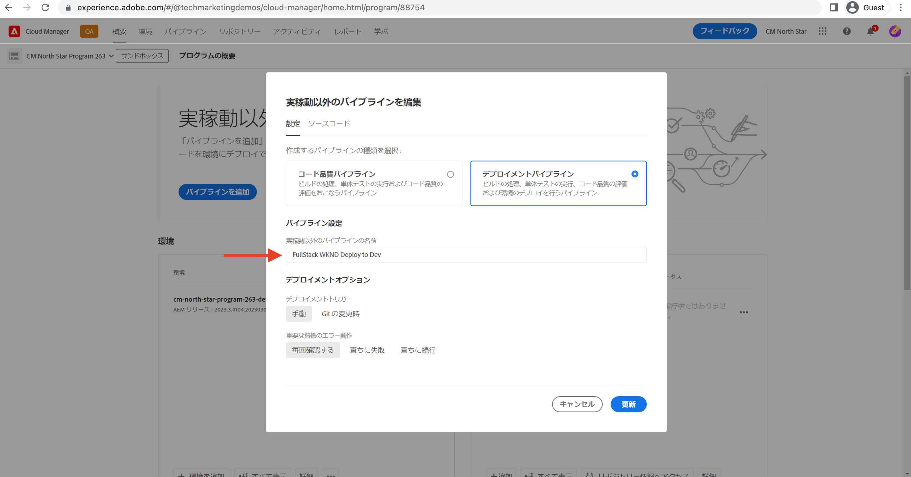
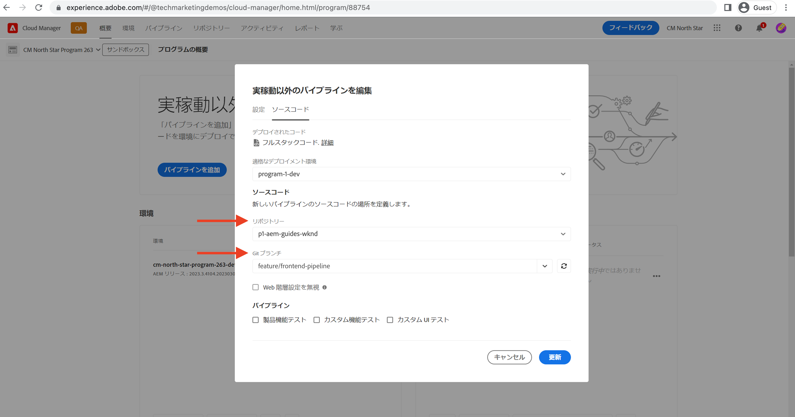
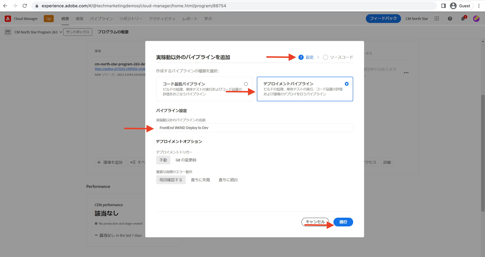
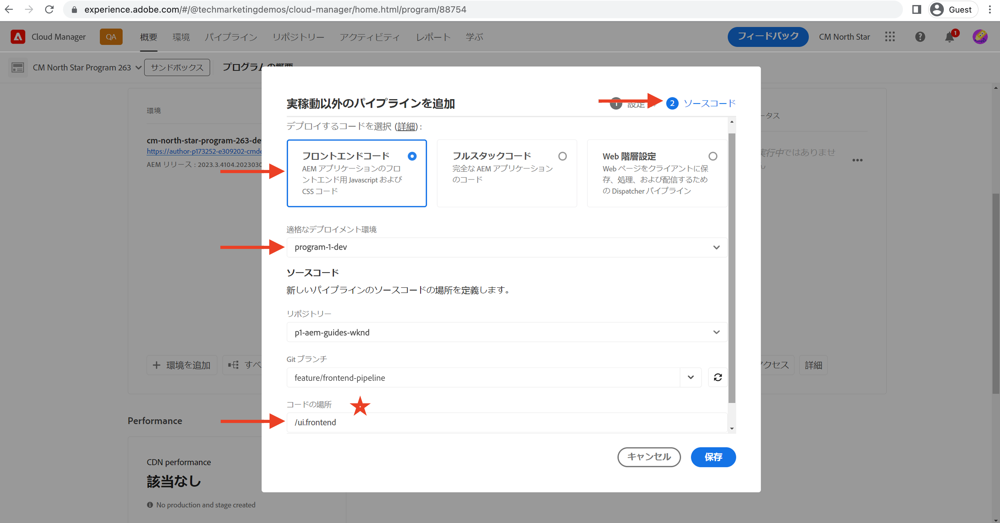

# フロントエンドパイプラインを使用したデプロイ

この章では、Adobe Cloud Manager でフロントエンドのパイプラインを作成し、実行します。`ui.frontend` モジュールからファイルをビルドし、AEM as a Cloud Service ビルトインの CDN にデプロイするだけです。このように、`/etc.clientlibs` ベースのフロントエンドリソース配信から移行できました。

## 目的 {#objectives}

* フロントエンドパイプラインを作成し、実行します。
* フロントエンドのリソースが `/etc.clientlibs` からではなく、`https://static-` で始まる新しいホスト名から配信されることを確認します。

## フロントエンドパイプラインの使用

>[!VIDEO](https://video.tv.adobe.com/v/3409420?quality=12&learn=on)

## 前提条件 {#prerequisites}

このチュートリアルは複数回に分けて行われ、[標準の AEM プロジェクトのアップデート](./update-project.md)で説明した手順が完了していることを前提としています。

Cloud Manager [でパイプラインを作成およびデプロイするための](https://experienceleague.adobe.com/docs/experience-manager-cloud-manager/content/requirements/users-and-roles.html?lang=ja#role-definitions)権限と、[AEM as a Cloud Service 環境](https://experienceleague.adobe.com/docs/experience-manager-cloud-service/content/implementing/using-cloud-manager/manage-environments.html?lang=ja)へのアクセス権を持っていることを確認します。

## 既存のパイプライン名を変更

「__設定__」タブの「 __実稼働以外のパイプライン名__」フィールドで、既存のパイプラインの名前を __開発にデプロイ__ から&#x200B;__フルスタック WKND 開発環境にデプロイ__&#x200B;に変更します。これは、名前を見ただけで、パイプラインがフルスタックかフロントエンドかを明確にするためです。

「__ソースコード__」タブで、「リポジトリ」フィールドと「Git ブランチ」フィールドの値が正しいこと、ブランチにフロントエンドパイプライン契約の変更があることも確認します。

## フロントエンドパイプラインの作成

`ui.frontend` モジュールで __ONLY__ モジュールのフロントエンドリソースをビルドし、デプロイするには、次の手順を実行します。

1. Cloud Manager UI の「__パイプライン__」セクションで、「__追加__」ボタンをクリックし、「__実稼動以外のパイプラインを追加__（ または __実稼動パイプラインを追加__）」を、デプロイ先の AEM as a Cloud Service 環境に基づいて作成します。

1. __実稼動以外のパイプラインを追加__&#x200B;ダイアログの&#x200B;__設定__&#x200B;手順で「__デプロイメントパイプライン__」オプションを選択し、__フロントエンド WKND 開発環境にデプロイ__&#x200B;と名前を付けて、「__継続__」をクリックします。

1. __ソースコード__&#x200B;の手順で、「__フロントエンドコード__」オプションを選択し、__適格なデプロイメント環境__&#x200B;から環境を選びます。「__ソースコード__」セクションで、リポジトリと「Git ブランチ」フィールドの値が正しく、フロントエンドパイプラインのコントラクトが変更されたブランチであることを確認します。
__最も重要なこと__&#x200B;は、「__コードロケーション__」フィールドの値が`/ui.frontend`であり、最後に「__保存__」をクリックすることです。

## デプロイメント順序

* 最初に、新しく名前が変更された&#x200B;__フルスタック WKND 開発環境へのデプロイ__&#x200B;パイプラインを使用して WKND clientlib ファイルを AEM リポジトリから削除します。さらに最も重要なのは、__Sling 設定__ ファイル（`SiteConfig`、`HtmlPageItemsConfig`）を追加して、フロントエンドのパイプライン契約用に AEM を準備することです。

>[!WARNING]
>
>__フルスタック WKND 開発環境へのデプロイ__&#x200B;パイプライン完了後、__スタイルが設定されていない__ WKND サイトができ、表示が崩れているように見えることがあります。停電を計画するか、変則的な時間帯にデプロイしてください。これは、1 回のフルスタックパイプラインの使用からフロントエンドパイプラインへの初期切り替え中に計画する必要があります。

* 最後に、__開発環境へのフロントエンド WKND デプロイ__ パイプラインはビルドのみ `ui.frontend` モジュールを使用し、フロントエンドリソースを直接 CDN にデプロイします。

>[!IMPORTANT]
>
>__スタイルが設定されていない__ WKND サイトが正常に戻り、今回は&#x200B;__フロントエンド__&#x200B;パイプラインの実行がフルスタックのパイプラインよりもずっと速かったことに気づくでしょう。

## スタイルの変更と新しい配信パラダイムの検証

* WKND サイトの任意のページを開くと、文字色が __Adobe Red__ になり、フロントエンドのリソース（CSS、JS）ファイルが CDN から配信されていることがわかります。リソースリクエストのホスト名は `https://static-pXX-eYY.p123-e456.adobeaemcloud.com/$HASH_VALUE$/theme/site.css` で始まり、同様に `HtmlPageItemsConfig` ファイルで参照した site.js やその他の静的リソースも含みます。

>[!TIP]
>
>ここでの `$HASH_VALUE$` は、__フロントエンド WKND 開発環境へのデプロイ__&#x200B;パイプラインの「__CONTENT HASH__」フィールドで見るものと同じものです。AEM にフロントエンドリソースの CDN URL を通知し、その値は __prefixPath__ プロパティの下の `/conf/wknd/sling:configs/com.adobe.cq.wcm.core.components.config.HtmlPageItemsConfig/jcr:content` に格納されます。

## これで完了です。 {#congratulations}

WKND Sites プロジェクトの ui.frontend モジュールのみをビルド、デプロイするフロントエンドパイプラインの作成、実行、検証が完了しました。これで、フロントエンドチームは、AEM プロジェクトのライフサイクル全体を超えて、サイトのデザインとフロントエンドの動作を素早く繰り返し実行できます。

## 次の手順 {#next-steps}

次章の[考慮事項](considerations.md)では、フロントエンドとバックエンドの開発プロセスへの影響を確認します。
